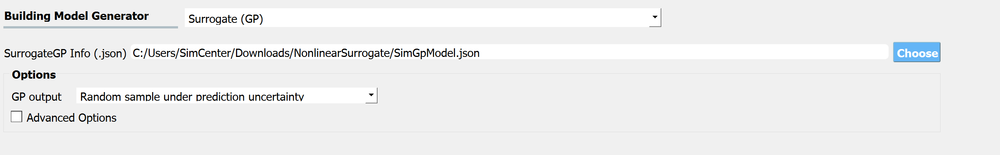

.. _SIM-user_manual-EEUQsur:

Surrogate (GP)
---------------------------

In place of the physical simulation models, the **Surrogate (Gaussian Process)** model trained in |short tool id| can be imported.

  Loading a surrogate model

When users select the Surrogate (GP) option, they are requested to provide **Surrogate info file** (.json) that contains the information about the surrogate model. The surrogate info file can be created by :ref:`training a surrogate model through EE-UQ<lblSimSurrogate>`.

**GP output** can be set as either the *median prediction* or a *random sample* generated from the normal distribution (or lognormal distribution if the user used log-transform when training) with the predictive median and variance. **NOTE:** the random generator does not account for the Gaussian process correlation, and each realization of EDP given the surrogate input parameters is independent of each other. 

For the users who are interested in the advanced options please refer to the `quoFEM <https://simcenter.designsafe-ci.org/research-tools/quofem-application/>`_ user manual.

.. Note:: 

  Once the surrogate model is imported, the RV tab will be auto-populated and EDP names will be displayed under the surrogate model file path. The users can populate EDP tab using the names. The users may not add or remove EDPs.

.. Important:: 

  The user who selected "surrogate (GP)" option in the SIM tab must select "None" in FEM and EDP tabs. Otherwise, |short tool id| will give an error.

