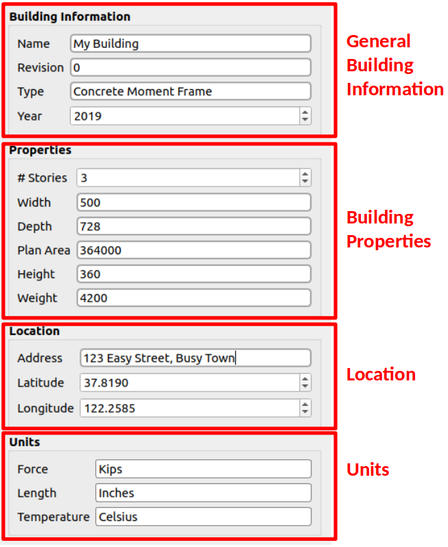

.. _lblGI:

GI: General Information
=======================

The **GI** tab allows the user to provide information about the building and the units the user will work with. The widget contains the following four frames, as shown in :numref:`figGI`.

#. **Building Information**: Collects general information about the building. This includes the name, type, and year of construction.

#. **Properties**: Collects information about the number of stories, width, depth, plan area and height of the building.

#. **Location**: Collects information about the location of the building. This information is used by some event widgets to characterize events that are specific to the building location.

#. **Units**: Collects information about the units used in the inputs and outputs. Some widgets will require inputs in different units. Those widgets will display units beside those special entry fields.

.. _figGI:

	General information input panel.

