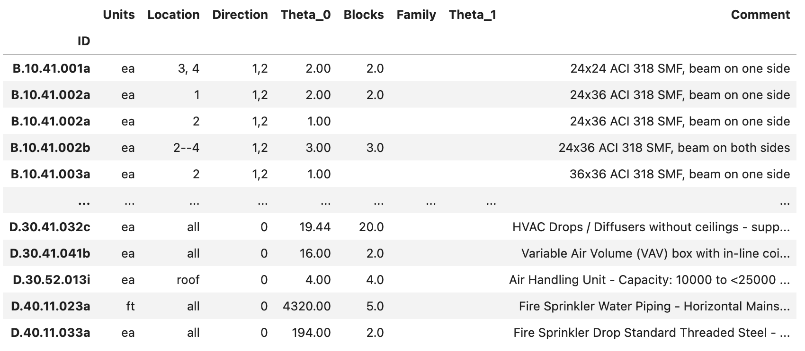

.. _lblPelicun_asset:

Asset Model
===========

This tab collects information about the asset model (:numref:`fig-dl-pelicun-asset`) that assigns components to the building and defines where they are and how much of each component is at each location. In an efficient, low-resolution analysis, only a few components are used to characterize the entire asset (e.g., building-level components in Hazus); while in a high-resolution analysis, such as FEMA P-58, a large number of components are assigned to various parts of the building to provide a more granular description of the consequences of the event. The asset model in Pelicun can consider uncertainties in the types of components assigned and in their quantities.

.. _fig-dl-pelicun-asset:

.. figure:: figures/dl_pelicun_asset.png
   :align: center
   :figclass: align-center

   The Asset model inputs.

The Asset model inputs are grouped into the following areas:

General Information
-------------------

This area collects general features of the investigated building. If you use PBE to analyze a non-building asset, feel free to put arbitrary values in these fields.

:Number of Stories:
   The number of stories is used to parse the component assignment descriptions when convenience keywords, such as "all" and "roof" are used. If you do not use such keywords, the number set here will have no effect on your analysis.

:Plan Area:
   The plan area is required to assess the probability of injuries in some methods. The unit for the provided area is based on the settings in the GI panel. 

:Occupancy Type:
   The occupancy type is used for automatic assignment of population models, consequence functions, or other components of damage and loss models. You can override such assignments in later tabs.

Component Vulnerability
-----------------------

This area is used to specify the component vulnerability library (i.e., typically one or more files that provide parameters for fragility functions). The following libraries are built into the application:

:FEMA P-58:
   Provides the fragility function parameters published in the second edition of FEMA P-58 (2018).

   .. warning:: About 30 \% of the components in FEMA P-58 have incomplete definitions. You will have to edit these components and provide the missing data to make them usable for damage simulation. PBE highlights which component definitions are incomplete under *Additional info* in the *Component Assignment* area of this input panel. See more information below.

:Hazus Earthquake Buildings:
   Provides the fragility function parameters for buildings published in the Hazus Earthquake Technical Manual (2023).

:Hazus Earthquake Transportation:
   Provides the fragility function parameters for transportation infrastructure components based on the Hazus Earthquake Technical Manual (2023).

:None:
   Select this option if none of the built-in libraries are needed in your analyses. This assumes that all components will be defined through external files.

The :ref:`lbl-dldb_damage` section of this manual provides detailed description of the components available in the built-in libraries. 

User-defined components
^^^^^^^^^^^^^^^^^^^^^^^

The built-in component libraries provide a good starting point, but you will almost always need to add project- or problem-specific components to provide a comprehensive description of an asset's vulnerability. Pelicun stores component vulnerability information in a standardized format. We suggest using the **Export DB** button to export one of the built-in libraries to a file that can serve as a template for adding your own components. The file formats and data schema are described in detail under :ref:`lbl-dldb_schema`.

.. note::
   You can also access the built-in libraries through the official `GitHub repository <https://github.com/NHERI-SimCenter/DB_DamageAndLoss/tree/main/DB>`_ of SimCenter's Damage and Loss Database. Component vulnerability data files have their names starting with ``damage_DB``.

Once you have your custom vulnerability data files prepared, check the **Use Additional Components** checkbox and click on the **Choose** button to be able to select a CSV file with the component vulnerability model parameters. If you have both a built-in library and a user-defined one in an analysis, components in the user-defined library take precedent over those in the built-in one. This lets you overwrite select components from a built-in library by redefining them while having all other components available with their original parameters from the built-in library. 

When a user-defined component library is loaded, the PBE application attempts to generate figures of fragility functions and tabulated parameters for every component in the library. The Program Output window provides feedback on this process and shows error messages if the provided data seems invalid. The figures are generated as HTML files in the ``resources/fragility_viz`` folder under the local jobs directory (see its location under Preferences). These figures can be helpful when creating a report or documentation for the assessment performed in PBE.

.. note::
   If similar figures of the built-in libraries are desired, we suggest exporting the data and loading it back as a user-defined dataset to generate the HTML files in the above directory.
   

Component Assignment
--------------------

This area is used to define the types of components and assign them to specific locations in the building. PBE provides a graphical interface to prepare such an assignment and the information is eventually stored in a CSV file. 

If you want to preserve an assignment or share it with others, the **Save** button allows you to export the settings in this area to a CSV file. You can use the **Load** button to import an assignment from such a file. You can find more information about the structure of these CSV files at the bottom of this page.

The components available in the component vulnerability library are listed in the **Available in DB:** drop-down list. This list can often include hundreds of components. Use the **Add** button to assign the selected component or the **Add All** to assign all components from the list to the Asset Model. The assigned components are listed in the **Assigned** drop-down list. Use the **Remove** button to remove the selected component or the **Remove All** button to remove all components from the assigned list. If you load the component assignment from a CSV file, the **Assigned** list is automatically populated with the components that are available in the component vulnerability library.

Below the assignment controls, you will find general information about the component currently selected from the **Assigned** list. First, PBE displays the fragility functions for every limit state and the corresponding model parameters.

.. note::
   Pelicun uses the following vocabulary to describe damage models: A component can experience damage when the **Demand** acting on the component exceeds its **Capacity**. A series of **Limit States** are identified for each component with typically increasing capacities that generally correspond to damages of increasing severity. When the demand exceeds the capacity corresponding to a component limit state, the component is damaged. 

   The type of damage is identified by a **Damage State**. Each limit state has one or more corresponding damage states. When a more than one damage states are assigned to a limit state, they are considered mutually exclusive, that is, exactly one of them will occur when the corresponding limit state is exceeded. The relative frequency of observing each damage state from a mutually exclusive set is controlled by a series of probabilities assigned to them that are shown in parentheses among the tabulated parameters for such components. These probabilities always sum up to 1.0 or 100%. 

Each limit state of a component needs to have a corresponding capacity. This can be a deterministic or a probabilistic value. If a deterministic value is assigned, it is shown under **Median Capacity** in the parameter table and the fragility curve figure displays a step function. Probabilistic capacities are characterized by a probability distribution function. Currently, *lognormal* and *normal* distributions are supported. The **Capacity Dispersion** parameter describes the *coefficient of variation* for normal distributions and the *logarithmic standard deviation* for lognormal distributions.

You can access more information about each damage state by hovering over the asterisks preceding the damage state labels. The pop-up window provides information about the type of damage and corresponding repair actions - provided that such information is available for the component in a metadata file in the vulnerability library.

.. note::

   PBE cannot display fragility curves for components with incomplete parametrization (e.g., probabilistic capacities with undefined dispersion values). When a component selected in the **Assigned** list has no fragility curves shown, you will need to provide additional data for it. As long as a component's information is incomplete, Pelicun automatically removes it from the analysis.

Below the fragility curves, the following component-specific information is shown:

:Description:
   Provides general information about the component from the library.

:Demand type:
   Describes the type of demand that controls the damage of this component. Make sure you can provide the required demands at the locations this component is assigned to.

:Block size:
   Specifies the recommended block size. You can deviate from the recommended block size when assigning components.

   .. note::
      Pelicun uses **Component Blocks** as the smallest units of damage in a building. All component pieces within a block will experience the same damage state. Component damage within a building is characterized by the number of component blocks in various damage states across various locations in the building.

      The size of component blocks is specific to the component type and sometimes further changes by location in the building. For example, in a high-resolution assessment, one can consider the sizes of rooms and walls across a floor and assign component blocks accordingly. Some components, such as mechanical equipment, are typically evaluated one-by-one. In such cases, the recommended block size will be 1 EA (i.e, one each).

:Additional info:
   Provides the following helpful additional information:

   :Directionality:
      Identifies if the component is sensitive to the directionality of demands. Components that are more sensitive to demands in one direction than in another (e.g., partition walls) are typically directional. Components that are damaged by excessive acceleration (e.g., mechanical equipment) are equally sensitive to accelerations in all directions, hence, they are characterized as non-directional. 

      .. note::
         Non-directional components can be assigned a Direction of "0" if you do not need to recognize their direction for other reasons.

   :Round up quantities:
      Identifies if the component is typically found in buildings in integer quantities. This is typical for components that use "each" or "ea" as their quantity unit, such as elevators.

   :INCOMPLETE DATA!:
      Identifies components that do not have all damage model parameters defined in the provided component vulnerability library. Components with incomplete data are not going to be used in the analysis. You are encouraged to export the library, provide the missing data for these components and load the modified library as Additional Component data to fix such a problem.

The bottom of the Component Assignment area is used to assign component quantities to specific locations in the building. Each component type has its own component quantity assignment data displayed when the component is selected from the **Assigned** list of components. 

Assignments are made in **Batches**. You can assign a specific quantity of components to one or more locations in the building in one batch. When assigning to multiple locations, the specified quantity will be assigned to *each* location. For example, if you want to assign the same quantity of components on every floor of a building, you can use a single batch to specify the quantity and then assign it to all floors. In another example, if you want to have different quantities of components in directions 1 and 2 (see more about directions below), you will need to have at least two batches in the assignment; one for each direction.

You can add a new batch using the **\+** button in the top left of this area and you can remove an existing batch using the **\-** button on the left side of the corresponding row. The following information can be provided for each batch:

:Unit:
   The unit you used to specify component quantities. The *Block size* is provided above using the default unit from the vulnerability library. As long as the unit you choose belongs to the same class (i.e., length, area, etc.), you can use many of the commonly used metric or US units. Squared units are expressed by using a ``2`` after the name, such as ``ft2`` for square feet.

   The supported units are described in the `Default Units <https://github.com/NHERI-SimCenter/SimCenterBackendApplications/blob/master/modules/performDL/pelicun3/pelicun/settings/default_units.json>`_ file of the Pelicun engine. If your work benefits from having additional units in that list, let us know and we can add them. 

   .. note:: 
      You can edit this JSON file in the backend engine and add the units that you want to have supported. The calculation engine works with the Standard Metric (SI) unit system. If you want to add new units, you will need to provide its name and scale factor that converts quantities in that unit to the equivalent unit in the SI system. As soon as you add this information to the ``default_units.json`` file, you should be able to use the new units in the PBE application.

:Location(s):
   Component blocks are distributed in an asset across locations. In buildings, locations typically correspond to stories, but they are a general identifier that can be used in creative ways to group components in other assets. Typically, the definition of locations is driven by the demands that are available which is ideally in line with the resolution of the damage and loss assessment. In a high-resolution building assessment, demands are available at every floor, hence, the location=floor assignment. In a high-resolution bridge analysis, for example, you can assign locations to key parts of the bridge where specific response quantities will be available as demands and component damages can be evaluated with appropriate fragility functions. In a low-resolution assessment, often only the ground floor and roof locations are used to characterize the response of a building.

   Locations need to be non-negative integers. The zero location is reserved for components with global scope, such as a component corresponding to the *collapse* limit state. Hence, the ground floor in a building is typically location 1.

   PBE allows you to conveniently assign components to multiple locations in one batch. The following options are available:

   :all:
      Uses the number of stories provided at the top of this input panel to infer the list of floors in a building. Assigns this batch to all floors.

   :roof:
      Uses the number of stories provided at the top of this input panel to infer the roof location id as one higher than the top story. Assigns this batch to the roof. This is a convenient setting if the same performance model is applied to buildings with different heights as it adjusts considering the number of stories automatically

   :x,y,z:
      You can use a comma-separated list to specify a set of locations for a batch.

   :x\-\-y:
      You can use two dashes to specify a range of locations. For example, ``3--7`` is equivalent to ``3, 4, 5, 6, 7``.

:Direction(s):
   Component blocks assigned to the same location might still experience different demands based on their orientation or other characteristics of their placement. Pelicun uses the direction parameter to specify the general position of a component block within a given location. 

   In the seismic assessment of buildings, directions typically correspond to the two orthogonal horizontal directions, but the Pelicun framework allows for more general usage. For example, if the deformation demands on two sides of a building are different, you can assign four directions to each floor, corresponding to X1, X2, Y1, Y2 where X, Y are the two primary horizontal directions and 1, 2 are used to identify the two sides of the building in each direction. In a bridge analysis, directions could correspond to the three orthogonal directions to capture bridge response in three dimensions. 

   Directions need to be non-negative integers. The zero direction is reserved for components with non-directional behavior (e.g., acceleration controlled non-structural components under seismic loading). For such components, demands from all available directions are used to calculate a controlling demand for damage analysis.

   The location and direction of a component block is used to identify the demand that controls its damage simulation. You can specify any location and direction combination as long as you can provide the component's required demand type for that location and direction (see :ref:`lblPelicun_demands` for details on how to provide demand data).

:Quantity:
   The total amount of components (measured in the specified unit) that shall be assigned to each location-direction pair through this batch assignment. 

   .. warning::
      If this batch is assigned to multiple location-directions, each of those places will have the specified component quantity assigned to it. For example, if the specified locations are ``1-4``, the specified directions are ``1, 2`` and the quantity is ``250``, then the total quantity assigned by this batch in the building is ``4 x 2 x 250 = 2000``. 

   .. note::
      Component quantities are either based on detailed information about the investigated asset or inferred using approximate models fit to component quantities in similar buildings. The Normative Quantity Estimator <REF> developed within the scope of the FEMA P-58 project is a popular tool for estimating non-structural components.

:Blocks:
   Specifies the number of component blocks to create from the assigned component quantity. This is an optional parameter; the default value of 1 is used if left empty. 

   Any positive integer number is valid. The component quantity is broken up into equal-sized blocks. You can use the provided information on the recommended block size to decide how many blocks you would like to use to model the assigned quantity of components. 

   .. warning::
      Having more than 100 blocks of a component in any location can considerably increase the calculation effort - only assign such a large number of blocks if you suspect that having the damage of those components represented in high fidelity is important to get sufficiently accurate overall results. In typical calculations, there is little benefit from using more than 100 blocks for any component type.

:Distribution:
   This is an optional parameter to consider uncertainty in component quantities. If left empty, a determinisitc model is used, that is, the provided component quantity is applied to every realization in the damage and loss simulation. This is identical to setting the distribution to ``N/A``.

   If you want to use a probabilistic approach, select either normal or lognormal distribution here. The quantities assigned to each location-direction are modeled by independent random variables that follow the distribution specified here. The Quantity specified earlier is used as the median and the Dispersion is used to define the second parameter of the distributions (see below).

:Dispersion:
   This is an optional parameter to consider uncertainty in component quantities. It is only required if you want to use a probabilistic approach and have already selected a distribution for the random quantity variable. 

   Dispersion defines the coefficient of variation for normal distributions and the log-standard deviation for lognormal distributions. If the distribution is set to ``N/A``, this can be left blank and any number provided here will not be used in the analysis.

:Comment:
   This field is not used in the analysis. You can provide additional information here that could be helpful when preparing and sharing component assignments.

Standard Format for Component Assignment Data
---------------------------------------------

The PBE app stores the specified component assignments automatically in a CSV file (``CMP_QNT.csv``) next to the configuration JSON file that is used to control the analysis. You can store this data in a user-specified file and also load it from such a file automatically using the **Load** and **Save** buttons introduced earlier.

.. note::
   CSV files can be conveniently manipulated in Microsoft Excel, just make sure you save the resulting table in the end in CSV format.

The component assignment information is organized in a tabular structure in the CSV file (:numref:`fig-dl-pelicun-asset`). Each row corresponds to one batch assignment (see above for more details on how batches are used in PBE). The first column identifies the component type for each batch. The component IDs are from the vulnerability library - the same IDs are listed in the **Assigned** list in the PBE user interface. The remaining columns are identical to those used for batch assignment in the user interface. Theta_0 corresponds to the Quantity, while the Family and Theta_1 correspond to the Distribution and Dispersion information, respectively. Multiple rows in the CSV file with the same component ID are interpreted as multiple batch assignments for the same component type.

.. _fig-dl-pelicun-asset-csv:

   Component assignment information stored in a CSV file.