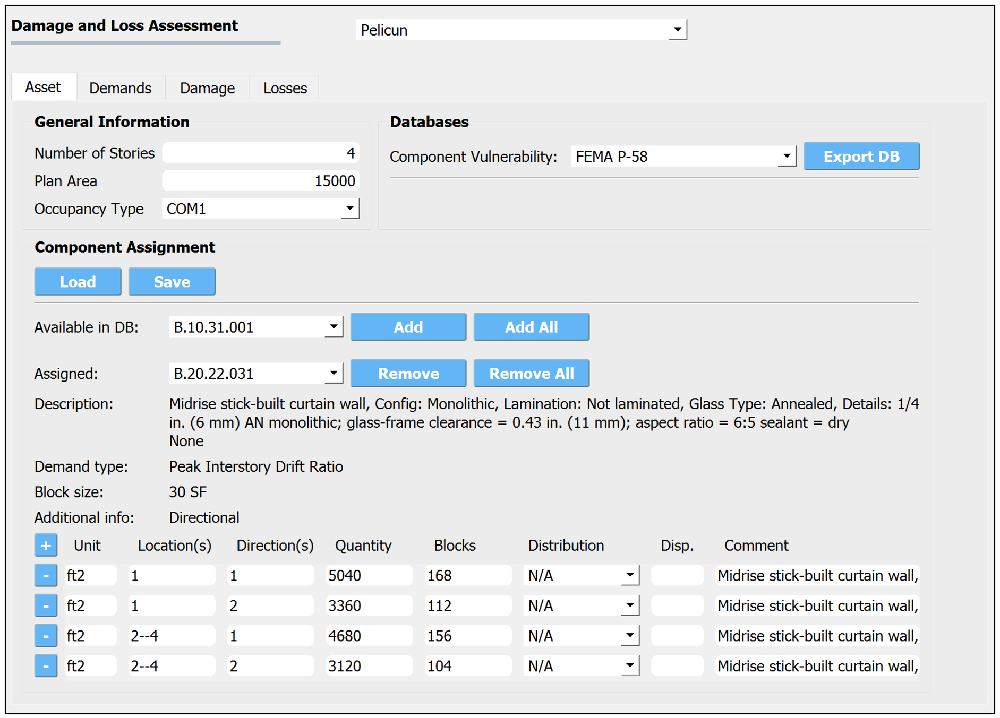

.. _lblPelicun_asset

Asset Model
===========

This tab collects information about the asset model (:numref:`fig-dl-pelicun-asset`). The panel allows the user to define the general building features and assign components to the asset. In an efficienct, low-resolution analysis, only a few components are used to characterize the entire asset (e.g., building-level components in Hazus); while in a high-resolution analysis, such as FEMA P-58, a large number of components are assigned to various parts of the building to provide a more granular description of the consequences of the event.

.. _fig-dl-pelicun-asset:

   The Asset model inputs.

The Asset model inputs are divided into the following areas:

General Information
-------------------

This area collects the following general features of the building:

:Number of Stories:
   The number of stories is used to parse the component assignment descriptions when convenience keywords, such as "all" and "roof" are used.

:Plan Area:
   The plan area is required to assess the probability of injuries in some methods. The unit for the provided area is based on the settings in the GI panel.

:Occupancy Type:
   The occupancy type is used for automatic assignment of population models, consequence functions, or other components of performance assessment methodologies. You can override such assignments in later tabs.

Databases
---------

This area is used to specify the component vulnerability database (i.e., typically a file that provides fragility function parameters). The following databases are built into the application:

:FEMA P-58:
   Provides the fragility function parameters published in the second edition of FEMA P-58 (2018).

   .. note:: About 30 \% of the components in FEMA P-58 have incomplete definitions. You will have to edit these components and provide the missing data to make them usable for performance assessment calculations. PBE highlights which component definitions are incomplete under *Additional info* in the *Component Assignment* area of this panel. See more information below.

:Hazus Earthquake:
   Provides the fragility function parameters published in the Hazus Earthquake Technical Manual (2011)

:User Defined:
   Allows you to Choose a file that provides your own set of vulnerability parameters. The |PelicunDocs| explains how to prepare a compatible component vulnerability data file.

The **Export DB** button allows you to export the selected built-in database to a file. This is helpful when you plan to make only minor edits to a built-in database and then use it as a User Defined one.

Component Assignment
--------------------

This area is used to define the types of components in the building and assign quantities of each component to locations and directions in the building. Although PBE provides a convenient interface to prepare such an assignment, the information is eventually stored in a CSV file. If you want to preserve an assignment or share it with others, the **Save** button allows you to prepare such a CSV file, while you can use the **Load** button to import an assignment from such a file. You can find more information about the structure of these CSV files in the |PelicunDocs|.

The components available in the selected component vulnerability database are listed in the **Available in DB:** drop-down list. Use the **Add** button to assign the selected component or the **Add All** to assign all components from the list to the Asset Model. The assigned components are listed in the **Assigned** drop-down list. Use the **Remove** button to remove the selected component or the **Remove All** button to remove all components from the assigned set.

Below the assignment controls, the panel provides information about the component selected from the assigned list:

:Description:
   Provides general information about the component from the database.

:Demand type:
   Describes the type of demand that is required to evaluate the damage state of this component. Make sure you can provide the required demands at the locations and directions that this component is assigned to.

:Block size:
   Specifies the recommended block size, that is, the quantity of the selected component that is assumed to have perfectly correlated behavior. In other words, this much of the component will get damaged together and all component damage is evaluated by aggregating the damage experienced by various blocks of the component in the building. Note that you can deviate from the recommended block size when assigning components.

:Additional info:
   Provides the following helpful additional information:

   :Directionality:
      Identifies if the component is sensitive to the directionality of the demands. Non-directional components can be assigned a Direction of "0" if you do not need to recognize their direction for other reasons.

   :Round up quantities:
      Identifies if the component is found in buildings in integer quantities. This is typical for components that use "each" or "ea" as their quantity unit.

   :INCOMPLETE DATA!:
      Identifies components that do not have all parameters defined in the selected component vulnerability database. Components with incomplete data are not going to be used in the analysis. You are encouraged to export the database, provide the missing data for these components and specify the modified database as a User Defined resource to fix such a problem.

The bottom of the Component Assignment area is used to assign component quantities to locations and directions in the building. Each component type (i.e., selected from the assigned list of components) has its own set of component quantity assignment. Quantities are assigned in blocks. You can add a new block assignment using the **\+** button on the left and you can remove an existin assignments using the **\-** button on its left side. The following information can be provided for each assigned block:

:Unit:
   The unit you used to specify component quantities. The *Block size* is provided above using the default unit from the fragility database. As long as the unit you choose belongs to the same class (i.e., length, area, etc.), you can use any of the commonly used metric or US units. Squared units are expressed by using a ``2`` after the name, such as ``ft2`` for square feet.

:Location(s):
   In buildings, locations are typically stories. The ground floor is story 1. Providing ``all`` assigns the same setting to every story. You can use two dashes to specify a range of stories, such as ``3--7``. If a component is only assigned to the top story, or the roof, you can use ``roof``. You can also combine these and use ``3--roof``, for example. These settings make it easy to transfer performance models between buildings that have a different number of stories.

:Direction(s):
   The directions correspond to EDPs that are used to assess the fragility of the components. They shall match the directions in the EDP results available from the simulations. Typically, direction 1 and 2 correspond to orthogonal horizontal X and Y directions.

:Quantity:
   The amount of components (in the specified unit) that are assigned to the given location(s) and direction(s). Note that if multiple locations and/or directions are provided, each of those will have the specified quantity assigned. For example, if the specified location(s) is "1-4" and the quantity is "250", then the total quantity assigned by this line is "1000".

:Blocks:
   Specifies the number of component blocks to create from the assigned quantity. This is an optional parameter; the default value of 1 is used if left empty. Any positive integer number is valid and the provided quantity will be broken up into that many equal-sized pieces. You can use the provided information on the recommended block size to decide how many block you would like to use to model the assigned quantity of components. Having more than 100 blocks of a component in any given floor or direction can considerably increase the calculation effort - only assign such a large number of blocks if you suspect that having the damage of those components represented in the calculation without compromise is important to get high-quality results.

:Distribution:
   If you want to model the uncertainty in component quantities, select either normal or lognormal distribution here. The value provided under Quantity and Dispersion will be used as the median and the dispersion for the distribution, respectively. The ``N/A`` setting corresponds to known, deterministic quantities with no uncertainty.

:Dispersion:
   Dispersion is defined by the coefficient of variation for normal distributions and the log-standard deviation for lognormal distributions. If the distribution is set to ``N/A``, this can be left blank.

:Comment:
   You can provide any additional information here; it is not used in the assessment, but could be helpful when preparing and sharing the model.

As long as you want to assign the same amount of components to every floor and every direction, one component group row is sufficient. Oftentimes, you will want to have more control over component quantities because the amount of components is not identical in all floors and directions.

The example in :numref:`fig-dl-p58-comp-details` shows the assignment of Buckling Restrained Braces in a building. The first row assigns four BRBs in direction 1 to the first and second stories. The four braces are grouped in pairs (hence the ``2, 2`` entry under ``median quantity``). Damage to those two *Component Groups* can be evaluated independently. The second row assigns six braces to every floor in direction 2. These are also grouped in pairs, forming three *Component Groups*. Since the number of braces is known exactly, the ``distribution`` is set to ``N/A`` and there is no need to specify a ``cov`` value.