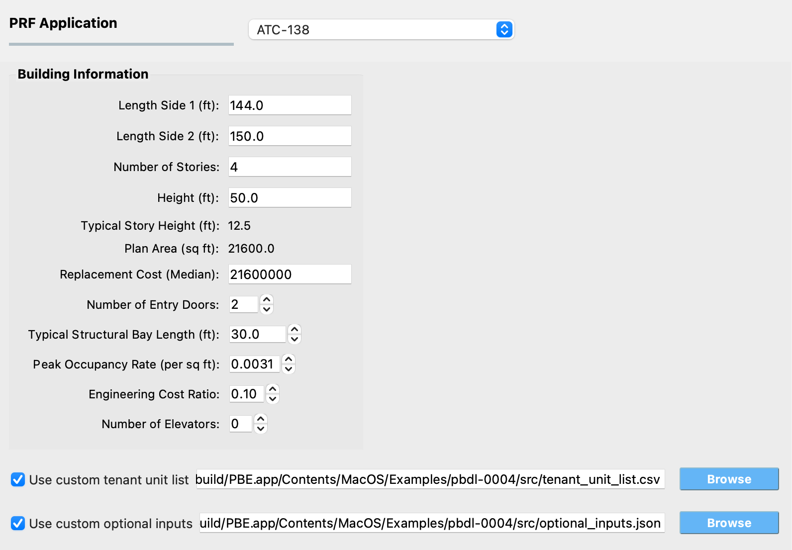

.. _lblPRF_atc138:

ATC-138
=======

This panel collects the building-specific inputs needed by the ATC-138
functional recovery assessment. The inputs supplement the damage and
loss results produced by Pelicun (under the DL tab) so the underlying
engine can simulate the functional recovery process -- including the
delays imposed by inspection, financing, design, permitting, and
contractor mobilization, the construction repair schedule, and the
fault-tree evaluation of when each tenant unit and the building as a
whole can be occupied again and regains full functional operation.
After the analysis runs, the Results panel reports per-realization
Reoccupancy, Functional Recovery, and Full Recovery times along with
summary statistics.

The methodology is described in detail on the official
`ATC-138 Functional Recovery Methodology <https://femap58.atcouncil.org/fr-methodology>`_
page. The Python implementation invoked by PBE lives at
`OpenPBEE/Functional-Recovery-Python <https://github.com/OpenPBEE/Functional-Recovery-Python>`_.
The example :ref:`pbdl-0004` demonstrates the panel end-to-end and can
be used as a starting template; it also ships ready-to-use template
files for the custom tenant unit list and the custom optional inputs
described below.

.. _fig-prf-atc138:

   The ATC-138 input panel.

The panel groups its inputs into the following areas:

Building Information
--------------------

This area collects geometry and inventory information about the
building, plus a few parameters that drive specific parts of the
functional recovery assessment (egress, repair crew sizing, casualty
modeling, engineering cost). Several of the fields are linked to the
General Information (GI) panel and to the Loss tab of the DL panel --
editing them here pushes the change back to those tabs and vice
versa, so values stay consistent across the workflow.

You can work in any length unit you prefer in the GI panel. ATC-138
itself uses feet internally, so the linked values in this panel are
always displayed in feet; PBE handles the conversion automatically.

The fields linked to the GI panel are:

:Length Side 1 (ft):
   The length of one of the two principal building sides.
   Corresponds to **Width** in the GI panel.

:Length Side 2 (ft):
   The length of the other principal building side. Corresponds to
   **Depth** in the GI panel.

:Number of Stories:
   The number of above-ground stories.

:Height (ft):
   The total above-ground height of the building.

:Typical Story Height (ft):
   *Read-only.* Computed automatically as ``Height / Number of
   Stories`` and updated whenever either source field changes. Used
   to size scaffolding for repair work along the building exterior.

:Plan Area (sq ft):
   *Read-only.* Computed automatically as
   ``Length Side 1 x Length Side 2`` and updated whenever either
   source field changes. Used to size the construction workforce
   per story and to derive the total building occupancy from the
   peak occupancy rate.

The next field is linked to the Loss tab on the DL panel:

:Replacement Cost (Median):
   The median replacement cost of the building. Used to scale
   repair-cost-driven impeding factors such as financing time and
   engineering design effort.

The remaining fields in this area are specific to the ATC-138 input
panel:

:Number of Entry Doors:
   Total number of entry doors to the building. Used in the egress
   assessment -- jammed entry doors after shaking can delay
   reoccupancy and function until temporary unjamming repairs are
   complete.

:Typical Structural Bay Length (ft):
   Typical length of a structural bay. Used to size scaffolding and
   to allocate repair crews to the work area.

:Peak Occupancy Rate (per sq ft):
   Peak building occupancy expressed as occupants per square foot
   of plan area. Used in the casualty and egress portions of the
   assessment. The default value (``0.0031``) is representative of
   a commercial office building at peak occupancy.

:Engineering Cost Ratio:
   Fraction of the total repair cost attributed to engineering and
   design effort. Used to derive design and re-design durations
   from the simulated repair cost. The default value (``0.10``)
   represents a typical project where engineering and design
   account for 10 % of total project cost.

:Number of Elevators:
   Total number of elevators in the building. If left at ``0``, the
   number of elevators is inferred automatically from the elevator
   components present in the asset model. Provide an explicit
   number if the asset model does not include elevator components
   but the building does have them, or if you want to override the
   inferred value.

   .. note::
      Whether or not elevators are *required* for a tenant unit to
      be considered functional is determined separately, by the
      occupancy type assigned to that tenant unit (see below).

Optional Custom Inputs
----------------------

ATC-138 ships with sensible defaults for every aspect of the
assessment that the panel does not expose directly. The two
checkboxes at the bottom of the panel let you override these
defaults when needed. :ref:`pbdl-0004` provides ready-to-use template
files for both options.

Custom tenant unit list
^^^^^^^^^^^^^^^^^^^^^^^

When the **Use custom tenant unit list** checkbox is unchecked, PBE
auto-generates a default ``tenant_unit_list.csv`` in which each
story is one tenant unit assigned the full story plan area, a
perimeter area derived from the building edge lengths and story
height, and the *Commercial Office* occupancy type. This is
appropriate for a typical office building, but real assets often
have multiple tenants per story or use a different occupancy type.

To override the default, check the box and use the **Browse**
button to point PBE at a CSV file with the following columns (one
row per tenant unit):

:id:
   Unique tenant unit identifier (integer or string).

:story:
   Building story where the tenant unit is located. Ground floor
   is story ``1``.

:area:
   Total plan area of the tenant unit, in square feet.

:perim_area:
   Total exterior perimeter (elevation) area of the tenant unit,
   in square feet.

:occupancy_id:
   Occupancy type identifier. ATC-138 currently supports the
   following four values; any other value will cause the
   assessment to fail:

   :``0``: Non-Occupied Space
   :``1``: Commercial Office
   :``7``: Multi-Unit Residential
   :``11``: Single-Unit Residential

   The occupancy type drives which utilities, elevators, and
   subsystems must be operational for the tenant unit to be
   considered functional. The full list of functional requirements
   per occupancy type is in
   `tenant_function_requirements.csv <https://github.com/OpenPBEE/Functional-Recovery-Python/blob/main/src/atc138/data/tenant_function_requirements.csv>`_
   in the Functional-Recovery-Python repository.

Custom optional inputs
^^^^^^^^^^^^^^^^^^^^^^

The assessment exposes a large number of secondary parameters
covering impedance, repair scheduling, and functional recovery
behavior. PBE uses the built-in defaults for all of them; if you
need to change any, check the **Use custom optional inputs** box
and point PBE at a JSON file. You only need to include the
parameters you actually want to override -- ATC-138 merges your
file on top of the defaults at run time, so anything not specified
keeps its default value.

The configurable parameter groups are:

:impedance_options:
   Controls the simulated delays before repairs can start --
   inspection, financing, engineering design, permitting,
   contractor mobilization, and procurement of long-lead items.
   Lets you designate the building as an essential facility, model
   an existing contractor relationship, or change the default lead
   time for materials.

:repair_time_options:
   Controls the construction phase of the schedule -- maximum
   workforce density per story, building-level workforce caps,
   whether temporary repairs and shoring are allowed.

:functionality_options:
   Controls the fault-tree evaluation of reoccupancy and functional
   recovery -- whether red tags are simulated, the egress
   threshold, utility and habitability requirements, the heat fuel
   type, and the flooding model.

The full list of parameters and their default values is documented
in
`default_inputs.json <https://github.com/OpenPBEE/Functional-Recovery-Python/blob/main/src/atc138/data/default_inputs.json>`_
in the Functional-Recovery-Python repository.

.. note::
   If you need to change one of the static lookup tables ATC-138
   uses internally (such as ``component_attributes.csv`` or
   ``tenant_function_requirements.csv``), you can place a modified
   copy of the file directly in the project directory and ATC-138
   will prefer it over the built-in default. PBE does not
   currently expose that workflow through the UI -- the file has
   to be copied into the project directory manually.
