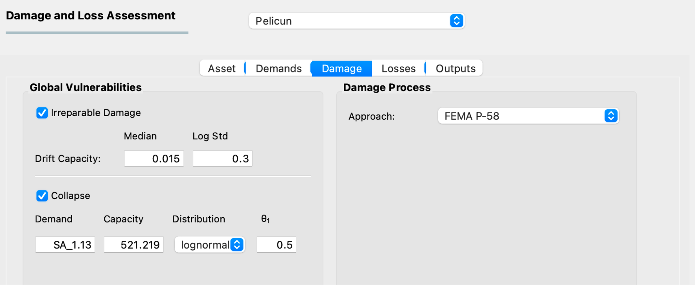

.. _lblPelicun_damage

Damage Model
============

This tab provides settings related to modeling damages (:numref:`fig-dl-pelicun-damage`). The vulnerability of individual components is already described by the parameters in the database that you selected in the Asset model. This tab provides a convenient way for you to create additional components that represent global vulnerabilities and allows you to specify a damage process that describes the interdependencies in component damages.

.. _fig-dl-pelicun-damage:

   The Damage model inputs.

Global Vulnerabilities
----------------------

Two types of global vulnerabilities can be automatically added to any performance assessment by PBE:

:Irreparable Damage:
    Irreparable damage is assumed to be triggered by excessive residual interstory drift values. The corresponding limit state capacity is assumed to have a lognormal distribution with user-defined parameters.

    .. note:: This model is supported by FEMA P-58 with a median of 0.015 radian and a logarithmic standard deviation of 0.3.

:Collapse:
    Collapse is assumed to be triggered by a single demand exceeding the structure's capacity for that demand. You can provide the demand type (Demand), the median capacity (Capacity), the distribution that describes the uncertainty in the capacity (Distribution) and the dispersion of that distribution (:math: `\theta_1`). Dispersion is defined as the coefficient of variation for a normal distribution and the log-standard deviation for a lognormal distribution. Note that a distribution of "N/A" corresponds to a deterministic capacity and does not require a dispersion value.

    In an earthquake context, the capacity can be based on a collapse fragility function and it is defined as the median and the log-standard deviation of that function. The corresponding demand type is typically an intensity measure, often the spectral acceleration at the fundamental period of vibration. Such a demand can be provided as "SA_1.03", for example, for a :math: `T_1=1.13` case.

    Another typical use case is to take a demand type from one of the Engineering Demand Parameters and consider that it cannot exceed a certain value without collapse. For example, use PID as the type and set the capacity as a deterministic 0.1.

.. note:: These automatic component generators were designed to handly the typical use cases. Pelicun allows for more complex global vulnerabilities and such models can be used in the PBE app too as long as they are provided as part of the Asset model. Let us know if you are interested in such vulnerabilities.

Damage Process
--------------

Damage processes characterize the interdependencies between various component damages during performance assessment. They allow modeling complex cascading damage scenarios and the development of models where multiple different probabilistic events can trigger the same damage state.

Two damage processes are provided by the PBE app for the sake of convenience:

:FEMA P-58:
    Based on the second edition of the methodology, this process performs two tasks::

        {
            "1_collapse": {
                "DS1": "ALL_NA"
            },
            "2_excessiveRID": {
                "DS1": "irreparable_DS1"
            }
        }

    #. Make sure that no other component damages are evaluated when the building collapses. This is important to avoid double counting consequences later.

    #. If any of the residual interstory drifts exceeds the assigned capacity, trigger an irreparable damage state.

    .. note:: If there are no collapse and irreparable damage vulnerabilities assigned, this damage process is automatically simplified before running the calculation.

:Hazus Earthquake:
    Based on the Hazus Earthquake methodology, this process performs four tasks::

        {
            "1_STR": {
                "DS5": "collapse_DS1"
            },
            "2_LF": {
                "DS5": "collapse_DS1"
            },
            "3_collapse": {
                "DS1": "ALL_NA"
            },
            "4_excessiveRID": {
                "DS1": "irreparable_DS1"
        }

    #. If any of the structural components (there is typically only one) is in Collapse damage state (DS5), trigger a global collapse damage state.

    #. If any of the liquefaction-related components is in a collapse damage state (DS5), it triggers a global collapse damage state.

    #. If the building is in a collapse damage state (including due to outcomes from tasks 1 or 2), all other component damages are set to N/A to avoid double counting consequences.

    #. If any of the residual interstory drifts exceeds the assigned capacity, trigger an irreparable damage state. This last task extends the concept of irreparable damage to the Hazus methodology. It is removed from the damage process if there are no irreparable damage vulnerabilities assigned to the model.

You can use a custom damage process for the calculation by selecting **User Defined** from the drop-down list and providing the process in a JSON file. The |PelicunDocs| provides more information on preparing damage processes.