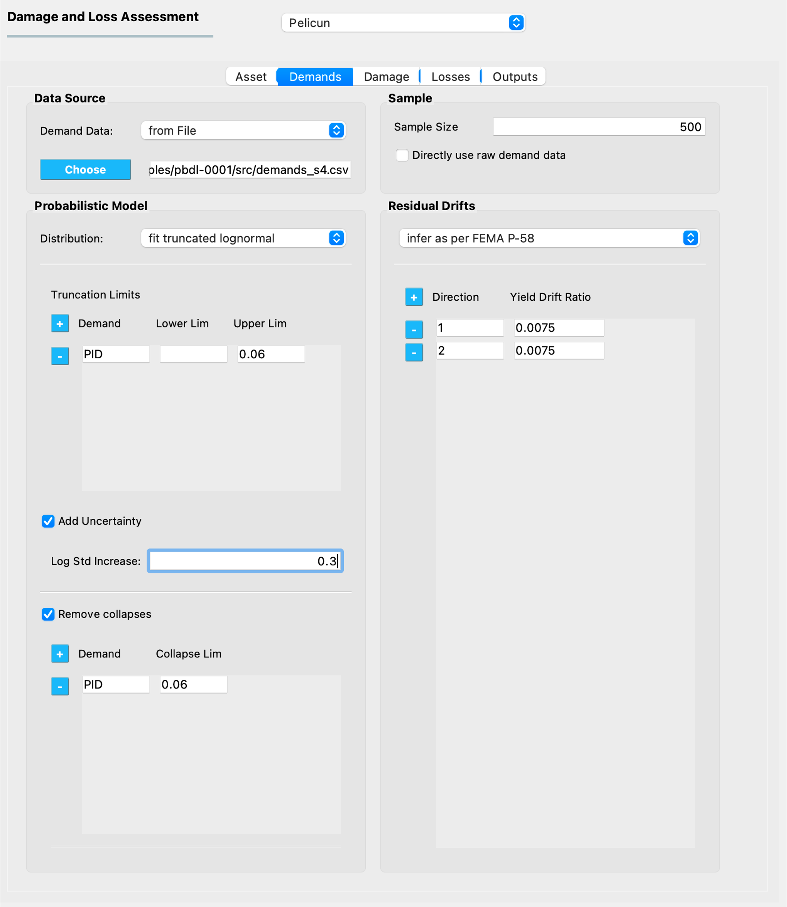
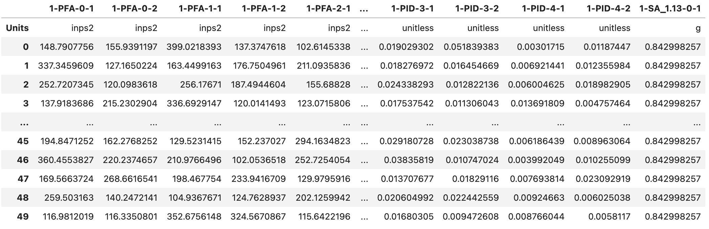

.. _lblPelicun_demands:

Demand Model
============

This tab configures the demand model that is used to generate realizations of demands that act on the components defined in the previous tab. (:numref:`fig-dl-pelicun-demands`). There are multiple ways to define the demands using the information provided in the following areas:

.. _fig-dl-pelicun-demands:

   The Demand model inputs.

Data Source
-----------

The drop-down list in this area identifies the source of demand information:

:from Workflow:
    Select this option if the PBE app is used to perform the entire performance assessment workflow, that is, the structural response simulation is also set up and performed by the PBE app. In such a case, make sure the workflow you set up provides all of the demand types required by the damage and loss assessment. The demand data file is automatically created in the appropriate format by the backend engine and passed on to Pelicun in the background.

:from File:
    Select this option if the PBE app is only used for the performance assessment step, that is, the structural response simulation is performed outside of the PBE app. In such a case, you will need to perform the demand calculations and provide the demand data file in the standard CSV format used by SimCenter applications, including Pelicun (see below).

    When this option is selected, use the **Choose** button to select the CSV file on your computer that contains the demand data.

Standard Format for Demand Data
-------------------------------

The PBE app expects demand data in a tabular structure in a CSV file (:numref:`fig-dl-pelicun-demands-csv`). Each row corresponds to one realization and each column corresponds to one intensity or response measure. 

Demand units can be specified by adding a row with a ``Units`` label. The supported units are described in the `Default Units <https://github.com/NHERI-SimCenter/SimCenterBackendApplications/blob/master/modules/performDL/pelicun3/pelicun/settings/default_units.json>`_ file of the Pelicun engine. If your work benefits from having additional units in that list, let us know and we can add them.

.. note:: 
      You can edit the ``default_units.json`` file in the backend engine and add the units that you want to have supported. The calculation engine works with the Standard Metric (SI) unit system. If you want to add new units, you will need to provide its name and scale factor that converts quantities in that unit to the equivalent unit in the SI system. As soon as you add this information to the ``default_units.json`` file, you should be able to use the new units in the PBE application. 

If no units are specified in the demand input file, the units are inferred based on the length unit selected in the PBE app under the General Information (GI) panel.

If only one demand realization (i.e., row) is provided, the demands will be considered deterministic. Otherwise, Pelicun can either use the provided data directly, or it can fit a multivariate distribution function to the provided data and sample from that distribution to get demands for the damage and loss simulation. See details of these settings in the following sections.

.. _fig-dl-pelicun-demands-csv:

   Demand information stored in a CSV file.

The labels in the header of the table in the demand CSV file identify the types of demands and their reference location in the investigated asset. Each label is structured as ``event-demand-location-direction``, with the following general rules:

:event:
    A one-based integer that is used to identify which event resulted in the measured demands in a multi-event simulation. Examples of multi-event simulations: earthquake + aftershocks; earthquake ground shaking + tsunami; multiple consecutive wind or flood events. If a damage and loss assessment uses a single event, then either use ``1`` for this field or omit it and use a simplified ``demand-location-direction`` label.

:demand:
    Identifies the type of demand using a capitalized acronym for brevity. The demand types PBE currently recognizes are listed in its `Pelicun's base module <https://github.com/NHERI-SimCenter/pelicun/blob/master/pelicun/base.py#L493>`_. Additional demand types can be easily added to this file either locally or to the official release by sending a request to the developers.

    Certain demands have additional identifiers, such as the vibration period for spectral acceleration. These can be added after an underscore (``_``) character as floating point numbers. For example, spectral acceleration at 0.7 seconds would require an ``SA_0.7`` demand label.

    .. note::
        A special demand label ``ONE`` is reserved for advanced calculations to provide a uniform 1.0 demand in all realizations. This column is typically generated automatically during the calculation and it is part of the demand output.

:location:
    An integer that specifies the location in the asset where the demand was measured. In buildings, locations typically correspond to stories, but they are a general identifier that can be used in creative ways to group components in other assets. In a high-resolution building assessment, demands are available at every floor, hence, the location=floor assignment is typically used. In a high-resolution bridge analysis, for example, you can assign locations to key parts of the bridge where specific response quantities will be available as demands. In a low-resolution assessment, often only the ground floor and roof locations are used to characterize the response of a building.

    The location needs to be a non-negative integer. The first floor in a building is typically location 1. This works well for demands assigned to entire stories, such as peak interstory drift ratio. Seismic analyses also needs other demands that are assigned to floors, i.e, slabs, such as peak floor acceleration. For the sake of clarity, we have a specific relationship between the location IDs of slabs and stories in buildings: a story always shares the location ID with its ceiling slab and its floor slab's ID is the previous integer. This has a few important consequences:

    * The ground acceleration (and any other demand that specifically corresponds to the ground as opposed to the first story of the building) shall be assigned to location ``0``

    * We assume stories are assigned a sequence of locations ``1-n`` in a building with ``n`` stories.

    * The ``n-th`` floor's acceleration (and any other demand that specifically corresponds to the floor slab as opposed to the story) shall be assigned to location ``n``. Note that as a result, the acceleration assigned to location ``1`` will be experienced by inhabitants in story ``2``.

    * The roof acceleration is assigned to the top floor's location.

    * If basement levels are modeled, they shall not be assigned a negative location. We recommend using story=1 at the lowest basement level and applying the above rules accordingly.

    .. note::
        The above considerations do not affect component assignments in the :ref:`lblPelicun_asset`. Components shall be assigned to the story they are installed on. Pelicun automatically picks the demands from the floor of a story unless an demand Offset is specified for a component in the provided vulnerability data. Suspended ceilings, for example, use an offset of 1 for their floor acceleration demand, to get the ceiling acceleration to control the damage of such components within a given story. See the :ref:`lbl-dldb_damage` section for more details on how the offset information is stored in the Damage and Loss Database.

:direction:
    Demand measured at a given location might be a vector-valued quantity. For example, a three-dimensional vector can describe both the intensity and the orientation of a demand. In seismic performance assessment, story drift ratios and floor accelerations are typically captured by recording their two orthogonal horizontal components. In a more general example, one can assign directions to deformations measured at various places within a floor (i.e., they have the same location).

    The direction needs to be a non-negative integer. The zero direction is reserved to internally handle the governing, non-directional demands and shall never be used in demand labels.

    The location and direction of the demands is used to link them to component blocks in a building (see the :ref:`lblPelicun_asset` for more details on component blocks). You can specify any location and direction combination as long as you follow the same logic when assigning components to the building.

For example, the ``1-PFA-0-1`` label in :numref:`fig-dl-pelicun-demands-csv` above corresponds to Peak Floor Acceleration from event 1 measured in inch/s2 at the ground in direction 1. Another example from column M in the figure:``1-PID-1-2`` corresponds to the Peak Interstory Drift Ratio from event 1 measured at the first story in direction 2. PID is unitless, that is, no scaling is needed regardless of what units are used for other quantities in the analysis.

Probabilistic Model
-------------------

A robust damage and loss assessment typically requires hundreds or thousands of damage and loss realizations to be able to propagate the various uncertainties throughout the simulation. Since raw demand data is often not available for more than a few dozen realizations, it is typically used to calibrate the parameters of a multivariate probability density function that is later sampled to obtain a sufficiently high number of demand realizations. 

.. warning::
    This is a critical step in the analysis that can introduce significant error in the results if the target probability density function fits the provided raw data poorly. Although the widely used multivariate lognormal model works well in many scenarios, we strongly advise always making sure it is applicable to your case before using it.

The following settings control the characteristics of the probabilistic demand model:

:Distribution:
    Select the type of distribution, if any, to be fit to the raw demand data. The following options are available:

    :lognormal:
        Fit a multivariate lognormal distribution to the data.

    :truncated log:
        Fit a truncated multivariate lognormal distribution to the data. Truncation allows for limiting the domain for each random demand variable. This is an effective and transparent approach to avoid unrealistically high demands that otherwise would be generated from the tails of lognormal distributions. See the details of setting up truncation limits below.

    :empirical:
        Use the raw demand data as-is without fitting a distribution. When this approach is chosen, the empirical data is sampled with replacement to obtain the required number of realizations. This is recommended if a sufficiently large number of realizations is available to characterize the uncertainty in the demand, or, if a single realization is provided to characterize a deterministic demand for the analysis.

:Truncation limits:
    This option is only available if the ``truncated log`` option is selected above. The **\+** and **\-** buttons can be used to add or remove definitions from the list. The following information defines each truncation limit:

    :Demand:
        Identifies the demand type using the standard SimCenter demand naming convention. See the previous section above for a detailed description of demand labels. Note that currently, only the demand type is specified here. All demands of the selected type will be truncated at the provided limits, i.e., demands of the given type at all locations and directions from all events. 

        Let us know if more specific demand truncation would be helpful for your work.

    :Lower Lim:
        Lower truncation limit for the specified demand type. The unit of this truncation limit is identical to the unit of the demand in the raw demand data. If the demand is from the standard SimCenter workflow, demand units are based on the unit settings in the General Information panel of the PBE app.

    :Upper Lim:
        Upper truncation limit for the specified demand type. Unit considerations are identical to those explained under the Lower Lim. Either of the two limits can be left empty to avoid imposing limits on the corresponding side of the distribution.

    The example shown in :numref:`fig-dl-pelicun-demands` request a truncated lognormal fit with a truncation at 6% peak interstory drift ratio. Note that other demand types (such as peak floor accelerations) would not be truncated under these settings.

:Add Uncertainty:
    This option allows you to add uncertainty to the demand distribution that was not included in the simulations used to obtain the raw demand data. Following the FEMA P-58 methodology, the uncertainty is quantified as a log-standard deviation value that is used to increase the dispersion of the raw demand data in all dimensions.

    .. note:: FEMA P-58 disaggregates this uncertainty into several components, but---from a practical point of view---only their aggregate value matters for the damage and loss assessment. Please provide the aggregate value here.

    .. note:: This option is not limited to lognormal distributions. Pelicun uses a general assessment engine that can add uncertainty following the logic described in FEMA P-58 to not only lognormal, but also truncated lognormal distributions as well as to empirical data.

:Remove collapses:
    This option allows you to filter collapsed results from the raw demand data. The collapsed realizations are removed from the raw demands before any other calculation would take place. For example, only the filtered data is passed on to the engine to fit a distribution to the demands. This allows you to remove collapsed cases and prepare a probabilistic demand model only for the non-collapsed realizations.

    Use the **\+** and **\-** buttons to prepare a list of demand types and corresponding collapse limits. See the previous section above for a detailed description of demand labels. Note that currently, only the demand type is specified here. If any of the demands (across events, locations, and directions) of the specified type exceeds the collapse limit in a realization, the asset in that realization is considered collapsed.

    Let us know if more specific collapse limits would be helpful for your work.

    The unit of the collapse limit is identical to the unit of the specified demand type in the raw demand data. If the demand data is from the standard SimCenter workflow, then demand units are based on the unit settings in the General Information panel of the PBE app.

Sample
------

This area is used to specify the sample size for demands. Since these realizations are the first step in the uncertainty propagation through the simulation, their size will define the number of damage and loss realizations produced by the entire assessment workflow.

Pelicun uses Latin Hypercube Sampling to provide mean and additive outputs with smaller standard errors than a conventional Monte Carlo analysis. If you are only interested in such outputs, using a few hundred realizations should be sufficient. However, if you are interested in other statistics of the damage and loss measures (such as percentiles far from the median), we recommend using a sample size of at least 1000.

:Directly use raw demand data: 
    This option allows you to use the provided demand data without resampling. That is, the data will be used in the same order it was provided. If the requested sample size is larger than the size of the raw demand sample, the demand data will be used multiple times, always re-starting from the beginning and going through in the original order. This option is useful when you want to preserve the order of demands, for example, because a portfolio of buildings is analyzed and the demands were generated to represent spatial correlation in the event intensities.

Residual Drifts
---------------

Residual interstory drift ratios are often used as proxies to infer irreparable damage to buildings. However, it is challenging to model such behavior reliably and some experts recommend approximating such drifts from other demands. The drop-down list in this area allows you to choose an approximate method to get residual drift estimates. Let us know if you prefer to use a method that is not listed here so that we can consider including it in a future update. Choose **do not infer** if you do not need residual drifts, or you wish to provide those values as part of the raw demand data yourself.

.. note:: This inference is performed **after** the demands are sampled, hence, the RID values are not limited by the prescribed distribution in the probabilistic model.

**FEMA P-58 method**

The inference method recommended in FEMA P-58 uses the yield drift ratio of the structural system to characterize the initiation of inelastic behavior and estimates the residual drifts from the peak interstory drift ratios under seismic excitation. Pelicun allows you to use direction-specific yield drift ratios to be able to appropriately model structural systems that are not identical in the two horizontal directions. Use the **\+** and **\-** buttons to prepare a list of directions and corresponding yield drift ratios.

.. note::
    Pelicun applies this method to every PID (Peak Interstory Drift) demand to get a corresponding RID (Residual Interstory Drift) demand. This allows for any floor to experience excessive residual drifts and provides a realistic picture of each floor's contribution to the likelihood of irreparable damage in the building. Since every floor is given a partially correlated chance to produce large residual drifts, this approach typically results in a higher likelihood of irreparable damage than the widely used alternative where a single RID demand is calculated based on the maximum of PID values across all floors and directions.

.. note::
    If you wish to perform your own RID calculation, we recommend providing an RID-0-1 value among the demand inputs, where 0 as location identifies this as a global (i.e., not specific to a particular location) demand and 1 as direction is an arbitrary choice. The automatic irreparable damage evaluation will recognize such input and perform the calculation appropriately.

.. warning::
    You might experience errors if you provide RIDs with zeros among them in the raw demand input and try to fit a lognormal distribution to the demands. These errors are due to zero being outside of the domain for the lognormal distribution. 

    We do not recommend replacing these zeros with small numbers because that typically results in poorly calibrated and biased lognormal demand distributions.

    If you have a sufficiently large raw sample and only one RID column, then you can consider running two separate assessments. One conditioned on no residual drift using only the RID=0 realizations and omitting the RID column from the input; and a second conditioned on non-zero residual drift using only RID>0 realizations where fitting the lognormal distribution should not run into errors. The final results should be combined considering the proportion of the two scenarios across the raw data. 

    This above method will not work well if you plan to consider RID on all floors of a multi-story building because you will typically experience RID=0 on at least one of the floors in every realization. In such cases, we recommend starting by inferring RID values for every floor using the built-in FEMA P-58 method and carefully reviewing how the inferred values compare to the ones in the raw data under various yield drift ratios. If none of the yield drift ratio values provides data that is in sufficiently good agreement with the raw results, we recommend seeking a different inference method or resampling method and performing that step outside of the PBE application. Then, you can use the method described in the note above to load the inferred RID values to the analysis.

    