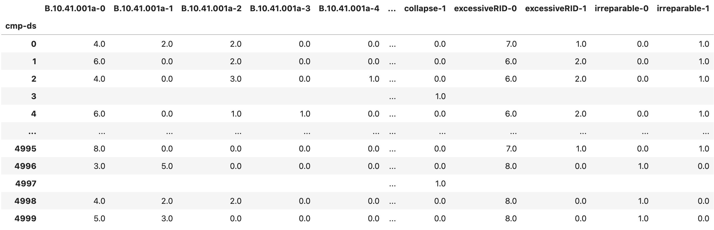

.. _lblPelicun_output:

Outputs
=======

This tab controls the types of output data generated throughout the calculation (:numref:`fig-dl-pelicun-outputs`). These outputs are stored in the local jobs directory (see its location under Preferences).

.. _fig-dl-pelicun-outputs:

   The settings for calculation outputs.

All outputs can be saved in either CSV or JSON format. The descriptions below focus on the tabular organization of the CSV format. Each JSON output is generated by using the column labels in the header of the corresponding CSV table as a first-level list of keys. The value assigned to each of these keys is the contents of the corresponding column as an array or dictionary. Arrays are used for files that store a sample, while dictionaries are used for files of statistics where the index of the table needs to be preserved. The sample files are automatically zipped to reduce their size.The following sections introduce each output type with the corresponding table headers and structure. 

Every output has a *sample* and a *statistics* version. The *sample* file provides information on every individual realization (identified by the index of the table) of the probabilistic calculation. The *statistics* file provides summary statistics based on the data in the *sample*. The following statistics are available:

:sample size:
	The ``count`` row provides the number of valid values in each column of the *sample* file. This might be fewer than the total number of realizations in the damage and loss assessment if certain outputs are conditioned on other events, such as collapse and non-collapse cases.  	

:mean:
	The ``mean`` row provides the mean of each column in the *sample* file.

:standard deviation:
	The ``std`` row provides the standard deviation of each column in the *sample* file. The number of degrees of freedom is set to N-1, where N is the sample size. This yields an unbiased estimate of the variance and a corrected sample standard deviation. Note that while this is a much better estimate than using N degrees of freedom, it is still not an unbiased one. For the typical sample sizes of N>100, the bias in this statistic is negligible. 

:median:
	The ``50%`` row provides the 50th percentile, also known as the median, of each column of the *sample* file.

:log standard deviation:
	The ``log_std`` row provides the standard deviation (with the same N-1 degrees of freedom for bias-correction) in logarithmic space for each column in the *sample* file. When a column in the sample includes zero or negative values, the log standard deviation for that column is undefined and left empty.

:extreme values:
	The ``min`` and ``max`` rows provide the minimum and maximum values of each column in the *sample* file.

:mean ± 1,2,3 standard deviations:
	Assuming a normal distribution, the following percentiles are ``-3, -2, -1, 1, 2, 3`` standard deviations from the mean: ``0.10%, 2.30%, 15.90%, 84.10%, 97.70%, 99.90%``. Each of these rows provides percentiles for each column in the *sample* file.

:10th and 90th percentiles:
	The ``10%`` and ``90%`` rows provide the 10th and the 90th percentiles for each column in the *sample* file. The 90th percentile is often used as the so-called *probable maximum* value and its opposite, the 10th percentile is considered a lower bound in several applications.

Asset
-----

The ``CMP_sample.csv`` (:numref:`fig-dl-pelicun-outputs-CMP_sample`) and ``CMP_stats.csv`` (:numref:`fig-dl-pelicun-outputs-CMP_stats`) files provide information on the types and quantities of damageable components assigned to the asset. Each column in the table corresponds to a component at a given location and direction. The label of each column is structured as ``componentID-location-direction``. The quantities are measured in the units specified during component assignment. 

The component quantity sample file is helpful in assessments with probabilistic component quantities. When the component quantities are deterministic, the sample file will contain identical rows. The statistics file provides a more concise option if you want to preserve deterministic component quantity assignments.

.. _fig-dl-pelicun-outputs-CMP_sample:

   The ``CMP_sample.csv`` output file with the component quantity sample.

.. _fig-dl-pelicun-outputs-CMP_stats:

.. figure:: figures/dl_pelicun_outputs_CMP_stats.png
   :align: center
   :figclass: align-center

   The ``CMP_stats.csv`` output file with the component quantity statistics.

Demands
-------

The ``DEM_sample.csv`` (:numref:`fig-dl-pelicun-outputs-DEM_sample`) and ``DEM_stats.csv`` (:numref:`fig-dl-pelicun-outputs-DEM_stats`) files provide information on the types and sizes of demands applied to the asset. Each column in the table corresponds to a demand type at a given location and direction. The label of each column is structured as ``event-demand-location-direction``. Demands are measured in the units specified during demand assignment. The :ref:`lbl-dldb_demands` section provides more information on demand labels and units.

.. _fig-dl-pelicun-outputs-DEM_sample:

   The ``DEM_sample.csv`` output file with the demand sample.

.. _fig-dl-pelicun-outputs-DEM_stats:

.. figure:: figures/dl_pelicun_outputs_DEM_stats.png
   :align: center
   :figclass: align-center

   The ``DEM_stats.csv`` output file with the demand statistics.

Damage
------

The ``DMG_sample.csv`` (:numref:`fig-dl-pelicun-outputs-DMG_sample`) and ``DMG_stats.csv`` (:numref:`fig-dl-pelicun-outputs-DMG_stats`) files provide information on the quantity of components in each damage state in each location and direction. The label of each column is structured as ``componentID-location-direction-ds``, where ``ds`` stands for damage state. Damaged component quantities are provided in the units specified during component assignment.

The ``ds=0`` option is included in the output and it provides the quantity of undamaged components for convenience. For the sake of efficiency, if a component type at a given location-direction is not damaged in any of the realizations, it is not included in the output. Furthermore, damage states that are never triggered (i.e., columns that would have all zero quantities) are also removed from the output. This behavior is controlled by optional settings in Pelicun that keep the output file sizes manageable. Let us know if there is interest in outputs with a comprehensive list of component-location-direction-ds; we can make such options available through the PBE app.

.. note::
	Some of the rows can be almost entirely empty if the assessment includes global vulnerabilities, such as collapse, that render other component damages undefined (see Damage Processes under :ref:`lbl-dldb_damage`). In such cases, the columns corresponding to the ``collapse`` component will identify the realizations (i.e., rows) where collapse was observed and other damages were not evaluated. 

	In the figures below, for example, realizations 4995, 4998, and 4999 are collapses and we see no damage quantities for other components. In the statistics file, we see that there are 4134 realizations with valid damage quantities for the first component. That yields a `4134/5000 = 82.68%` probability of non-collapse outcomes.

	Collapse is used here to demonstrate a common example that can lead to undefined damage quantities. Complex damage processes can introduce sophisticated interdependencies in the damage simulation that can yield similarly undefined damages for a subset of components.

.. _fig-dl-pelicun-outputs-DMG_sample:

   The ``DMG_sample.csv`` output file with the damaged component quantity sample.

.. _fig-dl-pelicun-outputs-DMG_stats:

.. figure:: figures/dl_pelicun_outputs_DMG_stats.png
   :align: center
   :figclass: align-center

   The ``DMG_stats.csv`` output file with the damaged component quantity statistics.

Two additional output files provide aggregate component damage information. The ``DMG_grp.csv`` (:numref:`fig-dl-pelicun-outputs-DMG_grp`) aggregates damage quantities from the ``DMG_sample.csv`` across locations and directions. In other words, it provides the total quantity of components in each damage state across the entire asset. Its column labels are structured as ``componentID-ds``. The ``DMG_grp_stats.csv`` (:numref:`fig-dl-pelicun-outputs-DMG_grp_stats`) provides statistics for the aggregated damage sample. 

.. _fig-dl-pelicun-outputs-DMG_grp:

   The ``DMG_grp.csv`` output file with the aggregate damaged component quantity sample.

.. _fig-dl-pelicun-outputs-DMG_grp_stats:

.. figure:: figures/dl_pelicun_outputs_DMG_grp_stats.png
   :align: center
   :figclass: align-center

   The ``DMG_grp_stats.csv`` output file with the aggregate damaged component quantity statistics.

Repair Consequences
-------------------

The ``DV_repair_sample.csv`` (:numref:`fig-dl-pelicun-outputs-DV_repair_sample`) and ``DV_repair_stats.csv`` (:numref:`fig-dl-pelicun-outputs-DV_repair_stats`) files provide detailed information on the repair consequences. The label of each column is structured as ``consequenceType-lossComponentID-damageComponentID-ds-location-direction``, where ``consequenceType`` identifies the repair consequence (*Carbon*, *Cost*, *Energy*, and *Time* are currently supported); ``damageComponentID`` identifies which component's damage resulted in the consequence; and ``lossComponentID`` identifies the component used to model the consequences. Consequence values are currently provided in the default units of the loss components.

<HERE>

The ``ds=0`` option is included in the output and it provides the quantity of undamaged components for convenience. For the sake of efficiency, if a component type at a given location-direction is not damaged in any of the realizations, it is not included in the output. Furthermore, damage states that are never triggered (i.e., columns that would have all zero quantities) are also removed from the output. This behavior is controlled by optional settings in Pelicun that keep the output file sizes manageable. Let us know if there is interest in outputs with a comprehensive list of component-location-direction-ds; we can make such options available through the PBE app.

.. note::
	Some of the rows can be almost entirely empty if the assessment includes global vulnerabilities, such as collapse, that render other component damages undefined (see Damage Processes under :ref:`lbl-dldb_damage`). In such cases, the columns corresponding to the ``collapse`` component will identify the realizations (i.e., rows) where collapse was observed and other damages were not evaluated. 

	In the figures below, for example, realizations 4995, 4998, and 4999 are collapses and we see no damage quantities for other components. In the statistics file, we see that there are 4134 realizations with valid damage quantities for the first component. That yields a `4134/5000 = 82.68%` probability of non-collapse outcomes.

	Collapse is used here to demonstrate a common example that can lead to undefined damage quantities. Complex damage processes can introduce sophisticated interdependencies in the damage simulation that can yield similarly undefined damages for a subset of components.

.. _fig-dl-pelicun-outputs-DMG_sample:

   The ``DMG_sample.csv`` output file with the damaged component quantity sample.

.. _fig-dl-pelicun-outputs-DMG_stats:

.. figure:: figures/dl_pelicun_outputs_DMG_stats.png
   :align: center
   :figclass: align-center

   The ``DMG_stats.csv`` output file with the damaged component quantity statistics.

Two additional output files provide aggregate component damage information. The ``DMG_grp.csv`` (:numref:`fig-dl-pelicun-outputs-DMG_grp`) aggregates damage quantities from the ``DMG_sample.csv`` across locations and directions. In other words, it provides the total quantity of components in each damage state across the entire asset. Its column labels are structured as ``componentID-ds``. The ``DMG_grp_stats.csv`` (:numref:`fig-dl-pelicun-outputs-DMG_grp_stats`) provides statistics for the aggregated damage sample. 

.. _fig-dl-pelicun-outputs-DMG_grp:

   The ``DMG_grp.csv`` output file with the aggregate damaged component quantity sample.

.. _fig-dl-pelicun-outputs-DMG_grp_stats:

.. figure:: figures/dl_pelicun_outputs_DMG_grp_stats.png
   :align: center
   :figclass: align-center

   The ``DMG_grp_stats.csv`` output file with the aggregate damaged component quantity statistics.

Aggregate Sample
^^^^^^^^^^^^^^^^

Aggregate Statistics
^^^^^^^^^^^^^^^^^^^^

