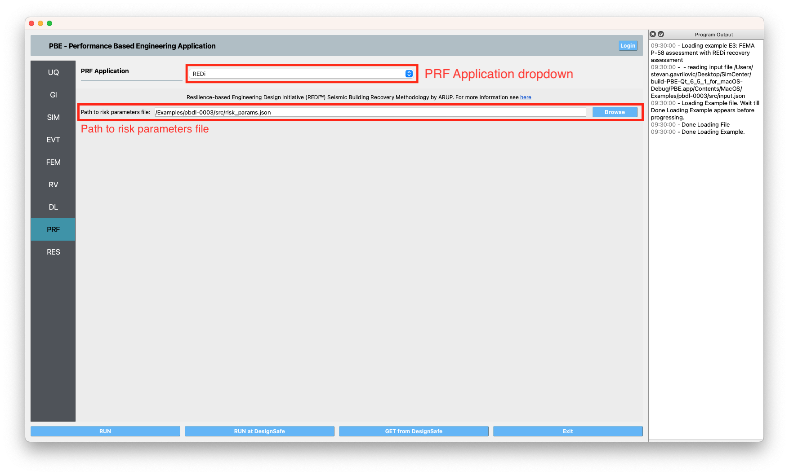

.. _lblPRF:

PRF: Recovery Performance Assessment
====================================

The recovery performance assessment panel defines the inputs to set up a recovery performance assessment for a building. If you do not want to perform a recovery performance assessment, set the **PRF Application** dropdown to ``None``.

REDi
^^^^

The REDi Panel employs the Resilience-based Engineering Design Initiative (REDi™) Seismic Building Recovery Methodology by `ARUP <https://www.arup.com>`_. For more information on the REDi methodology visit the `REDi documentation <https://sgavrilovicarup.github.io/REDi-docs/#>`_. The only input required is the **risk parameters** file. :numref:`fig-prf-redi` shows the input panel that allows the user to set the path to the **risk parameters** file for the assessment. The **risk parameters** file is a json file that contains the necessary inputs required by the REDi engine. Example **risk parameters** include impeding factors such as permit delay time. For a full list and an explanation of the required risk parameters, see the `Risk Parameters <https://sgavrilovicarup.github.io/REDi-docs/#risk-parameters>`_ section in the REDi documentation. 

.. _fig-prf-redi:

	The REDi recovery input pane.

.. note::

   In addition  to the csv output format that is default in Pelicun, REDi requires that the outputs be in json format as well. Therefore, the json output checkbox must be checked in **DL->Pelicun->Outputs->Format**, as seen in :numref:`fig-prf-redi-json` below.
   
   .. _fig-prf-redi-json:
   
   .. figure:: figures/prf_redi_json.png
   	:align: center
   	:figclass: align-center
   
   	Required output format.
   

.. warning::

   The REDi recovery application employs the `PyREDi <https://pypi.org/project/pyredi/>`_ Python module. The PyREDi modules uses its own version of the FEMA P-58 component library. There is a one-to-one match between the P-58 components in Pelicun and in  PyREDi. However, if the user is adding their own custom components, the custom components need to be added to the PyREDi library as well (Located at ``site-packages/REDi/data/components_library.json`` in your Python installation). Note that the custom components  require REDi-specific component attributes explained here `PyREDi <https://sgavrilovicarup.github.io/REDi-docs/#background>`_.
   
