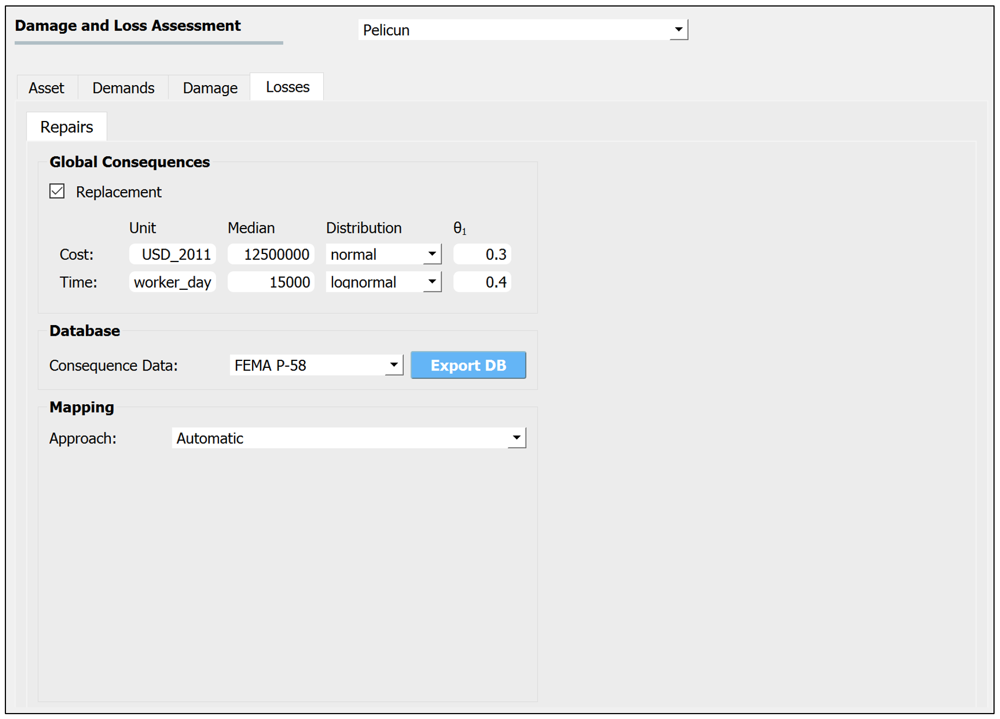
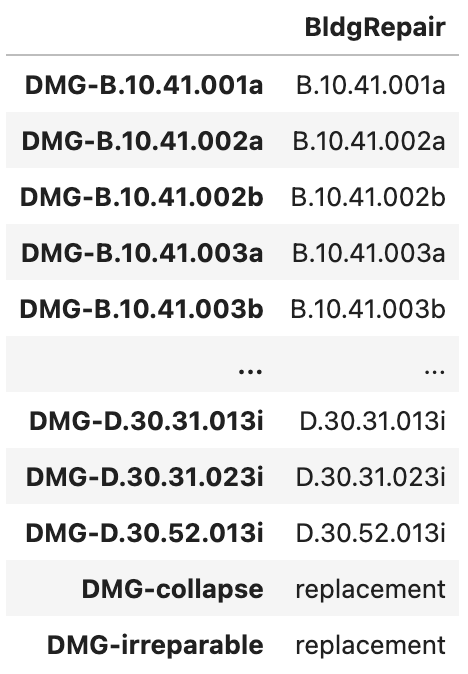

.. _lblPelicun_loss_repairs:

Repair Consequences
===================

Repair consequences in Pelicun are calculated as a function of the quantity and severity of damage experienced by components (:numref:`fig-dl-pelicun-loss-repairs`). Alternatively, if corresponding consequence functions are provided by the user, Pelicun can also calculate repair consequences as a function of demands (i.e., intensity measures or structural response quantities). This latter approach can implement *loss functions* from the literature. 

.. _fig-dl-pelicun-loss-repairs:

   The Repair Consequence model inputs.

The Repair Consequence model inputs are grouped into the following areas:

Component Repair Consequences
-----------------------------

This area is used to specify the component repair consequence library (i.e., typically one or more files that provide parameters for consequence functions). The following libraries are built into the application:

:FEMA P-58:
    Provides the repair consequence function parameters published in the second edition of FEMA P-58 (2018). Supports calculating the cost and time it takes to repair damages as well as the carbon emissions and embodied energy corrsponding to the repairs as per FEMA P-58.

:Hazus Earthquake Buildings:
    Provides the repair consequence function parameters for buildings published in the Hazus Earthquake Technical Manual (2023). Supports calculating the cost and time it takes to repair damages.

:Hazus Earthquake Transportation:
    Provides the repair consequence function parameters for transportation infrastructure components based on the Hazus Earthquake Technical Manual (2023).

:None:
    Select this option if none of the built-in libraries are used in your analyses. This assumes that all components will be defined through external files.

The :ref:`lbl-dldb_repair` section of this manual provides detailed description of the components available in the built-in libraries.

User-defined components
^^^^^^^^^^^^^^^^^^^^^^^

The built-in component libraries provide a good starting point, but you will almost always need to add project- or problem-specific components to provide a comprehensive description of damage and losses for an asset. Pelicun stores consequence function parameters in a standardized format. We suggest using the **Export DB** button to export one of the built-in libraries to a file that can serve as a template for adding your own components. The file formats and data schema are described in detail under :ref:`lbl-dldb_schema`.

.. note::
   You can also access the built-in libraries through the official `GitHub repository <https://github.com/NHERI-SimCenter/DB_DamageAndLoss/tree/main/DB>`_ of SimCenter's Damage and Loss Database. Component repair consequence data files have their names starting with ``loss_repair_DB``.

Once you have your custom repair consequence data files prepared, check the **Use Additional Components** checkbox and click on the **Choose** button to be able to select a CSV file with the component parameters. If you have both a built-in library and a user-defined one in an analysis, components in the user-defined library take precedent over those in the built-in one. This lets you overwrite select components from a built-in library by redefining them while having all other components available with their original parameters from the built-in library. 

Repair Consequence Types
------------------------

This area shows the consequence types available in the selected libraries and allows for requesting results on only a subset of them through the provided checkboxes.

The PBE application currently only supports calculations for the four repair consequence types shown in :numref:`fig-dl-pelicun-loss-repairs`. Future versions will allow for arbitrary consequence types that are automatically parsed from the provided libraries. Such functionality is already available in Pelicun.

Available Consequence Models
----------------------------

This area shows the consequence functions available in the component repair consequence library. The available components are listed under **Component** and the consequence types available for the selected component are listed under **Consequence Type**. Libraries do not need to have all consequence types provided for all components. 

When a user-defined component library is loaded, the PBE application attempts to generate figures of consequence functions and tabulated parameters for every component in the library. The Program Output window provides feedback on this process and shows error messages if the provided data seems invalid. The figures are generated as HTML files in the ``resources/consequence_viz`` folder under the local jobs directory (see its location under Preferences). These figures can be helpful when creating a report or documentation for the assessment performed in PBE.

.. note::
    The built-in libraries already have their figures generated in the backend. To export those figures, we suggest exporting the library and loading it back as a user-defined data to generate the HTML files in the above directory.

Below the component and consequence selection boxes, a short descripition of the component is shown and the controlling demand is highlighted. Consequences controlled by Damage Quantity assign losses to blocks of damaged components, while those controlled by Demand Intensity assign losses based on the severity of intensity measures or structural response quantities. This general component information is followed by a figure of the consequence function(s) and a tabulated summary of their parameters. 

Models controlled by Demand Intensity have a single consequence function that prescribes a median consequence to a demand input. Components controlled by Damage Quantity need to have one consequence function defined for each damage state of the component. These functions describe the consequences per damaged component block corresponding to the suggested block size. Note that Pelicun can handle other block sizes and automatically scales the consequences for non-standard component blocks. Repair consequence models controlled by damage can consider the effect of economies of scale (i.e., the repair cost per unit tends to decrease with increasing total quantity of damaged units). When such a model is available, the horizontal axis shows damage quantities (using the suggested block size).

Currently, the PBE application supports constant and multilinear median consequence functions. Constant median consequences are defined by a single scalar and shown in the table next to the figures. The unit for these is displayed in brackets in the vertical axis label of the figure. For multilinear consequence functions, the detailed list of breakpoint coordinates are shown if you hover over the asterisk that follows the ``varies`` text in the table. The function is assumed constant before the first and after the last breakpoint. Multilinear functions are applicable to demand-controlled components as well as components that aim to model economies of scale.

Consequence models can be deterministic or probabilistic. Deterministic models provide a median consequence only. Probabilistic models describe the uncertainty around the median consequence function by prescribing a distribution function and a dispersion parameter. Currently, *lognormal* and *normal* distributions are supported. The **Consequence Dispersion** parameter describes the *coefficient of variation* for normal distributions and the *logarithmic standard deviation* for lognormal distributions. Consequence models in Pelicun are homoscedastic and expect a single scalar for the dispersion parameter.

Clicking on individual damage states in the legend controls visibility of the corresponding consequence functions. Hovering over the asterisk before the ``DS#`` entries in the table shows additional information about the damage state and the corresponding repair action - provided that such information is available for the component in a metadata file in the component consequence library.

.. note::
    PBE cannot display consequence functions for components with incomplete parametrization (e.g., probabilistic consequences with undefined dispersion values). When no consequence functions are shown after selecting a component, you will need to provide additional data for it. As long as a component's information is incomplete, Pelicun automatically removes it from the analysis.

Global consequences
-------------------

This area allows you to add components to your loss model that handle global replacement consequences. If you choose Automatic mapping between damage and repair consequences (see the subsection on Mapping below for details), collapse and irreparable damage are automatically mapped to lead to these replacement consequences.

Both deterministic and probabilistic replacement consequences are supported. Deterministic consequence models have their **Distribution** set to N/A. Probabilistic models use a prescribed distribution to model the uncertainty in the replacement consequence. Currently, *normal* and *lognormal* distributions are supported. The **θ₁** parameter is the coefficient of variation for a normal distribution and the log-standard deviation for a lognormal distribution.

Currently, units of the replacement consequences need to match those of the component consequences used in the assessment. In a future update, we plan to automate conversion between frequently-used units and allow for different units for replacement inputs and component data.

.. note:: Both the FEMA P-58 and the Hazus methodology use deterministic replacement consequences.

.. note:: Large input values can be provided using scientific notation in the form of E notation: ``MeN`` is defined as the value of ``M`` multiplied by 10 raised to the power of ``N``. For example, ``1e9`` provided for the median replacement energy :numref:`fig-dl-pelicun-loss-repairs` is equivalent to ``1000000000``.

Mapping
-------

The last step of repair consequence modeling is mapping demands or component damages to component loss models. This mapping is defined in a tabular format that is illustrated below (:numref:`fig-dl-pelicun-loss_repairs-map`).

.. _fig-dl-pelicun-loss_repairs-map:

   Loss map stored in a CSV file.

The first column identifies the inputs for consequence calculations. Input labels are composed of ``inputType-inputSubType`` where

:inputType: 
    Identifies if this input describes demands (``DEM``) or damages (``DMG``).

:inputSubType:
    When using demands, the subtype identifies the demand type with the acronyms introduced in :ref:`lblPelicun_demands`. For example, ``DEM-SA_1.0`` corresponds to the Sa(T=1.0s) input from the demand data. When a demand type has demand data corresponding to multiple locations, corresponding losses are calculated using the specific demand at each location.

    When using damages, the subtype identifies the component type using the component's standard ID that is listed in the :ref:`lblPelicun_asset`. For example, ``DMG-B.10.41.001a`` corresponds to the quantity of B.10.41.001a components in each damage state. When a component type is assigned to multiple locations, corresponding losses are calculated using the specific component damages at each location.

The second column shall have a standard ``BldgRepair`` label in the header and list the repair consequence component ID corresponding to each input.

.. note::
    Pelicun's loss mapping supports many-to-many relationships, that is, neither columns are required to have unique values. For example, multiple types of damage might lead to the same replacement consequence as shown in :numref:`fig-dl-pelicun-loss_repairs-map`. Alternatively, the same inputs might lead to two complementary consequences that you prefer to model independently - this could be handled by listing the same input twice and linking it to two different loss components in the mapping table.

The **Automatic** approach automatically creates one of the following two maps based on the Damage Process prescribed in the :ref:`lblPelicun_damage`:

:FEMA P-58:
    Queries the damageable component IDs and creates a mapping to a list of identical loss component IDs. This recognizes that FEMA P-58 handles damages and losses within the same component using a single component ID.

:Hazus Earthquake Buildings:
    Uses the occupancy type information (set in the :ref:`lblPelicun_asset`) to assign a repair consequence to each building-level component type.

Collapse and irreparable damage are automatically mapped to  replacement consequences in the above cases.

You can provide your own mapping by selecting the **User Defined** option. This option allows you to Choose a CSV file that includes a custom mapping table that follows the schema introduced above.
