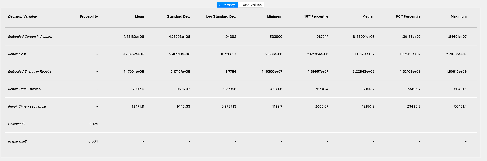
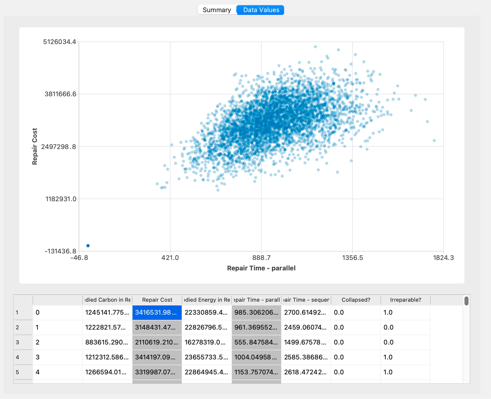

.. _resPBE:

RES: Results
------------

After the user hits the **Run** button, the simulation of building response and the loss assessment is performed automatically in the background. Assuming that the calculations were successful, the |app| switches to the **RES** tab to present the results. A successful run or download of a job that ran successfully will result in two tabbed widgets being displayed in this panel.

The first panel :numref:`figResultsSummaryPBE` shows summary statistics: mean, standard deviation, and several important percentiles of the Decision Variables.

.. _figResultsSummaryPBE:

	Results summary.

The second panel presents results for each realization in a plot and in tabular format. By selecting various columns with the left and right mouse buttons in the table below the graphic, the information in the plot is updated :numref:`resultsData_PBE`. The plot is controlled as follows:

    #.  Selection with the left mouse button identifies the variable on the Y axis.
    #. Selection with the right mouse button identifies the variable on the X axis.
    #. If the same column is selected with both mouse buttons, then the distribution of the selected Decision Variable is plotted. A left click on the column triggers a cumulative distribution function plot, while a right click triggers a probability density function plot.

.. _resultsData_PBE:

	Results presented graphically and in tabular form.

The columns in the table typically identify the Decision Variable category (e.g. reconstruction, injuries, etc.) and a variable within that category preceded by a forward slash (e.g., injuries/fatalities). Boolean variables (e.g,. collapsed?, red_tagged?) are used to describe the occurrence of events. The reconstruction/time_impractical? and cost_impractical? variables identify realizations where reconstruction time or cost would exceed the replacement time or cost, respectively. In such cases, replacement is assumed instead of reconstruction. The minimum (i.e., based on parallel work) reconstruction time is used when making this decision.

Besides the results displayed in the application, advanced users can find detailed information about EDPs, damage, and decision variables in **csv** files in the Working directory in the **tmp.SimCenter/templatedir** folder. 

