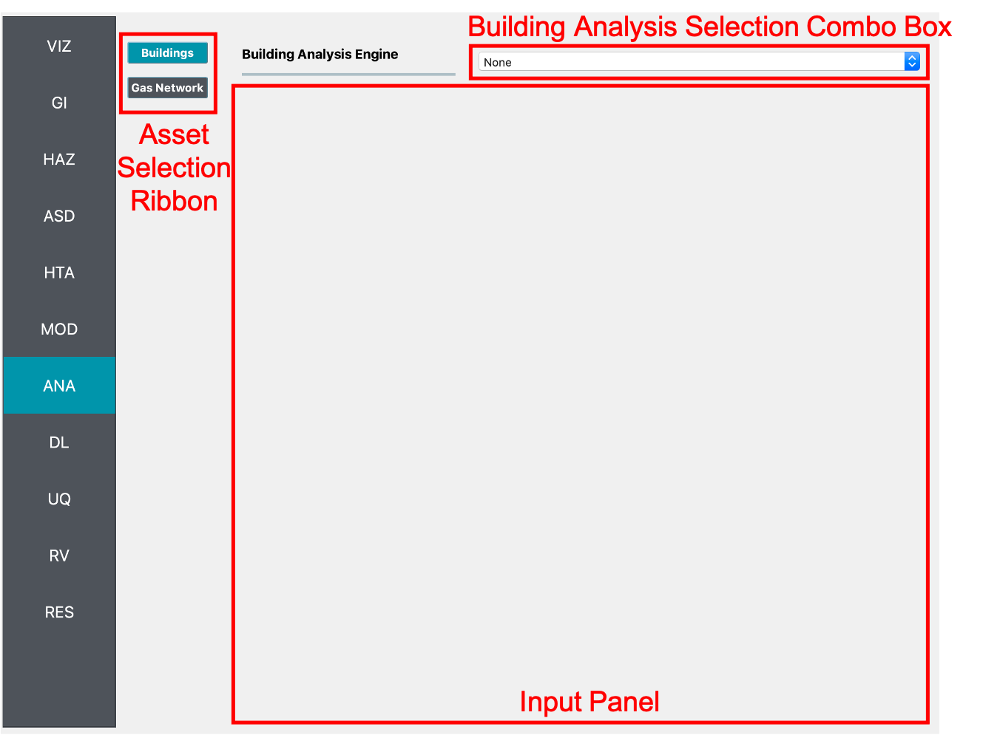

ANA: Asset Analysis
===================

In this panel, the user can select the applications that will be employed in the analysis of each asset class. The user can select the type of asset from the **Asset Selection Ribbon**, e.g., Buildings and Gas Network, as shown on the left-hand side of :numref:`fig-R2DANAInputPanel`. The **Asset Selection Ribbon** is hidden by default, and appears when more than one type of asset is selected in the **GI: General Information** panel. Additionally, only the assets that are checked in the **GI: General Information** panel will appear in the **Asset Selection Ribbon**. As the user switches between assets, the **Input Panel** in :numref:`fig-buildingModelingPanel` will change to reflect the applications that are available for analyzing each type of asset.

.. _fig-R2DANAInputPanel:

  Buildings analysis input panel.

.. contents::
   :local:

Buildings
---------

The applications available for the modeling of buildings are: 

	- OpenSees
	- OpenSeesPy
	- IM as EDP

Currently, the inputs, scripts, commands, etc., for the analysis applications are provided by the modeling applications. Future implementation will allow for the user to customize the analysis applications, e.g., specify the type of solver and convergence test in an OpenSees analysis. 

OpenSees Analysis Model
***********************

The **OpenSees** analysis application employs OpenSees to conduct the structural analysis.

OpenSeesPy Analysis Model
*************************

The **OpenSeesPy** analysis application employs OpenSeesPy to conduct the structural analysis.

IM as EDP Analysis Model
*************************

The **IM as EDP** application forgoes a structural analysis altogether. In this case, the hazard intensity measure (IM) is considered the engineering demand parameter (EDP). 
