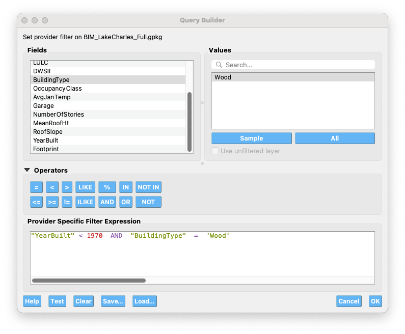
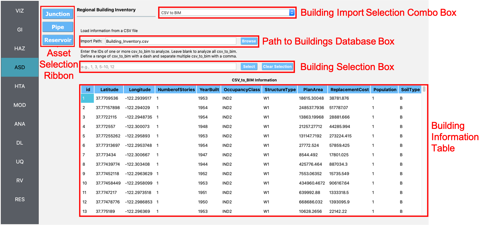
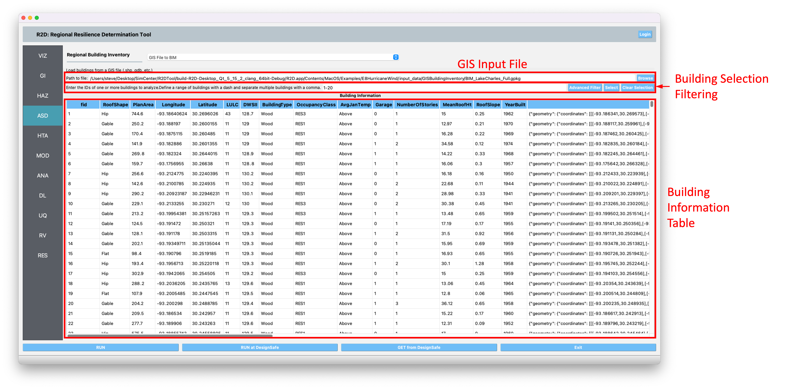
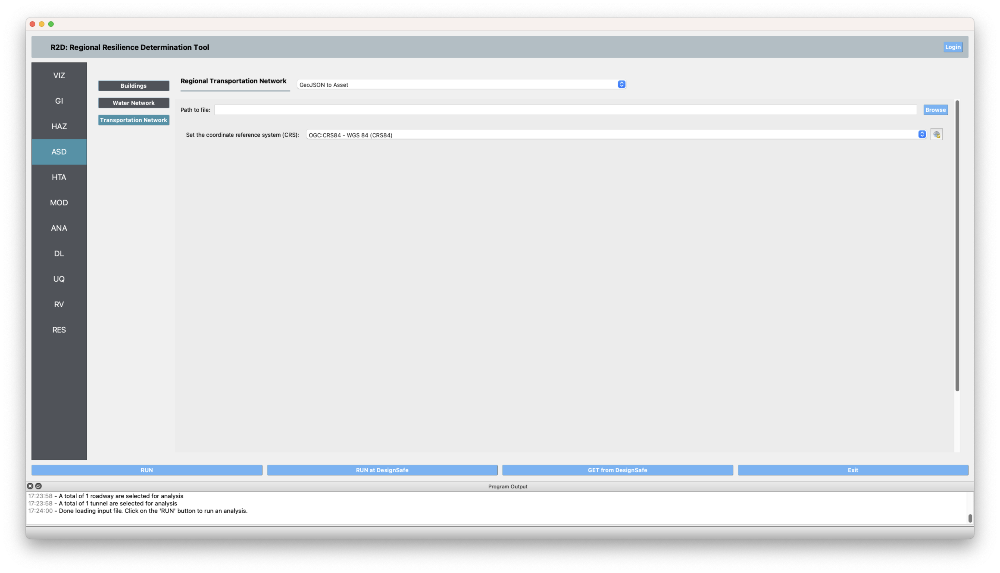
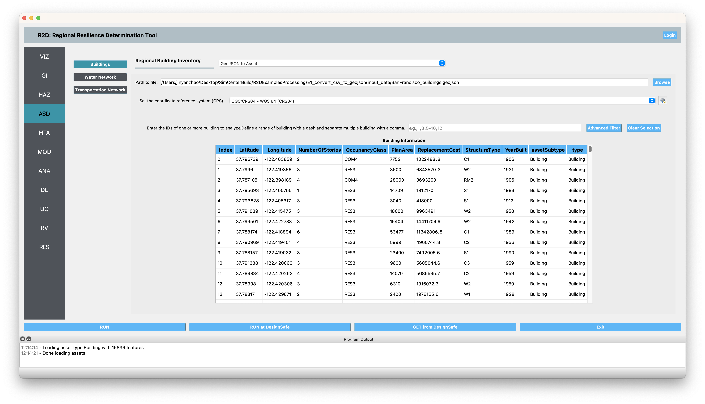
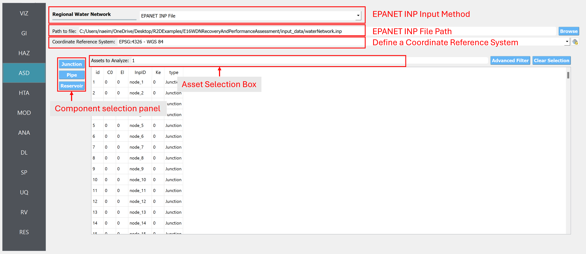
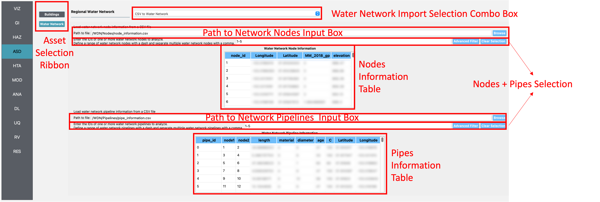
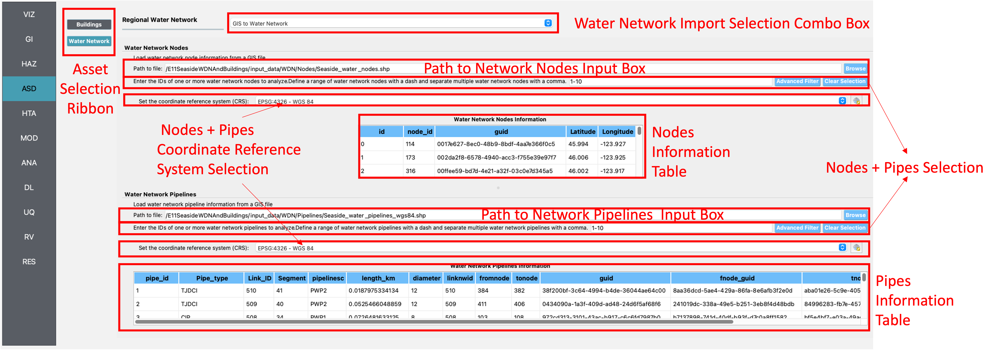
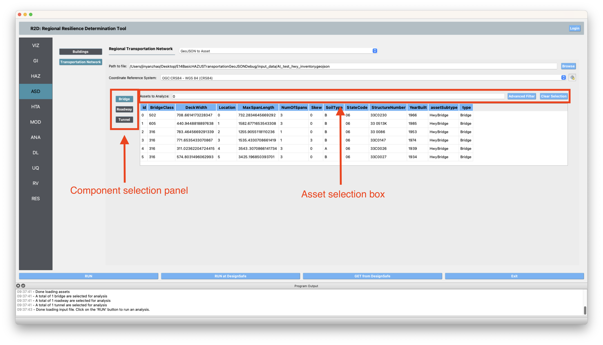
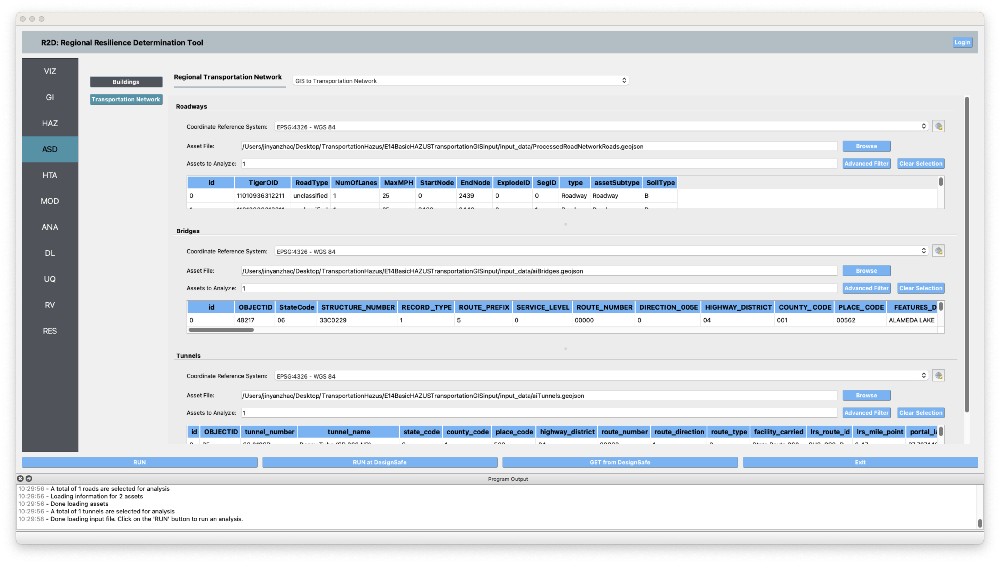

ASD: Asset Definition
=====================

This section guides users through importing databases for various asset classes. Users can select asset types, such as Buildings and Transportation Networks, from the **Asset Selection Ribbon** on the left-hand side of :numref:`fig-buildingInputPanel`. This ribbon appears when multiple asset types are selected in the **GI: General Information** panel, displaying only the assets checked in the **GI** panel. Switching between assets updates the main panel to show relevant import options for each asset type.

.. contents::
   :local:

.. _lbl-ASDBuildings:

Buildings
---------

The buildings input panel (:numref:`fig-buildingInputPanel`) enables users to import a building inventory database. Selection of the import application is done via the **Building Import Selection** combo box, facilitating the creation of an asset information model (AIM).

CSV to AIM
**********

This application imports a building inventory from a .csv file provided by the user.

#. **Path to Buildings Database**: Users specify the .csv file path here. The file must at least contain columns for building IDs (id, in sequence), and the latitudes (Latitude) and longitudes (Longitude) of building locations. Additional columns should be included to supply information needed by other workflow applications.

#. **Building Selection Filtering**: Users can select a subset of buildings for analysis either by entering building IDs directly or using the **Advanced Filter** for SQL format filter expressions. The **Query Builder** dialog (:numref:`fig-R2DQueryBuilderDialog`) aids in creating these expressions. Operators and fields can be combined to perform complex filtering expressions such as ``"YearBuilt" < 1970  AND  "BuildingType"  =  'Wood'``

.. _fig-R2DQueryBuilderDialog:

  Query Builder Dialog.

Pressing **Select** adds the specified buildings to the analysis list, while **Clear Selection** removes them. The **Building Information** table (:numref:`fig-buildingInputPanel`) is a spreadsheet populated with data from the .csv file.

.. _fig-buildingInputPanel:

  CSV to AIM input panel.

GIS to AIM
**********

This application imports a building inventory from a GIS file (e.g., shapefile, geodatabase) specified by the user, as shown in :numref:`fig-R2DGISBuildingsInputPanel`.

#. **GIS Input File**: Users provide the GIS file path here. Selecting the file is facilitated by a dialog box opened via the **Browse** button.

#. **Building Selection Filtering**: Similar to CSV to AIM, buildings can be selected directly by ID or through advanced filtering. The **Query Builder** dialog assists in creating SQL format filter expressions.

The **Building Information** table displays a spreadsheet of the imported data, showing only selected buildings for analysis.

.. _fig-R2DGISBuildingsInputPanel:

  GIS to AIM input panel.

GeoJSON to Asset
****************

The **GeoJSON to Asset** application (:numref:`fig-R2DGeoJsonInputBeforeLoad`) is the preferred method for loading regional infrastructure inventories in SimCenter. It requires a `.geojson` file conforming to the official `.geojson` format described `here <https://geojson.org/>`_. The file must include a "CRS" key-item pair for the coordinate reference system and describe building stock information in the `"features"` array. Each feature represents an asset and must include `{"type":"Feature"}`, `"id"`, `"geometry"`, and `"properties"` items.  The value of `"id"` should be an integer in string format for asset selection.

The `"properties"` item should contain all information necessary for subsequent workflow analyses. A **"type"** attribute within `"properties"` is necessary, and it specifies the component type (e.g., **"Building"** for building inventory). This affects how assets are managed in later simulation workflows.

.. _fig-R2DGeoJsonInputBeforeLoad:

  GeoJSON to Asset input panel.

.. literalinclude:: figures/R2DGeoJSONInputExampleBuilding.json
   :language: json
   :linenos:
   :caption: GeoJSON formatted database for buildings.
   :name: fig-R2DGeoJSONInputExampleBuilding

.. _fig-R2DGeoJsonInputAfterLoadBuilding:

  
  GeoJSON to Asset input panel after loading a building ``.geojson`` database.
  
.. _lbl-ASDWaterDistributionNetwork:

Regional Water Distribution Networks
-------------------------------------

The water distribution network panel (:numref:`fig-WDNINPASD`) allows for the input of nodes and pipelines. Users select the import application via the **Regional Water Network Selection** combo box.

INP to Water Distribution Network
*********************************

This application imports water distribution networks from the EPANET INP format. The INP file contains many features and is widely used in the industry. Although the INP file includes coordinates, the coordinate reference system must be defined within this application.

For more information, please refer to `EPANET's Document <https://epanet22.readthedocs.io/en/latest/back_matter.html>`_.

Please note that this is the preferred input method for using REWET in R2D.

.. _fig-WDNINPASD:

  INP network distribution network input panel.

This application imports a water distribution network from .csv files representing nodes and pipelines.

CSV to Regional Water Network
*****************************

This application imports a water distribution network from .csv files representing nodes and pipelines.

#. **Path to Nodes/Pipelines**: Users specify the file paths for nodes and pipelines. The nodes file must include columns for node IDs (in sequence) and their latitudes and longitudes. The pipelines file requires columns for pipe IDs (in sequence) and node IDs for the start and end points.

#. The **Node and Pipeline Information** table displays the imported data in a user-editable spreadsheet. Subset selection for analysis is available through direct ID input or advanced filtering.

.. _fig-WDNInputPanel:

  CSV to regional water network input panel.

GIS to Regional Water Network
*****************************

This application imports a water distribution network from GIS files representing nodes and pipelines.

#. **Path to Nodes/Pipelines**: Users provide the GIS file paths here. The files must include identification numbers (id) for nodes and pipelines, with additional attributes as needed.

#. The **Node and Pipeline Information** table displays imported data, with CRS specification required for correct feature placement.

.. _fig-R2DWDNgisInputPanel:

  GIS to regional water network input panel.

.. _lbl-ASDTransport:

Regional Transportation Infrastructure
--------------------------------------

This section covers the import of transportation network inventories. The **Transportation Network Selection** combo box allows for application selection.

GeoJSON to Asset
****************
The **GeoJSON to Asset** application (:numref:`fig-R2DGeoJsonInputBeforeLoad`), is SimCenter's preferred method to load regional infrastructure inventory.
:numref:`fig-R2DGeoJSONInputExampleBuilding` is an example of a ``.geojson`` formatted database for transportation infrastructure. 
It follows the format convention of the official ``.geojson`` structure as described `here <https://geojson.org/>`_. 
A "CRS" key-item pair is necessary to define the coordinate reference system, and the infrastructure information is described in the `"features"` array.
Each feature in the features array stands for one asset. Each feature must include a `{"type":"Feature"}` key-item pair, an `"id"` item, a `"geometry"` item, and a `"properties"` item.

To be used in R2D, the ``.geojson`` file also needs to contain an "id" item, and the value of the "id" needs to be integer values in a string format. The "id" is used to select assets to be analyzed. 
The "id" needs to be unique in each asset type, (e.g., a "Bridge" and a "Tunnel" can have the same "id" but two "Bridge"s can not share the same "id")
The information needed in later workflow should be included in the `"properties"` item. All information needed in the 
subsequent workflow (e.g., IMasEDP asset analysis and HAZUS-MH EQ damage and loss analysis) must be provided. Otherwise, R2D may return errors.
The information required for typical analysis workflows can be found in :ref:`File Types and Schemas <lblUserDefInputs>` and in :ref:`R2D examples <lbl-examples>`. 
A special SimCenter convention is an attribute **"type"** must be included in the `"properties"` items. The value of **"type"**
describes the component type of this feature. For transportation 
infrastructure, the value of `"type"` could be `Bridge`, `Roadway`, `Tunnel`, or other values. Assets with the same `"type"` (e.g., all bridges)
will be visualized in the same visualization layer. Assets with the same `"type"` will also be placed in the 
same working directory in the **Results** folder in the **Output Directory** folder that is specified in R2D preferences. For each bridge (or other component type),
there can be other identification keys (such as, `"assetSubtype": "HwyBridge"` in :numref:`R2DGeoJSONInputExampleTransport`). The key `"assetSubtype"` is 
used by the R2D built-in Damage and Loss (DL) application **Pelicun3** when the HAZUS-MH damage and loss methods are selected. `"HwyBridge"` stands for highway bridge as classified in the
`Hazus Inventory Technical Manual <https://www.fema.gov/sites/default/files/documents/fema_hazus-6-inventory-technical-manual.pdf>`_ and the
`Hazus Earthquake Model Technical Manual <https://www.fema.gov/sites/default/files/documents/fema_hazus-earthquake-model-technical-manual-5-1.pdf>`_.
If a user selects to use **User-provided Fragilities** in **Pelicun3**, the key `"assetSubtype"` is not needed.
More descriptions can be found in example 14 in :ref:`R2D examples <lbl-examples>`. 

:numref:`fig-R2DGeoJsonInputAfterLoadTransport` is the panel after a ``.geojson`` transportation infrastructure inventory database is loaded in R2D.
Users should switch the viewing panel with the **component selection panel** and select the assets they want to analyze in the **Asset Selection Filtering** box.
The selected assets can be visualized in the **VIZ** panel.

.. note:: The outputs of the BRIALS Transportation tool use the default units of the inventory database described in :numref:`lbl-BrailsTransportation`. Users need to convert the units to those defined in the :ref:`General Information <lblGI>` panel before loading the units to this Asset panel.

.. literalinclude:: figures/R2DGeoJSONInputExampleTransport.json
   :language: json
   :linenos:
   :caption: GeoJSON formatted database for transportation infrastructure inventory.
   :name: R2DGeoJSONInputExampleTransport

.. _fig-R2DGeoJsonInputAfterLoadTransport:

  GeoJSON to Asset input panel after loading a transportation infrastructure ``.geojson`` database.
  

GIS to Transportation Network AIM
*********************************

This application (:numref:`fig-R2DTransportGISInputPanel`) imports transportation networks from GIS files containing highway bridges, tunnels, and roadways. Users specify file paths for each feature type, with the GIS files containing identification numbers and additional attributes as needed.
Example GIS files for roadways, bridges, and tunnels that can be loaded to R2D with **GIS to Transportation Network AIM** can 
be found in the `GitHub data repository <https://github.com/NHERI-SimCenter/R2DExamples>`_ of example 14 of :ref:`R2D examples <lbl-examples>`

.. _fig-R2DTransportGISInputPanel:

  GIS to regional transportation network input panel.