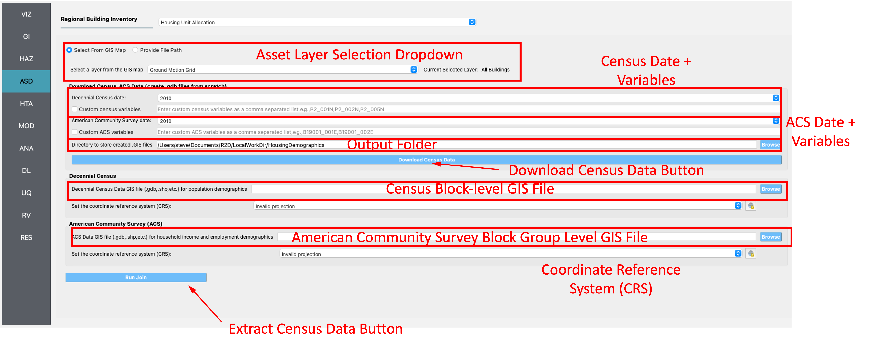

Census Data Allocation
----------------------

The **Census Data Allocation** application can be employed to augment an existing asset inventory with US Census demographic information and socio-economic information, e.g., household income, from the American Community Survey (ACS). The input panel is shown in :numref:`fig-R2DHUAPanel`. As seen in the figure, the asset information is supplied via selection of an already imported layer in R2D. Alternatively, a user can supply an asset layer in a GIS format, e.g., shapefile, geodatabase, and the supplied layer will be employed.

.. note:: R2D will make a copy of the asset layer that you provide. Going forward, the copy of the asset layer is employed to preserve the original data.

The procedure is as follows:
	#. Given an asset inventory, R2D cross-references the assets with a US counties map (2021), generating a set of US county codes that overlap with the provided asset inventory.
	#. The US Census API is queried and the population demographic information within each county is downloaded at the block level and saved locally . Similarly, the ACS API is called to download socio-economic information and the data is saved as a second GIS file. The ACS data is saved at the block group level. The GIS files are found in the output folder specified by the user (shown below as Directory to store created .GIS files).
	#. The Census and ACS information from the downloaded GIS files is extracted and appended to the assets in the copied layer by performing a spatial join. This means that each asset within the copied layer will be augmented to contain the informtaion extracted from the Census block level layer and the ACS block group layer of which it is located in.

.. note:: The download of census data employs a modified version of the ``censusutil.py`` script from the `pyincore-data <https://github.com/IN-CORE/pyincore-data>`_ module, a component of IN-CORE. 

#. The **Asset Layer Selection Dropdown** is where the user selects the GIS layer in R2D that contains the asset inventory of interest. When the user selects a layer, it will be copied automatically.

#. If the user provides their own GIS file with the asset inventory, they will also have to provide the **Coordinate Reference System (CRS)**. The CRS dropdown is where the coordinate reference system for a particular GIS file is specified so that it can be projected into the correct coordinates.

#. The **Census Date** dropdown is where the Census vintage is provided. Currently, the 2010 and 2020 Census dates are supported. 

#. The **Census Variables** input box is where the user can provide custom variables to download from the Census API in a comma separated list. For the 2010 vintage the default variables are ``P005001,P005003,P005004,P005010``, and for the 2020 vintage, the default variables are ``P2_001N,P2_002N,P2_005N,P2_006N``. You can go to the Census website for a particular vintage to see what the variables mean, and what other variables are available.

	The default variables for 2010 are:
		- P005001 = Total
		- P005003 = Total!!Not Hispanic or Latino!!White alone
		- P005004 = Total!!Not Hispanic or Latino!!Black or African American alone
		- P005010 = Total!!Hispanic or Latino
	
	The default variables for 2020 are:
		- P2_001N=!!Total:
		- P2_002N=!!Total:!!Hispanic or Latino
		- P2_005N=!!Total:!!Not Hispanic or Latino:!!Population of one race:!!White alone
		- P2_006N=!!Total:!!Not Hispanic or Latino:!!Population of one race:!!Black or African American alone

#. The **ACS Date** dropdown is where the ACS vintage is provided. Currently, the 2010, 2015, and 2020 ACS dates are supported.

#. The **ACS Variables** input box is where the user can provide custom variables to download from the ACS API. They should also be provided in a comma separated list.

	For the 2010, 2015, and 2020 5-year ACS vintage the default variables are:
		- B19001_001E - Estimate!!Total
		- B19001_002E - Estimate!!Total!!Less than $10,000
		- B19001_003E - Estimate!!Total!!$10,000 to $14,999
		- B19001_004E - Estimate!!Total!!$15,000 to $19,999
		- B19001_005E - Estimate!!Total!!$20,000 to $24,999
		- B19001_006E - Estimate!!Total!!$25,000 to $29,999
		- B19001_007E - Estimate!!Total!!$30,000 to $34,999
		- B19001_008E - Estimate!!Total!!$35,000 to $39,999
		- B19001_009E - Estimate!!Total!!$40,000 to $44,999
		- B19001_010E - Estimate!!Total!!$45,000 to $49,999
		- B19001_011E - Estimate!!Total!!$50,000 to $59,999
		- B19001_012E - Estimate!!Total!!$60,000 to $74,999
		- B19001_013E - Estimate!!Total!!$75,000 to $99,999
		- B19001_014E - Estimate!!Total!!$100,000 to $124,999
		- B19001_015E - Estimate!!Total!!$125,000 to $149,999
		- B19001_016E - Estimate!!Total!!$150,000 to $199,999
		- B19001_017E - Estimate!!Total!!$200,000 or more
		- B19013_001E - Estimate!!Median household income in the past 12 months (in 2016 inflation-adjusted dollars)

#. The **Output Folder** is the location on your computer where R2D will save the GIS files that are downloaded from the US Census APIs. 

#. The **Download Census Data Button** runs the process that extracts the counties that overlap the building inventory, calls the US Census and ACS APIs to download data for the extracted counties, and saves the data as GIS files to the output folder.

#. The **Census Block-level GIS File** and **American Community Survey Block Group Level GIS File** box provides the file paths to the respective GIS files. These paths will be populated automatically after the download process described above completes. Alternatively, you can provide your own Census and ACS layers to join to the building inventory. Clicking on the **Browse** button will open a dialog where you can select the respective file.

#. The **Extract Census Data Button** runs the process that extracts the Census and ACS data from the GIS files and appends that information to each asset in the copied asset layer. Users can now save the newly augmented layer by right-clicking on the layer in the layer tree and selecting the ``Export->Save As`` option.

.. _fig-R2DHUAPanel:

  Census data allocation input panel.
