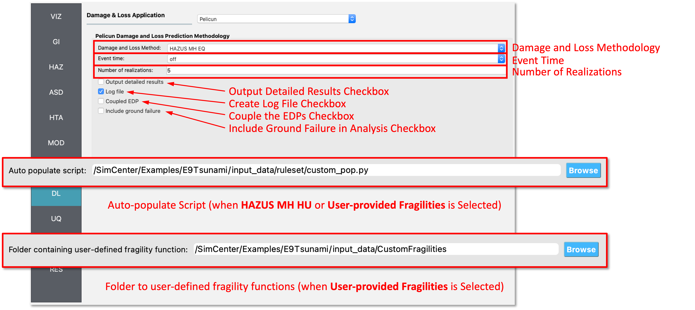

DL: Damage and Loss
===================

The **Damage and Loss** panel is where the user selects a damage and loss methodology to estimate losses over a region. The following damage and loss applications are available:

.. contents::
   :local:

Pelicun Damage and Loss 
-----------------------

Shown in :numref:`fig-R2DPelicunDLPanel`, the **Pelicun Damage and Loss** application has the following inputs:

	#. **Damage and Loss Methodology:** The type of damage and loss methodology to use. Currently, the following damage and loss methodologies are available:
	
		- Hazus MH EQ
			 The **Hazus MH EQ** option, expects the inputs to include standard engineering demand parameters (EDPs) for earthquakes such as peak interstory drift ratio (PID), peak floor acceleration (PFA), peak roof drift (PRD), and peak floor displacement (PFD). Use this option if performing a building response analysis. 
		- Hazus MH EQ IM
			The **Hazus MH EQ IM** option is more rudimentary, and only expects an intensity measure (IM) as an input, e.g., peak ground acceleration (PGA). Use this option if you are NOT performing a building response analysis, i.e., the Building Modeling type is set to **None** in the **MOD** tab. Also, in the **ANA** tab, the Building Analysis Engine type should be **IMasEDP** when using this option. 
		- Hazus MH HU
			The **Hazus MH HU** option is for the prediction of damage and loss to buildings subjected to hurricanes. This option expects a wind intensity measure (IM) as an input, e.g., peak wind speed (PWS).
		
		All of the HAZUS options employ data from the *Hazards U.S. Multi-Hazard project* (HAZUS-MH). The **Hazus MH EQ** and the **Hazus MH EQ IM** options are intended for damage and loss analysis of buildings subjected to earthquakes. The **Hazus MH HU** option is intended for damage and loss analysis of buildings subjected to hurricanes.
	
	#. **Event Time:** Select event time 'on' or 'off'. Selecting the event time to 'on' defines the time of the event in YYYY-MM-DD:HH format. ‘off’ turns all time-effects off.
	
	#. **Number of Realizations:** The number of loss realizations to generate in an analysis.
	
	#. **Output Detailed Results:** Checking this box will output detailed results.
	
	#. **Create Log File:** Checking this box will create a log file of the analysis.
	
	#. **Include Ground Failure:** Checking this box will include ground failure in the analysis. If ground failure is included, fragility groups associated with ground failure are added in the auto-population phase. Note that such analysis requires peak ground displacement (PGD) values as inputs.

.. _fig-R2DPelicunDLPanel:

	Pelicun Damage and Loss Input panel.

Additional information on Pelicun and descriptions of its output are available at `Pelicun Documentation <https://nheri-simcenter.github.io/pelicun/common/user_manual/usage/pelicun/outputs.html>`_.
