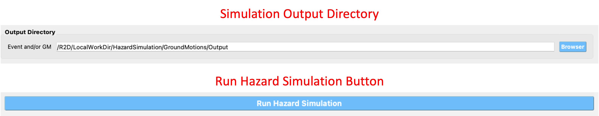

.. _ground_motion_tool:

Earthquake Scenario Simulation
------------------------------

This tool dialog is where user can enter data on an earthquake scenario and the tool will generate a series of ground motions for a series of points in the area. The application employs OpenSHA, determining which records to select from a ground motion database. The **Earthquake Scenario Simulation** input panel is given in :numref:`fig-EQSSPanel` and the individual input panes are discussed below.

.. _fig-EQSSPanel:

.. figure:: figures/R2DEQSSPanel.png
  :align: center
  :figclass: align-center

  Earthquake Scenario Simulation Input panel.

**Site Definition Parameters**

This is where a user defines the geographical locations where ground motion selection will occur. A user can select to input a single location, multiple locations on a grid, or a collection of scattered sites as seen in the **Grid Type Selection** box in the top-left corner of :numref:`fig-R2DEQSSSiteSinglePane`.
    
    #. **Single Location**

	In the **Single Location** pane, shown in :numref:`fig-R2DEQSSSiteSinglePane`, the user needs to provide the following inputs:

		- **Location:** The latitude and longitude of the site.
		- **Number of Ground Motions per Site:** The number of ground motions that will be selected at the site.

	.. _fig-R2DEQSSSiteSinglePane:

	.. figure:: figures/R2DEQSSSiteSinglePane.png
	  :align: center
	  :figclass: align-center

	  Single location site definition.

    #. **Grid of Locations**

	In the **Grid of Locations** input pane, given in :numref:`fig-R2DEQSSSiteGridPane`, the user can either manually define a grid, or select a grid on a map. To manually define a grid, the user needs to provide the following input parameters:

		- **Latitude Extents:**  The minimum and maximum latitude values that the grid will span.
   		- **Longitude Extents:** The minimum and maximum longitude values that the grid will span.

	In addition to defining the geographical extents of the grid, the user must also provide the following inputs:

   		- **Number of Ground Motions per Site:** The number of ground motions that will be selected at each grid point.
   		- **Latitude Discretization:** The number of divisions along the latitude direction.
   		- **Longitude Discretization:** The number of divisions along the longitude direction.

	.. _fig-R2DEQSSSiteGridPane:

	.. figure:: figures/R2DEQSSSiteGridPane.png
	  :align: center
	  :figclass: align-center

	  Grid of locations site definition pane.

	To select a grid on a map, the user needs to click on the **Define Grid on Map** button and a new **Grid Selection Window** will appear with the grid, as seen in :numref:`fig-R2DEQSSGridSelection`. A user can click and drag the **Resize** and **Move** handles, shown in :numref:`fig-R2DEQSSGridSelection` as blue circles, to resize the grid extents and to move the grid. Changing the grid discretization along the latitude and longitude directions will change the number of grid divisions on the map. Once a grid is defined on the map, the window can be closed and the grid information will be updated in the input pane. To view or modify the grid again, press the **Define Grid on Map** button and the **Grid Selection Window** displaying the grid will reappear.

	.. _fig-R2DEQSSGridSelection:
	
	.. figure:: figures/R2DEQSSGridSelection.png
	  :align: center
	  :figclass: align-center
	
	  Selection of grid on map.
	  
    #. **Scattered Locations**

  	In the **Scattered Locations** input pane, given in :numref:`fig-R2DEQSSSiteScatterPane`, the user provides a custom list of sites. The following inputs are required:

		- **Site File:** The user provided file, in ``.csv`` format, containing the list of sites and corresponding site data. At a minimum the site file must contain the station number, latitude, and longitude of each site, as seen in the **Site Preview Table** in :numref:`fig-R2DEQSSSiteScatterPane`.
		- **Site Preview Table:** Table providing the information at each site. Apart from the station number, latitude, and longitude at each site, the site file can include other information such as the Vs30 at the site. 
		- **Minimum and Maximum Site ID:** The minimum and maximum site IDs considered.
		- **Number of Ground Motions per Site:** The number of ground motions that will be selected at each site.

	.. _fig-R2DEQSSSiteScatterPane:
	
	.. figure:: figures/R2DEQSSSiteScatterPane.png
	  :align: center
	  :figclass: align-center
	
	  Scattered sites input pane.

**Spatial Correlation and Ground Motion Scaling Factors**

This is where the user selects the spatial correlation models, and where the user defines the minimum and maximum scaling factors that are used in ground motion selection. Shown at the top of :numref:`fig-R2DEQSSCorrScalePane`, the user has the option to select the Intra- and Inter-event Spatial Correlation Models. Spatial correlation ensures that ground motions at different locations will share similar characteristics. The following Inter-event Spatial Correlation Models are available:

	- Baker & Jayaram (2008)

and the following Intra-event Spatial Correlation Models are available:

	- Markhvida et al. (2017)
	- Jayaram & Baker (2009)
	- Loth & Baker (2013)

Special thanks to Dr. Anne Hulsey for sharing the python package `seaturtles <https://github.com/annehulsey/seaturtles>`_, especially for the method of computing the regional ground motion intensity using the Markhvida et al. (2017) and Baker & Jayaram (2008) correlation models. 

The **Ground Motion Record Scaling Bounds**, shown at the bottom of :numref:`fig-R2DEQSSCorrScalePane`, are the minimum and maximum scaling factors that intensity measures can be scaled by during the ground motion selection process.

.. _fig-R2DEQSSCorrScalePane:

.. figure:: figures/R2DEQSSCorrScalePane.png
  :align: center
  :figclass: align-center

  Spatial correlation and ground motion selection scaling factors.

**Ground Motion Record Database**

Ground motion records are selected from a ground motion database. Currently, only the *PEER NGA-West2* database is available, shown in the **Ground Motion Record Database** combo box in :numref:`fig-R2DEQSSGMDBPane`. Alternatively, a user can select *None* to skip ground motion selection altogether. In that case, only the intensity measures will be saved at each location. 
	
  	.. _fig-R2DEQSSGMDBPane:

  	.. figure:: figures/R2DEQSSGMDBPane.png
  	  :align: center
  	  :figclass: align-center

  	  Ground motion records database.

**Ground Motion Prediction Equations**

Ground motion prediction equations estimate the intensity of ground shaking that may occur at a site. The **Ground Motion Prediction Equation** combo box, shown in :numref:`fig-R2DEQSSGMPEPane`, contains the following ground motion prediction equations:

	- Abrahamson, Silva & Kamai (2014)
	- Boore, Stewart, Seyhan & Atkinson (2014)
	- Campbell & Bozorgnia (2014)
	- Chiou & Youngs (2014)

.. _fig-R2DEQSSGMPEPane:

.. figure:: figures/R2DEQSSGMPEPane.png
  :align: center
  :figclass: align-center

  Ground motion prediction equations.

**Earthquake Source**

This is where the user defines the earthquake rupture characteristics. In the **Rupture Type** combo box, shown in :numref:`fig-R2DEQSSSEQRupPointPane`, point source and UCERF earthquake rupture forecast models are available.

    #. **Point Source**
	
	The **Point Source** pane, shown in :numref:`fig-R2DEQSSSEQRupPointPane`, requires the following inputs:
	
		- **Magnitude:** Magnitude of the earthquake.
		- **Location and Depth:** Location and depth of earthquake rupture.
		- **Rupture Geometry:** Average dip and rake of rupture.
	
	.. _fig-R2DEQSSSEQRupPointPane:
	
	.. figure:: figures/R2DEQSSSEQRupPointPane.png
	  :align: center
	  :figclass: align-center
	
	  Point source earthquake rupture.

    #. **UCERF Earthquake Rupture Forecast**

	The **UCERF Earthquake Rupture Forecast** pane, shown in :numref:`fig-R2DEQSSSEQRupForecastPane`, requires the following inputs:

		- **Number of scenarios:** The number of rupture scenarios considered.
		- **Magnitude and Distance:** Magnitude of the earthquake and the maximum distance, in km, from a site.
		- **Name:** Users can specify keywords here to search for specific earthquakes.
		- **Earthquake Forecast Model:** Type of earthquake forecast model.
		
	The types of UCERF earthquake forecast models available are:

		- WGCEP (2007) UCERF2 - Single Branch
		- Mean UCERF3
		- Mean UCERF3 FM3.1
		- Mean UCERF3 FM3.2

	.. _fig-R2DEQSSSEQRupForecastPane:

	.. figure:: figures/R2DEQSSSEQRupForecastPane.png
	  :align: center
	  :figclass: align-center

	  Earthquake rupture forecast.

    #. **OpenQuake Scenario-Based**
    
	The **OpenQuake Scenario-Based** pane, shown in :numref:`fig-R2DOpenQuakeScenarioBased`, requires the following inputs:
		
		- **OpenQuake Version:** Version of OpenQuake (currently available 3.10, 3.11, 3.12, and latest minor version is supported).
		- **Rupture File:** A xml file (NRML format) defining an earthquake source.
		- **Rupture Meshsize:** Mesh size for line sources.
		- **Area Meshsize:** Mesh size for area sources.
		- **Maximum Distance:** Maximum considered distance from source to site.

	.. _fig-R2DOpenQuakeScenarioBased:

	.. figure:: figures/R2DOpenQuakeScenarioBased.png
	  :align: center
	  :figclass: align-center

	  OpenQuake Scenario-Based Input.

    #. **OpenQuake Classcial PSHA**

	The **OpenQuake Classcial PSHA** pane, shown in :numref:`fig-R2DOpenQuakeClassicalPSHA`, requires the following inputs:

		- **OpenQuake Version:** Version of OpenQuake (currently available 3.10, 3.11, 3.12, and latest minor version is supported).
		- **Source Logic Tree:** A xml file (NRML format) defining a logic tree model for seismic sources.
		- **Source Model Folder:** A directory hosting the seismic sources defined in the source logic tree.
		- **Rupture Meshsize:** Mesh size for line sources.
		- **Area Meshsize:** Mesh size for area sources.
		- **Maximum Distance:** Maximum considered distance from source to site.
		- **GMPE Logic Tree:** A xml file (NRML format) defining a logic tree model for ground motion prediction equations.
		- **Return Period:** Return period of the PSHA.
		- **Seed:** Seed in generating ground motion maps.
		- **Quantiles:** Quantile levels of ground motion intensity measures in the output (e.g., uniform hazard spectra).
		- **Investigation Time:** time period for computing the probability of exceedance
		- **Output:** Checkboxes for *Individual hazard curve*, *Mean hazard curve*, *Hazard map*, and *Uniform hazard spectra*

	.. _fig-R2DOpenQuakeClassicalPSHA:

	.. figure:: figures/R2DOpenQuakeClassicalPSHA.png
	  :align: center
	  :figclass: align-center

	  OpenQuake Classical PSHA Input.

    #. **Hazard Occurrence**

	The **Hazard Occurrence** pane, shown in :numref:`fig-R2DHazardOccurrence`, requires the following inputs:

		- **Hazard occurrence model:** Currently Manzour and Davidson (2016) ([Manzour2016]_) is available.
		- **Forecast model:** Type of earthquake forecast model where the candidate earthquake scenarios are collected from. 
			- WGCEP (2007) UCERF2 - Single Branch
			- Mean UCERF3
			- Mean UCERF3 FM3.1
			- Mean UCERF3 FM3.2
		- **Candidate earthquake number:** Number of earthquakes used as candidates to select from.
		- **Reduced earthquake number:** Maximum number of selected (reduced) earthquakes to recover the hazard curves.
		- **Reduced motion number:** Maximum number of selected (reduced) ground motions per individual site to recover the site hazard curve.
		- **Hazard curve input:** Types of reference hazard curves: (1) Inferred and (2) User-defined. Inferred hazard curves are fetched from National seismic hazar map project ([Peterson2020]_). User-defined hazard curves should be summarized in a csv file following the :download:`template <src/HazardCurves.csv>`.
		- **National seismic hazard map:** Version of national seismic hazard map used to infer reference site-specific hazard curves.
		- **Hazard curve file:** User-defined hazard curve file.
		- **Intensity measure:** The intensity measure type used in reference hazard curves.
		- **Hazard curve Sa period:** Period of the response acceleration Sa if the intensity measure type is Sa.
		- **Return periods (yr):** A list of return periods in year used in minimizing the difference between recovered and reference hazard curves (seperated by ",").

	.. _fig-R2DHazardOccurrence:

	.. figure:: figures/R2DHazardOccurrence.png
	  :align: center
	  :figclass: align-center

	  Hazard Occurrence Input.

**Intensity Measure and Period Points**

The **Intensity Measure and Period Points** pane, shown in :numref:`fig-R2DEQSSIMPane`, requires the following inputs:

	- **Intensity Measure Type:** Type of intensity measure. The Spectral Acceleration (SA) and Peak Ground Acceleration (PGA) intensity measures are available.
	- **Period Points:** List of periods, in seconds, that are used in the ground motion selection procedure.
	
.. _fig-R2DEQSSIMPane:

.. figure:: figures/R2DEQSSIMPane.png
  :align: center
  :figclass: align-center

  Intensity measure and period.

**Output Directory and Run Button**

Shown at the bottom of :numref:`fig-R2DEQSSOutputDirPane`, the **Run Hazard Simulation** button starts the ground motion selection application. The **Output Directory** box, provided in :numref:`fig-R2DEQSSOutputDirPane`, allows the user to select a directory that will contain the input and output files of the earthquake scenario simulation.

.. _fig-R2DEQSSOutputDirPane:

  Earthquake Scenario Simulation Output Directory.

The earthquake scenario simulation is run via a Python script. When the **Run Hazard Simulation** button is pressed, text output from the script will appear in the **Program Output** console at the bottom of the application.
	Upon successful completion of the earthquake scenario simulation, results from the simulation are in the **Output Directory** folder that is specified above, as shown in :numref:`fig-R2DEQSSOutputDirPane`. The final output is a ``.csv`` file called ``EventGrid.csv``. The ``EventGrid.csv`` file contains the grid points and their locations and file names. Each grid point is assigned a ``.csv`` file containing a list of the ground motions at the grid point and their scaling factors. If applicable, the corresponding ground motion records, in ``JSON`` format, are also in the **Output Directory** directoy. Next, the ``EventGrid.csv`` is post-processed, and a new layer containing the ground motions is added to the GIS widget. Shown on the right-hand side of :numref:`fig-R2DEQSSOutput`, the grid points are represented with a cross symbol. Clicking on a grid point will produce a popup with information about the ground motions at that point.

.. _fig-R2DEQSSOutput:

.. figure:: figures/R2DEQSSOutput.png
  :align: center
  :figclass: align-center

  Post-processing output and grid visualization.

