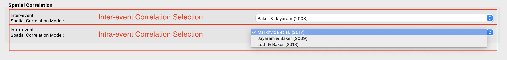

.. _ground_motion_tool:

Earthquake Event Simulation
------------------------------

This tool allows users to input earthquake scenario data, generating ground motions for specified points within an area. The **Earthquake Scenario Simulation** tool's input panels are detailed below, with use cases described in the :ref:`technical manual <lblEQSimulationUseCases>`.

Site Definition Panel
*********************

The **Site Definition Panel** (:numref:`fig-R2DEQSSitePanel`) enables users to specify geographical locations and seismic characteristics for ground motion models.

.. _fig-R2DEQSSitePanel:

  Earthquake Scenario Simulation Site Definition Input panel.    

Site Definition Options
+++++++++++++++++++++++

To input site locations, users can select to input a single location,
multiple locations on a grid, or a collection of scattering sites, as seen in the
**Site Location Definition** box at the top of :numref:`fig-R2DEQSSitePanel`.
The available methods to input site definitions are:

    #. **Single Location**

	In the **Single Location** pane at the top of :numref:`fig-R2DEQSSitePanel` is shown as :numref:`fig-R2DEQSSSiteSinglePane`.
	Users could define a single site where the seismic hazard is analyzed.
	The following inputs are needed:
		- **Location:** The latitude and longitude of the site.
		- **Vs30 model:** The model of the average shear-wave velocity (m/s) between 0 and 30 meters depth (Vs30). Note that the "User-specified" option is not available for this single site definition method.
		- **Z1pt0 model:** The model of depth (m) to where shear-wave velocity = 1.0 km/sec (the first occurrence if more than one depth exists). 
		- **Z2pt5 model:** The model of depth (m) to where shear-wave velocity = 2.5 km/sec (the first occurrence if more than one depth exists).
		- The details of the available Vs30, Z1pt0, and Z2pt5 models in R2D are described :ref:`here <lbl-shearWaveVelocity>`

	.. _fig-R2DEQSSSiteSinglePane:

	.. figure:: figures/R2DEQSSSiteSinglePane.png
	  :align: center
	  :figclass: align-center

	  Single location site definition.

    #. **Grid of Locations**

	In the **Grid of Locations** input pane, given in :numref:`fig-R2DEQSSSiteGridPane`, the user can either manually define a grid, or select a grid on a map. To manually define a grid, the user needs to provide the following input parameters:
		- **Latitude Extents:** The minimum and maximum latitude values that the grid will span.
		- **Longitude Extents:** The minimum and maximum longitude values that the grid will span.
		- **Latitude Discretization:** The number of divisions along the latitude direction.
		- **Longitude Discretization:** The number of divisions along the longitude direction.
	In addition to defining the geographical extent of the grid, the user must also provide the following inputs:
   		- **Vs30 model:** same with the **Single Location** site definition method.
   		- **Z1pt0 model:** The model of depth (m) to where shear-wave velocity = 1.0 km/sec. If the "User-specified" option is selected, the user-specified value will be applied to all grid points.
   		- **Z2pt5 model:** The model of depth (m) to where shear-wave velocity = 2.5 km/sec. If the "User-specified" option is selected, the user-specified value will be applied to all grid points.
   		- The details of the available Vs30, Z1pt0, and Z2pt5 models in R2D are described :ref:`here <lbl-shearWaveVelocity>`
	.. _fig-R2DEQSSSiteGridPane:

	.. figure:: figures/R2DEQSSSiteGridPane.png
	  :align: center
	  :figclass: align-center

	  Grid of locations site definition pane.

	To select a grid on a map, the user needs to click on the **Define Grid on Map** button, and a new **Grid Selection Window** will appear with the grid, as seen in :numref:`fig-R2DEQSSGridSelection`. A user can click and drag the **Resize** and **Move** handles, shown in :numref:`fig-R2DEQSSGridSelection` as blue circles, to resize the grid extents and to move the grid. Changing the grid discretization along the latitude and longitude directions will change the number of grid divisions on the map. Once a grid is defined on the map, the window can be closed and the grid information will be updated in the input pane. To view or modify the grid again, press the **Define Grid on Map** button and the **Grid Selection Window** displaying the grid will reappear.

	.. _fig-R2DEQSSGridSelection:
	
	.. figure:: figures/R2DEQSSGridSelection.png
	  :align: center
	  :figclass: align-center
	
	  Selection of grid on the map.
	  
    #. **Scattering Locations**

  	In the **Scattering Locations** input pane, given in :numref:`fig-R2DEQSSSiteScatterPane`, the user provides a custom list of sites. The following inputs are required:

		- **Site File (.csv):** The user-provided file, in ``.csv`` format, which contains the list of sites and corresponding site data. Users can provide user-specified Vs30, Z1pt0 and Z2pt5 values. The conventions to define such ``.csv`` file is described :ref:`here <lbl-siteFileAndSCSiteModel>`
		- **Sites to Analyze Filter:** A filter to select a subset of the sites in the loaded Site File to analyze. All sites will be analyzed if this field is left empty.
		- **Vs30 model:** The model of the average shear-wave velocity (m/s) between 0 and 30 meters depth (Vs30). A "User-specified" option is available and the Vs30 models at each site should be provided in the Site File (.csv) as described in :ref:`Site File (.csv) definition <lbl-siteFileAndSCSiteModel>`
		- **Z1pt0 model:** The model of depth (m) to where shear-wave velocity = 1.0 km/sec. If the "User-specified" option is selected, R2D will check if a "z1pt0" column exists in the Site File (.csv). If such a column exists, the values in the Site File (.csv) will be used. Otherwise, the value specified in the **Z1pt0** pane will be applied to all sites.
		- **Z2pt5 model:** The model of depth (m) to where shear-wave velocity = 2.5 km/sec. If the "User-specified" option is selected, R2D will check if a "z2pt5" column exists in the Site File (.csv). If such a column exists, the values in the Site File (.csv) will be used. Otherwise, the value specified in the **Z2pt5** pane will be applied to all sites.
		- The details of the available Vs30, Z1pt0, and Z2pt5 models in R2D are described :ref:`here <lbl-shearWaveVelocity>`
	.. _fig-R2DEQSSSiteScatterPane:
	
	.. figure:: figures/R2DEQSSSiteScatterPane.png
	  :align: center
	  :figclass: align-center
	
	  Scattering sites input pane.

.. _lbl-shearWaveVelocity:

Shear Wave Velocity
+++++++++++++++++++

In seismic hazard analysis, the **Shear Wave Velocity** at a site is of interest
because it gives an indication of whether the expected shaking in response to an
Earthquake Rupture may be higher. For instance, at a bedrock site (high shear-wave
velocity) there will be little amplification of seismic waves, whereas in a sedimentary
basin (low shear-wave velocity) one might expect intense amplification. Vs30, Z1pt0,
and Z2pt5 are several ways that shear-wave velocity data is incorporated into seismic hazard calculations.
    #. **Vs30 Model**
	Vs30 stands for the average shear-wave velocity between 0 and 30 meters depth.
	More information is available at the `USGS Global Vs30 Map Server site <https://earthquake.usgs.gov/data/vs30/>`_.
	Some ground motion prediction equations (e.g., Abrahamson, Silva, and Kamai (2014) [AbrahamsonSilvaKamai2014]_) require knowing whether a Vs30 value was
	Measured or Inferred. Inferred Vs30 values are estimated based on correlations
	with local surface geology or slope and may introduce larger intra-event standard
	deviations. See detailed discussions in [AbrahamsonSilvaKamai2013]_.
	R2D supports three models to infer Vs30 values and a user-specified method to 
	specify measured Vs30 values. The unit of Vs30 in R2D is meter per second.
		- CGS/Wills Vs30 (Wills et al., 2015) [willsetal2015]_
			This model is applicable to California, US, and is created based on 
			correlations of Vs30 with geologic units and surface slope. The database
			is obtained by interfacing the `WillsMap2015 <https://github.com/opensha/opensha/blob/master/src/main/java/org/opensha/commons/data/siteData/impl/WillsMap2015.java>`_ class in **openSHA**, which
			obtained the database from the electronic supplements of [willsetal2015]_.
		- Thompson California Vs30 (Thompson et al. 2018) [Thompson2018]_
			This model is applicable to California, US and the raw data can be obtained from the `USGS website <https://www.sciencebase.gov/catalog/item/5a5fa029e4b06e28e9bfc43a>`_.
		- Global Vs30 (Heath et al., 2020) [Heath2020]_
			This model is applicable to anywhere on the Earth. Heath et al. (2020)
			developed a hybrid global Vs30 map database that defaults to the global slope-based Vs30 map,
			but smoothly insets the more accurate regional Vs30 maps where available.
			The raw data can be obtained from the `USGS website <https://www.sciencebase.gov/catalog/item/5d815a9ae4b0c4f70d0586c8>`_.
		- User-specified
			This method allows the user to input user-specified Vs30 values. This option
			is only available if **Scattering Locations** is used to define site locations.
			The user-specified values should be included in the user-provided ``.csv``
			file with a column named ("vs30"). If the user-specified option is
			selected, users need also specify if the provided "vs30" values are 
			measured or inferred by providing a "vsInferred" column in the ``.csv`` file
			or checking/unchecking the "Specified Vs30 values are inferred"
			check box. 
    #. **Z1pt0 Model**
	The depth (km) to where shear-wave velocity = 1.0 km/sec (the first occurrence if more than one depth exists). Z1pt0 and Z2pt5 
	are related to long-period site response. Z2pt5 may be more directly related to the long-period site response, but Z1pt0
	is used in many site classifications because it is closer to the traditional geotechnical parameter of “depth to bedrock” and
	is easier to measure for specific projects [AbrahamsonSilvaKamai2014]_. The unit of Z1pt0 in R2D is meter.
		- OpenSHA default model
			This model applies to California. R2D will interpolate the SCEC Community Velocity Model Version 4, Iteration 26, Basin Depth,
			SCEC CCA, Iteration 6, Basin Depth, SCEC Community Velocity Model Version 4 Basin Depth,
			SCEC/Harvard Community Velocity Model Version 11.9.x Basin Depth, and USGS Bay Area Velocity Model Release 8.3.0
			model to get the value of Z1pt0. The models are accessed by calling the class `OrderedSiteDataProviderList <https://github.com/opensha/opensha/blob/ba07dd44cb1b11448a88b142382d3a129df24df1/src/main/java/org/opensha/commons/data/siteData/OrderedSiteDataProviderList.java#L365>`_
			in **openSHA**. If a NaN value is obtained from the interpolation, the prediction equation (Eq.1) in 
			[ChiouYoungs2014]_ will be used to infer Z1pt0 value from Vs30. 
		- User-specified
			If the **Single Location** or **Grid of Locations** site definition method is selected. The value specified in the **Z1pt0 Model** pane
			will be applied to all the site(s).
			If the **Scattering Location** site definition method is selected.  R2D will check if a "z1pt0" column exists
			in the Site File (.csv). If such a column exists, the values in the Site File (.csv) will be used.
			Otherwise, the value specified in the **Z1pt0** pane will be applied to all sites.

    #. **Z2pt5 Model**
	The depth (km) to where shear-wave velocity = 2.5 km/sec (the first occurrence if more than one depth exists). Z1pt0 and Z2pt5 
	are related to long-period site response. Z2pt5 may be more directly related to the long-period site response.
	The unit of Z2pt5 in R2D is meter.
		- OpenSHA default model
			This model applies to California. R2D will interpolate the SCEC Community Velocity Model Version 4, Iteration 26, Basin Depth,
			SCEC CCA, Iteration 6, Basin Depth, SCEC Community Velocity Model Version 4 Basin Depth,
			SCEC/Harvard Community Velocity Model Version 11.9.x Basin Depth, and USGS Bay Area Velocity Model Release 8.3.0
			model to get the value of Z2pt5. The models are accessed by calling the class `OrderedSiteDataProviderList <https://github.com/opensha/opensha/blob/ba07dd44cb1b11448a88b142382d3a129df24df1/src/main/java/org/opensha/commons/data/siteData/OrderedSiteDataProviderList.java#L365>`_
			in **openSHA**. If a NaN value is obtained from the interpolation, the prediction equation (Eq.33) in 
			[CampbellBozorgnia2014]_ will be used to infer Z2pt5 value from Vs30. 
		- User-specified
			If the **Single Location** or **Grid of Locations** site definition method is selected. The value specified in the **Z2pt5 Model** pane
			will be applied to all the site(s).
			If the **Scattering Location** site definition method is selected.  R2D will check if a "Z2pt5" column exists
			in the Site File (.csv). If such a column exists, the values in the Site File (.csv) will be used.
			Otherwise, the value specified in the **Z2pt5** pane will be applied to all sites.

.. _lbl-siteFileAndSCSiteModel:

Site File (.csv) Definition and SimCenterSiteModel.csv
+++++++++++++++++++++++++++++++++++++++++++++++++++++++

The Site File (.csv) is the user-provided file, in ``.csv`` format, that contains the list of sites and corresponding site data.
At a minimum, the Site File (.csv) must contain the station ID, latitude, and longitude of each site.
If the "User-specified" option is selected in the **Vs30 Model**, **Depth to Z1pt0**, or **Depth to Z2pt5** panes,
corresponding information should also be included in the Site File (.csv). The naming convention for the columns in Site File (.csv)
is "ID" for station ID, "lat" for latitude, "lon" for longitude, "vs30" for Vs30, "z1pt0" for
depth (m) to where shear-wave velocity = 1.0 km/sec and "z2pt5" for depth (m) to where shear-wave velocity = 2.5 km/sec.
The station ID must be a consecutive sequence starting from 0.
Users can also provide a column of "vsInferred". The value of "vsInferred" can be either 0 (stands for false) or 1 (stands for true).
If such a value is provided, the "vsInferred" defined in the **Vs30 Model Pane** will be overwritten.
Similarly, if users provide a column of "z1pt0" or "z2pt0", the value specified in the
**Depth to Z1pt0** and **Depth to Z2pt5** panes are overwritten by the values in
the Site File (.csv).

When the **Forecast Rupture Scenarios** button is clicked, R2D will create a **SimCenterSiteModel.csv** based on the site location, vs30 model,
depth to shear-wave velocity = 1.0 km/sec and 2.5 km/sec models. This is the output of the **Site Definition Panel** and 
will be used in the subsequent earthquake hazard simulation workflow. This file is
stored in the "/HazardSimulation/GroundMotions/Input" folder in the R2D local work direction defined in 
R2D preferences.

.. note:: Users can check the correctness of the defined Site Model by reading the **SimCenterSiteModel.csv** file. If a user
	would like to overwrite a value in the **SimCenterSiteModel.csv**, they can edit the **SimCenterSiteModel.csv** and load it back
	to R2D as a Site File (.csv). Afterward, please select the "User-specified" option for the **Vs30**, **Z1pt0**, and **Z2pt5 Model**, and
	the values specified in the edited **SimCenterSiteModel.csv** will be used in the subsequent earthquake hazard simulation workflow.
	

.. [AbrahamsonSilvaKamai2013]
	Abrahamson, N. A., Silva, W. J., and Kamai, R., 2013. Update of the AS08 Ground Motion Prediction Equations Based on the NGA-West2 Data Set, PEER Report No. 2013/04, Pacific Earthquake Engineering Research Center, University of California, Berkeley.
.. [Heath2020]
	Heath, D.C., Wald, D.J., Worden, C.B., Thompson, E.M., and Smoczyk, G.M., 2020, A Global Hybrid Vs30 Map with a Topographic-Slope-Based Default and Regional Map Insets: U.S. Geological Survey data release, https://doi.org/10.5066/P96HFVXM.
.. [Thompson2018]
	Thompson, E.M., 2018, An Updated Vs30 Map for California with Geologic and Topographic Constraints (ver. 2.0, July 2022): U.S. Geological Survey data release, https://doi.org/10.5066/F7JQ108S.
.. [willsetal2015]
	Wills, C. J., Gutierrez, C. I., Perez, F. G., & Branum, D. M. (2015). A next generation VS30 map for California based on geology and topography. Bulletin of the Seismological Society of America, 105(6), 3083-3091

Earthquake Rupture Panel
*************************

The **Earthquake Rupture Panel** is shown in :numref:`fig-R2DEQSERPane`. 
This is where a user defines the earthquake rupture(s) in the regional hazard analysis.
The available Earthquake Rupture definition methods are OpenSHA ERF, Point Source,
and OpenQuake ERF. The details of each method are described below.
    
.. _fig-R2DEQSERPane:

  Earthquake Rupture Panel

OpenSHA ERF
+++++++++++
This method allows users to define earthquake ruptures from two Earthquake Rupture
Forecasting (ERF) models for California, which are implemented in OpenSHA.
The two ERF models are "WGCEP (2007) UCERF2 - Single Branch" ([Field2009]_)
and "Mean UCERF3" ([Field2017]_)

	#. WGCEP (2007) UCERF2 - Single Branch ([Field2009]_)
		This ERF model selects a single branch from UCERF2's logic tree based on the Floater Type,
		Background Seismicity, Treat Background Seismicity As, and Probability Model options.
		The ERF model is obtained by interfacing the `MeanUCERF2 <https://github.com/opensha/opensha/blob/master/src/main/java/org/opensha/sha/earthquake/rupForecastImpl/WGCEP_UCERF_2_Final/MeanUCERF2/MeanUCERF2.java>`_
		class in OpenSHA. 

	#. Mean UCERF3 ([Field2017]_)
		Three of the most commonly used logic trees (named presets in OpenSHA) are available in R2D.
		The presets can be selected in the "Mean UCERF3 Presets" combo box. The available presets 
		are "FM3.1 Branch Averaged", "FM3.2 Branch Averaged", and "(POISSON ONLY) Both FM Branch Averaged".
		For each preset, there are more options to specify how to treat background seismicity,
		what probability model to use, and other parameters. More details of the ERF models
		can be found on the `OpenSHA website <https://opensha.org/>`_

For both UCERF models, users also need to specify the Maximum Distance (km) between
the centroid of the sites and the earthquake sources (faults) they want to consider.
Users also need to specify the maximum magnitude and the minimum magnitude they 
want to consider in the earthquake hazard simulation. Only the ruptures that satisfy
these three criteria will be selected. 

After the ERF model parameters are set up, users should click the **Forecast Rupture Scenarios** button.
R2D will run the user-specified ERF models implemented in OpenSHA.
The generated earthquake ruptures will be saved as a ``.geojson``
file named ``RupFile.geojson`` in the "HazardSimulation/GroundMotions/Output" folder in
the local work directory of R2D. The ``RupFile.geojson`` will be loaded to R2D and visualized 
in the lower part of the Earthquake Rupture Panel.

.. note:: The number of ruptures generated by the UCERFs depends on the Fault Grid Spacing,
	if background seismicity is included, maximum and minimum considered rupture scenarios.
	Numerous scenarios (over tens of thousands) may be generated if the Mean UCERF3
	model is used. Generating, saving, and visualizing such a large number of ruptures can be slow in R2D.
	If Scenario-Based ground motion simulation is desired after the earthquake rupture
	forecasting, users are recommended to look for their scenarios in OpenSHA's Deterministic
	calculation type and identify their scenario. Afterward, a narrow selection criteria can be specified
	in R2D to reduce the run time.
.. note:: User other ERF models available in OpenSHA is also possible by directly running the backend application
	codes of R2D. Please contact the developer at the |messageBoard|
	for inquiries and feature requests. 

Point Source
+++++++++++++
The **Point Source** pane, shown in :numref:`fig-R2DEQSSSEQRupPointPane`, defines a single
earthquake rupture. The point source may not accurately reflect real fault geometry but it
may be useful for educational and/or academic use.

The required inputs are:

	- **Magnitude:** Magnitude of the earthquake.
	- **Location and Depth:** Latitude, Longitude, and depth of earthquake rupture.
	- **Rupture Geometry:** Average dip and rake of rupture.

.. _fig-R2DEQSSSEQRupPointPane:

.. figure:: figures/R2DEQSSSEQRupPointPane.png
  :align: center
  :figclass: align-center

  Point source earthquake rupture.

.. _lbl-ERFOpenquake:

OpenQuake Earthquake Rupture Forecasting
++++++++++++++++++++++++++++++++++++++++
	The OpenQuake Earthquake Rupture Forecasting (**OpenQuake ERF**) option uses 
	the Global Earthquake Model Foundation's `OpenQuake Engine <https://www.globalquakemodel.org/product/openquake-engine>`_
	to define ruptures from earthquake sources (faults) and estimate the occurrence rate of earthquake 
	ruptures. In contrast to **OpenSHA ERF**, where the earthquake source models
	are built in UCERFs, users need to provide a Source File (``.xml``) in `OpenQuake's
	conventions <https://docs.openquake.org/oq-engine/manual/latest/user-guide/inputs/seismic-source-model-inputs.html#source-typologies>`_.
	Note that although R2D allows defining multiple "sourceGroup", defining seismic
	source logic trees is not supported now.

    
	The **OpenQuake ERF** pane, shown in :numref:`fig-R2DEQSOpenQuakeERF`, requires the following inputs:
		
		- **OpenQuake Version:** Version of OpenQuake (currently available is 3.17).
		- **Source Model File:** A ``.xml`` file (NRML format) defining an earthquake source geometry, magnitude scaling relationship, rupture aspect ratio, and magnitude frequency distribution. Examples of the rupture files can be found in the `demos folder of OpenQuake's GitHub repo <https://github.com/gem/oq-engine/tree/master/demos>`_. 
		- **Rupture Meshsize:** Mesh size for line sources.
		- **Area Meshsize:** Mesh size for area sources.
		- **Maximum Distance:** Maximum considered distance from source to site.
		- **Maximum Magnitude:** Maximum considered earthquake magnitude.
		- **Minimum Magnitude:** Minimum considered earthquake magnitude.
		- **Magnitude-Frequency Distribution Bin Width** Bin width to discretize the Magnitude-Frequency Distribution defined in the Source Model File.

	.. _fig-R2DEQSOpenQuakeERF:

	.. figure:: figures/R2DEQSOpenQuakeERF.png
	  :align: center
	  :figclass: align-center

	  OpenQuake Scenario-Based Input.

.. [Field2009]
	Field, E. H., Dawson, T. E., Felzer, K. R., Frankel, A. D., Gupta, V., Jordan, T. H., ... & Wills, C. J. (2009). Uniform California earthquake rupture forecast, version 2 (UCERF 2). Bulletin of the Seismological Society of America, 99(4), 2053-2107.

.. [Field2017]
	Field, E. H., Jordan, T. H., Page, M. T., Milner, K. R., Shaw, B. E., Dawson, T. E., ... & Thatcher, W. R. (2017). A synoptic view of the third Uniform California Earthquake Rupture Forecast (UCERF3). Seismological Research Letters, 88(5), 1259-1267.

Forecast Rupture Scenarios Button
++++++++++++++++++++++++++++++++++
By clicking this button, R2D will clear the "HazardSimulation" folder in the local
working directory of R2D. R2D will then create a SimCenterSiteModel.csv in the "Input"
folder of the "HazardSimulation" folder. The SimCenterSiteModel.csv contains the location
and site classification information defined in the Site Definition Panel. 

R2D will then run the earthquake rupture forecasting models defined in the earthquake rupture
panel. A file "RupFile.geojson" will be created in the "Output" folder of the "HazardSimulation"
folder. The "RupFile.geojson" contains the basic information of the rupture scenarios
generated by the earthquake rupture forecasting models. Users could inspect the
SimCenterSiteModel.csv and RupFile.geojson files to check the results from earthquake
rupture forecasting.

Scenario Selection Panel
*************************
The Scenario Selection Panel allows users to select which scenario(s) to consider
in the generation of ground motion maps. Currently available options are:

Scenario-specific
+++++++++++++++++
This option selects a single earthquake scenario from the results of the Earthquake
Rupture Forecasting to generate corresponding ground motion maps to be used in regional seismic 
analysis. Note that many ground motion maps can be generated from a single scenario
because of the uncertainties associated with the ground motion prediction equations.
Users need to identify the source ID and the rupture ID of the scenario they would like to
analyze and input them into the Scenario-specific selection pane. To identify the source
and rupture IDs, users can visualize in the scenario selection panel as shown in 
:numref:`fig-R2DEQSRupVizTableView` or visualize the earthquake rupture scenarios created in ERF by
right-clicking the **Earthquake Ruptures -- RupFile** layer in the visualization pane
in **Earthquake Rupture** pane and open the attribute table as shown in :numref:`fig-R2DEQSRupVizAttributeTable`.
Then users click on each row in the rupture table on the scenario selection panel, the rupture ID,
and source ID will be filled automatically.

	.. _fig-R2DEQSRupVizTableView:

	.. figure:: figures/R2DEQSRupVizTableView.png
	  :align: center
	  :figclass: align-center

	  Rupture visualization in the scenario selection panel.

	.. _fig-R2DEQSRupVizAttributeTable:

	.. figure:: figures/R2DEQSRupVizAttributeTable.png
	  :align: center
	  :figclass: align-center

	  Rupture visualization using QGIS attribute table.

Conventional Monte Carlo
++++++++++++++++++++++++
This option selects a series of earthquake scenarios from the results of the Earthquake
Rupture Forecasting to generate a series of ground motion maps to be used in regional seismic 
risk analysis. Similar to the scenario-specific option, users can visualize the
earthquake rupture scenarios created in ERF at the lower part of the Scenario Selection Panel or by
right-clicking the **Earthquake Ruptures -- RupFile** layer in the visualization pane
in **Earthquake Rupture** pane and opening the attribute table as shown in :numref:`fig-R2DEQSRupVizAttributeTable`.
Users need to specify a range of the scenarios they would like to
analyze by selecting them on the rupture table in the scenario-specific panel
or inputting them into the conventional Monte Carlo selection line edit. To select
on the rupture table, when one row is selected in the usual way, the current selection
is cleared and the new item is selected. However, if the user presses the Ctrl key
when clicking on one row, the clicked row gets toggled and all other rows are left untouched.
If the user presses the Shift key while clicking on one row, all rows between the
current row and the clicked row are selected or unselected, depending on the state
of the clicked row. Multiple rows can be selected by dragging the mouse over them.
The range users input in this panel is the index of the ruptures in the rupture table.
Note if a user uses the attribute table in :numref:`fig-R2DEQSRupVizAttributeTable`
to inspect the rupture index, R2D uses the initial index of the attribute table,
which is sorted according to descending MeanAnnualRate. The selection will not
synchronize if a user reorders or edits the attribute table (e.g., by sorting the
attribute table based on source-site distance). 

Hazard Consistent Downsampling
+++++++++++++++++++++++++++++++
Because the number of earthquake scenarios is usually very big in conventional
Monte Carlo method, there are algorithms to select a subset of all relevant earthquake
scenarios with a scaled occurrence rate to achieve a similar hazard level with the full set of
earthquake scenarios. R2D implemented one of such algorithms developed by Manzour &
Davidson (2016) [Manzour2016]_.
To apply the algorithms, users need to define:
	- **Hazard Curve Input** The hazard curve(s) presenting the true hazard level that the downsampled earthquake scenarios aim to match. Users can select from **inferred** hazard curves from the full set of earthquake ruptures forecasted from the ERF model, **National Seismic Hazard Map** [Peterson2020]_ hazard curves, or **User-defined** hazard curves. An example of the format of user-defined hazard curves is shown in :numref:`fig-UserSpecifiedHazardCurve`.
	- **Intensity measure** The intensity measure used to calculate the hazard level. The intensity measure defined here has to be included in the specified :ref:`Ground Motion Model <lbl-GroundMotionModels>`.
	- **Earthquake scenario sample size** The earthquake scenario sample size limit in the downsampled earthquake scenario subset.
	- **Ground motion map sample size** The ground motion map sample size limit in the downsample earthquake suite.
	- **Hazard curve Sa period:** Period of the response acceleration Sa if the intensity measure type is Sa.
	- **Return periods (yr):** A list of return periods in years used in minimizing the difference between recovered and reference hazard curves (separated by ",").
Users are encouraged to read the original paper [Manzour2016]_ to better understand how to select parameters used in the algorithm.

.. literalinclude:: figures/UserSpecifiedHazardCurve.json
   :language: json
   :linenos:
   :caption: An example of user-defined hazard curves.
   :name: fig-UserSpecifiedHazardCurve

.. note:: The intensity measure selected in the **Hazard Consistent Downsampling**
	must be included in the Intensity Measure defined in the **Ground Motion Models** panel.
	This is because the Hazard Consistent Downsampling makes use of one of the computed intensity
	measures defined in the **Ground Motion Models** panel to compute the hazard level at each site.

.. [Manzour2016]
   Manzour, H., Davidson, R. A., Horspool, N., & Nozick, L. K. (2016). Seismic hazard and loss analysis for spatially distributed infrastructure in Christchurch, New Zealand. Earthquake Spectra, 32(2), 697-712.

.. [Peterson2020]
   Petersen, M. D., Shumway, A. M., Powers, P. M., Mueller, C. S., Moschetti, M. P., Frankel, A. D., ... & Zeng, Y. (2020). The 2018 update of the US National Seismic Hazard Model: Overview of model and implications. Earthquake Spectra, 36(1), 5-41.

.. _lbl-GroundMotionModels:

Ground Motion Models
*********************

Intensity Measure and Period Points
+++++++++++++++++++++++++++++++++++

The **Intensity Measure and Period Points** pane, shown in :numref:`fig-R2DEQSSIMPane`, requires the following inputs:

	- **Intensity Measure Type:** Type of intensity measure. The Spectral Acceleration (SA) and Peak Ground Acceleration (PGA) intensity measures are available.
	- **Period Points:** List of periods, in seconds, that are used in the ground motion selection procedure.
The units of the PGA and SA estimated in R2D are the gravitational constant (g) and the unit of PGV is centimeter per second (cm/s).

.. _fig-R2DEQSSIMPane:

.. figure:: figures/R2DEQSSIMPane.png
  :align: center
  :figclass: align-center

  Intensity measure and period.
 
Ground Motion Prediction Equations
++++++++++++++++++++++++++++++++++

Ground motion prediction equations estimate the intensity of ground shaking that may occur at a site. The **Ground Motion Prediction Equation** combo box, shown in :numref:`fig-R2DEQSSGMPEPane`, contains the following ground motion prediction equations:

	- Abrahamson, Silva & Kamai (2014) [AbrahamsonSilvaKamai2014]_
	- Boore, Stewart, Seyhan & Atkinson (2014) [BooreEtal2014]_
	- Campbell & Bozorgnia (2014) [CampbellBozorgnia2014]_
	- Chiou & Youngs (2014) [ChiouYoungs2014]_

.. _fig-R2DEQSSGMPEPane:

.. figure:: figures/R2DEQSSGMPEPane.png
  :align: center
  :figclass: align-center

  Ground motion prediction equations.

Spatial Correlation Models
++++++++++++++++++++++++++

This is where the user selects the spatial correlation models, and where the user defines the minimum and maximum scaling factors that are used in ground motion selection. Shown at the top of :numref:`fig-R2DEQSSCorrScalePane`, the user has the option to select the Intra- and Inter-event Spatial Correlation Models. Spatial correlation ensures that ground motions at different locations will share similar characteristics. The following Inter-event Spatial Correlation Models are available:

	- Baker & Jayaram (2008) [Jayaram08]_
	- Baker & Bradley (2017) [BakerBradley17]_

and the following Intra-event Spatial Correlation Models are available:

	- Markhvida et al. (2017) [Markhvida17]_
	- Jayaram & Baker (2009) [Jayaram09]_
	- Loth & Baker (2013) [Loth13]_
	- Du & Ning (2021) [DuNing2021]_

Special thanks to Dr. Anne Hulsey for sharing the python package `seaturtles <https://github.com/annehulsey/seaturtles>`_, especially for the method of computing the regional ground motion intensity using the Markhvida et al. (2017) and Baker & Jayaram (2008) correlation models. 

.. _fig-R2DEQSSCorrScalePane:

  Spatial correlation and ground motion selection scaling factors.

.. [AbrahamsonSilvaKamai2014]
	Abrahamson, N. A., Silva, W. J., & Kamai, R. (2014). Summary of the ASK14 ground motion relation for active crustal regions. Earthquake Spectra, 30(3), 1025-1055.
.. [BooreEtal2014]
	Boore, D. M., Stewart, J. P., Seyhan, E., & Atkinson, G. M. (2014). NGA-West2 equations for predicting PGA, PGV, and 5% damped PSA for shallow crustal earthquakes. Earthquake Spectra, 30(3), 1057-1085.
.. [CampbellBozorgnia2014]
	Campbell, K. W., & Bozorgnia, Y. (2014). NGA-West2 ground motion model for the average horizontal components of PGA, PGV, and 5% damped linear acceleration response spectra. Earthquake Spectra, 30(3), 1087-1115.
.. [ChiouYoungs2014]
	Chiou, B. S. J., & Youngs, R. R. (2014). Update of the Chiou and Youngs NGA model for the average horizontal component of peak ground motion and response spectra. Earthquake Spectra, 30(3), 1117-1153.
.. [Jayaram08]
   Jayaram N, Baker JW. Statistical tests of the joint distribution of spectral acceleration values. Bulletin of the Seismological Society of America 2008; 98(5):2231–2243.
.. [Jayaram09]
   Jayaram, N., & Baker, J. W. (2009). Correlation model for spatially distributed ground‐motion intensities. Earthquake Engineering & Structural Dynamics, 38(15), 1687-1708.
.. [Loth13]
   Loth, C., & Baker, J. W. (2013). A spatial cross‐correlation model of spectral accelerations at multiple periods. Earthquake Engineering & Structural Dynamics, 42(3), 397-417.
.. [Markhvida17]
   Markhvida, M., Ceferino, L., & Baker, J. W. (2018). Modeling spatially correlated spectral accelerations at multiple periods using principal component analysis and geostatistics. Earthquake Engineering & Structural Dynamics, 47(5), 1107-1123.
.. [BakerBradley17]
   Baker, J. W., & Bradley, B. A. (2017). Intensity measure correlations observed in the NGA-West2 database, and dependence of correlations on rupture and site parameters. Earthquake Spectra, 33(1), 145-156.
.. [DuNing2021]
   Du, W., & Ning, C. L. (2021). Modeling spatial cross-correlation of multiple ground motion intensity measures (SAs, PGA, PGV, Ia, CAV, and significant durations) based on principal component and geostatistical analyses. Earthquake Spectra, 37(1), 486-504.

Ground Failure Models
**********************
The level 1 liquefaction and landslide models developed in PEER's `OpenSRA project <https://peer.berkeley.edu/opensra>`_ are implemented in R2D. Please refer to 
Largent et al. (2023) [OpenSRAFrontiers]_ for the details of the models.

Ground failure models are selected in this tab. Fig. :numref:`fig-R2DEQSGroundFailurePanel`
is the user interface of the ground failure models panel. Users select the ground failure sources with the
ground failure source checkboxes. When a checkbox is checked, a ground failure tab
(e.g., Fig. :numref:`fig-R2DEQSLiquefactionPanel` for liquefaction) will be displayed.
The ground failure models require geospatial data input. For example, distance to water bodies and
groundwater depth are required for several liquefaction trigging models. These geospatial
data may be large and are not distributed with R2D by default. When any of the ground failure
source checkboxes are checked, R2D will check if the geospatial data exits in the R2D package.
If they do not exist, a window like Fig. :numref:`fig-R2DEQGroundFailureDownloadWindow` will pop up.
If you would like to use the R2D default database, please click "Yes" and wait until
the download completes to continue the analysis. If you do not plan to use the R2D 
the default database, you can click "Cancel" and provide the database with custom 
GIS files or define the geospatial values in the Site File loaded Site Definition Panel.

.. note:: Default data for landslide induced ground deformation: 
	The default slope data ("CA_Slope_30m_WGS84_degree") used in landslide is too big (1.9 Gb) and can not be downloaded
	automatically. To use the default data, please go to `https://zenodo.org/records/13357384 <https://zenodo.org/records/13357384>`_ on 
	your browser and download the latest version of the "groundFailure.zip" file. 
	After the download completes. Please unzip the "groundFailure.zip" file and place the unzipped folder in R2D's default database folder.
	
	- For Apple Mac users, the default database folder can be find by right-clicking on R2D in your Finder and select "Show Package Contents" (See Fig. :numref:`fig-R2DEQGroundFailureShowContent`). The default database folder is in "Contents >> MacOS >> Databases". If a "groundFailure" folder exists. Please move the "CA_Slope_30m_WGS84_degree" folder in the downloaded "groundFailure.zip" to existing "groundFailure".

	.. _fig-R2DEQGroundFailureShowContent:

	.. figure:: figures/R2DEQGroundFailureShowContent.png
	  :align: center
	  :scale: 75%
	  :figclass: align-center

	  Databases location on Apple Mac.

	- For Windows users, the default database folder can be find in "R2D_Windows_Download >> Databases". If a "groundFailure" folder exists. Please move the "CA_Slope_30m_WGS84_degree" folder in the downloaded "groundFailure.zip" to existing "groundFailure".

Currently, the permanent ground
deformation (PGD) induced by liquefaction and landslide can be estimated. The PGD induced by earthquake fault displacement will be added in future releases.
The estimated horizontal ground deformation (PGD_h) and vertical ground deformation (PGD_v) are in the units of meter (m).

.. [OpenSRAFrontiers]
	Largent, M., Bray, J., Watson-Lamprey, J., & Abrahamson, N. (2023). Developing software to assess the seismic risk of natural gas infrastructure: OpenSRA. Frontiers in Built Environment, 9, 1176919.

  	.. _fig-R2DEQSGroundFailurePanel:

  	.. figure:: figures/R2DEQSGroundFailurePanel.png
  	  :align: center
  	  :figclass: align-center

  	  Ground Failure Models Panel.

  	.. _fig-R2DEQGroundFailureDownloadWindow:

  	.. figure:: figures/R2DEQGroundFailureDownloadWindow.png
  	  :scale: 100%
  	  :align: center
  	  :figclass: align-center

  	  Ground Failure Data Download Dialog.

Liquefaction-induced Ground Failure
+++++++++++++++++++++++++++++++++++
**Liquefaction Triggering Models** |br|
To estimate liquefaction-induced PGD_h and PGD_v, a triggering model, a lateral spreading model, and a settlement model need to be selected.
The triggering, lateral spreading, and settlement suitable for regional-scale liquefaction are summarized and 
implemented in the `OpenSRA project <https://peer.berkeley.edu/opensra>`_. The OpenSRA Project is a multi-year study to develop open-source seismic risk assessment tools for natural gas infrastructure.
The theories of the ground failure models are described in detail in the `OpenSRA report <https://peer.berkeley.edu/sites/default/files/cec_opensra_task-b_liquefaction-landslide_final_clean_web.pdf>`_.

The liquefaction triggering model estimates the liquefaction susceptibility (liq_susc) and liquefaction probability (liq_prob)
at the sites defined in the **Site Definition Panel**. The following liquefaction-triggering models are available:
	- Zhu et al. (2017) [Zhu2017]_
	- Hazus (2020) [Hazus2020]_
	- Zhu et al. (2017) [Zhu2017]_ susceptibility and Hazus (2020) [Hazus2020]_ probability
The [Zhu2017]_ triggering model uses geospatial proxies (e.g., distance to water body, groundwater depth) to estimate
liquefaction susceptibility and liquefaction probability. The [Hazus2020]_ uses geologic unit information to define liquefaction susceptibility. The liquefaction probability
is then calculated based on the liquefaction susceptibility and ground shaking intensities as suggested in section 4.2.2.1.2 of [Hazus2020]_.
The Zhu et al. (2017) [Zhu2017]_ susceptibility and Hazus (2020) [Hazus2020]_ probability method uses the liquefaction susceptibility
derived from geospatial proxies as suggested in [Zhu2017]_ and then use the equations in [Hazus2020]_ to evaluate liquefaction probability.

To use the liquefaction triggering models, GIS raster or vector files are required as inputs.
R2D provides several default files that can be used as baselines to estimate liquefaction triggering
in California. The GIS files are produced and published by the `OpenSRA project <https://peer.berkeley.edu/opensra>`_.
They are on state-wide scales and may introduce uncertainties due to limited resolutions.
Users can provide other raster files, or define the proxy values in the Site File (.csv) if
preferred.

The output of the triggering model is the liquefaction susceptibility (liq_susc) and liquefaction
probability (liq_prob). The liq_susc is defined in section 4.2.2.1.1 of [Hazus2020]_ and is
encoded with integer numbers, with 0 standing for "None" and 5 standing for "Very High". liq_susc and liq_prob
will only be saved in the final output if the checkboxes at the bottom of the triggering model selection are checked.

.. note:: Possible Errors: 
	Besides the geospatial proxies and geologic information, the triggering models also
	require peak ground acceleration (PGA), peak ground velocity (PGV), and earthquake magnitude. As a result,
	PGA and PGV need to be selected in the **Ground Motion Models** panel. Otherwise, the backend Python script will
	return an error and a message of "At least one of 'PGA' and 'PGV' is missing in the selected intensity measures."
	will be printed.
**Lateral Spreading and Settlement Models** |br|
The liquefaction lateral spreading and settlement model available in R2D is:
	- Hazus (2020) [Hazus2020]_
The details of the models are described in 4.2.2.1.3.1 of [Hazus2020]_ and `OpenSRA report <https://peer.berkeley.edu/sites/default/files/cec_opensra_task-b_liquefaction-landslide_final_clean_web.pdf>`_.

The units of the lateral spreading ground deformation (liq_PGD_h) and settlement ground deformation (liq_PGD_v) estimated with R2D is meter (m).
liq_PGD_h and liq_PGD_v will be saved in the final output if the checkboxes below the lateral spreading and settlement selection combo box are checked.

The output will also contain fields of "PGD_h" and "PGD_v". If only liquefaction models are evaluated, they are equal to "liq_PGD_h" and "liq_PGD_v". If both liquefaction and landslide models are evaluated, the "PGD_h" value will be the sum of ground deformation induced by liquefaction and landslide.

.. [Zhu2017]
   Zhu, J., Baise, L. G., & Thompson, E. M. (2017). An updated geospatial liquefaction model for global application. Bulletin of the Seismological Society of America, 107(3), 1365-1385.
.. [Hazus2020]
   FEMA (2020). Hazus Earthquake Model Technical Manual. 

.. _fig-R2DEQSLiquefactionPanel:

.. figure:: figures/R2DEQSLiquefactionPanel.png
	:align: center
	:figclass: align-center

	Ground Failure Models Panel.

Landslide-induced Ground Failure
+++++++++++++++++++++++++++++++++++
**Landslide Ground Displacement Model** |br|
The model developed by Bray and Macedo (2019) [BrayMacedo2019]_ is implemented in R2D. This model estimates landslide-induced ground displacement using five model-specific input variables, along with the output (Earthquake Magnitude and Peak Ground Acceleration) defined/estimated in the "Earthquake Rupture" tab and "Ground Motion Models" tab.

The five model-specific variables for the Bray and Macedo (2019) model need to be defined at each site. The five input variables and their corresponding input methods in R2D are:

- Slope (degree):
	- Define with raster (nearest pixel): Use the slope value defined at the nearest pixel to each site in a raster file (e.g., a .tif file).
	- Defined ("slope") in Site File (.csv): A column named "slope" is defined in the "Site File" input in the "Sites" tab. 
- Slope Thickness
	- Use constant value (m): Assume a constant slope thickness at all sites. Seismically induced disrupted soil slides are typically shallow, usually 1 – 3 m thick ([GrantEtal2016]_). A value of 2 m is used as the default in R2D.
	- Define with raster (nearest pixel): Use the slope thickness value defined at the nearest pixel to each site in a raster file (e.g., a .tif file).
	- Defined ("slopeThickness") in Site File (.csv): A column named "slopeThickness" is defined in the "Site File" input in the "Sites" tab. 
- Slope Unit Weigth (kN/m^3)
	- Use constant value (kN/m^3): Assume a constant soil unit weight at all sites. A unit weight of 17 kN/m³ is used as the default value in openSRA [OpenSRAFrontiers]_. The same default value is used in R2D.
	- Define with raster (nearest pixel): Use the soil unit weight defined at the nearest pixel to each site in a raster file (e.g., a .tif file).
	- Defined ("gammaSoil") in Site File (.csv): A column named "gammaSoil" is defined in the "Site File" input in the "Sites" tab. 
- Soil Cohesion (kPa)
	- Infer from Geologic Map (Bain et al. 2022): Infer soil cohesion from a geologic map according to Table B.15 in Bain et al. 2022 [BainEtal2022]_. If this option is selected, a field to input the Geologic Map File will appear at the bottom of this tab. The default California state-wide geologic map in R2D is the map developed by Wills et al. (2015) [WillsEtAl2015]_.
	- Use constant value (kPa): Assume a constant soil cohesion value at all sites. 
	- Defined ("cohesionSoil") in Site File (.csv): A column named "cohesionSoil" is defined in the "Site File" input in the "Sites" tab.
- Soil Friction Angle (degree)
	- Infer from Geologic Map (Bain et al. 2022): Infer the soil friction angle from a geologic map according to Table B.15 in Bain et al. 2022 [BainEtal2022]_. If this option is selected, a field to input the Geologic Map File will appear at the bottom of this tab. The default California state-wide geologic map in R2D is the map developed by Wills et al. (2015) [WillsEtAl2015]_.
	- Use constant value (degree): Assume a constant soil friction angle value at all sites. 
	- Defined ("phiSoil") in Site File (.csv): A column named "phiSoil" is defined in the "Site File" input in the "Sites" tab. 

The units of the landslide ground deformation (lsd_PGD_h) estimated with R2D is meter (m).
liq_PGD_h will be saved in the final output if the checkbox in the **Save Ouput** combo box are checked.

The output will also contain a field of "PGD_h". If only landslide model is evaluated, it is equal to "lsd_PGD_h". If both liquefaction and landslide models are evaluated, the "PGD_h" value will be the sum of ground deformation induced by liquefaction and landslide.

.. [BrayMacedo2019]
	Bray, J. D., & Macedo, J. (2019). Procedure for estimating shear-induced seismic slope displacement for shallow crustal earthquakes. Journal of Geotechnical and Geoenvironmental engineering, 145(12), 04019106.
.. [GrantEtal2016]
	Grant, A., Wartman, J., & Abou-Jaoude, G. (2016). Multimodal method for coseismic landslide hazard assessment. Engineering Geology, 212, 146-160.
.. [BainEtal2022]
	Bain, Chris; Hutabarat, Daniel; Bray, Jonathan D.; Abrahamson, Norman; O’Rourke, Thomas D.;  Lindvall, Scott. 2022. Performance-Based Earthquake Engineering Assessment Tool for Natural Gas Storage and Pipeline Systems, Task B - Enhanced Liquefaction and Ground Deformation Report. California Energy Commission. July 2022.
	
Ground Motion Record Selection
******************************

Ground Motion Record Database
+++++++++++++++++++++++++++++

Ground motion records are selected from a ground motion database. Currently, only the *PEER NGA-West2* database is available, shown in the **Ground Motion Record Database** combo box in :numref:`fig-R2DEQSSGMDBPane`. Alternatively, a user can select *None* to skip ground motion selection altogether. In that case, only the intensity measures will be saved at each location. 
	
  	.. _fig-R2DEQSSGMDBPane:

  	.. figure:: figures/R2DEQSSGMDBPane.png
  	  :align: center
  	  :figclass: align-center

  	  Ground motion records database.

The **Ground Motion Record Scaling Bounds**, shown in :numref:`fig-R2DEQSSGMDBPane`, are the minimum and maximum scaling factors that intensity measures can be scaled by during the ground motion selection process.

Run Hazard Simulation Button
++++++++++++++++++++++++++++

Shown at the bottom of :numref:`fig-R2DEQSSGMDBPane`, the **Run Hazard Simulation** button starts the ground motion selection application.
The earthquake scenario simulation is run via a Python script. When the **Run Hazard Simulation** button is pressed,
text output from the script will appear in the **Program Output** console at the
bottom of the application. Upon successful completion of the earthquake scenario
simulation, results from the simulation are in the **HazardSimulation/GroundMotions/Output**
folder of the local working directory that is specified in R2D preferences,
as shown in :numref:`figUI-preferences`.

The intensity measure outputs are stored in 
the **IMs** folder in **HazardSimulation/GroundMotions/Ouput**. The output is a ``.csv`` file
called ``EventGrid.csv`` containing the site locations and the names of the ``.csv`` files containing
the intensity measure samples at each site. The number of intensity measure samples
at each site is equal to the number of ground motions per site specified in the 
ground motion record selection panel, as shown in :numref:`fig-R2DEQSSGMDBPane`.
The output of PGA and SA are in the unit of gravitational acceleration (g). 

If ground motion record selection is performed, the selected records will be saved in
the **HazardSimulation/GroundMotions/Ouput** folder. The output includes an ``EventGrid.csv``
file, which contains site locations and the names of the ``.csv`` files containing the selected
ground motion records at each site. Each site is assigned a ``.csv`` file containing
a list of the selected ground motions at the site and their scaling factors.
If ground motion records are saved in ``JSON`` format in the **HazardSimulation/GroundMotions/Ouput** directory.
The ``EventGrid.csv`` will also be post-processed, and a new layer containing the
ground motions will be added to the GIS widget. The grid points are represented
with a cross symbol. Clicking on a grid point will produce a popup with information
about the ground motions at that point.

Video Resources
++++++++++++++++++++++++++++

  .. raw:: html

      

         <iframe src="https://www.youtube.com/embed/ARaiTIDkwpI" width="715" height="441" frameborder="5" allowfullscreen="allowfullscreen"></iframe>
      

