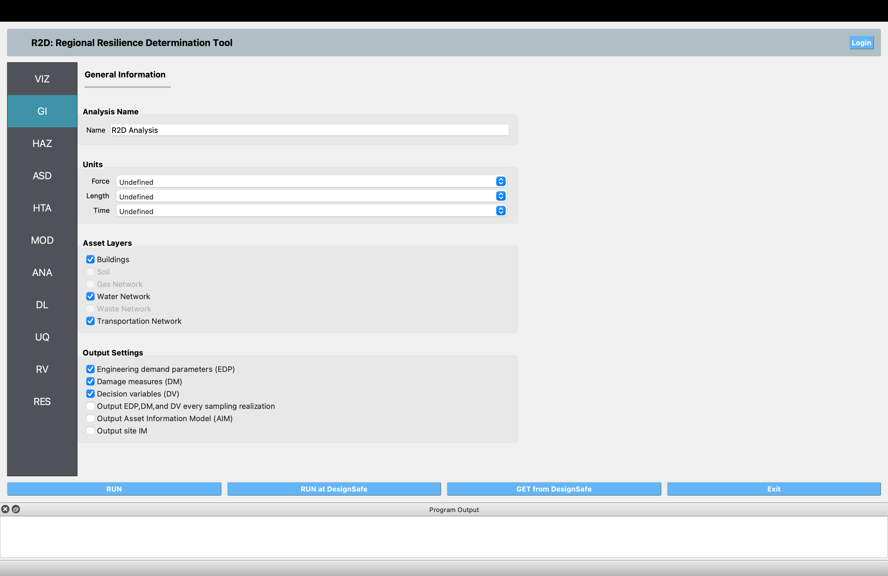

.. _lblGI:

GI: General Information
=======================

The **General Information** panel allows the user to provide information about the analysis, such as the analysis name and the units the user will work with. The widget contains the following input sections, as shown in :numref:`fig-R2DGIPanel`.

#. **Analysis Name**: The user can provide a unique name for the analysis. 

#. **Units Selection**: Collects information about the units used in the inputs and outputs. Some widgets will require inputs in different units. Those widgets will display units beside those special entry fields.

#. **Asset Layer Selection**: This is where the user can select the asset classes to include in a regional analysis. When a user selects a particular asset class, the corresponding panel for that asset will appear in the other input panels, such as in the **ASD: Asset Definition** and **MOD: Asset Modeling** input panels. Note that only the analysis of buildings, water networks, and transportation networks are supported in the current version. 

#. **Output Settings**: The user can specify the level of output detail provided in the results. 

.. note:: When the **Ouput EDP, DM, and DV every sampling realization** option is checked, the results can be found in one of two places. For local runs on your personal computer the sampling realizations can be found in the **Results** folder as an .hdf file, e.g., realizations_1-1000.hdf. The **Results** folder is in the **Output Directory** folder that is specified in R2D preferences. For remote runs on DesignSafe the sampling realizations are not downloaded onto your personal computer when remote data is retrieved because the resulting .hdf file could be very large when many samples are involved. You can download the sampling realizations from a remote run by going to the `DesignSafe website <https://www.designsafe-ci.org>`_ and logging into your account. Go to **Workspace** -> **TOOLS&APPLICATIONS** and click on the **JOBS STATUS** button on the right-hand side to see the list of available jobs. Select a job and click on the **More Info** button and then the **View** button under the **Output** heading. The sampling realizations will be in the **hdf.zip** file which can be downloaded onto your computer. The .hdf files can be converted to .csv format with `this <https://github.com/NHERI-SimCenter/SimCenterBackendApplications/blob/master/modules/performDL/pelicun/HDF_to_CSV.py>`_ Python script.

.. _fig-R2DGIPanel:

	General information input panel.

