.. _lblHAZ:

HAZ: Hazards
============

In this panel the user can define or simulate hazards over a region. The user can select the type of hazard, such as Earthquakes and Hurricanes, from the **Hazard Selection** combo box, as shown on the top of :numref:`fig-HazMainPanel`. As the user selects between the different hazard applications, the main panel will change to reflect the inputs for each application.

.. contents::
   :local:

.. _fig-HazMainPanel:

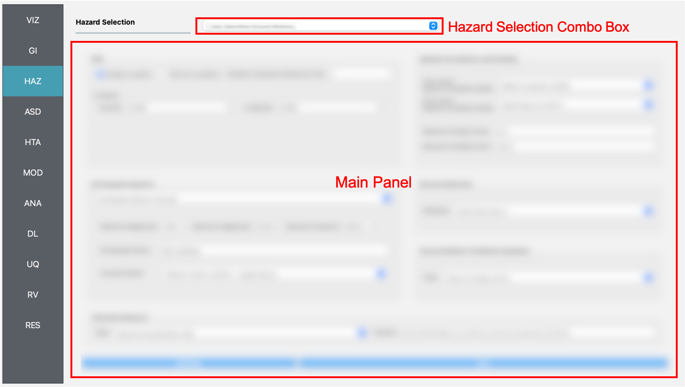

  Hazard input panel.

.. _ground_motion_tool:

Earthquake Scenario Simulation
------------------------------

The **Earthquake Scenario Simulation** is an application that provides a selection of earthquake ground motion records along a user-defined grid, a single point, or a list of scattered sites. The application employs OpenSHA, determining which records to select from a ground motion database. The **Earthquake Scenario Simulation** input panel is given in :numref:`fig-EQSSPanel` and the individual input panes are discussed below.

.. _fig-EQSSPanel:

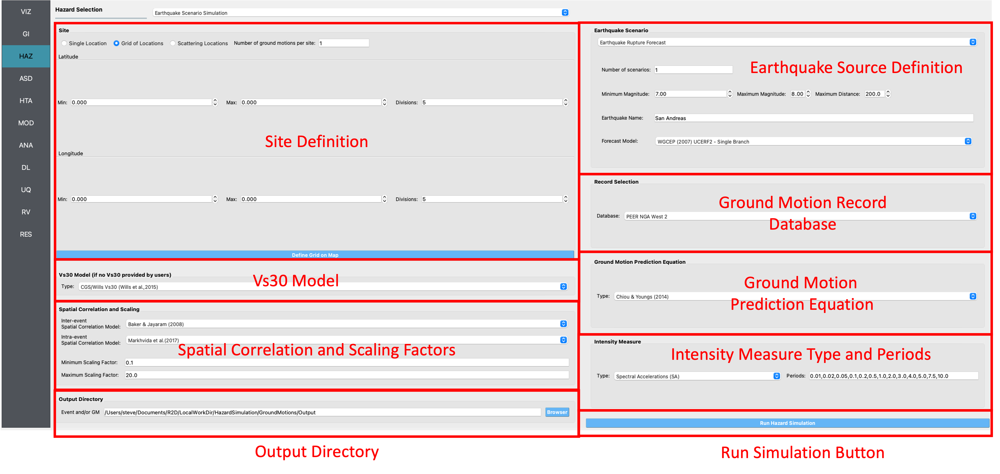

  Earthquake Scenerio Simulation Input panel.

**Site Definition Parameters**

This is where a user defines the geographical locations where ground motion selection will occur. A user can select to input a single location, multiple locations on a grid, or a collection of scattered sites as seen in the **Grid Type Selection** box in the top-left corner of :numref:`fig-R2DEQSSSiteSinglePane`.
    
    #. **Single Location**

	In the **Single Location** pane, shown in :numref:`fig-R2DEQSSSiteSinglePane`, the user needs to provide the following inputs:

		- **Location:** The latitude and longitude of the site.
		- **Number of Ground Motions per Site:** The number of ground motions that will be selected at the site.

	.. _fig-R2DEQSSSiteSinglePane:

	.. figure:: figures/R2DEQSSSiteSinglePane.png
	  :align: center
	  :figclass: align-center

	  Single location site definition.

    #. **Grid of Locations**

	In the **Grid of Locations** input pane, given in :numref:`fig-R2DEQSSSiteGridPane`, the user can either manually define a grid, or select a grid on a map. To manually define a grid, the user needs to provide the following input parameters:

		- **Latitude Extents:**  The minimum and maximum latitude values that the grid will span.
   		- **Longitude Extents:** The minimum and maximum longitude values that the grid will span.

	In addition to defining the geographical extents of the grid, the user must also provide the following inputs:

   		- **Number of Ground Motions per Site:** The number of ground motions that will be selected at each grid point.
   		- **Latitude Discretization:** The number of divisions along the latitude direction.
   		- **Longitude Discretization:** The number of divisions along the longitude direction.

	.. _fig-R2DEQSSSiteGridPane:

	.. figure:: figures/R2DEQSSSiteGridPane.png
	  :align: center
	  :figclass: align-center

	  Grid of locations site definition pane.

	To select a grid on a map, the user needs to click on the **Define Grid on Map** button and a new **Grid Selection Window** will appear with the grid, as seen in :numref:`fig-R2DEQSSGridSelection`. A user can click and drag the **Resize** and **Move** handles, shown in :numref:`fig-R2DEQSSGridSelection` as blue circles, to resize the grid extents and to move the grid. Changing the grid discretization along the latitude and longitude directions will change the number of grid divisions on the map. Once a grid is defined on the map, the window can be closed and the grid information will be updated in the input pane. To view or modify the grid again, press the **Define Grid on Map** button and the **Grid Selection Window** displaying the grid will reappear.

	.. _fig-R2DEQSSGridSelection:
	
	.. figure:: figures/R2DEQSSGridSelection.png
	  :align: center
	  :figclass: align-center
	
	  Selection of grid on map.
	  
    #. **Scattered Locations**

  	In the **Scattered Locations** input pane, given in :numref:`fig-R2DEQSSSiteScatterPane`, the user provides a custom list of sites. The following inputs are required:

		- **Site File:** The user provided file, in ``.csv`` format, containing the list of sites and corresponding site data. At a minimum the site file must contain the station number, latitude, and longitude of each site, as seen in the **Site Preview Table** in :numref:`fig-R2DEQSSSiteScatterPane`.
		- **Site Preview Table:** Table providing the information at each site. Apart from the station number, latitude, and longitude at each site, the site file can include other information such as the Vs30 at the site. 
		- **Minimum and Maximum Site ID:** The minimum and maximum site IDs considered.
		- **Number of Ground Motions per Site:** The number of ground motions that will be selected at each site.

	.. _fig-R2DEQSSSiteScatterPane:
	
	.. figure:: figures/R2DEQSSSiteScatterPane.png
	  :align: center
	  :figclass: align-center
	
	  Scattered sites input pane.

**Spatial Correlation and Ground Motion Scaling Factors**

This is where the user selects the spatial correlation models, and where the user defines the minimum and maximum scaling factors that are used in ground motion selection. Shown at the top of :numref:`fig-R2DEQSSCorrScalePane`, the user has the option to select the Intra- and Inter-event Spatial Correlation Models. Spatial correlation ensures that ground motions at different locations will share similar characteristics. The following Inter-event Spatial Correlation Models are available:

	- Baker & Jayaram (2008)

and the following Intra-event Spatial Correlation Models are available:

	- Markhvida et al. (2017)
	- Jayaram & Baker (2009)
	- Loth & Baker (2013)

The **Ground Motion Record Scaling Bounds**, shown at the bottom of :numref:`fig-R2DEQSSCorrScalePane`, are the minimum and maximum scaling factors that intensity measures can be scaled by during the ground motion selection process.

.. _fig-R2DEQSSCorrScalePane:

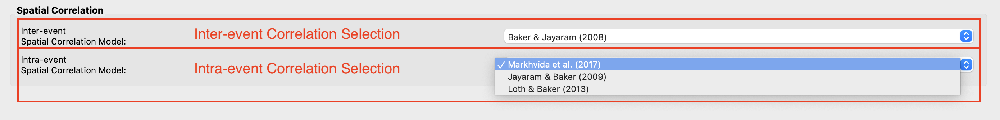

  Spatial correlation and ground motion selection scaling factors.

**Ground Motion Record Database**

Ground motion records are selected from a ground motion database. Currently, only the *PEER NGA-West2* database is available, shown in the **Ground Motion Record Database** combo box in :numref:`fig-R2DEQSSGMDBPane`. Alternatively, a user can select *None* to skip ground motion selection altogether. In that case, only the intensity measures will be saved at each location. 
	
  	.. _fig-R2DEQSSGMDBPane:

  	.. figure:: figures/R2DEQSSGMDBPane.png
  	  :align: center
  	  :figclass: align-center

  	  Ground motion records database.

**Ground Motion Prediction Equations**

Ground motion prediction equations estimate the intensity of ground shaking that may occur at a site. The **Ground Motion Prediction Equation** combo box, shown in :numref:`fig-R2DEQSSGMPEPane`, contains the following ground motion prediction equations:

	- Abrahamson, Silva & Kamai (2014)
	- Boore, Stewart, Seyhan & Atkinson (2014)
	- Campbell & Bozorgnia (2014)
	- Chiou & Youngs (2014)

.. _fig-R2DEQSSGMPEPane:

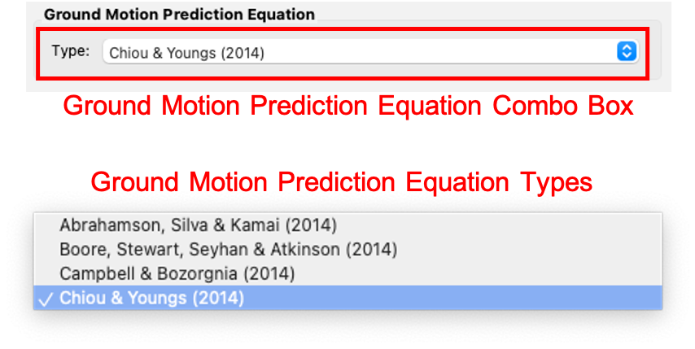

  Ground motion prediction equations.

**Earthquake Rupture Definition**

This is where the user defines the earthquake rupture characteristics. In the **Rupture Type** combo box, shown in :numref:`fig-R2DEQSSSEQRupPointPane`, point source and UCERF earthquake rupture forecast models are available.

    #. **Point Source**
	
	The **Point Source** pane, shown in :numref:`fig-R2DEQSSSEQRupPointPane`, requires the following inputs:
	
		- **Magnitude:** Magnitude of the earthquake.
		- **Location and Depth:** Location and depth of earthquake rupture.
		- **Rupture Geometry:** Average dip and rake of rupture.
	
	.. _fig-R2DEQSSSEQRupPointPane:
	
	.. figure:: figures/R2DEQSSSEQRupPointPane.png
	  :align: center
	  :figclass: align-center
	
	  Point source earthquake rupture.

    #. **UCERF Earthquake Rupture Forecast**

	The **UCERF Earthquake Rupture Forecast** pane, shown in :numref:`fig-R2DEQSSSEQRupForecastPane`, requires the following inputs:

		- **Magnitude and Distance:** Magnitude of the earthquake and the maximum distance, in km, from a site.
		- **Name:** Users can specify keywords here to search for specific earthquakes.
		- **Earthquake Forecast Model:** Type of earthquake forecast model.
		
	The types of UCERF earthquake forecast models available are:

		- WGCEP (2007) UCERF2 - Single Branch
		- Mean UCERF3
		- Mean UCERF3 FM3.1
		- Mean UCERF3 FM3.2

	.. _fig-R2DEQSSSEQRupForecastPane:

	.. figure:: figures/R2DEQSSSEQRupForecastPane.png
	  :align: center
	  :figclass: align-center

	  Earthquake rupture forecast.

**Intensity Measure and Period Points**

The **Intensity Measure and Period Points** pane, shown in :numref:`fig-R2DEQSSIMPane`, requires the following inputs:

	- **Intensity Measure Type:** Type of intensity measure. The Spectral Acceleration (SA) and Peak Ground Acceleration (PGA) intensity measures are available.
	- **Period Points:** List of periods, in seconds, that are used in the ground motion selection procedure.
	
.. _fig-R2DEQSSIMPane:

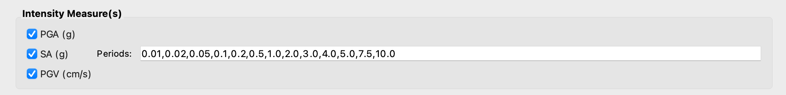

  Intensity measure and period.

**Settings and Run Buttons**

Shown at the bottom of :numref:`fig-EQSSPanel`, the **Settings** and **Run** buttons bring up the settings pane and start the ground motion selection application, respectively. The settings pane is provided in :numref:`fig-R2DEQSSSettingsPane`, showing the user-selectable directories containing the input and output files of the earthquake scenario simulation.

.. _fig-R2DEQSSSettingsPane:

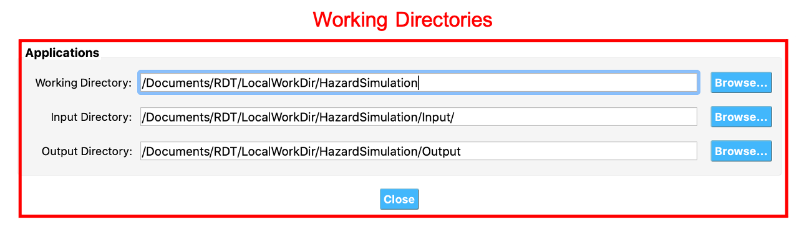

  Earthquake Scenario Simulation settings.

The earthquake scenario simulation is run via a Python script. When the **Run** button is pressed, a console window will appear, given in :numref:`fig-R2DEQSSConsole`, showing text output from the script.

.. _fig-R2DEQSSConsole:

.. figure:: figures/R2DEQSSConsole.png
  :align: center
  :figclass: align-center

  Earthquake selection output console.

Upon successful completion of the earthquake scenario simulation, the user will see output similar to that shown in the left-hand side of :numref:`fig-R2DEQSSOutput`. The results from the simulation are in the **Output Directory** folder that is specified in the settings, shown in :numref:`fig-R2DEQSSSettingsPane`. The final output is a ``.csv`` file called ``EventGrid.csv``. The ``EventGrid.csv`` file contains the grid points and their locations and file names. Each grid point is assigned a ``.csv`` file containing a list of the ground motions at the grid point and their scaling factors. If applicable, the corresponding ground motion records, in ``JSON`` format, are also in the **Output Directory** directoy. Next, the ``EventGrid.csv`` is post-processed, and a new layer containing the ground motions is added to the GIS widget. Shown on the right-hand side of :numref:`fig-R2DEQSSOutput`, the grid points are represented with a cross symbol. Clicking on a grid point will produce a popup with information about the ground motions at that point.

.. _fig-R2DEQSSOutput:

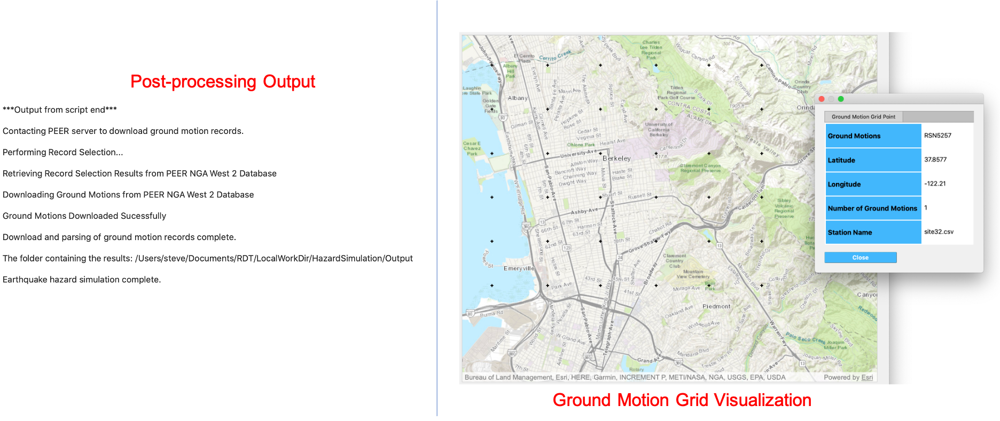

  Post-processing output and grid visualization.

User-specified Earthquakes
---------------------------

The **User-specified Earthquakes** application loads the results of an **Earthquake Scenario Simulation** that was run previously. The **User-specified Earthquakes** application input pane is given in :numref:`fig-UserSelectEQ`. As seen in the figure, the user is required to input the file path to the ``EventGrid.csv`` file. If the ground motions are not in the same folder as the ``EventGrid.csv`` file, then the user needs to input the directory path to the folder containing the ground motions.

.. _fig-UserSelectEQ:

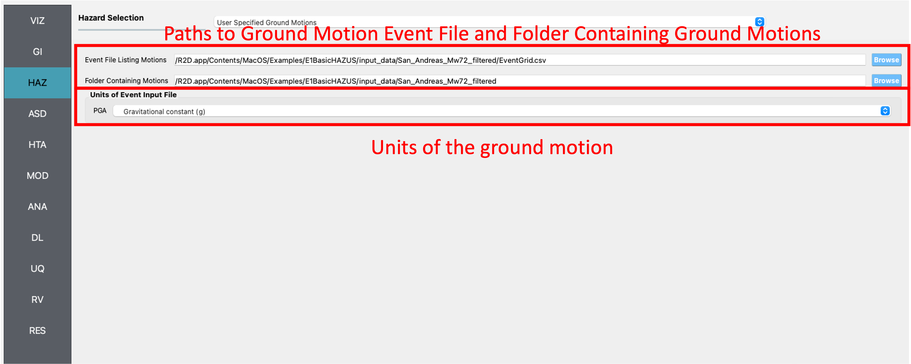

  User-defined earthquakes input panel.
  
  
Hurricane Scenario Simulation
-----------------------------

The **Hurricane Scenario Simulation**, seen in :numref:`fig-R2DHurricaneMainPanel`, is an application that calculates a wind field over a user defined grid. The GIS visualization window, seen at the bottom of :numref:`fig-R2DHurricaneMainPanel`, is used to interactively define hurricane inputs. At a minimum, a user needs to specify a set of hurricane track points, landfall location and parameters, and a wind field grid. The individual input panes are discussed below.

.. _fig-R2DHurricaneMainPanel:

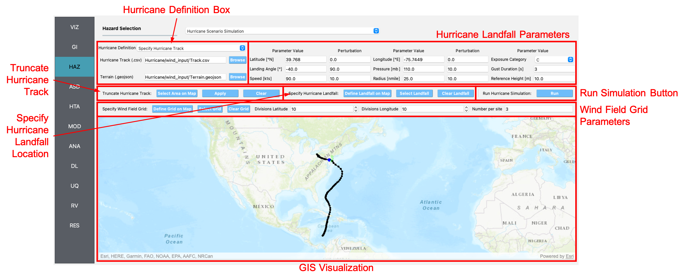

  Hurricane Scenario Simulation Application.

**Hurricane Definition**

A user has the option to specify a hurricane track and associated landfall parameters, or select a historical hurricane from a built-in database.

    #. **Specify Hurricane Track**

	To manually input a hurricane track, the user needs to supply a ``.csv`` file with rows that contain the latitude and longitude coordinates of the points along the track. To input the hurricane track file, the user needs to specify the file path in the **Path to Hurricane Track File** input shown in :numref:`fig-R2DHurricaneTrackSelectPane`. A successfully loaded track is shown at the top of :numref:`fig-R2DHurricaneTrackSelectPane`. The circles represent a measurement point along the track and the arrow head shows the direction of the hurricane. Clicking on a circle will produce a dialog with the available information at that point.

	.. _fig-R2DHurricaneTrackSelectPane:

	.. figure:: figures/R2DHurricaneTrackSelectPane.png
	  :align: center
	  :figclass: align-center

	  Manually defined hurricane track.
	  	  
	An example hurricane track input file is given below in  :numref:`fig-R2DHurricaneTrackSelectExData`. The track data should be in temporal order, i.e., the first measurement should be in the first row of the input file.
	
	.. _fig-R2DHurricaneTrackSelectExData:

	.. figure:: figures/R2DHurricaneTrackSelectExData.png
	  :align: center
	  :figclass: align-center

	  Example data for hurricane track input.
	  
	Users also have the option to specify a terrain roughness file in the ``.geojson`` format. Users need to provide the path to the terrain roughness file in the **Path to Terrain Roughness File** input, given in :numref:`fig-R2DHurricaneTrackSelectPane`. When loaded, the terrain roughness file will be visualized in the GIS window, as highlighted at the bottom of :numref:`fig-R2DHurricaneTrackSelectPane`. If a terrain roughness is not specified, a default value of 0.03 m is used (assuming open/flat terrain few isolated obstacles). 
		  
    #. **Select Hurricane from Database**

	The panel to select a historical hurricane is shown in :numref:`fig-R2DHurricaneTrackDB`. Clicking on the **Load Hurricane Database** button will load the database and all of the hurricanes in the database will appear in the GIS window, as shown at the bottom of :numref:`fig-R2DHurricaneTrackDB`. The database that is pre-bundled with the application is the International Best Track Archive for Climate Stewardship (IBTrACS) v04r00 database, listing storms that have occurred in the last three years. Users can modify the ``.csv`` database file, e.g., update it or add their own storm information, if the same header format and file name (ibtracs.last3years.list.v04r00.csv) is retained. Users can find this file in the ``Databases`` folder that is in the |app| installation directory. 

	.. _fig-R2DHurricaneTrackDB:

	.. figure:: figures/R2DHurricaneTrackDB.png
	  :align: center
	  :figclass: align-center

	  Hurricane selection from database.
			  
	To load a specific hurricane, a user needs to navigate to a hurricane of their choice in the GIS window, and click on the hurricane to select it. The selected hurricane will be highlighted, as shown in :numref:`fig-R2DHurricaneTrackDB2`, and a dialog will appear providing the hurricane track metadata. Clicking on the **Select Hurricane Button** in :numref:`fig-R2DHurricaneTrackDB2` will finalize the selection. The selected hurricane's metadata will appear in the box that is given in the middle of :numref:`fig-R2DHurricaneTrackDB`.
			
  	.. _fig-R2DHurricaneTrackDB2:

  	.. figure:: figures/R2DHurricaneTrackDB2.png
  	  :align: center
  	  :figclass: align-center

  	  Selecting a hurricane from the map.
			
	After selecting a hurricane, a user will see the final hurricane track, similar to what is shown in :numref:`fig-R2DHurricaneTrackDB3`. The circles represent a measurement point along the track. Clicking on a circle will produce a dialog with the available information at that point. The blue diamond respresents the first point of hurricane landfall, i.e., the first point at which the distance to land is equal to zero. If a landfall location is found, the landfall parameters are programmatically filled in with the measurements at the landfall location. In the case where a hurricane makes landfall more than once, the user has the option to clear the intial landfall point, and select another landfall point, the procedure of which is described below. Note that if a new landfall location is selected by the user, with the exception of the latitude and longitude which is updated programmatically, users should manually update the landfall parameters to agree with the expected parameter values at new location.
	
  	.. _fig-R2DHurricaneTrackDB3:

  	.. figure:: figures/R2DHurricaneTrackDB3.png
  	  :align: center
  	  :figclass: align-center

  	  Output after hurricane selection.	

**Hurricane Landfall Parameters**

This is where the user inputs the hurricane landfall parameters. Hurricane landfall occurs when the center of the storm moves across a coastline after traversing open water. Shown in :numref:`fig-R2DHurricaneLandfallParams`, the user must suppply the following parameter values:

	- Latitude in degrees North
	- Longitude in degrees East
	- Landing, or approach angle, in degrees
	- Speed in knots (kts)
	- Pressure in millibars (mb)
	- Radius in nautical miles (nmile)
	- Exposure category to classify terrain roughness
	- Gust duration in seconds (s)
	- Reference height in meters (m). The reference height 
	
Note that if a track is selected from the database, the landfall parameters will be automatically filled in based on the first encountered landfall. The **Perturbation** input boxes allow the user to specify uncertainty in the parameter values.  

.. _fig-R2DHurricaneLandfallParams:

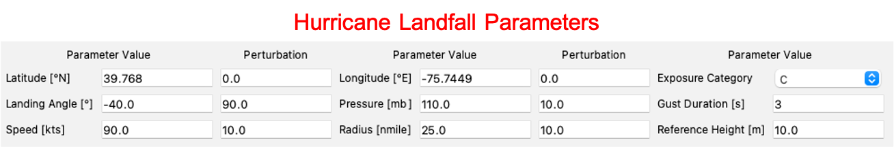

  Hurricane Landfall Parameters.
	  
**Specify Landfall Location**

The hurricane landfall location is manually defined using the buttons in :numref:`fig-R2DHurricaneLandfallSelect`. Clicking on the **Define Landfall on Map** button causes a blue circle to appear in the GIS window, as seen in the righthand side of the window in :numref:`fig-R2DHurricaneLandfallParams`. A user can click on and drag this circle to any location on the map. When the user is satisfied with their new landfall location, they need to click on the **Select Landfall** button to finalize the selection. The landfall will then appear as a blue diamond symbol in its own layer in the GIS window. If a user wants to erase an exsiting landfall location, they need to click on the **Clear Landfall** button and start over. 

.. _fig-R2DHurricaneLandfallSelect:

.. figure:: figures/R2DHurricaneLandfallSelect.png
  :align: center
  :figclass: align-center

  Specify Hurricane Landfall.

**Truncate Hurricane Track**

|app| allows users to truncate hurricane tracks to save time in the wind field computations. This is also useful when a user requires only a portion of a hurricane track in their region of interest. The buttons for truncating a hurricane track are shown in :numref:`fig-R2DHurricaneTruncateTrack`. Clicking on the **Select Area on Map** button in the figure will turn on the selection procedure. Clicking on any point in the GIS window will create a selection point, shown as a red dot in the GIS window of the figure. Continuing the point selection procedure will form the boundary of the selection polygon, an example of which is provided in :numref:`fig-R2DHurricaneTruncateTrack`. The selection polygon can be cleared at any point by pressing the **Clear** button. Clicking on the **Apply** button will finalize the selection. The track points that fall within the selection polygon will be kept and all other points will be discarded. Note that once the **Apply** button is pressed, the procedure cannot be undone. An example truncated track is given in the lefthand side of the GIS window in :numref:`fig-R2DHurricaneTruncateTrack`.
	
.. _fig-R2DHurricaneTruncateTrack:

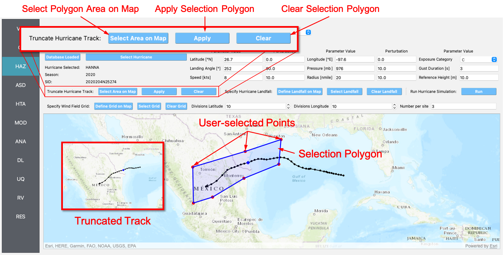

  Truncate Hurricane Track.
  
**Specify Wind Field Grid**

To select the wind field grid on a map, the user needs to click on the **Define Grid on Map** button. A new grid will appear in the GIS window, as seen in :numref:`fig-R2DHurricaneDefineGrid`. A user can click and drag the **Resize** and **Move** handles, shown in :numref:`fig-R2DHurricaneDefineGrid`, to resize the grid extents and to move the grid. Changing the grid discretization along the latitude and longitude directions will change the number of grid divisions on the map. Once a grid is defined on the map, the user needs to click on the **Select Grid** button to finalize grid selection. When grid selection is finalized, a new layer is added to the GIS widget. Shown on the right-hand side of :numref:`fig-R2DHurricaneDefineGrid`, the wind field grid points are represented with a cross symbol. Clicking on the **Clear Grid** button will clear the existing grid, allowing for the selection of a new grid. 
	
.. _fig-R2DHurricaneDefineGrid:

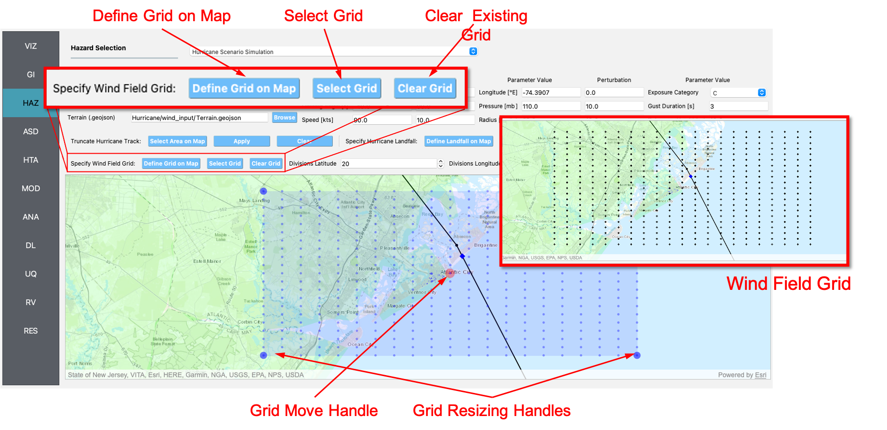

  Hurricane Wind Field Grid.

**Run Simulation Button**

Shown on the right-hand side of :numref:`fig-R2DHurricaneMainPanel`, the **Run Simulation** button starts the hurricane simulation application. The results from the simulation are in the **Output Directory** folder specified in |app| preferences. The final output is a ``.csv`` file called ``EventGrid.csv``. The ``EventGrid.csv`` file contains the grid point locations and file names. Each grid point is assigned a ``.csv`` file containing a list of the peak wind speeds at the grid point. The ``EventGrid.csv`` is post-processed and the grid points created in the **Specify Wind Field Grid** step will be updated with the Peak Wind Speed values that are calculated in the simulation. Clicking on a grid point will produce a popup listing the wind speeds at that point. 

User-specified Wind Fields
--------------------------

The **User-specified Wind Field** application loads the results of a **Hurricane Scenario Simulation** that was run previously. The **User-specified Hurricanes** application input pane is given in :numref:`fig-R2DUserSelectWindField`. As seen in the figure, the user is required to input the file path to the ``EventGrid.csv`` file. If the wind field stations are not in the same folder as the ``EventGrid.csv`` file, then the user needs to input the directory path to the folder containing the wind field station files.

.. _fig-R2DUserSelectWindField:

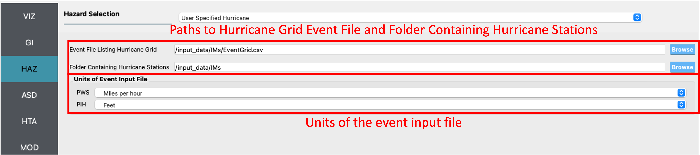

  User-specified wind field input panel.
  

ShakeMap Earthquake Scenarios
-----------------------------

The **ShakeMap Earthquake Scenario** application provides the functionality to import a USGS ShakeMap earthquake hazard. The **ShakeMap Earthquake Scenario** application input pane is given in :numref:`fig-R2DShakeMapPane`. As seen in the figure, the user is required to input a path to a folder on the user's computer that contains the ShakeMap data. At a minimum, the folder must contain a ``grid.xml`` file that provides the ground motion intensity measures, e.g., PGA, PGV, over a geographical grid. To visualize the PGA contours or rupture in the GIS window, a user can also provide the ``cont_pga.json`` file, or ``rupture.json`` file, respectively. Note that more than one ShakeMap can be input. However, the ShakeMap that is selected in the **List of ShakeMaps** tree in :numref:`fig-R2DShakeMapPane`, is the one that is employed in the subsquent analysis.

.. _fig-R2DShakeMapPane:

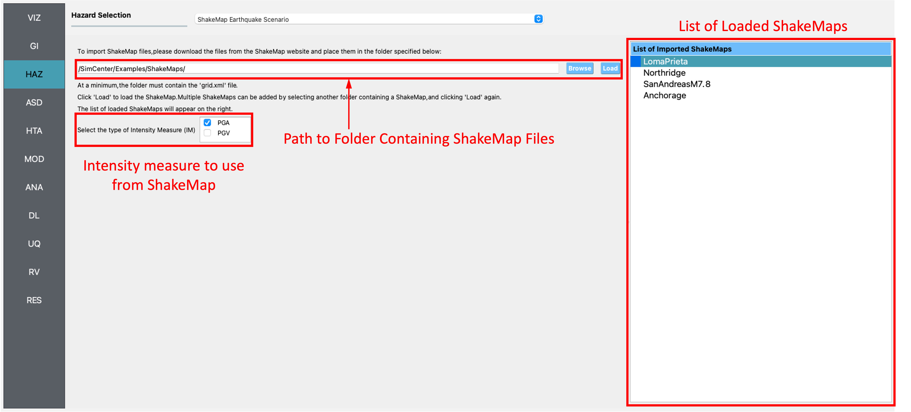

  ShakeMap input panel.
  
After a ShakeMap is loaded, it will appear in the list of ShakeMaps shown above in :numref:`fig-R2DShakeMapPane`. Users can see the grid, contours, etc., ShakeMap visuals by going to the **VIZ** pane, as highlighted in :numref:`fig-R2DShakeMapOutput` below. 
  
.. _fig-R2DShakeMapOutput:

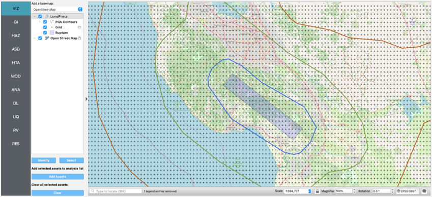

  ShakeMap visualization.
  
