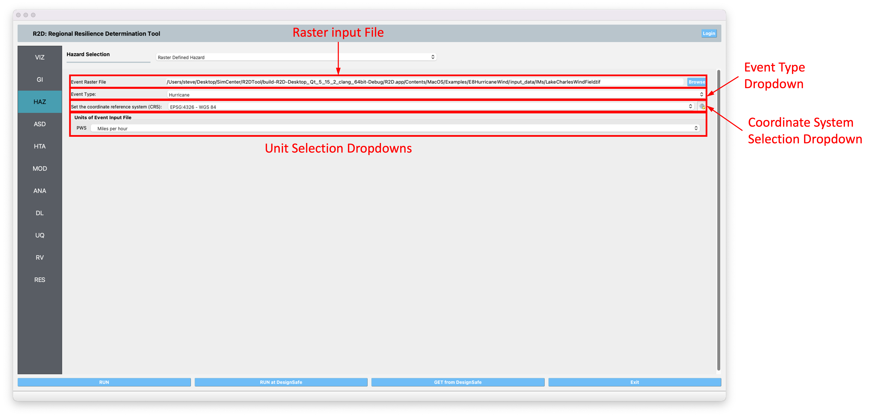
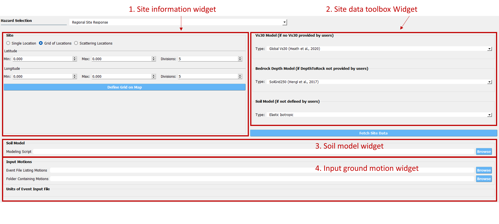

.. _lblHAZ:

HAZ: Hazards
============

This panel allows users to define or simulate hazards across a specified region. Users can choose the hazard type, such as Earthquakes and Hurricanes, from the **Hazard Selection** dropdown menu at the top of the Hazard input panel, as depicted in :numref:`fig-HazMainPanel`. The main panel updates to display relevant input fields for the selected hazard type.

.. contents::
   :local:

.. _fig-HazMainPanel:

.. figure:: figures/R2DHazMainPanel.png
  :align: center
  :figclass: align-center

  Hazard input panel.

.. _lbl-UserSpecifiedGroundMotions:

User-specified Ground Motions
-----------------------------

The **User-specified Ground Motion** option enables users to load results from a prior **Earthquake Event Simulation**. Users must provide the path to the ``EventGrid.csv`` file in the `Event File Listing Motions Field`, as shown in :numref:`fig-UserSelectEQ`. If the ground motion files are located in a different directory, the path to that directory must also be specified. Users are required to define the units for the ground motion data. This application supports analysis of both ground shaking and ground failure, as detailed in :ref:`Example E1-E4 <lbl-examples>` and :ref:`Example E5 and E14 <lbl-examples>`, respectively.

.. _fig-UserSelectEQ:

.. figure:: figures/R2DUserSelectEQ.png
  :align: center
  :figclass: align-center

  User-defined earthquakes input panel.

.. _lbl-UserSpecifiedHurricane:

User-specified Hurricane
------------------------

Similar to the **User-specified Ground Motion**, the **User-specified Hurricane** option imports results from a **Hurricane Scenario Simulation**. Users must input the path to the ``EventGrid.csv`` file in the `Event File Listing Hurricane Field`, as illustrated in :numref:`fig-UserSelectWindField`. If hurricane files are not in the same directory as the ``EventGrid.csv`` file, the directory path containing the hurricane data must be provided. Users also need to specify the units for the hurricane hazard input fields.

.. _fig-UserSelectWindField:

.. figure:: figures/R2DUserSelectWindField.png
  :align: center
  :figclass: align-center

  User-defined hurricane input panel.

.. _lbl-shakeMapEQScenarios: 

ShakeMap Earthquake Scenarios
-----------------------------

The **ShakeMap Earthquake Scenario** option allows users to import USGS ShakeMap earthquake hazard data. Users must input a path to a directory containing the ShakeMap data, which must include a ``grid.xml`` file, and optionally, ``cont_pga.json`` or ``rupture.json`` files for visualizing PGA contours or rupture in the GIS window, respectively. Multiple ShakeMaps can be imported, but only the selected ShakeMap in the **List of ShakeMaps** will be used for analysis. Users can choose the desired intensity measure from the ShakeMap grid.

.. _fig-R2DShakeMapPane:

.. figure:: figures/R2DShakeMapPane.png
  :align: center
  :figclass: align-center

  ShakeMap input panel.

After loading a ShakeMap, it appears in the list of ShakeMaps as shown in :numref:`fig-R2DShakeMapPane`. The **VIZ** pane allows users to view ShakeMap visuals, including the grid and contours, as highlighted in :numref:`fig-R2DShakeMapOutput` below.

.. _fig-R2DShakeMapOutput:

.. figure:: figures/R2DShakeMapOutput.png
  :align: center
  :figclass: align-center

  ShakeMap visualization.

.. note:: 
   R2D generates a .csv file for each grid point in the ``grid.xml`` file, storing ground motion intensity measures. While Unix-like systems process these files quickly, Windows systems may take longer (approximately 5 minutes for 10,000 grid points). For faster computation during testing or debugging, consider trimming or subsampling the ``grid.xml`` file.

.. _lbl-rasterDefinedHazard:

Raster Defined Hazard
---------------------

The **Raster Defined Hazard Widget** imports raster files to represent hazard intensities. Users can load a raster file by clicking the **Browse** button and selecting the file. The event type (e.g., Hurricane or Earthquake) must be selected from the **Event Type Dropdown**. Users must specify the coordinate reference system (CRS) used to create the raster to ensure rasters appear correctly on the map. For rasters with multiple bands, users must provide units for each band.

.. _fig-R2DRasterHazardPane:

  Raster hazard input pane.

.. note:: The **Raster Defined Hazard Widget** samples the raster at each asset location to determine hazard intensity. It generates a set of .csv files in the SimCenter event format (EventGrid.csv), with each grid point corresponding to an asset location. The **Mapping Application** in **HTA** should be set to **Site Specified** for analysis.
.. _lbl-regionalSiteResponse:

Regional Site Response
----------------------

Site response analysis evaluates seismic wave propagation through soil, assuming horizontal boundaries and vertical SH-wave propagation. The output includes ground surface response and, for liquefiable soils, maximum shear strain and excess pore pressure ratio plots.

.. _fig_siteResponse:
.. figure:: figures/siteResponse.png
   :align: center
   :figclass: align-center

   Schematic of site response analysis (courtesy of Dr. Pedro Arduino)

**Regional Site Response** offers four functionalities for site response analysis, each represented by a widget:

.. _fig_siteResponsePane:

   Regional Site Response graphic user interface

#. **Site information widget**: Defines sites for analysis through ``Single Location``, ``Grid of Locations``, or ``Scattering Locations``. Users can define a grid on the map or upload a .csv file with minimum attributes: ``Station`` ID, ``Longitude``, and ``Latitude``. Additional soil properties or modeling parameters can be added or generated using the **Site Data tool widget**.

#. **Site data toolbox widget**: Offers Vs30 data from Wills et al., 2015 ([Wills2015]_), Thompson et al., 2018 ([Thompson2018]_), and Heath et al., 2020 ([Heath2020]_), and bedrock depth data from SoilGrid250 ([Hengl2017]_). Three soil model types will be available: (1) Elastic isotropic, (2) Multiaxial Cyclic plasticity, and (3) User. After selecting the desired data sources and model type, a new site information csv site file will be generated and loaded by clicking the ``Fetch Site Data`` button.

#. **Soil model widget**: Requires a soil modeling script to create numerical models and run simulations based on the site information .csv.

#. **Input motion widget**: Expect an ``EventGrid.csv`` file and a directory with ground motion acceleration time history files, including units and scaling factors.

.. [Wills2015]
   Wills, C. J., Gutierrez, C. I., Perez, F. G., & Branum, D. M. (2015). A next generation VS 30 map for California based on geology and topography. Bulletin of the Seismological Society of America, 105(6), 3083-3091.

.. [Thompson2018]
   Thompson, E.M., 2018, An Updated Vs30 Map for California with Geologic and Topographic Constraints: U.S. Geological Survey data release.

.. [Heath2020]
   Heath, D. C., Wald, D. J., Worden, C. B., Thompson, E. M., & Smoczyk, G. M. (2020). A global hybrid VS30 map with a topographic slope–based default and regional map insets. Earthquake Spectra, 36(3), 1570–1584.

.. [Hengl2017]
   Hengl T, Mendes de Jesus J, Heuvelink GBM, Ruiperez Gonzalez M, Kilibarda M, Blagotić A, et al. (2017) SoilGrids250m: Global gridded soil information based on machine learning. PLoS ONE 12(2): e0169748.
