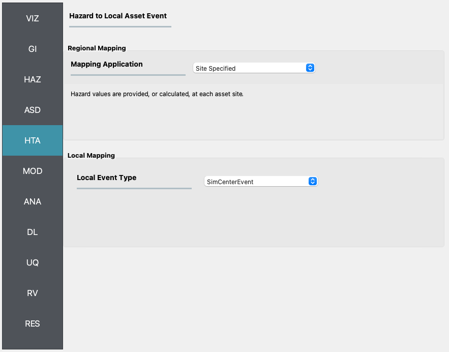

HTA: Hazard to Asset
====================

This section provides an overview of the methods in the R2D tool for mapping hazard intensities to assets within a specified region, including the **Regional Mapping** and **Local Mapping** approaches.

Regional Mapping
----------------

In regional analyses, hazard intensities need to be specified across a geographic area accurately. Often, these intensities are determined at a grid of points rather than the precise locations of assets. The **Regional Mapping** option facilitates the assignment of hazard intensities to assets by the **Nearest Neighbor Event** to locate the nearest grid point(s) where hazard intensities are available.

Nearest Neighbor Event
**********************

The **Nearest Neighbor Event** application draws samples of hazard intensities from adjacent grid points based on proximity. The input pane for this application, depicted in :numref:`fig-R2DHTAPanel`, necessitates the specification of:

	#. **Number of samples:** Determines the quantity of samples to be drawn at each grid point.
	#. **Number of neighbors:** Sets the count of neighboring grid points to draw samples from.
	#. **Seed:** Initializes the random number generator. Utilizing the same seed value ensures the reproduction of an identical sequence of sampled numbers.

.. _fig-R2DHTAPanel:

.. figure:: figures/R2DHTAPanel.png
	:align: center
	:figclass: align-center

	Nearest neighbor event input panel.
	
	
Site Specified Event
********************

For scenarios where hazard intensities are available at the exact asset locations, the **Site Specified Event** application is the appropriate choice. This application, illustrated in :numref:`fig-R2DSSEPanel`, allows for the input of hazard intensities directly by the user or through calculations within the R2D workflow.

.. _fig-R2DSSEPanel:

	Site-specific event input panel.
	