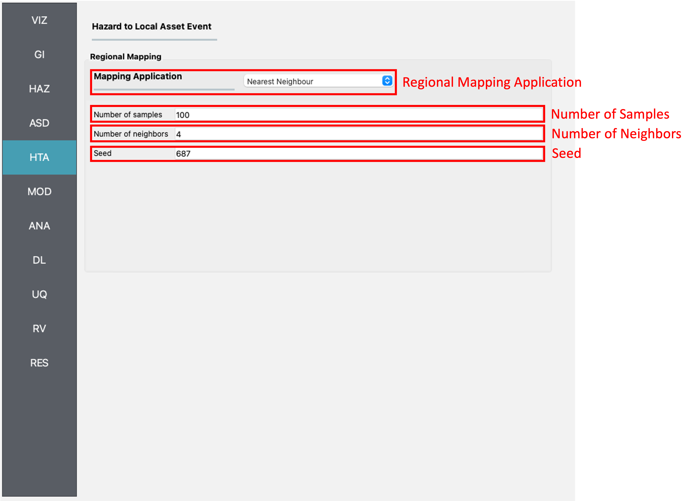

HTA: Hazard to Asset
====================

Regional Mapping
----------------

In a regional analysis, hazard intensities need to be specified over a geographic area. In some cases, hazard intensities are defined along a grid of points instead of at the exact location of an asset. The **Regional Mapping** pane, shown here with the **Nearest Neighbor Event** application selected as the **Regional Mapping Application**, provides a method for an asset to locate the nearest grid point(s) from which it will obtain the hazard intensities. 

Nearest Neighbor Event
**********************

The **Nearest Neighbor Event** application draws samples of hazard intensities from nearby grid points. The **Nearest Neighbor Event** input pane, shown in :numref:`fig-RegionalMapping`, requires the following inputs:

	#. **Number of samples:** Controls the number of samples considered at each grid point.
	#. **Number of neighbors:** Number of neighboring grid points that samples will be drawn from.

.. _fig-RegionalMapping:

	Nearest neighbor event input panel.

Local Mapping
-------------
