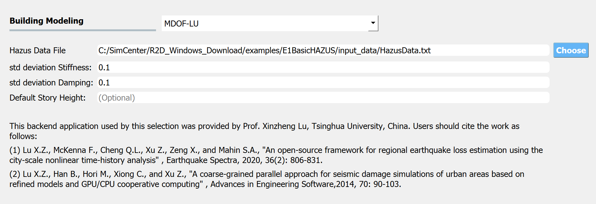

MOD: Asset Modeling
===================

In this panel the user can select the applications that will be used to model each asset class. The user can select the type of asset from the **Asset Selection Ribbon**, e.g., Buildings and Gas Network, as shown on the left-hand side of :numref:`fig-buildingModelingPanel`. The **Asset Selection Ribbon** is hidden by default, and appears when more than one type of asset is selected in the **GI: General Information** panel. Additionally, only the assets that are checked in the **GI: General Information** panel will appear in the **Asset Selection Ribbon**. As the user switches between assets, the **Input Panel** in :numref:`fig-buildingModelingPanel` will change to reflect the applications that are available for the modeling of each type of asset. 

.. _fig-buildingModelingPanel:

.. figure:: figures/R2DMODInputPanel.png
  :align: center
  :figclass: align-center

  Buildings modeling input panel.

.. contents::
   :local:

Buildings
---------

The applications available for the modeling of buildings are: 

	- MDOF-LU Building Model
	- OpenSeesPy Building Model

MDOF-LU Building Model
**********************

The **MDOF-LU** building modeling application creates a hysteretic, multi-degree of freedom (MDOF) model based on the Lu method. As seen in :numref:`fig-MDOFLUModelingPanel`, the following inputs are required:

	#. **stdStiffness:** The lateral stiffness of the building model.
	#. **stdDamping:** The damping of the building model.

.. _fig-MDOFLUModelingPanel:

  MDOF-LU Building model input panel.
  
.. note:: When the **MDOF-LU** building modeling application is employed, the **OpenSees** simulation application should be used for analysis in the **ANA: Asset Analysis** input panel. 

OpenSeesPy Building Model
*************************

The **OpenSeesPy** building modeling application creates an OpenSeesPy structural model from a user-defined Python script. The input panel, shown in :numref:`fig-R2DOpenSeesPyBuildingModel`, has the following inputs:

	#. **OpenSeesPy Script:** Script containing the code to create the building model. 
	#. **Node Response Mapping:** By default, the workflow assumes X=1, Y=2, Z=3 mapping between the *x,y,z* directions and degrees of freedom, with *x* and *y* being the horizontal directions. This input allows you to define an alternative mapping by providing three numbers separated by commas in a string, such as ‘1, 3, 2’ if you wish to have *y* as the vertical direction.
	#. **Analysis Spatial Dimensions:** Number of dimensions in the OpenSeesPy analysis.
	#. **Degrees-of-Freedom at Node:** Number of degrees-of-freedom at each node. 

.. _fig-R2DOpenSeesPyBuildingModel:

.. figure:: figures/R2DOpenSeesPyBuildingModel.png
  :align: center
  :figclass: align-center

  OpenSeesPy Building model input panel.

