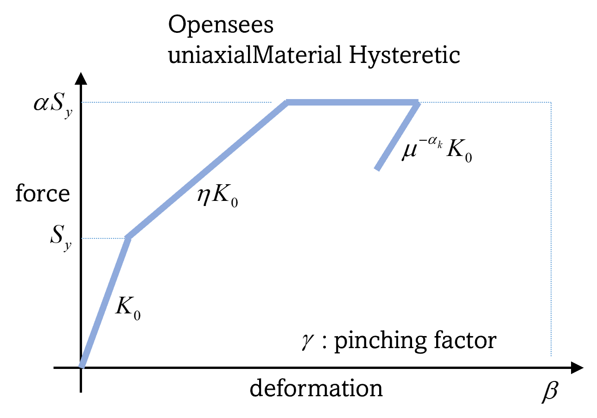

MOD: Asset Modeling
===================

This section outlines how users can configure the modeling of various asset classes within the application. Users can choose specific applications for modeling different asset types, such as Buildings or Transportation Networks, via the **Asset Selection Ribbon** on the left-hand side of the interface, as depicted in :numref:`fig-buildingModelingPanel`. This ribbon is initially hidden and becomes visible when multiple asset types are selected in the **GI: General Information** panel. Only assets marked in the **GI: General Information** panel will be displayed in the **Asset Selection Ribbon**. Switching between assets updates the **Input Panel** to show the relevant applications for modeling the selected asset type.

.. _fig-buildingModelingPanel:

.. figure:: figures/R2DMODInputPanel.png
  :align: center
  :figclass: align-center

  Buildings modeling input panel.

.. contents::
   :local:

.. _lbl-MODBuildings:

Buildings
---------

For building modeling, the following applications are available:

	- MDOF-LU Building Model
	- OpenSeesPy Building Model

.. _lbl-MODMDOFLu:

MDOF-LU Building Model
**********************

The **MDOF-LU** application generates a hysteretic, multi-degree of freedom (MDOF) model based on high-level building information provided by the user. This approach is adapted from [Lu2020]_. It processes building inventory data (e.g., construction year, structural type, plan area, number of stories) provided by the user in the ASD tab to determine the design code level and generates an OpenSees model for each building. Required information includes:

.. _fig-MDOFLUModelingPanel:

.. figure:: figures/R2DMDOFLUBuildingModel.png
  :align: center
  :figclass: align-center
  :width: 80%

* **Hazus Data File:** Path to a file with rules mapping design code levels and structural types to structural parameters. An example file can be downloaded :download:`here <src/MDOF_Lu_HazusData.txt>`, with column names explained below:

    .. collapse:: Column names of HazusData.txt (click)

      .. csv-table:: Column names of HazusData.txt (showing the first 10 rows for high-code) 
         :file: src/MOD_Lu_HazusData_display.csv
         :header-rows: 1
         :align: center
  See :numref:`fig-MDOFLUModelingHys` for the parameter definitions. Note that not all the parameters are being used.
* **Std deviation Stiffness:** Standard deviation for lateral stiffness. The uncertainty will be applied by sampling a multiplication factor with the specified standard deviation and mean of 1. The factor is sampled only once per structure and will be applied to all stories.
* **Std deviation Damping:** Standard deviation for damping ratio. The uncertainty will be applied by sampling a multiplication factor with the specified standard deviation and mean of 1.
* **Default Story Height (optional):** Sets mass node coordinates.

The analysis outputs include a ``SAM.json`` file for structural parameters and an ``example.tcl`` file (with  `uniaxialMaterial Hysteretic <https://opensees.berkeley.edu/wiki/index.php/Hysteretic_Material>`_ material model) for the downstream OpenSees model. Both files are located in the working directory.

    .. collapse:: Example of SAM.json (click)

      .. literalinclude:: src/MOD_Lu_SAM.json
          :language: json

    .. collapse:: Example of opensees.tcl (click)

      .. literalinclude:: src/MOD_Lu_example.tcl
          :language: tcl
          :emphasize-lines: 1,2,3,4,5,6,7,8,9,10,11

where the keys of ``SAM.json`` are defined as follows:

.. _fig-MDOFLUModelingHys:

  Hysteresis model in MDOF-LU Building Model.

.. csv-table:: Structure parameters estimated from MDOF-Lu
  :file: src/MOD_SAM.csv
  :header-rows: 1
  :align: center
  :widths: 2, 1, 7
   \* `see here for details on unloading stiffness <https://portwooddigital.com/2022/04/17/hysteretic-damage-parameters/>`_

.. note:: When the **MDOF-LU** building modeling application is employed, the **OpenSees** simulation application should be used for analysis in the **ANA: Asset Analysis** input panel. 

.. [Lu2020] Lu, X., McKenna, F., Cheng, Q., Xu, Z., Zeng, X., & Mahin, S. A. (2020). An open-source framework for regional earthquake loss estimation using city-scale nonlinear time history analysis. Earthquake Spectra, 36(2), 806-831.

OpenSeesPy Building Model
*************************

The **OpenSeesPy** application allows for the creation of structural models using a user-defined Python script. The input panel (:numref:`fig-R2DOpenSeesPyBuildingModel`) provides fields for:

	#. **OpenSeesPy Script:** Script containing the code to create the building model. 
	#. **Node Response Mapping:** By default, the workflow assumes X=1, Y=2, Z=3 mapping between the *x,y,z* directions and degrees of freedom, with *x* and *y* being the horizontal directions. This input allows you to define an alternative mapping by providing three numbers separated by commas in a string, such as ‘1, 3, 2’ if you wish to have *y* as the vertical direction.
	#. **Analysis Spatial Dimensions:** Number of dimensions in the OpenSeesPy analysis.
	#. **Degrees-of-Freedom at Node:** Number of degrees-of-freedom at each node. 

.. _fig-R2DOpenSeesPyBuildingModel:

.. figure:: figures/R2DOpenSeesPyBuildingModel.png
  :align: center
  :figclass: align-center

  OpenSeesPy Building model input panel.

.. _lbl-MODTransport:

Transportation Infrastructure
-----------------------------

Currently, only Intensity Measure as Engineering Demand Parameter (**IMasEDP**) analysis is supported for transportation infrastructure. The asset models should be **None** for **IMasEDP** analyses. 
