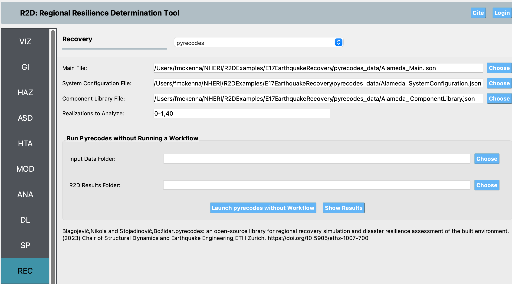

REC: Recovery
===================

The **Recovery** panel is where the user selects a methodology to perform a regional recovery (i.e., network) performance functionality assessment. The following regional recovery applications are availabl:

.. contents::
   :local:

.. _lbl-PYRECODES:

Pyrecodes
---------

`pyrecodes <https://nikolablagojevic.github.io/pyrecodes/html/index.html>`_ is an open-source Python library for regional disaster recovery simulation and disaster resilience assessment of the built environment. pyrecodes is based on the iRe-CoDeS, a framework for disaster resilience quantification discretizes a system into components and simulates the change in components’ supply and demand for various resources over the post-disaster recovery period. Components’ interactions are captured by simulating the flow of operation and recovery resources among components and conditioning their ability to operate and recover on their resource demand fulfillment. System’s resilience is then assessed by contrasting the post-disaster system-level evolution of supply, demand and consumption of various resources and identifying the magnitude and duration of unmet resource demands in the system.

To perform system resilience in pyrecodes, as shown in :numref:`fig-PyrecodesBasicPanel`, the  user needs to provide three JSON files:

#. **main file** which specifies the class of the system configuration and component library objects and is used to run the system resilience assessment.
   
#. **component library file** which defines templates for component objects to be instantiated in the system.

#. **system configuration file** which defines the system by specifying the spatial distribution of components, damage input model, resource parameters, resilience calculators, and temporal discretization of the system.

   The contents of these files is as `specified on the pyrecodes website <https://nikolablagojevic.github.io/pyrecodes/html/usage/user_guide.html>`_ . The user also needs to identify which of the sample runs of the previous workflow to calcuilate recovery for. Not all runs aree included for performence reasons.

.. _fig-PyrecodesBasicPanel:

   Pyrecodes Base Input Panel.
   
Additional information on Pyrecodes and descriptions of its output are available at the `pyrecodes website <https://nikolablagojevic.github.io/pyrecodes/html/index.html>`_ and [Blagojevic25]_.

.. [Blagojevic25]
   Blagojević, Nikola, and Stojadinović, Božidar. (2025). pyrecodes: an open-source library for regional recovery simulation and disaster resilience assessment of the built environment (v0.2.0). Zenodo. https://doi.org/10.5281/zenodo.14774265

.. note::

   As can be discerned in the figure, pyrecodes can also be run independently of the workflow by providing the location of a previously executed workflow. This is useful when the user wishes to run additional samples.
