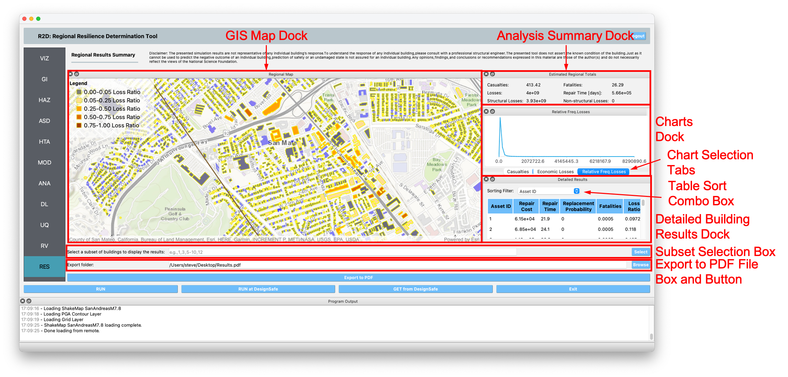

RES: Results
============

The **Results** panel is where the user can review the results of an analysis. Currently, the results post-processor supports output from the following applications:

.. contents::
   :local:

Pelicun Damage and Loss 
-----------------------

:numref:`fig-R2DRESPanel` shows the results panel for the **Pelicun Damage and Loss** application. The results panel is comprised of several docking windows that can be moved, rearranged, resized, and opened and closed by the user. The results panel contains these main docks:

	#. **Regional Map Dock:** Geographic map of the region. The assets are colored according to their loss ratio. Clicking on an asset will produce a popup showing the detailed information of that asset.
	
	#. **Analysis Summary Dock:** A high-level summary of the aggregated losses, repair times, and casualties over a region. 
	
	#. **Charts Dock:** Graphical respresentation of the results in three charts:
		
		#. *Casualties:* Bar chart showing the casualites in a region accross four casualty severity levels; with 1 being the least severe and 4 being the most severe level. 
		
		#. *Economic Losses:* Bar chart providing the losses in a region according to damage states, *DS*, where *DS* = 1..4, and where *DS* =1 is the least severe and *DS* = 4 is the most severe damage state. Moreover, the losses are grouped into losses resulting from damage to structural components, damage to non-structural drift sensitive components, and damage to non-structural acceleration sensitive components.
		
		#. *Relative Frequency Diagram of the Losses:* Line chart of the relative frequency diagram of the total losses of each building. 
	
		To switch between the charts, the user can click on the **Chart Selection Tabs** shown in :numref:`fig-R2DRESPanel`
	
	#. **Detailed Building Results Dock:** Table showing the detailed building results. For each building, the table provides the:
		 
		 - Asset ID
		 - Repair Cost
		 - Repair Time
		 - Probability of Replacement
		 - Fatalities
		 - Loss Ratio
	
		The **Table Sort** combo box, shown in :numref:`fig-R2DRESPanel`, sorts the table in descending order according to the selected filter, e.g., repair cost. 
	
By default, the results are displayed for all buildings in an analysis. The **Subset Selection** box allows the user to specify a subset of buildings for which the results will be displayed. A range of buildings is specified with a dash, and multiple buildings are separated with a comma, e.g., 2-8, 9, 13, 15, 21, 34-38. When the **Select** button is pressed, only the buildings that are specified in the **Building Selection** box are post-processed and shown in the results.

The **Export to PDF** file box and button allows for the creation of a PDF containing the regional summary, charts, and building results table for future reference. The user can specify the folder to which to save the results by pressing on the **Browse** button. By default, the file will be saved as ``Results.pdf``. Clicking on the **Export to PDF** button creates the PDF in the specified folder. 

.. _fig-R2DRESPanel:

	Pelicun results visualization panel.

