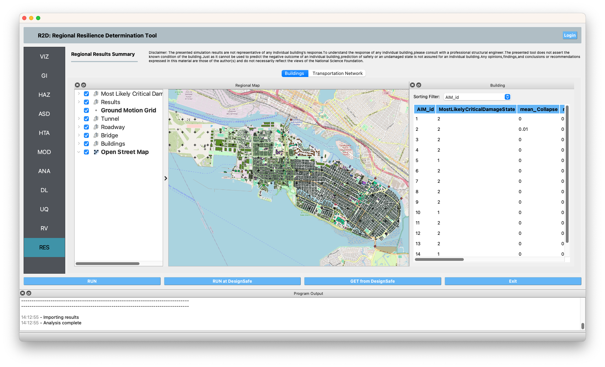

RES: Results
============

The **Results** panel is where the user can review the results of an analysis. Currently, the results post-processor supports output from the following applications:

.. contents::
   :local:

Pelicun Damage and Loss 
-----------------------

:numref:`fig-R2DRESPanel` shows the results panel for the **Pelicun Damage and Loss** application. The results panel is comprised of several docking windows that can be moved, rearranged, resized, and opened and closed by the user. The results panel contains these main docks:

	1. **Regional Map Dock:** Displays a geographic map highlighting the assets within the analyzed region. Assets are color-coded based on their most likely critical damage state. Clicking on an asset reveals a popup with detailed information about it.

	.. note:: The term 'critical damage state' refers to the highest level of damage sustained by any of the asset's components. In the context of asset-level damage assessment (e.g., Hazus-MH EQ IM), an asset is evaluated based on multiple components, each susceptible to different types of hazard intensity measures. For instance, a building's vulnerability may be assessed in terms of both ground shaking (PGA) and ground failure (PGD) components. The critical damage state is determined by the largest damage state of these components, with the 'Most likely' critical damage state being identified as the mode across all realizations of damage state generated by Pelicun. For further details on Pelicun's output and methodology, refer to the [Pelicun Documentation](https://nheri-simcenter.github.io/pelicun/common/user_manual/usage/pelicun/outputs.html). The process involves identifying a critical damage state for each realization, with the mode of these states representing the most likely outcome.

	2. **Detailed Building Results Dock:** This table presents a detailed breakdown of the results for each asset, including:
		 
		 - Asset ID
		 - Mean and standard deviation of repair cost
		 - Mean and standard deviation of repair time
		 - Mean and standard deviation of the most likely damage state
	
		The table can be sorted in descending order based on any of these metrics using the **Table Sort** combo box, as depicted in :numref:`fig-R2DRESPanel`.

.. _fig-R2DRESPanel:

	Pelicun results visualization panel.

