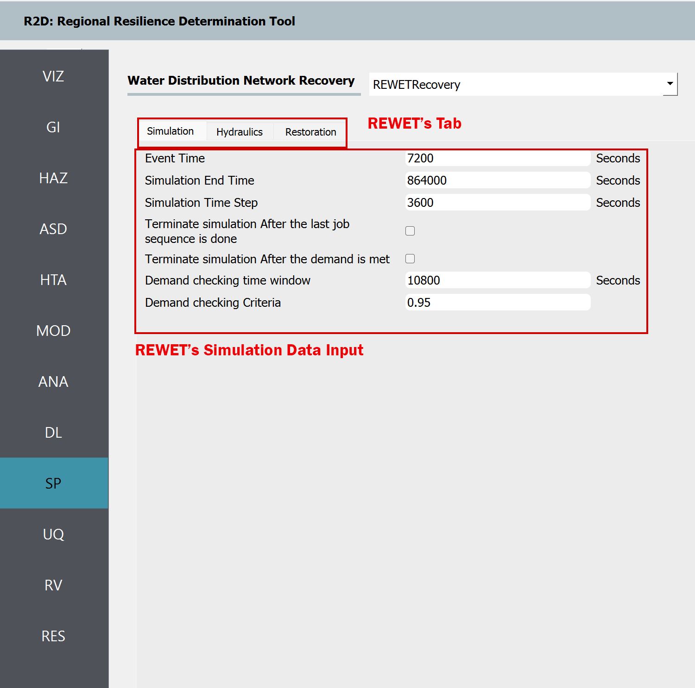
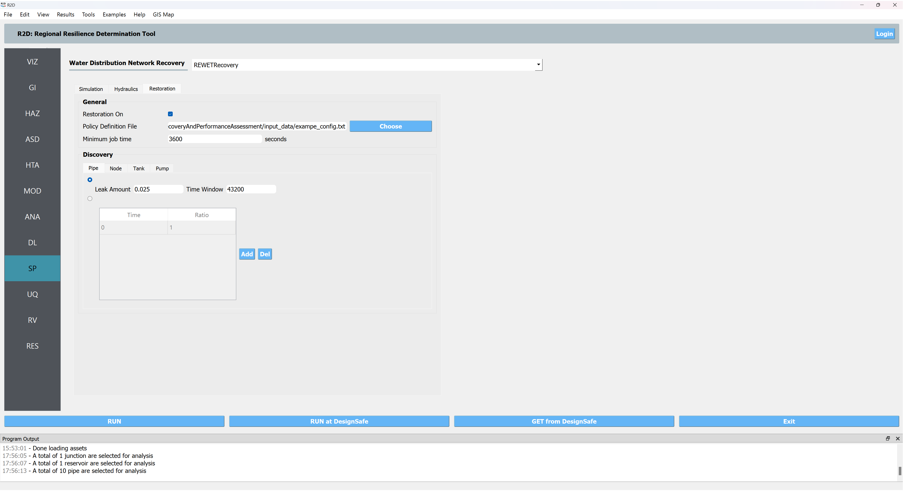

SP: System Performance
===================

The **System Performance** panel is where the user selects a system performance methodology to perform a system (i.e., network) performance functionality assessment. The following system performance applications are available:

.. contents::
   :local:

.. _lbl-SPREWET:

REWET
-----

Shown in :numref:`fig-R2DREWETSYMPanel`, the **REWET System Performance** assessment application has three tabs:

.. _fig-R2DREWETSYMPanel:

#. **Simulation:** This tab refers to the input required for simulating the Water Distribution Network (WDN) service restoration after an event. The following inputs are required in REWET's simulation tab:

	- Event Time
	This refers to the time (in seconds) of the event after the simulation starts. For instance, if the time in the example INP file is 12 AM, an event time equal to 7200 corresponds to 2 AM.

	- Simulation End Time
	This specifies the time at which the simulation ends.

	- Terminate Simulation after the Last Job Sequence Is Done
	This option, if selected, allows the simulation to be ended before the simulation end time is reached if all the jobs defined for recovery are completed.

	- Terminate Simulation after the Demand Is Met
	This option, if selected, allows the simulation to be ended before the simulation end time is reached if the ratio of demand after the event to the demand before the event meets or exceeds a given threshold for all demand nodes.

	- Demand Checking Time Window
	This parameter defines the time window for checking demand after selecting “Terminate Simulation after the Demand.”

	- Demand Checking Criteria
	This shows the ratio of demand after to demand before, which determines when the simulation ends when “Terminate Simulation after the Demand” is selected.
	
#. **Hydraulic:** This tab refers to the input required for hydraulics of the Water Distortion Network (WDN) and damage simulation. The following inputs are required in REWET's hydraulics tab.

	- Hydraulic Solver Selection
	Users can specify their preferred hydraulic solver for their hydraulic simulation based on the available versions of REWET in R2D. The Modified EPANET V2.2 is a customized version of EPANET V2.2 [EPANET, 2020] that handles flow from negative pressure scenarios.
	
	- Minimum Pressure Override and Required Pressure Override
	These options allow users to override the minimum and required pressure values specified in the INP file. Since the minimum and required pressure values in the example are correct, we leave them unchanged (set as -1 so that they will be ignored).
	
	- Pipe Damage Modeling
	In pipe damage modeling, the relationship between the pipe’s diameter and the equivalent orifice diameter - similar to the approach proposed by Shi and O’Rourke (2008)[Shi and O’Rourke (2008)] - for each pipe material (or damage type) is defined. The default value is set to Cast Iron, with average values derived from Shi and O’Rourke (2008)[Shi and O’Rourke (2008)]. If the user does not provide a material (or damage subtype) name list in the asset, R2D assumes the default value to be Cast Iron.
	
	.. _fig-R2DREWETHYDPanel:

	.. figure:: figures/R2DSPREWETHyd.png
		:align: center
		:figclass: align-center

REWET System-Performance Hydraulic Input panel.

#. **Restoration:**	This tab refers to the input required for the Restoration of the Water Distortion Network 
(WDN) after the damages from an event. The following inputs are required in REWET's restoration tab.

   **Restoration On:** When checked, this indicates that REWET runs the restoration (recovery) simulation.
   
   **Policy Definition File:** This file defines restoration policies according to REWET’s policy definition 
   format.
	
   **Minimum Job Time:** Specifies the time when a job is assigned to a restoration agent before their shift 
   ends.
	
   **Pipe Discovery Rules for Damaged Assets:** The user can define the discovery rules for each damaged asset. 
   For a pipe, the discovery can be based on leaks or on a user-specified timeseries of the discovery ratio. 
   Leak-based discovery helps the user mimic the discovery of buried pipes, in which the pipes are 
   not discovered unless the damage location on the pipe is pressurized for enough time so that the water flows 
   out to the surface of the ground. The user-specified method may also be beneficial to the user when other 
   methods for discovery are used, or the user prefers such a model. Other possible damage discoveries are 
   node-level damage discovery, tank, and pump damages. Based on the available REWET and R2D versions, damage
   modeling of these asset types (also known as elements) may be included or not. If such damage modeling is 
   being performed, the user may define such an element’s discovery as well.

.. _fig-R2DREWETHYDPanel:

	

Additional information on REWET and descriptions of its output are available at [Naeimi, 2023] 
.. [EPANET, 2020]
   Rossman, L., H. Woo, M. Tryby, F. Shang, R. Janke, AND T. Haxton. EPANET 2.2 User Manual. U.S. Environmental Protection Agency, Washington, DC, EPA/600/R-20/133, 2020.
.. [Naeimi, 2023]
   	Naeimi Dafchahi, Sina, and Rachel A. Davidson. Post-Event Restoration Simulation of Water Distribution Systems : A Generally Applicable Approach. 2023. ProQuest Dissertations & Theses.
.. [Shi and O’Rourke (2008)]
   Shi, P, and T D O’Rourke. 2008. Seismic Response Modeling of Water Supply Systems. Buffalo- NY: MCEER-University at Buffalo. https://www.buffalo.edu/mceer/catalog.host.html/content/shared/www/mceer/publications/MCEER-08-0016.detail.html.
