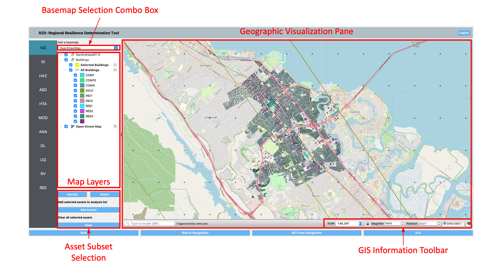

.. _r2d-viz:

VIZ: Visualization
==================

This section details the Visualization panel as depicted in :numref:`fig-regionalGISPanel`, enabling users to visualize assets and hazards on a geographical map.

.. _fig-regionalGISPanel:

  Geographic visualization panel.

#. **Geographic Visualization (GIS) Pane**: This pane integrates the `QGIS <https://www.qgis.org/en/site/index.html>`_ system, offering a comprehensive suite of geospatial tools within R2D. Users can visualize a map of a region along with assets and hazards. For an in-depth exploration of QGIS features, refer to the QGIS `documentation <https://www.qgis.org/en/docs/index.html>`_. Access the GIS functionality in R2D via the **GIS Map** menu.

#. **Base Map Selection**: Choose a base map from the dropdown to display in the GIS pane's background.

#. **Map Layer Tree**: Manage map layers here. Check a layer's box to toggle visibility or right-click for options like **Zoom to Layer** and **Show Feature Count**. Layers can be reordered through drag-and-drop; layers positioned lower are rendered beneath those above them.

#. **Asset Subset Selection**: Select specific assets for analysis or to view attributes.

	- To select a subset of assets, click on the **Select** button, shown in :numref:`fig-R2DAssetSelection`, to start the selection process. 
	- You can click on a single asset to select it, or click-hold and drag to create a rectangle that will select all assets that it intersects. By holding the shift key, you can continue selecting assets until you are satisfied. 
	- Clicking on the **Add Assets** button will add the selected assets to the **Selected Assets** layer for that type of asset, e.g., **Selected Buildings**. Only assets added to the **Selected Assets** layer will be analyzed. 
	
	.. note:: Only features that are in the current layer can be selected on the map. The current layer is the layer that is selected (highlighted) in the layer tree. 
	
   Selection tips:
   
	- To select multiple features, hold down the shift key.
	- Selected features are highlighted in yellow.
	- A layer must be visible for its assets to be selectable.
	- Use the **Clear** button to reset selections or click on an empty map area to clear selections from the current layer. The **Clear Selection** button removes all selections across layers.
	
	.. _fig-R2DAssetSelection: 

	.. figure:: figures/R2DAssetSelection.png
	  :align: center
	  :figclass: align-center

	  Asset selection.
	  
#. **Identify**: Query attributes of selected assets. Clicking an asset displays a table on the right side of the GIS window, listing attribute names and values as shown in :numref:`fig-R2DVizAssetIdentify`.

	.. _fig-R2DVizAssetIdentify:

	.. figure:: figures/R2DVizAssetIdentify.png
	  :align: center
	  :figclass: align-center

	  Asset attributes.
