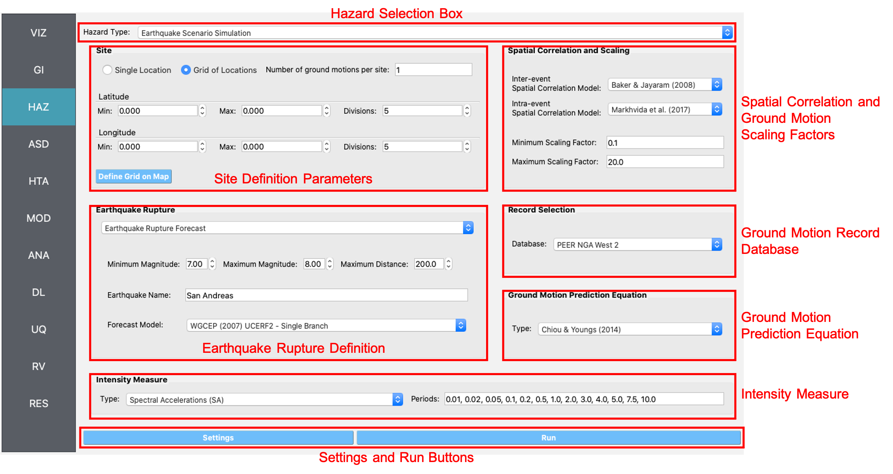

HAZ: Hazards
============

In this panel the user can define hazards over a region. The user can select the type of hazard, Earthquakes, Wind, etc., from the **Hazard Selection** combo box, as shown on the top of :numref:`fig-EQSSPanel`. As the user selects between different hazards, the main panel changes to reflect the inputs for each type of hazard application. 

.. contents::
   :local:
   
.. _fig-EQSSPanel:

  Earthquake scenario simulation input panel.

Earthquake Scenario Simulation
------------------------------

The **Earthquake Scenario Simulation** is an application that selects earthquake ground motion records at one or more user defined locations. The application employs OpenSHA, determining which records to select from the a ground motion database. The **Earthquake Scenario Simulation** input panel is given in :numref:`fig-EQSSPanel`. The individual input panes are discussed below. 

#. **Site Definition Parameters**

	This is where a user defines the geographical locations where ground motion selection will occur. A user can define a single location, or multiple locations on a grid, as seen in the top-left corner of :numref:`fig-RDTEQSSSiteSinglePane`.

	#. **Single Location**
	
		In the **Single Location** site pane, shown in :numref:`fig-RDTEQSSSiteSinglePane`, the user needs to provide the following input parameters:
		
			- **Number of Ground Motions per Site:** The number of ground motions that will be selected at the site.
			- **Location:** The latitude and longitude of the site. 
		
		.. _fig-RDTEQSSSiteSinglePane:
           
		.. figure:: figures/RDTEQSSSiteSinglePane.png
		  :align: center
		  :figclass: align-center
           
		  Single location site definition.
	
	#. **Grid of Locations** 
	
		In the **Grid of Locations** input pane, given in :numref:`fig-RDTEQSSSiteGridPane`, the user can either manually define a grid, or select a grid on a map. To manually define a grid, the user needs to provide the following input parameters:
		
	  		- **Latitude Extents:**  The minimum and maximum latitude values that the grid will span.
	  		- **Longitude Extents:** The minimum and maximum longitude valuesthat the grid will span.

		In addition to defining the geographical extents of the grid, the user must also provide the following parameters:
	  
	  		- **Number of Ground Motions per Site:** The number of ground motions that will be selected for each site. 
	  		- **Latitude Discretization:** The number of divisions along the latitude direction.
	  		- **Longitude Discretization:** The number of divisions along the longitude direction.
	  
		.. _fig-RDTEQSSSiteGridPane:
    	
		.. figure:: figures/RDTEQSSSiteGridPane.png
		  :align: center
		  :figclass: align-center
		  
		  Location grid site definition pane.

		To select a grid on a map, the user can click on the **Define Grid on Map** button and a new **Grid Selection Window** will appear with the grid, as seen in :numref:`fig-RDTEQSSGridSelection`. A user can click and drag the **Resize** and **Move** handles, shown in :numref:`fig-RDTEQSSGridSelection`, to resize the grid extents and to move the grid. Changing the grid discretization along the latitude and longitude directions will change the number of grid divisions on the map. Once a grid is defined on the map, the window can be closed and the grid information will be updated in the input pane. To view or modify the grid again, press the **Define Grid on Map** button and the **Grid Selection Window** displaying the grid will reappear.

  	.. _fig-RDTEQSSGridSelection:

  	.. figure:: figures/RDTEQSSGridSelection.png
  	  :align: center
  	  :figclass: align-center

  	  Selection of grid on map.

#. **Spatial Correlation and Ground Motion Scaling Factors**

	This is where the user selects the spatial correlation models, and where the user defines the minimum and maximum scaling factors that are used in ground motion selection. Shown at the top of :numref:`fig-RDTEQSSCorrScalePane`, the user has the option to select the **Intra-** and **Inter-event Spatial Correlation Models**. Spatial correlation ensures that ground motions at different locations will share similar characteristics. The following **Inter-event Spatial Correlation Models** are available:
	
		- Baker & Jayaram (2008)
	
	and the following **Intra-event Spatial Correlation Models** are available:
	
		- Markhvida et al. (2017)
		- Jayaram & Baker (2009)
		- Loth & Baker (2013) 
	
	The **Ground Motion Record Scaling Bounds**, shown at the bottom of :numref:`fig-RDTEQSSCorrScalePane`, are the minimum and maximum scaling factors that intensity measures can be scaled by during the gound motion selection process.
	
  	.. _fig-RDTEQSSCorrScalePane:

  	.. figure:: figures/RDTEQSSCorrScalePane.png
  	  :align: center
  	  :figclass: align-center

  	  Spatial correlation and ground motion selection scaling factors.

#. **Ground Motion Record Database**

	Ground motion records are selected from a ground motion database. Currently, only the *PEER NGA-West2* database is available, shown in the **Ground Motion Record Database** combo box in :numref:`fig-EQSSPanel`.

#. **Ground Motion Prediction Equations**

	The **Ground Motion Prediction Equation** box in :numref:`fig-EQSSPanel` provides a combo box where one of the following ground motion prediction equations can be selected:
	
		- Abrahamson, Silva & Kamai (2014)
		- Boore, Stewart, Seyhan & Atkinson (2014)
		- Campbell & Bozorgnia (2014)
		- Chiou & Youngs (2014)
		
	Ground motion prediction equations estimate the intensity of ground shaking that may occur at a given location.

#. **Earthquake Rupture Definition**

	This is where the user defines the earthquake rupture characteristics. Point source and earthquake rupture forecast models are availble. 
	
		#. **Earthquake Rupture Forecast**
			
			The **Earthquake Rupture Forecast** allows users to select historical earthquakes as the scenarios to run. Historical earthquake data is available from the following supported Earthquake Forecast Models: 
			
				- WGCEP (2007) UCERF2 - Single Branch
				- Mean UCERF3
				- Mean UCERF3 FM3.1
				- Mean UCERF3 FM3.2
			
			The **Earthquake Rupture Forecast** pane, shown in :numref:`fig-RDTEQSSSEQRupForecastPane`, requires the following input parameters:
		
				- **Rupture Type:** Type of earthquake rupture (here Earthquake Rupture Forecast).
				- **Magnitude and Distance:** Magnitude of the earthquake and the maximum distance, in km, from a site. 
				- **Name:** Users can specify keywords here to search for specific earthquakes. 
				- **Earthquake Forecast Model:** Type of earthquake forecast model. 
		
			.. _fig-RDTEQSSSEQRupForecastPane:
			
			.. figure:: figures/RDTEQSSSEQRupForecastPane.png
			  :align: center
			  :figclass: align-center
			
			  Earthquake rupture forecast.
	  
		#. **Point Source** 
	
			The **Point Source** pane, shown in :numref:`fig-RDTEQSSSEQRupPointPane`, requires the following input parameters:
		
				- **Rupture Type:** Type of earthquake rupture.
				- **Magnitude:** Magnitude of the earthquake.
				- **Location and Depth:** Location and depth of earthquake rupture.
				- **Rupture Geometry:** Average dip and rake of rupture.
	
			.. _fig-RDTEQSSSEQRupPointPane:
			
			.. figure:: figures/RDTEQSSSEQRupPointPane.png
			  :align: center
			  :figclass: align-center
			
			  Point source earthquake rupture.

#. **Intensity Measure and Period Points**

	The **Intensity Measure and Period Points** pane, shown in :numref:`fig-RDTEQSSIMPane`, requires the following:

		- **Intensity Measure Type:** Type of intensity measure. The Spectral Acceleration (SA) and Peak Ground Acceleration (PGA) intenisty measures are available. 
		- **Period Points:** List of periods, in seconds. The period points are used in searching and ground motion scaling.
	
  	.. _fig-RDTEQSSIMPane:

  	.. figure:: figures/RDTEQSSIMPane.png
  	  :align: center
  	  :figclass: align-center

  	  Intensity measure and period.

#. **Settings and Run Buttons**

	Shown at the bottom of :numref:`fig-EQSSPanel`, the **Settings** and **Run** buttons bring up the settings pane and start the ground motion selection application, respectively. The settings pane is provided in :numref:`fig-RDTEQSSSettingsPane`, showing the user-selectable directories containing the input and output files of the ground motion selection.
	
	.. _fig-RDTEQSSSettingsPane:
	
	.. figure:: figures/RDTEQSSSettingsPane.png
	  :align: center
	  :figclass: align-center
	
	  Earthquake Scenario Simulation settings.
	  
	The ground motion selection application is run via a Python script. When the **Run** button is pressed, a console window will appear, given in :numref:`fig-RDTEQSSConsole`, showing text output from the script.  
	
	.. _fig-RDTEQSSConsole:
	
	.. figure:: figures/RDTEQSSConsole.png
	  :align: center
	  :figclass: align-center
	
	  Earthquake selection output console.
	
	Upon successful completion of the ground motion selection, the user will see output similar to that shown in the left-hand side of :numref:`fig-RDTEQSSOutput`. The results from the simulation are in the **Output Directory** folder that is specified in the settings, shown in :numref:`fig-RDTEQSSSettingsPane`. The final output is a .csv file called ``EventGrid.csv``. The ``EventGrid.csv`` file contains the grid points and their locations and file names. Each grid point is assigned a .csv file containing a list of the ground motions at the grid point and their scaling factors. The corresponding ground motion records, in JSON format, are also in the **Output Directory** directoy.
	Next, the ``EventGrid.csv`` is post-processed, and a new layer, called **EQ Hazard Simulation Grid**, is added to the **VIZ: Visualization Widget**. Shown on the right-hand side of :numref:`fig-RDTEQSSOutput`, the grid points are represented with a cross symbol. Clicking on a grid point will produce a popup with information about the ground motions at that point.
	
	.. _fig-RDTEQSSOutput:
	
	.. figure:: figures/RDTEQSSOutput.png
	  :align: center
	  :figclass: align-center
	
	  Post-processing output and grid visualization.

User-defined Earthquakes
------------------------

The **User-defined Earthquakes** application loads the results of an **Earthquake Scenario Simulation** that has been run previously. The **User-defined Earthquakes** application input pane is given in :numref:`fig-UserSelectEQ`. As seen in the figure, the user is required to input the file path to the ``EventGrid.csv`` file. If the gournd motions are not in the same folder as the ``EventGrid.csv`` file, then the user needs to input the directory path to the folder containing the ground motions.   

.. _fig-UserSelectEQ:

.. figure:: figures/RDTUserSelectEQ.png
  :align: center
  :figclass: align-center

  User-defined earthquakes input panel.
