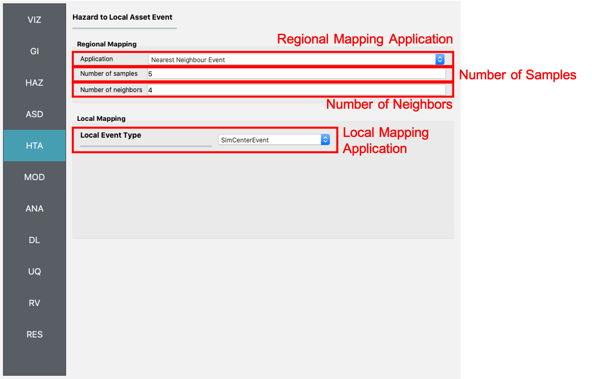

.. _lblGI:

HTA: Hazard to Asset
====================

Regional Mapping
----------------

In a regional analysis, hazard intensities should be specified over a geographic area. In some cases, hazard intensities are defined along a grid of points instead of at the exact location of an asset. The **Regional Mapping** pane, shown here with the `Nearest Neighbor Event` application selected, provides a method for an asset to locate the nearest grid point(s) from which it will obtain the hazard intensities. 

Nearest Neighbor Event
**********************

The ``Nearest Neighbor Event`` application draws samples of the hazard intensity from nearby grid points. The ``Number of samples`` input controls the number of samples considered at each grid point, while the `Number of neighbors` input is the number of neighboring grid points that samples will be drawn from.

.. _fig_RegionalMapping:

	Nearest neighbor event input panel.

Local Mapping
-------------
