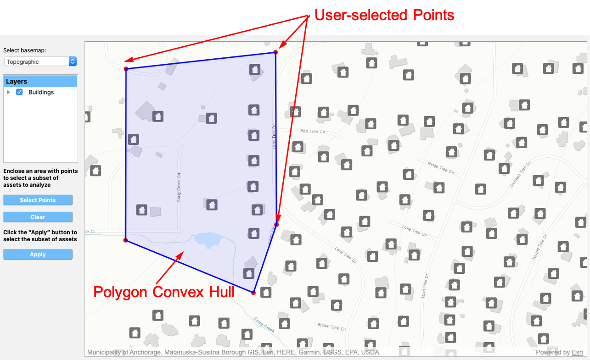

VIZ: Visualization
==================

In this panel, shown in :numref:`fig-regionalGISPanel`, the user can visualize the assets and hazards over a geographical region.

.. _fig-regionalGISPanel:

.. figure:: figures/RDTVIZPanel.png
  :align: center
  :figclass: align-center

  Geographic visualization panel.

#. The **Geographic Visualization** pane displays the map of a region and the various objects within the region that can be visualized, e.g., assets and hazards. 

#. The **Basemap Selection** combo box is where the user can select a basemap that is the background of the **Geographic Visualization** pane

#. The **Map Layers** shows the layers that are in the map. Checking the box to the left of a layer name will show or hide the corresponding layer in the map. Moreover, right-clicking on a layer will display a pop-up with any available layer functionality, e.g.,**Change Opacity**

#. The **Asset Subset Selection** allows a user to select the points to define the convex hull of an arbitrary polygon, as shown in :numref:`fig-AssetSelection`. Any asset that is within the convex hull of the polygon will be added to a list of assets for analysis. Clicking on the **Select Points** button starts the selection process. Clicking anywhere on the map will place a point at the location of the mouse-click. The user can continue selecting points, and a convex hull polygon will be automatically created with the selected points. Clicking on the **Clear** button will clear the selected points. Once a suitable polygon is defined, clicking on the **Apply** button will search the polygon and select the assets within the polygon for analysis. Note that only visible assets will be selected, i.e., assets in layers that are hidden will not be included. 

.. _fig-AssetSelection:

  Asset selection.

