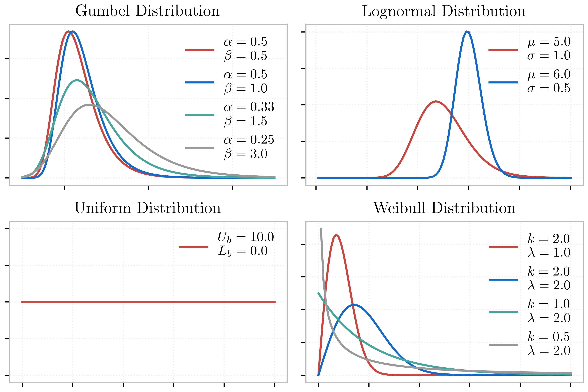

RV: Random Variables
====================

The **RV** tab allows the user to specify the probabilistic distribution for the random problem at hand. The following probabilistic distributions for the random variables are currently supported: 

1. `Normal (Gaussian) <https://dakota.sandia.gov//sites/default/files/docs/6.9/html-ref/variables-normal_uncertain.html>`_

   User provides the mean (:math:`\mu`) and standard deviation (:math:`\sigma`) of the normal distribution. The density function of the normal distribution, as a function of :math:`\mu` and :math:`\sigma` is:

   .. math::

      f(x) = \frac{1}{\sqrt{2 \pi} \sigma} \exp \left( -{\frac{1}{2} \left( \frac{x - \mu}{\sigma} \right)^2} \right)

2. `Lognormal <https://dakota.sandia.gov//sites/default/files/docs/6.9/html-ref/variables-lognormal_uncertain.html>`_

   User provides the mean (:math:`\mu`) and standard deviation (:math:`\sigma`) of the lognormal distribution. The density function of the lognormal distribution, as a function of :math:`\mu` and :math:`\sigma` is:

   .. math::

      f(x) = \frac{1}{\sqrt{2 \pi} \zeta x} \exp \left( -{\frac{1}{2} \left( \frac{\ln x - \lambda}{\zeta} \right)^2} \right)

  where :math:`\zeta^2 = \ln \left( \frac{\sigma^2}{\mu^2} + 1 \right)` and :math:`\lambda = \ln(\mu) - \frac{\zeta^2}{2}`

3. `Beta <https://dakota.sandia.gov//sites/default/files/docs/6.9/html-ref/variables-beta_uncertain.html>`_

   User provides :math:`\alpha`, :math:`\beta`, lower bound (:math:`L_B`), and an upper bound (:math:`U_B`) for the beta distribution. The density function of the normal distribution, as a function of these quantities is:

   .. math::

      f(x) = \frac{\Gamma(\alpha + \beta)}{\Gamma(\alpha)\Gamma(\beta)} \frac{(x - L_B)^{\alpha-1}(U_B-x)^{\beta-1}}{(U_B - L_B)^{\alpha + \beta - 1}}

   where :math:`\Gamma(\alpha)` is the `Gamma function <http://mathworld.wolfram.com/GammaFunction.html>`_.

4. `Uniform <https://dakota.sandia.gov//sites/default/files/docs/6.9/html-ref/variables-uniform_uncertain.html>`_

   User provides the lower bound (:math:`L_B`), and an upper bound (:math:`U_B`) for the uniform distribution. The density function of the normal distribution, as a function of these quantities is:

   .. math::

      f(x) = \frac{1.0}{(U_B - L_B)}

   The mean of the distribution is :math:`\frac{(U_B + L_B)}{2.0}`

5. `Weibull <https://dakota.sandia.gov//sites/default/files/docs/6.9/html-ref/variables-weibull_uncertain.html>`_

   User provides shape parameter (:math:`k`) and scale parameter (:math:`\lambda`)  for the Weibull distribution. The density function of the Weibull distribution, as a function of these quantities is:

   .. math::

      f(x) = \frac{k}{\lambda}\left(\frac{x}{\lambda}\right)^{k-1} \exp \left( -(x/\lambda)^{k} \right)

   where :math:`k,\lambda > 0` and :math:`x >= 0`. For :math:`x<0`, :math:`f(x) = 0`.

6. `Gumbel <https://dakota.sandia.gov//sites/default/files/docs/6.9/html-ref/variables-gumbel_uncertain.html>`_

   User provides :math:`\alpha` and :math:`\beta` for the Gumbel distribution, where :math:`\beta` is known as the **location parameter** and :math:`\frac{1}{\alpha}` the **scale parameter**. The density function of the Gumbel distribution, as a function of these quantities is:

   .. math::
   
	f(x) = \alpha e^{-\alpha(x-\beta)} \exp(-e^{-\alpha(x-\beta)})

For each random variable, the user must enter a name and select from the pull down menu the distribution associated with the random variable. For the distribution selected, the user must then provide the input arguments, which are as described above. :numref:`figRV` shows the panel for a problem with four Random Variables with all random input following Gaussian distributions. 

.. _figRV:

.. figure:: figures/rv.png
   :align: center
   :figclass: align-center

   Random variable specification.

.. note::

   To add a new random variable the user presses the **Add** button. To remove a random variable, the user must first select it by checking the small circle before the random variable, and then pressing the **Remove** button.

.. warning::

   Removing a random variable may have unintended consequences and cause the UQ engine to fail. 

   Various distributions offered by the |app| .

