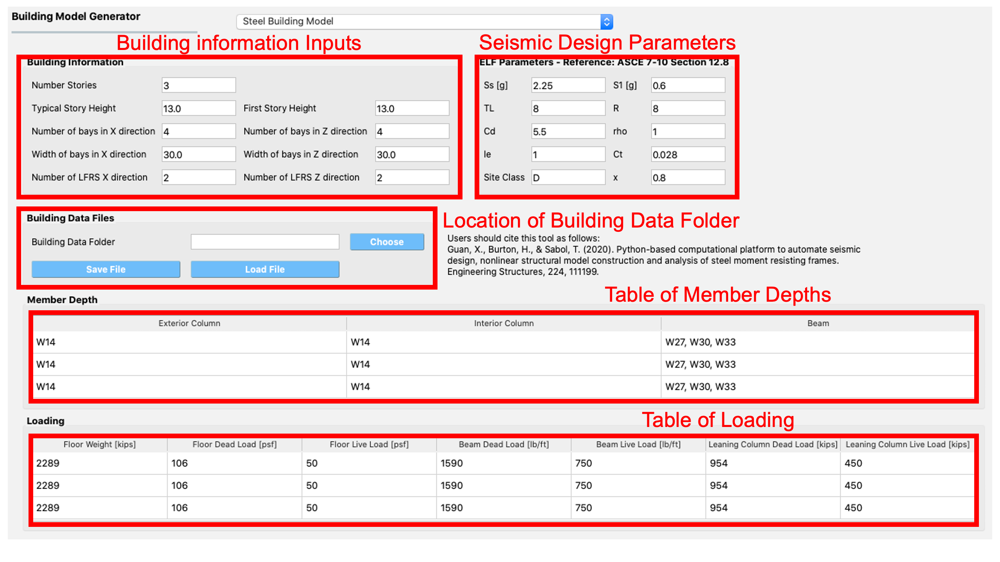

.. _SIM-user_manual:

SIM: Structural Model
=====================

The user here defines the structural system of the building. The  structural system is the part of the building provided to resist the gravity loads and those loads arising from the natural hazard. There are a number of backend applications provided for this part of the workflow, each responsible for defining the structural analysis model. The user can select the application to use from the drop-down menu at the top of this panel. As the user switches between applications, the input panel changes to reflect the inputs each particular application requires. At present, there are two backend applications available.

.. contents::
   :local:

.. _lblMDOFSIM:

Multiple Degrees of Freedom (MDOF)
----------------------------------

This panel is provided for users to quickly create simple shear models of a building. The panel, as shown in :numref:`fig-mdof` is divided into 3 frames:

#. The top left frame allows the user to specify the number of stories and properties that are constant for every floor and story in the building. The following properties are available: floor weight, story height, torsional stiffness, initial stiffness, yield strength, and hardening ratio for each direction in each story. The user has the option of specifying values for eccentricity of mass in :math:`x` and :math:`y` directions, and eccentricities for the location of the response quantities. Here, the one and two directions are orthogonal :math:`x` and :math:`y` axes in plan view.

#. The lower left frame allows the user to override the structural parameters above for individual floors and stories.

#. The frame on the right is a graphical widget showing the current building. When entering data into the lower left frame, the stories corresponding to the data being modified are highlighted in red.


.. _fig-mdof:

.. figure:: figures/mdof_general.png
  :align: center
  :figclass: align-center

  Multiple degrees of freedom (MDOF) building model generator.


Random variables can be created by the user if they enter a valid string instead of a number in the entry fields for any entry except for the *Number of floors*. The variable name entered will appear as a random variable in the **UQ** panel; it is there that the user must specify the distribution associated with the random variable.

  
    .. MDOF or Shear Building Model

  ..
     .. note::  
        ```Random Variables```: Random Variables can be created by the user if they enter a valid string instead of a number in the entry fields for any entry except for the *Number of floors*. The variable name entered will appear as a Random Variable in the **UQ** tab; it is there that the user must specify the distribution associated with the Random Variable.

.. _lblOpenSeesSIM:

OpenSees
--------

This panel is for users who have an existing OpenSees model of a building that performs a gravity analysis and now they wish to subject that building model to one of the **EVT** options provided. The input panel for this option is shown in :numref:`fig-figure3`. Users need to provide three pieces of information:

#. Main OpenSees Script: The main script that contains the building model. This script should build a model and perform any gravity analysis of the building that is required before the event is applied.

#. Response Nodes: A list of node numbers that define a column line of interest for which the responses will be determined. The column nodes should be in order from ground floor to roof. The :ref:`EDP<lblEDP>` workflow application uses this information to determine nodes at which displacement, acceleration, and story drifts are calculated.

#. An entry for the dimension of the model (i.e., 2D or 3D). This information is used when loads are applied.

#. Entry for the number of degrees of freedom at each node in the model.


.. _fig-figure3:

.. figure:: figures/openSees_gen.png
	:align: center
	:figclass: align-center
	
	OpenSees Model.


In OpenSees there is an option to set variables to have certain values using the ``pset`` command, e.g ``pset a 5.0`` will set the variable a to have a value 5 in the OpenSees script. In |short tool id|, any variable found in the main script to be set using the ``pset`` command will be assumed to be a random variable. As such, when a new main script is loaded all variables set with ``pset`` will appear as random variables in the **UQ** panel.


Steel Building Model (AutoSDA)
------------------------------

This module provides a way for a user to create a nonlinear structural model of a moment-resisting steel-framed building. The ``AutoSDA`` computer program :cite:`guan2020python` is used for the seismic design and to generate the resulting two-dimensional structural model in ``OpenSees``. ``AutoSDA`` automates the seismic design process and nonlinear structural model construction, generating code-conforming section sizes and detailing for beams, columns, and beam-column connections based on the user-specified input design parameters. The resulting nonlinear model is then subjected to the hazard option that is selected by the user in the **EVT** panel. The TCL files of the ``OpenSees`` model generated by ``AutoSDA`` are located in the individual work directories in the ``tmp.SimCenter`` folder that **EE-UQ** creates on the user's computer.

The input panel for this module is shown in :numref:`fig-sda`. Users need to provide the following information:

#. Building Information Inputs: The building information box describes the building geometry. The units for the building geometry parameters are in feet. Changing the building parameter values will update the building properties in the **GI** panel. Also, changing the number of building stories will add or subtract rows from the ``Member Depth`` and ``Loading`` tables below.
 
#. Seismic Design Parameters: The seismic design parameters box contains the Equivalent Lateral Force (ELF) design parameters as specified by ASCE 7-10. ``AutoSDA`` employs these parameters in its automated seismic design procedures. Note that the values of these ELF parameters are site-specific, and can be obtained from the `SEAOC/OSHPD Seismic Design Maps Tool <https://seismicmaps.org>`_ or the `ATC Hazards by Location Tool <https://hazards.atcouncil.org>`_.

#. Building Data Folder: The location of the building data folder is specified within this box. The building data folder should contain the following four CSV files that are required by ``AutoSDA``: 1) Geometry.csv; 2) ELFParameters.csv; 3) MemberDepth.csv; and 4) Loads.csv. These files can be automatically created on the user's computer by by clicking on the ``Save File`` button. The user will be prompted to select a folder whereafter the files will be saved. Alternatively, users have the option to upload their own CSV files by selecting a folder, and then clicking on the ``Load File`` button. Note that users are encouraged to backup their CSV files as **EE-UQ** will overwrite the existing files in the selected folder. Before running an analysis, users must save or load the corresponding CSV files so that ``AutoSDA`` can locate them. 

#. Member Depth Table: This table lists the user-specified depths for the interior columns, exterior columns, and beams. Each row in the table corresponds to a building story. The first row corresponds to the first story, the second row to the second story, etc. As shown in :numref:`fig-sda`, the member depth values need to follow nomenclature from the AISC steel shapes database, e.g., W14, W24. If multiple depths are specified, the depths need to be separated by a comma, followed by a space. 

#. Loading Table: This table contains the loading values for the floors, beams and columns. As in the ``Member Depth`` table, each row in this table corresponds to its own building story. In this table, there is an option to specify the loading values as random variables. This is done by entering a unique name tag for a random variable in lieu of a numerical value. For example, in any of the the cells in the table, a user can enter the text ``SomeRV.`` The ``SomeRV`` random variable tag will then appear in the **UQ** panel, where the type of distribution, mean value, etc., can be specified. 

.. warning::
	When employing the ``AutoSDA`` building model, the analysis may not converge with the default settings in the **FEM** tab. The user should change the convergence test in the **FEM** tab to be: EnergyIncr 1.0e-3 300

.. note::
	If the CSV files in the building data folder are modified by hand, the top-most headings in the CSV files should not be changed. ``AutoSDA`` will not recognize the headings if they are altered, and thus the required data will not get imported. Moreover, the number of rows in the MemberDepth.csv and Loads.csv files needs to match the number of building stories in the Geometry.csv file.

.. _fig-sda:


	
	Steel Building Model.
	
.. .. bibliography:: ../../../../references.bib

