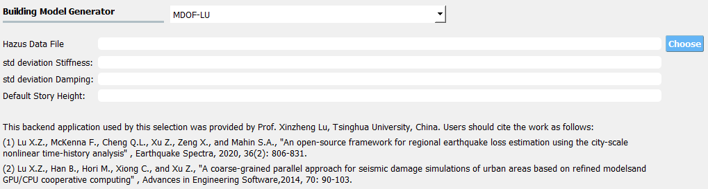
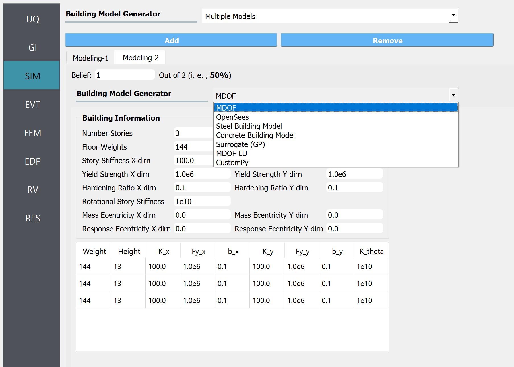

.. _SIM-user_manual:

=====================
SIM: Structural Model
=====================

The user here defines the structural system of the building. The structural system is the part of the building provided to resist the gravity loads and those loads arising from the natural hazard. There are a number of backend applications provided for this part of the workflow, each responsible for defining the structural analysis model. The user can select the application to use from the drop-down menu at the top of this panel. As the user switches between applications, the input panel changes to reflect the inputs each particular application requires. At present, there are a few backend applications available.

.. contents:: Table of Contents
   :local:
   :depth: 2
   :backlinks: none

.. _lblMDOFSIM:

Multiple Degrees of Freedom (MDOF)
----------------------------------

This panel is provided for users to quickly create simple shear models of a building. The panel, as shown in :numref:`fig-mdof` is divided into 3 frames:

#. The top left frame allows the user to specify the number of stories and properties that are constant for every floor and story in the building. The following properties are available: floor weight, story height, torsional stiffness, initial stiffness, yield strength, and hardening ratio for each direction in each story. The user has the option of specifying values for eccentricity of mass in :math:`x` and :math:`y` directions, and eccentricities for the location of the response quantities. Here, the one and two directions are orthogonal :math:`x` and :math:`y` axes in plan view.

#. The lower left frame allows the user to override the structural parameters above for individual floors and stories.

#. The frame on the right is a graphical widget showing the current building. When entering data into the lower left frame, the stories corresponding to the data being modified are highlighted in red.


.. _fig-mdof:

.. figure:: figures/mdof_general.png
   :align: center
   :figclass: align-center

   Multiple degrees of freedom (MDOF) building model generator.


Random variables can be created by the user if they enter a valid string instead of a number in the entry fields for any entry except for the *Number of floors*. The variable name entered will appear as a random variable in the **RV** panel; it is there that the user must specify the distribution associated with the random variable.

  
.. MDOF or Shear Building Model

..
   .. note::  
      ```Random Variables```: Random Variables can be created by the user if they enter a valid string instead of a number in the entry fields for any entry except for the *Number of floors*. The variable name entered will appear as a Random Variable in the **UQ** tab; it is there that the user must specify the distribution associated with the Random Variable.

.. _lblOpenSeesSIM:

OpenSees
--------

This panel is for users who have an existing OpenSees model of a building that performs a gravity analysis and now they wish to subject that building model to one of the **EVT** options provided. The input panel for this option is shown in :numref:`fig-figure3`. Users need to provide three pieces of information:

#. Main OpenSees Script: The main script that contains the building model. This script should build a model and perform any gravity analysis of the building that is required before the event is applied.

#. Response Nodes: A list of node numbers that define a column line of interest for which the responses will be determined. The column nodes should be in order from ground floor to roof. The :ref:`EDP<lblEDP>` workflow application uses this information to determine nodes at which displacement, acceleration, and story drifts are calculated.

#. An entry for the dimension of the model (i.e., 2D or 3D). This information is used when loads are applied.

#. Entry for the number of degrees of freedom at each node in the model.


.. _fig-figure3:

.. figure:: figures/openSees_gen.png
   :align: center
   :figclass: align-center
	
   OpenSees Model.


In OpenSees there is an option to set a variable to have a certain value using either the ``set`` or ``pset`` command, e.g ``pset a 5.0`` will set the variable a to have a value 5 in the OpenSees script. In |short tool id|, any variable found in the main script to be set using the ``pset`` command will be assumed to be a random variable. As such, when a new main script is loaded, all variables set with ``pset`` will appear as random variables in the **UQ** panel.


.. only:: EEUQ_app

   .. _lblAutoSDASIM:
		
   Steel Building Model (AutoSDA)
   ------------------------------

   This module provides a way for a user to create a nonlinear structural model of a moment-resisting steel-framed building. The AutoSDA computer program :cite:`guan2020python` is used for the seismic design and to generate the resulting two-dimensional structural model in OpenSees. AutoSDA automates the seismic design process and nonlinear structural model construction, generating code-conforming section sizes and detailing for beams, columns, and beam-column connections based on the user-specified input design parameters. The resulting nonlinear model is then subjected to the hazard option that is selected by the user in the **EVT** panel. The TCL files of the OpenSees model generated by AutoSDA are located in the individual work directories in the ``tmp.SimCenter`` folder that **EE-UQ** creates on the user's computer.

   The input panel for this module is shown in :numref:`fig-sda`. Users need to provide the following information:

   #. Building Information Inputs: The building information box describes the building geometry. The units for the building geometry parameters are in feet. Changing the building parameter values will update the building properties in the **GI** panel. Also, changing the number of building stories will add or subtract rows from the ``Member Depth`` and ``Loading`` tables below.
 
   #. Seismic Design Parameters: The seismic design parameters box contains the Equivalent Lateral Force (ELF) design parameters as specified by ASCE 7-10. AutoSDA employs these parameters in its automated seismic design procedures. Note that the values of these ELF parameters are site-specific, and can be obtained from the `SEAOC/OSHPD Seismic Design Maps Tool <https://seismicmaps.org>`_ or the `ATC Hazards by Location Tool <https://hazards.atcouncil.org>`_.

   #. Building Data Folder: The location of the building data folder is specified within this box. The building data folder should contain the following four CSV files that are required by AutoSDA: 1) Geometry.csv; 2) ELFParameters.csv; 3) MemberDepth.csv; and 4) Loads.csv. These files can be automatically created on the user's computer by clicking on the ``Save File`` button. The user will be prompted to select a folder whereafter the files will be saved. Alternatively, users have the option to upload their own CSV files by selecting a folder, and then clicking on the ``Load File`` button. Note that users are encouraged to backup their CSV files as **EE-UQ** will overwrite the existing files in the selected folder. Before running an analysis, users must save or load the corresponding CSV files so that AutoSDA can locate them. 

   #. Member Depth Table: This table lists the user-specified depths for the interior columns, exterior columns, and beams. Each row in the table corresponds to a building story. The first row corresponds to the first story, the second row to the second story, etc. As shown in :numref:`fig-sda`, the member depth values need to follow nomenclature from the AISC steel shapes database, e.g., W14, W24. If multiple depths are specified, the depths need to be separated by a comma, followed by a space. 

   #. Loading Table: This table contains the loading values for the floors, beams and columns. As in the ``Member Depth`` table, each row in this table corresponds to its own building story. In this table, there is an option to specify the loading values as random variables. This is done by entering a unique name tag for a random variable in lieu of a numerical value. For example, in any of the cells in the table, a user can enter the text ``SomeRV.`` The ``SomeRV`` random variable tag will then appear in the **UQ** panel, where the type of distribution, mean value, etc., can be specified. 

   .. warning::
      When employing the AutoSDA building model, the analysis may not converge with the default settings in the **FEM** tab. The user should change the convergence test in the **FEM** tab to be: EnergyIncr 1.0e-3 300

   .. note::
      If the CSV files in the building data folder are modified by hand, the top-most headings in the CSV files should not be changed. AutoSDA will not recognize the headings if they are altered, and thus the required data will not get imported. Moreover, the number of rows in the MemberDepth.csv and Loads.csv files needs to match the number of building stories in the Geometry.csv file.

   .. _fig-sda:

   .. figure:: figures/autoSDAUI.png
      :align: center
      :figclass: align-center
	
      Steel Building Model.
	
.. only:: EEUQ_app
  
   .. _lblRCFIAPSIM:
   
   Concrete Building Model (RC-FIAP)
   --------------------------------------

   This module provides a way for a user to create a nonlinear structural model of a reinforced concrete building. The RC-FIAP (Reinforced Concrete Frame Inelastic Analysis Platform) computer program generates a two-dimensional structural model that is employed in OpenSees. RC-FIAP automates the seismic design process and inelastic structural model construction based on user-provided input design parameters. The resulting nonlinear model is then subjected to the hazard option that is selected by the user in the **EVT** panel. The TCL files of the OpenSees model generated by RC-FIAP are located in the individual work directories in the ``tmp.SimCenter`` folder that **EE-UQ** creates on the user's computer.

   The input panel for this module is shown in :numref:`fig-EEUQRCFIAPSIM`. Users need to provide the following information:

   #. Column Section Dimensions: Where the user specifies the interior and exterior column dimensions, namely the width and depth in meters. 

   #. Beam Section Dimensions: Where the user specifies the width and depth of the beam sections. The beam section dimension units are in meters. 

   #. Frame Geometry: The frame geometry is defined as a vector of story heights and spans, in meters. Each height or span needs to be separated by a comma. That is, there are as many building stories as there are comma-separated heights. Note that changing the values of the stories and spans will update the building properties in the **GI** panel.
 
   #. ASCE 7-16 Seismic Design Parameters: The seismic design parameters box contains the design parameters as specified by ASCE 7-16. RC-FIAP employs these parameters in its automated seismic design procedures.

   #. Moment of Inertia Parameters: This is where the moment of inertia for elastic analyses is specified for both beams and columns. 

   #. Material Parameters: This is where the material model parameters are defined for the reinforcing steel, beam concrete compressive strength, and column concrete compressive strength. All values are in MPa. For each material parameter, there is an option to specify the values as random variables. This is done by entering a unique name tag for a random variable in lieu of a numerical value. For example, in any of the boxes, a user can enter the text ``SomeRV.`` The ``SomeRV`` random variable tag will then appear in the **UQ** panel, where the type of distribution, mean value, etc., can be specified. 

   #. Load Parameters: This is where the load values (in KPa) are given along with the tributary lengths (m) for gravity and seismic loading. For each loading parameter, there is an option to specify the values as random variables. This is done by entering a unique name tag for a random variable in lieu of a numerical value. For example, in any of the boxes, a user can enter the text ``SomeRV.`` The ``SomeRV`` random variable tag will then appear in the **UQ** panel, where the type of distribution, mean value, etc., can be specified. 

   #. Plastic Hinge Length: This is where the plastic hinge length is selected.  

   #. Regularization: Users can select whether they want to include regularization of the stress-strain curves. 


   .. _fig-EEUQRCFIAPSIM:

   .. figure:: figures/EEUQRCFIAPSIM.png
      :align: center
      :figclass: align-center
	
      Concrete Building Model.


.. only:: EEUQ_app 
   
   .. include:: FEM_EEUQ_surrogate.rst


.. _lblMDOFLUSIM:

MDOF-LU Building Model
----------------------

The **MDOF-LU** building modeling application creates a hysteretic, multi-degree of freedom (MDOF) model based on the Lu method. As seen in :numref:`fig-MDOFLUModelingPanel`, the following inputs are required:

.. _fig-MDOFLUModelingPanel:


   
   MDOF-LU Building model input panel.

* **Hazus Data File:** The path to a file that contains the ruleset that maps the design code-level & structural types to various structural parameters. :download:`Here <R2DTool/src/MDOF_Lu_HazusData.txt>` is an example file, where the columns are in the order of

    .. collapse:: Column names of HazusData.txt (click)

      .. csv-table:: Column names of HazusData.txt (showing the first 10 rows for high-code) 
         :file: R2DTool/src/MOD_Lu_HazusData_display.csv
         :header-rows: 1
         :align: center

  See :numref:`fig-MDOFLUModelingHys` for the parameter definitions. Note that not all the parameters are being used.

* **Std deviation Stiffness:** The standard deviation of lateral stiffness of the building model. The randomness will be applied by sampling a multiplication factor with the specified standard deviation and mean of 1. The factor is sampled only once per structure and will be applied to all stories.
* **Std deviation Damping:** The standard deviation of the damping ratio of the building model. The randomness will be applied by sampling a multiplication factor with the specified standard deviation and mean of 1. 
* **Default Story Height (optional):** Used to set the mass node coordinates.

Once the analysis is done, the estimated structural parameters are written in ``SAM.json`` and the corresponding opensees model is written in ``example.tcl`` (with  `uniaxialMaterial Hysteretic <https://opensees.berkeley.edu/wiki/index.php/Hysteretic_Material>`_ material model) for the downstream analysis. Both files can be found in the local working directory. 

    .. collapse:: Example of SAM.json (click)

      .. literalinclude:: R2DTool/src/MOD_Lu_SAM.json
          :language: json

    .. collapse:: Example of opensees.tcl (click)

      .. literalinclude:: R2DTool/src/MOD_Lu_example.tcl
          :language: tcl
          :emphasize-lines: 1,2,3,4,5,6,7,8,9,10,11

where the keys of ``SAM.json`` are defined as follows:

.. _fig-MDOFLUModelingHys:

.. figure:: R2DTool/figures/R2DMDOFLU_Hysteresis.png
   :align: center
   :figclass: align-center
   :width: 400

   MDOF-LU Building model.  

.. csv-table:: Structure parameters estimated from MDOF-Lu
   :file: R2DTool/src/MOD_SAM.csv
   :header-rows: 1
   :align: center
   :widths: 2, 1, 7
   \* `see here for details on unloading stiffness <https://portwooddigital.com/2022/04/17/hysteretic-damage-parameters/>`_

.. note:: When the **MDOF-LU** building modeling application is employed, the **OpenSees** simulation application should be used for analysis in the **ANA: Asset Analysis** input panel. 


.. [Lu2020] Lu, X., McKenna, F., Cheng, Q., Xu, Z., Zeng, X., & Mahin, S. A. (2020). An open-source framework for regional earthquake loss estimation using the city-scale nonlinear time history analysis. Earthquake Spectra, 36(2), 806-831.

.. only:: EEUQ_app

   .. _lblSSISIM:

   SSI Simulation (Custom 3D Building and Soil/Foundation Type 1)
   --------------------------------------------------------------

   This application enables full 3D soil–structure interaction (SSI) modeling entirely within **EE‑UQ**. It couples a user‑provided structural model ("Custom 3D Building") to a parametric soil/foundation system ("Soil & Foundation Type 1"). The SSI builder automates the creation of the soil domain, mat foundation, optional pile‑supported foundation head, and the building–foundation coupling—no manual constraint scripting is required.

   The interface consists of two tabs:

   - Building (Custom 3D Building)
   - Soil and Foundation (Type 1)

   Building (Custom 3D Building)
   ^^^^^^^^^^^^^^^^^^^^^^^^^^^^^^

   Provide the following:

   #. **Model file**: Main OpenSees TCL for the structure. Remove fixed‑base restraints at the base—SSI will couple the base to the soil/foundation.
   #. **Mesh file (optional)**: Optional geometry (e.g., VTK/HDF) for visualization.
   #. **Response Nodes**: Story‑level nodes (e.g., center‑of‑mass per floor), listed from base to roof. Used by the Standard Earthquake EDP option.
   #. **Bounds**: Structural footprint bounding box (x_min/x_max, y_min/y_max, z_min/z_max).
   #. **Columns base**: Table of base support nodes with their coordinates. Each row contains:

      - ``tag``: Structural node tag at the base of a column/line of support
      - ``x, y, z``: Coordinates (in meters)

      The SSI builder uses this information to place building–foundation connections, apply embedment, align the foundation head and piles to the building footprint, and enforce interface constraints consistently with the SSI mesh.

   Notes on random variables (RVs) and partitions:

   - Any TCL variable specified via ``pset`` in the model file is registered as a constant in **UQ**; use **RV** panel to define distributions when needed.
   - The **num_partitions** for the building is inferred from the widget settings; total cores per simulation sample will include partitions requested by the building and soil/foundation (see below).

   Soil and Foundation (Type 1)
   ^^^^^^^^^^^^^^^^^^^^^^^^^^^^^

   Define the SSI domain and interfaces:

   - **Soil**:

     - **Plan bounds**: ``x_min/x_max``, ``y_min/y_max``
     - **Discretization**: ``nx``, ``ny`` (number of soil elements in x/y)
     - **Gravity**: typically ``gravity_z = -9.81`` m/s²
     - **num_partitions**: MPI partitions for the soil mesh
     - **boundary_conditions**: ``periodic`` (laminar/perimeter input) or ``DRM``
     - **Soil profile table** (from bottom to top), each row includes:

       ``z_bot``, ``z_top``, ``nz``, ``material`` (e.g., Elastic), ``mat_props``
       (for Elastic: E, ν, ρ), ``damping`` (e.g., Frequency‑Rayleigh), ``damping_props`` (ζ, f_low, f_high)

     - When **DRM** is selected, additional **DRM options** are available:

       ``absorbing_layer_type`` (Rayleigh or PML), ``num_partitions``, ``number_of_layers``, ``Rayleigh_damping``, ``match_damping``.

     .. figure:: figures/SSIType1Soil.png
        :align: center
        :figclass: align-center
        :width: 800

        Soil settings in SSI Type 1 (plan bounds, mesh, soil profile, and DRM options).

   - **Foundation**:

     - **Block**: ``dx, dy, dz`` (mesh sizes), ``embedded`` (True/False), ``num_partitions``
     - **Column embedment**: ``column_embedment_depth`` and **column_section_props** (E, A, Iy, Iz, G, J) used to transmit forces at the building–foundation interface
     - **Foundation profile table**: bounds (x/y ranges and z_top/z_bot), material ``Elastic`` with ``mat_props`` = (E, ν, ρ), and ``damping`` with ``damping_props`` (ζ, f_low, f_high)

     .. figure:: figures/SSIType1Foundation.png
        :align: center
        :figclass: align-center
        :width: 800

        Foundation block and profile in SSI Type 1 (mesh sizes, embedment, section properties).

   - **Piles (optional)**:

     - **pile_profile table**: Supports "Grid" or "Single" layouts with geometry (x/y at top/bottom, z_top/z_bot, nz, radius r), ``section`` (No‑Section), ``material`` (Elastic), ``mat_props`` (E, A, Iy, Iz, G, J), and ``transformation`` (Linear/PDelta with a direction vector)
     - **pile_interface**: ``num_points_on_perimeter``, ``num_points_along_length``, ``penalty_parameter``

     .. figure:: figures/SSIType1Pile.png
        :align: center
        :figclass: align-center
        :width: 800

        Pile profile and interface discretization in SSI Type 1.

   Random variables in soil/foundation tables:

   - You may enter tokens like ``RV.vs1`` inside ``mat_props`` fields; the widget will auto‑register RV names found in the tables so you can set distributions in the **RV** panel.

   EDPs and results:

   - **Laminar/perimeter inputs**: Standard Earthquake EDPs are supported when the structure runs as a single partition. For multi‑partition runs or custom outputs, use **User‑Defined EDP** and provide your own recorders.
   - **DRM inputs**: Use **User‑Defined EDP** with recorders (e.g., a ``recorders.tcl``) to extract structural and/or soil responses while using boundary conditions.

   Planning resources (cores per sample):

   - A practical rule of thumb is:

     ``cores_per_sample ≈ Building.num_partitions + Soil.num_partitions + Foundation.num_partitions``

     and when using DRM, add ``+ DRM.num_partitions`` from the DRM options. Match your DesignSafe job size (nodes × cores per node) to the desired number of concurrent samples times ``cores_per_sample``.

   Plot button and browser viewer
   ^^^^^^^^^^^^^^^^^^^^^^^^^^^^^^

   Clicking **Plot** in the SSI Simulation panel exports the current SSI modeling JSON and launches a lightweight, browser‑based 3D viewer (PyVista + trame) that helps you verify geometry and settings before you run on DesignSafe. The viewer (see below) supports:

   - Scene presets:
     - **Quick Plot**: fast boxes/cylinders for soil layers, foundation blocks, and piles
     - **Discretize** (one‑time): builds the actual meshes from your inputs and caches them in memory
     - **Actual Plot**: renders the cached actual meshes, with optional scalar coloring
     - **Reset Camera** and **Clear All** utilities
   - Visibility and opacity:
     - Toggle on/off soil, foundation, piles, and (optional) building mesh overlay
     - Adjust opacity sliders for each component
   - Scalar coloring:
     - Choose among available fields (e.g., Core/Region/ElementTag/MaterialTag) for the discretized view
   - Camera & helpers:
     - One‑click views (isometric, XY, XZ, YZ)
     - Axes and grid toggles

   .. figure:: figures/SSI_ploter.png
      :align: center
      :figclass: align-center
      :width: 900

      SSI Plotter launched from the Plot button (browser‑based).

   Notes:
   - If a building **mesh file** is provided in the Building tab, it will be overlaid for footprint checks and alignment with the soil/foundation.
   - The viewer runs locally and is meant for inspection; it does not replace post‑processing of full simulation results.


   Using the tables and help panel
   ^^^^^^^^^^^^^^^^^^^^^^^^^^^^^^^

   - Table controls: each table (soil profile, foundation profile, pile profile) offers **Add row**, **Remove**, and **Clear** buttons below the grid. Click a cell to edit values; combo boxes are provided for categorical fields (e.g., ``material``, ``damping``, ``type``, ``section``, and ``transformation``).
   - RV tokens: in numeric list fields like ``mat_props`` and ``damping_props``, you may enter comma‑separated values; any token that starts with ``RV.`` (e.g., ``RV.vs1``) is auto‑registered as a random variable for later specification in the **RV** panel.
   - Validation: the **Validate** button checks common issues (e.g., x/y bounds ordering, positive nz, required rows present, correct material/damping selections, pile parameter counts). Any issues are reported in a dialog so they can be corrected before submission.
   - Help panel: a contextual help panel on the right summarizes field meanings and provides tips for each tab (Soil, Foundation, Piles). Use it as a quick reference while filling the tables.

   .. figure:: figures/SSI_Building.png
      :align: center
      :figclass: align-center
      :width: 800

      Custom 3D Building tab (model file, response nodes, footprint bounds, and base column nodes).


.. only:: EEUQ_app
   
   .. _lblFemoraSIM:

   Femora (Building Model Generator)
   ----------------------------------

   The **Femora** SIM option lets you use a Femora‑based model generator as your structural model source in EE‑UQ. This is a compact panel for pointing to a Femora model file and specifying the key runtime parameters that the workflow needs. It integrates with the EE‑UQ workflow (and DesignSafe) to run multi‑core OpenSees analyses, as demonstrated in EE‑UQ Example 12.

   Inputs (see figure below):

   #. **Model File**: Femora model file (``*.py``, ``*.json``, or ``*.femora``) to load. Use "Browse" to select the file.
   #. **Number of Cores**: Total cores used per simulation sample for the structural analysis. Choose this to match your DesignSafe resource request.
   #. **Response Nodes**: Comma/space/semicolon‑separated list of node tags from base to roof. These are used for response extraction (e.g., PFAs, PFDs, PIDs) when Standard Earthquake EDPs are applied.
   #. **Spatial Dimension (ndm)**: Typically 3 for 3D models.
   #. **DOF at Nodes (ndf)**: Typical 3 for solid/translation‑only models or 6 for frame elements. Match your model.
   #. **Damping Ratio**: Optional global damping ratio. Check "Use Damping" to enable entry. The value is exposed to the workflow for compatible solvers.
   #. **Add Random Variable**: Adds a new random variable entry (each entry is an RV name). All RVs are exported and can be assigned distributions in the **RV** panel. The Femora model can use these RVs for parameters.

   .. figure:: figures/Femora_input.png
      :align: center
      :figclass: align-center
      :width: 800

      Femora SIM input panel in EE‑UQ.

   Behavior and outputs:

   - Clicking **Run** (locally) or **Run at DesignSafe** uses the specified core count per sample. Plan your DesignSafe job accordingly (nodes × cores per node ≥ concurrent_samples × numCores).
   - The Femora SIM serializes to JSON as ``type = FemoraInput`` with the fields shown above; the workflow backend uses these entries to launch the analysis and collect EDPs.
   - Response nodes are also mirrored into ``centroidNodes`` for compatibility with standard EDP extraction.
   - Random variables added here are exported as name/value pairs (``RV.<name>``) so you can set distributions and sampling in the **RV** panel.


.. _lblMultipleModelsSIM:

Multiple Models
---------------

The **Multiple Models** structural modeling application allows users to define multiple structural models for use in their analysis. The Add and Remove buttons allow users to control the number of models they want to use in the analysis. 

By adding a model, a new tab is created in the SIM panel where users can choose one of the structural modeling applications described in the sections above and provide the inputs necessary to create the model. Users also need to specify their belief about the credibility of the model in the tab corresponding to that model. The beliefs are expressed as non-negative numerical values. The belief value for each model is defined relative to the other models, and the beliefs do not need to sum to 1.



   Selecting a structural modeling application within a Multiple Models SIM Application


.. Note:: 

   If a Multiple Models application is selected, at least 2 models must be defined.

.. Note:: 

   If the "Multi-fidelity Monte Carlo (MFMC)" option was selected in the UQ tab, the belief values will be ignored. The premise of MFMC is that the high-fidelity model response *always* provides the best response, therefore, the conception of *belief* does not apply.

.. .. bibliography:: ../../../../references.bib

