.. _lblSimCenterUQPLoM:

Probabilistic Learning on Manifolds (PLoM)
*******************************************

About PLoM
^^^^^^^^^^^^

**PLoM** is an open source python package that implements the algorithm of **Probabilistic 
Learning on Manifolds** with and without constraints ([SoizeGhanem2016]_, [SoizeGhanem2020]_) 
for *generating realizations of a random vector in a finite Euclidean space that are 
statistically consistent with a given dataset of that vector*. 

PLoM functionality in SimCenter tools is built upon `PLoM <https://github.com/sanjayg0/PLoM>`_ 
package (available under MIT license), an opensource python package for Probabilistic 
Learning on Manifolds [ZhongGualGovindjee2021]_. The package mainly consists of python 
modules and invokes a dynamic library for more efficiently computing the gradient of 
the potential, and can be imported and run on Linux, macOS, and Windows platform. 

Basic Model
^^^^^^^^^^^^^^

The ``PLoM Model`` is a SimCenterUQ method to learn data structure and generate new 
realizations from a training dataset. It can be used for data sampling, dimension reduction, 
and surrogate modeling. Currently, there are two training data options: ``Import Data File`` 
and ``Sampling and Simulation``.

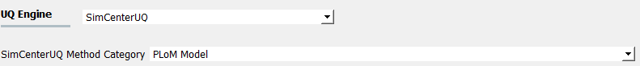

   SimCenterUQ method: PLoM Model

Option 1: Import Data File
----------------------------

Under ``Import Data File`` option, UQ Engine expects users to directly provide the 
training data matrices. For instance, users can upload tabulated data files for input variables 
and corresponding output responses, by using the ``Raw Data`` mode.

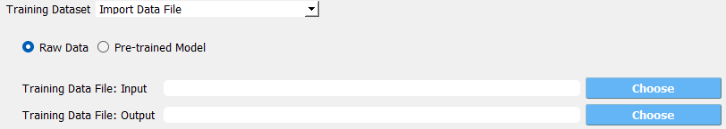

   User-provided raw data files for training dataset

``New Sample Number Ratio`` is an integer defining the ratio of new realization size and the input 
sample size. For instance, if the input file includes 100 data points, using a ``New Sample Number Ratio`` 
of 5 would produce 500 new realizations. In addition, if ``New Sample Number Ratio`` is set to zero, 
then no new sample will be generate, however, the trained model can be saved.

   User-provided pre-trained model

The alternative mode to ``Raw Data`` is ``Pre-trained Model`` which allows users to upload 
the saved pre-trained model.

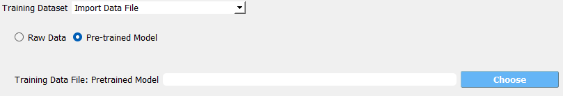

   User-provided pre-trained model

Option 2: Sampling and Simulation
----------------------------------

Under ``Sampling and Simulation`` option, UQ Engine will first invokes **FEM** applications 
(e.g., OpenSees) to run numerical simulations and generate the needed training dataset. So, 
instead of directly providing the training data, users are responsible for configuring the 
simulation model and anlaysis.

.. figure:: figures/plomSimulation.png
   :align: center
   :figclass: align-center
   :width: 300

   User-provided pre-trained model

Advanced Options
^^^^^^^^^^^^^^^^^^

Advanced users are able to configure more modeling parameters by checking
``Advanced Options`` checkbox.

General
---------------

* **Log-space Transform**: apply logrithmic transformation to the data metrix
* **Random Seed**: enable replicating analysis
* **PCA Tolerance**: truncating eigen value model representation from principal component analysis

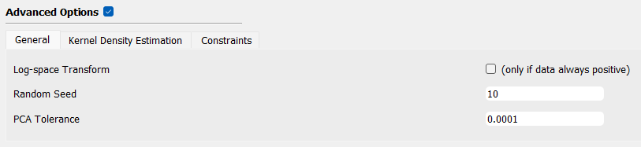

   PLoM advanced option: General

Kernel Density Estimation
--------------------------

* **KDE Smooth Factor**: smooth factor in kernel density base function
* **Diffusion Maps**: whether invokes diffusion maps
* **Diff. Maps Tolerance**: truncating ratio between the last considered eignevalue and the first eigenvalue

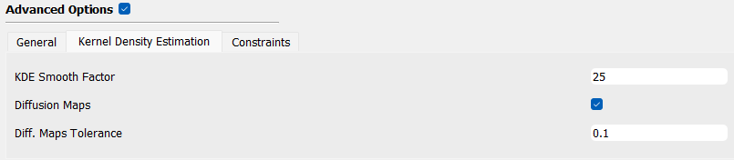

   PLoM advanced option: Kernel Density Estimation

Constraints
--------------------------

* **Add constraints**: whether applies constraints to the model
* **Constraints file (.py)**: constraint file path
* **Iteration Number**: maixmum number of iterations 
* **Iteration Tolerance**: maximum tolerance in iteration

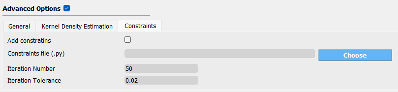

   PLoM advanced option: Constraints

User-Defined Variables
--------------------------

* **None**: no extra variables except for those defined in **RV** and **EDP** panel to be considered
* **User-Defined**: users can upload a script for computing the extra variables in the analysis
* **Ground Motion Intensity**: for earthquake simulation, user can add various intensity measures as extra variables, 
                               for instance, Peak Ground Acceleration, Pseudo Spectral Acceleration at multiple periods

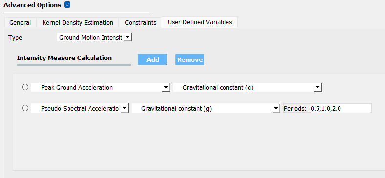

   PLoM advanced option: User-Defined Variables

Results and Postprocess
^^^^^^^^^^^^^^^^^^^^^^^^

Once the training completed, two plots will be generated in **RES** panel for the PLoM training results:

* **PCA**: plots the curve of PCA representation error versus the PCA eigenvalues overlapped by the truncating PCA eigenvalue used in training.
* **KDE**: plots the curve of diffusion map eigenvalue by components overlapped by the truncating eigenvalue used in training

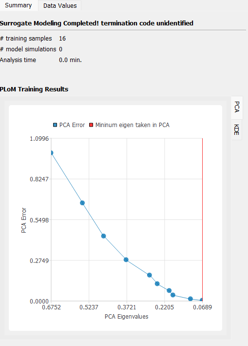

   PLoM training result plots: PCA

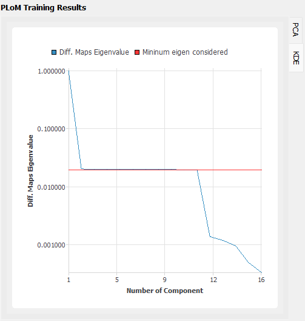

   PLoM training result plots: KDE

Users can also save the trained PLoM model by clicking on the ``Save PLoM Model`` at the bottom of the **RES** Summary page.
The training data and model information will be saved as a .h5 data file to a user-defined directory, which can be 
loaded back for generating extra samples in the future (as described previously).

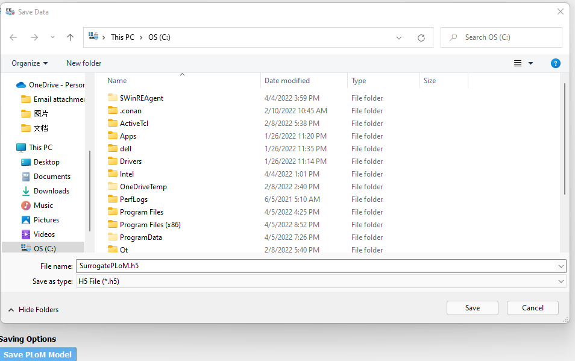

   Save PLoM model

The training data / new sample points can be visualized under the ``Data Values`` tab, and saved to a 
user-defined directory by clicking ``Save Table`` or ``Save Column Seperately`` buttom on the top right corner.

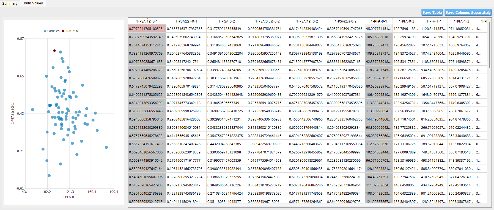

   Visualization of PLoM results

.. [SoizeGhanem2016]
    Soize, C., & Ghanem, R. (2016). Data-driven probability concentration and sampling on manifold. Journal of Computational Physics, 321, 242-258.

.. [SoizeGhanem2020]
    Soize, C., & Ghanem, R. (2020). Physics‐constrained non‐Gaussian probabilistic learning on manifolds. International Journal for Numerical Methods in Engineering, 121(1), 110-145.

.. [ZhongGualGovindjee2021] 
    Zhong, K., Gual, J., and Govindjee, S., PLoM python package v1.0, https://github.com/sanjayg0/PLoM (2021).