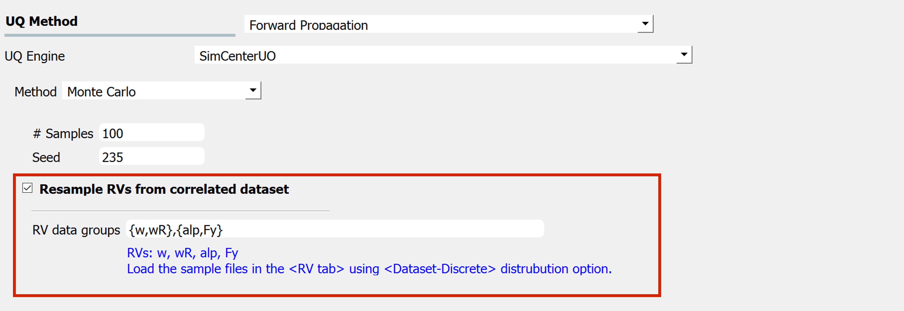
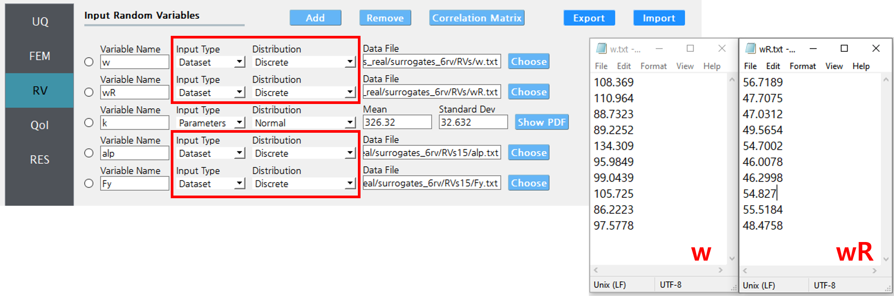
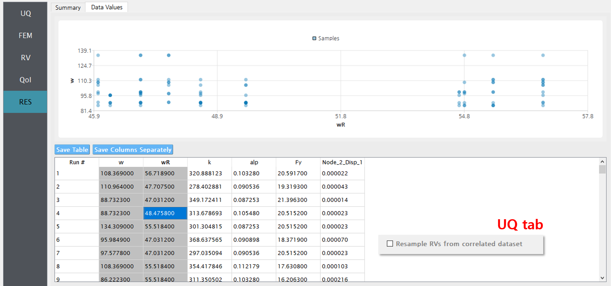

.. _lblSimSurrogate:

Forward Propagation Methods
***************************

The forward propagation provides a probabilistic understanding of output variables by producing sample realizations and statistical moments (mean, standard deviation, skewness, and kurtosis). Currently, only the Monte Carlo Sampling (MCS) method is available in the SimCenterUQ engine and the other sampling methods (Latin hypercube sampling, Surrogate model-based efficient sampling) are available in the Dakota engine.

.. _figSimSamp3:

  	Click check box to import correlated datasets

The forward propagation in the SimCenterUQ engine additionally takes correlated data samples by allowing users to link the RVs samples (:numref:`figSimSamp3`), i.e. datasets from different RVs with same sample size :math:`N` can be considered as an ordered list or :math:`N` **tuples**. During the random generation, the tuple's index will be uniformly resampled
 
* **with** replacement if :math:`N \leq` size of the random samples
* **without** replacement if :math:`N >` size of the random samples

The tuples are imported in the RV tab, through ``parameters``-``discrete`` option of the drop down menu. The RVs inside each group should be provided with the same length of the samples (e.g. in :numref:`figSimSamp3`, :math:`w` and :math:`wR` should have the same sample size :math:`N_1` and :math:`alp` and :math:`F_y` should have the same sample size :math:`N_2`)

.. _figSimSamp4:

  	Example RV tab. RVs :math:`w` and :math:`wR` have the same sample size when they are specified to be coupled as shown in :numref:`figSimSamp3`.

.. note::
	Any correlation values for **the coupled datasets** additionally specified in the RV tab will be ignored.

For example, consider the case where two variables :math:`w` and :math:`wR` are provided as 10 discrete data points in RV tab as in :numref:`figSimSamp4`. Below is the an example 100 realization the two variables when they are considered to be *independent*, i.e. without checking the "Resample RVs from correlated dataset" option.

.. _figSimSamp1:

  	Example of correlated samples (when "Resample ..." option in the UQ tab is enabled).

On the other hand, if the two random variable data files are considered to be tuples, i.e. if "Resample RVs from correlated dataset" are checked and the group {w,wR} is reported in the below field as shown in :numref:`figSimSamp3`, 100 realization pairs of the RVs will be stacked on top of the provided 10 dataset.

.. _figSimSamp2:

.. figure:: figures/SimUQ_sampling1.png
	:align: center
	:figclass: align-center
	:width: 1200

  	Example of uncorrelated samples (when "Resample ..." option in the UQ tab is enabled).

This feature is especially useful when the user wants to perform a forward UQ analysis directly using the posterior samples obtained from Markov Chain Monte Carlo or other Bayesian sampling approaches. 
