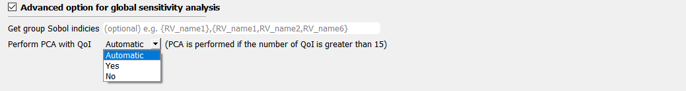

.. _lblSimSensitivity:

Global Sensitivity Analysis
**********************************************

Global sensitivity analysis is used to quantify contribution of each input variable to the uncertainty in the quantities of interest (QoI). Using the global sensitivity indices, users can set preferences between random variables considering both inherent randomness and its propagation through the model. Global sensitivity analysis helps users to understand the overall impact of different sources of uncertainties and their intersections, as well as to accelerate UQ computations by focusing on dominant dimensions or screening out trivial input variables. This can also be useful identifying the input variables for which extra experimentation/research may be useful in reducing the uncertainty in the initial specification.

**Sobol indices** are widely used variance-based global sensitivity measures which has two types: main effect and total effect sensitivity indices. The **main effect index** quantifies the fraction of variance in QoI that can be attributed to specific input random variable(s) but without considering interaction effect with other input variables. The **total effect index**, on the other hand, additionally takes the interactions into account. **Please read** :ref:`HERE<lbluqSimTechnical>` **for more details on the equations and implemented algorithms**.

Algorithm
^^^^^^^^^^^^

In the SimCenterUQ engine, sensitivity indices are estimated by **Gaussian mixture model-based probability distribution approximation** method presented in Hu and Mahadevan (2019) [Hu19]_. To run this sensitivity analysis, the user has to specify the number of samples and a random seed. The method can handle correlated random variables as well.

.. note::

   - When a constant variable is defined, the sensitivity analysis algorithm will ignore the variable.
   - If "NaN" is written in the FEM output script (`results.out`) instead of a number SimCenterUQ engine will exclude this samples from the sensitivity analysis. This may be useful when one wants to get 'conditional' sensitivity indices, i.e. conditional to non-NaN cases.

Sample Generation
^^^^^^^^^^^^^^^^^^^^^^^^^^^

Performing sensitivity analysis requires Monte Calro Samples. This can be either generated by quoFEM or imported from  separate data files.

	* **Monte Carlo**: |app| will randomly generate the samples of RVs, evaluate model to get the samples of QoIs, and perform sensitivity analysis

		.. _figSimSensitivity:

		.. figure:: figures/SimCenterUQ/Sensitivity1.png
			:align: center
			:figclass: align-center
			:width: 1200

		  	Sensitivity analysis input panel (MCS).

		- Two input parameters need to be specified: (1) the number of samples of the output to be produced, which is equal to the number of times the model is evaluated, and (2) the seed for the pseudo-random number generator.
		- **Resample RVs from correlated dataset** is explaned :ref:`HERE<lblSimForward>` 

	* **Import Data Files**: |app| will directly import sample pairs of RVs-QoIs and perform sensitivity analysis.

		.. _figSimSensitivity1_data:

		.. figure:: figures/SimCenterUQ/Sensitivity1_data.png
			:align: center
			:figclass: align-center
			:width: 1200

		  	Sensitivity analysis input panel (Import Dataset).
		- The directory to input and output dataset needs to be provided. The dataset can either be comma/tab-separated file, or binary file.

		- **Comma or tab separated file (.csv or .txt)**

			* Each text file is a numeric table with the columns separated by a tab, space, or comma. Multiple headers can be presented following the symbol %. 
			* The number of rows corresponds to the number of training data samples.
			* Train Points (Input): The number of columns should match the number of RVs presented in the **RV tab** and also match with required inputs of the simulation model provided in the **FEM tab**. **The order of the columns should match thoses of the random variables presented in the RV tab**
			* System Responses (Output): The number of columns and the order of columns should match the QoI quantities presented in **QoI tab**.
			* Both files need to be provided, and the number of columns for the two files should be the same.
			* See :numref:`figSim4` for example input data sheets.

			.. _figSim4:

			.. figure:: figures/Surrogate4_SimUQ.jpg
			   :align: center
			   :figclass: align-center
			   :width: 800

			   Example of data input files

		- **Binary (.bin)**: |app| accepts binary **floating-point** numeric matrix in a **row major order**. Below is an example Matlab script that can be used to create proper binary input files from [number of samples] x [input or output dimension] matlab matrix

			.. literalinclude:: figures/SimCenterUQ/matlab_dat_to_bin.m
			   :language: matlab
			   :caption: Creating binary dataset (row-major, float point) using Matlab

Group-wise Sobol Indices
^^^^^^^^^^^^^^^^^^^^^^^^^^^

By default, the analysis results are first-order sensitivity indices of each random variable. In order to also account for the higher-order interaction effect, the user may activate the option to specify advanced outputs at the bottom of the **QoI** tab. Using this option, the user can manually provide groups of relevant random variables to get so-called group-wise Sobol indices.

.. _figSimSensitivity2:

  	Group-wise Sobol indicies
	
The group-wise Sobol indices are useful when the user wants to obtain a sensitivity measure corresponding to a categorical group of input variables, for example, to compare the relative sensitivity between structural parameters and excitation parameters. In particular, when there are non-causal correlations between some random variables or when the user expects interactive contributions of the random variables that are in nature inseparable, one can introduce the group index. The group-wise Sobol index for joint variables :math:`x_i` and :math:`x_j` is defined as

.. math::
	:label: GroupSij

	S_{ij}^G=\frac{\text{Var}_{x_i,x_j}[\text{E}_{\boldsymbol{x}\sim ij}[y|x_i,x_j]]}{\text{Var}[y]},  \qquad  i,j=1, \cdots ,d

In order to associate more input variables, the set {:math:`x_i,x_j`} can be simply replaced by a larger set, e.g. {:math:`x_i,x_j,x_k`}. Results of Eq. :eq:`GroupSij` can be post-processed to obtain higher-order Sobol indices presented in Eq. :eq:`Sij`, i.e. it is obtained by subtracting the lower-order interaction terms from the group index. 

.. note::

   - When multiple outputs are considered, global sensitivity analysis is performed separately for each QoI, but the base Monte Carlo samples are can be re-used for different QoIs. 
   - When random variables defined in **RV** tab is not exhaustive, i.e. if the model contains *unexplained* randomness, total Sobol index value may be underestimated by omitting the interaction with the missing variables.

Principal Component Analysis (PCA) with QoI
^^^^^^^^^^^^^^^^^^^^^^^^^^^^^^^^^^^^^^^^^^^^

When the number of the quantity of interests (QoI) exceeds 15, quoFEM, by default, performs **principal component analysis and probability model-based global sensitivity analysis (PCA-PSA)**. The user can otherwise manually specify the option by selecting either ``Yes`` or ``No``. If ``Yes`` is selected, the user can also provide the ``potion of variance explained`` in range of 0 and 1.0. As this value gets close to 1, the accuracy of the approximation improves while the computational demand also increases. Note that when 1.0 is selected, dimension will not be reduced. The default value is 0.99. We do not recommend using a value lower than 0.99 unless the user thoroughly understands its consequence.

.. _figSimSensitivity4:

  	Principal Component Analysis

Results Display
^^^^^^^^^^^^^^^^^^^^^^^^^^^

The main and total effect indices are displayed for each random variable (or group of random variables if the user specifies the group in the UQ tab) and quantity of interest (QoI) pair.

.. _figSimSensitivity4:

.. figure:: figures/SimCenterUQ/Sensitivity4.png
	:align: center
	:figclass: align-center
	:width: 1200

  	Results from :ref:`an example<qfem-0009>`

Only when the quantities of interest (QoI) are defined as a **field variable**, i.e. by setting a length greater than 1 in the EDP tab, the aggregated sensitivity indices will also be displayed. 

.. _figSimSensitivity4:

.. figure:: figures/SimCenterUQ/Sensitivity5.png
	:align: center
	:figclass: align-center
	:width: 1200

  	Aggregated results from :ref:`an example<qfem-0023>`

.. [Hu19]
   Hu, Z. and Mahadevan, S. (2019). Probability models for data-driven global sensitivity analysis. *Reliability Engineering & System Safety*, 187, 40-57.

