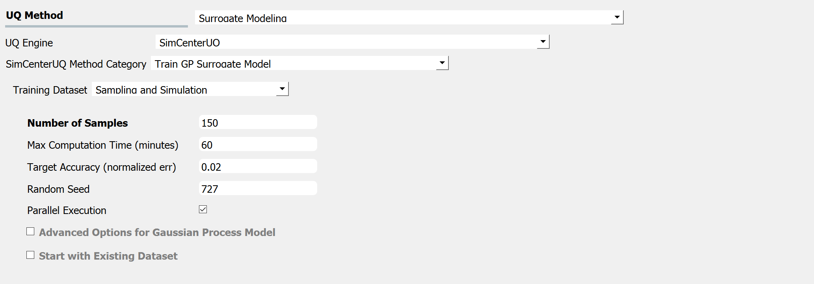
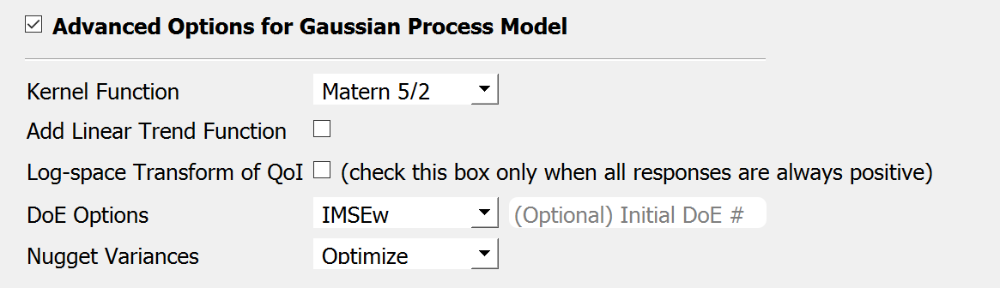
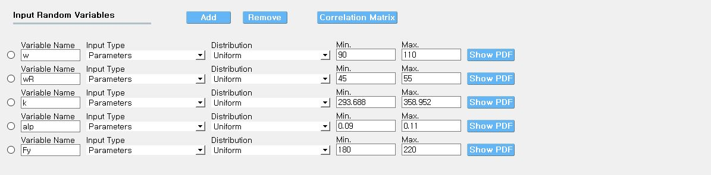
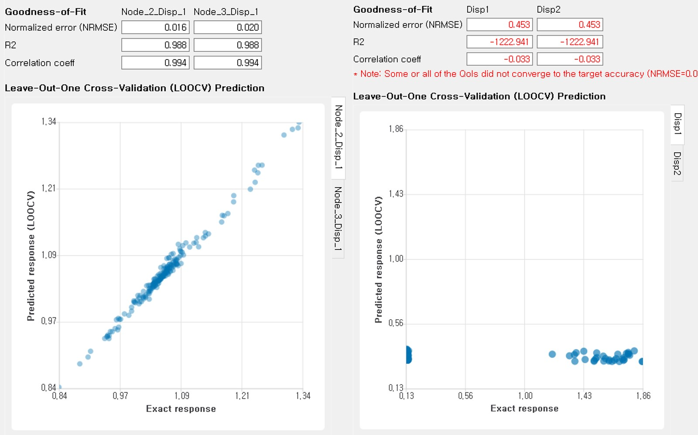
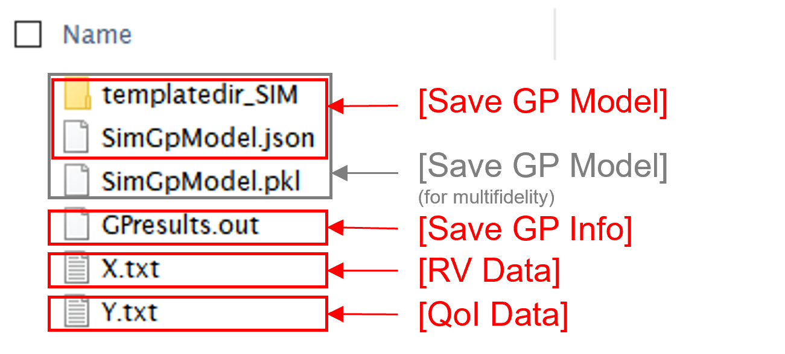

.. _lblSimSurrogate:
.. role:: blue

Gaussian Process (GP) Surrogate Modeling
******************************************

.. Note:: 
     Surrogate modeling functionality of |short tool id| is built upon `GPy <https://sheffieldml.github.io/GPy/>`_ library (available under BSD 3-clause license), an opensource Python framework for Gaussian process modeling developed in the Sheffield machine learning group. 

.. only:: quoFEM_app

    The ``Train GP Surrogate Model`` module is used to construct a Gaussian process (GP) based **surrogate model** that substitutes expensive computational **simulation models** or physical experiments. Consider a simulation model, with input random variables (or parameters) :math:`\boldsymbol{x}` and output quantity of interests, denoted as :math:`\boldsymbol{y}=f(\boldsymbol{x})`. A surrogate model for the corresponding simulation model can be built by different user-provided information types (RV-random variables, QoI-quantities of interest):

    .. list-table:: User-provided information types      
       :widths: 3 10 10
       :header-rows: 1

       * -  
         - RV (model input :math:`\boldsymbol{x}`)
         - QoI (model response :math:`\boldsymbol{y}`)
       * - **Case1**
         - bounds of random variables :math:`\boldsymbol{x}`
         - simulation model: :math:`\boldsymbol{y}=f(\boldsymbol{x})` 
       * - **Case2**  
         - dataset: :math:`\{\boldsymbol{x^{(1)},x^{(2)}, ... ,x^{(N)}}\}`
         - simulation model: :math:`\boldsymbol{y}=f(\boldsymbol{x})` 
       * - **Case3**  
         - dataset: :math:`\{\boldsymbol{x^{(1)},x^{(2)}, ... ,x^{(N)}}\}`
         - dataset: :math:`\{\boldsymbol{y^{(1)},y^{(2)}, ... ,y^{(N)}}\}`

    **Case 1 (Sampling and Simulation)**: The user provides lower and upper bounds of each random variable (RV) and a simulation model. |short tool id| will find the best training points sequentially by the adaptive **design of experiments** (DoE) strategies until the model converges or reaches a user-specified computational tolerance. 

    **Case 2 (Import RV Dataset and run Simulation)**: The user provides a sample population of RVs as a separate text file. |short tool id| will run simulations to get QoI values and build a surrogate model. 

    **Case 3 (Import both RV and QoI Dataset)**: The user provides a sample population of RVs and QoIs. |short tool id| will not run any simulations and build a surrogate model purely based on the provided dataset.

    .. list-table:: |short tool id| workflow (DoE: Design of experiments)      
       :widths: 2 5 5 5
       :header-rows: 1
       :align: center

       * -  
         - Sampling (Adaptive DoE) 
         - Model simulation   
         - Surrogate Construction   
       * - **Case1**
         - O
         - O
         - O
       * - **Case2**  
         - X
         - O
         - O
       * - **Case3**  
         - X
         - X
         - O

    **The trained surrogate model can be saved in a portable file (.json format) and later imported** in place of the original simulation model for UQ analysis or optimization purposes. See user guide section 2.3.5 for how to import the surrogate model in |short tool id|.

.. only:: EEUQ_app

    The ``Train GP Surrogate Model`` module is used to construct a Gaussian process (GP) based **surrogate model** that substitutes expensive computational **simulation models**. The challenge of surrogate modeling in earthquake engineering arrives from the stochasticity in the ground motion time history and corresponding stochastic output. 

    .. _figSimEE1:

    .. figure:: figures/SimCenterUQ/Surrogate_EEUQ1.png
       :align: center
       :figclass: align-center
       :width: 1000

       Surrogate Modeling in EE-UQ

    * **Output of surrogate model**: Following the performance-based earthquake engineering practice, the response estimation module in SimCenter workflow concerns only the peak responses (e.g. peak acceleration, peak drift ratio at each floor) rather than the whole time history. Therefore, the surrogate modeling algorithms in this tool are designed to predict the non-time history responses.

    * **Input of surrogate model**: To keep the input dimension of the surrogate model to a reasonable scale, the ground motion time history is first parameterized in the algorithm into several key features. This can be, for example, the source properties (e.g. M, R) or time/frequency domain excitation property at the site of interest (e.g. intensity measures) ([Kyprioti2021]_, [Zhong2023]_).

    The surrogate prediction of EDP given the ground motion parameters typically inherits significant randomness, as the amount of information provided by these parameters is not sufficient to determine the exact model peak response. Therefore, the key task in surrogate modeling is to capture the remaining amount of uncertainty in the EDP predictions, as shown in the above figure.

    **The trained surrogate model can be saved in a portable file (.json format) and later imported** in place of the original simulation model for UQ analysis or optimization purposes. See user guide :ref:`section 2.2.5 <SIM-user_manual-EEUQsur>` for how to import the surrogate model in |short tool id|.

    .. [Kyprioti2021]
       Kyprioti, A. P., & Taflanidis, A. A. (2021). "Kriging metamodeling for seismic response distribution estimation". *Earthquake Engineering & Structural Dynamics*, 50(13), 3550-3576.

    .. [Zhong2023]
       Zhong, K., Navarro, J.G., Govindjee, S., and Deierlein, G.G. (2023). "Surrogate Modeling of Structural Seismic Response Using Probabilistic Learning on Manifolds," *Earthquake Engineering & Structural Dynamics*, 1-22,  https://doi.org/10.1002/eqe.3839

Input description
^^^^^^^^^^^^^^^^^

Case 1: Sampling and Simulation
--------------------------------

.. only:: EEUQ_app

    .. Note::
        Another SimCenter tool named `quoFEM <https://simcenter.designsafe-ci.org/research-tools/quofem-application/>`_ also supports surrogate modeling capability that shares the same algorithm with EE-UQ. However, quoFEM is targeted at more general applications not restricted to earthquake problems. quoFEM additionally supports different user-provided information types, allowing users to directly (i) Import an RV Dataset and run the Simulation (Case 2), or (ii) Import both RV and EDP Datasets (Case 3). Currently, in EE-UQ, we only support the Sampling and simulation option (Case 1).

When the **Training Dataset** option is set to the ``Sampling and Simulation``, a simulation model should be presented in the later tabs. The training points are sampled adaptively by the design of experiments.

.. _figSim1:

   Input panel for surrogate modeling

* **Maximum Number of Model Runs**: When the number of simulation runs reaches the limit, the analysis will be terminated.
* **Maximum Computation Time (in minutes)**: When the tolerance limit of the computation time is reached, the analysis will be terminated. There will be a few minutes of error.
* **Target Accuracy (Normalized Error)**: The target accuracy is defined in terms of normalized root-mean-squared error (NRMSE) estimated by leave-out-one cross-validation (LOOCV).

    .. math::
        :label: NRMSE

        \begin{align*}
            \rm{NRMSE} ~ &= \frac{\sqrt{\frac{1}{N} \sum^{N}_{k=1} (y_k-\hat{y}_k)^2}}{\max_{k=1,...,N}(y_k)-\min_{k=1,...,N}(y_k)}
        \end{align*}    

   |   where 
   |      :math:`y_k`: exact response from the model simulation
   |      :math:`\hat{y}_k`: estimated response by LOOCV surrogate model prediction
   |      :math:`N`: number of samples used to train the surrogate model

* **Random Seed**: Seed of the random number generator
* **Parallel execution**: This engine implemented multiprocessing (local) or mpi4py (remote) python packages to run parallel execution.
Note that the results from the parallel and serial run may not be exactly the same because parallel execution sets the number of batch design of experiments (DoE) in order to maximize the use of resources (Default DoE interval: 5). User can also activate the following advanced options:

:blue:`Advanced Options for Gaussian Process Model`

.. _figSim2:

   Sampling and Simulation - Case 1

.. only:: quoFEM_app

    * **Kernel function**: Correlation function for Gaussian process regression. Matern5/2 function is the default, and Matern3/2, Radial Basis, and Exponential functions (exponent :math:`\gamma=1`) are additionally supported. (For details, please refer to `chapter 4 <http://gaussianprocess.org/gpml/chapters/RW4.pdf>`_ of the book Gaussian Processes for Machine Learning)
    * **Add Linear Trend Function**: When an increasing or decreasing trend is expected over the variables' domain, a linear trend function may be introduced. The default is unchecked, i.e. no trend function.
    * **Log-space Transform of QoI**: When the user can guarantee that the response quantities are always greater than 0, the user may want to introduce a surrogate model in the log-transformed space of the QoI. The default is unchecked, i.e. the original physical coordinates.
    * **Design of Experiments options**: The user may manually select the design of experiments (DoE) method and the number of the initial DoE. The default is "none" and the default number of DoE is 4 times the number of random variables.
    * **Nugget Variances**: The user may define nugget variances or bounds of the nugget variances if needed. The default is "optimize". See the subsection titled 'Heteroscedastic Gaussian Process' to learn more about this feature.

.. only:: EEUQ_app

    * **Kernel function**: Correlation function for Gaussian process regression. Matern5/2 function is the default, and Matern3/2, Radial Basis, and Exponential functions (exponent :math:`\gamma=1`) are additionally supported. (For details, please refer to `chapter 4 <http://gaussianprocess.org/gpml/chapters/RW4.pdf>`_ of the book Gaussian Processes for Machine Learning)
    * **Add Linear Trend Function**: When an increasing or decreasing trend is expected over the variables domain, a linear trend function may be introduced. The default is checked.
    * **Log-space Transform of QoI**: When the user can guarantee that the response quantities are always greater than 0, the user may want to introduce a surrogate model in the log-transformed space of QoI. The default is checked.
    * **Design of Experiments options**: The user may manually select the design of experiments (DoE) method and the number of the initial DoE. The default is "none" and the default number of DoE is 4 times the number of random variables.
    * **Nugget Variances**: The default is "heteroscedastic" with replication size 1.

:blue:`Start with Existing Dataset`

.. only:: EEUQ_app

    This option is not recommended in EE-UQ at this point. For the users who are interested in using this option, please refer to `quoFEM <https://simcenter.designsafe-ci.org/research-tools/quofem-application/>`_ documentation.

.. only:: quoFEM_app

    .. _figSim3:

    .. figure:: figures/Surrogate3_SimUQ.png
       :align: center
       :figclass: align-center
       :width: 900

       Input panel for surrogate modeling

    Additionally, users may populate the initial samples directly from data files by activating. The following two data files are requested:

    * **Train Points (Input)**
    * **System Responses (Output)**

    where

    * Each text file is a numeric table with columns separated by a tab, space, or comma. Multiple headers can be presented following the symbol %. 
    * The number of rows corresponds to the number of training data samples.
    * Train Points (Input): The number of columns should match the number of RVs presented in the **RV tab** and also match the required inputs of the simulation model provided in the **FEM tab**. **The order of the columns should match those of the random variables presented in the RV tab** (See :numref:`figSim4` and :numref:`figSim7` for example.)
    * System Responses (Output): The number of columns and the order of columns should match the QoI quantities presented in **QoI tab**.
    * Both files need to be provided, and the number of columns for the two files should be the same.
    * See :numref:`figSim4` for example input data sheets.

    .. _figSim4:

    .. figure:: figures/Surrogate4_SimUQ.jpg
       :align: center
       :figclass: align-center
       :width: 900

       Example of data input files

    .. Note:: 

       * When the **Start with Existing Dataset** is checked, one redundant simulation will be performed in order to check the consistency between the data and the simulation model. An error will be thrown when the dataset cannot be reproduced by the simulation model.
       * If the user wants to use the samples purely from data files and does not wish to introduce any simulation model, refer to Case 3 below.

.. only:: EEUQ_app

    :blue:`Advanced Options (Earthquake specific)`

    .. _figSimEE1:

    .. figure:: figures/SimCenterUQ/Surrogate_Advanced_EEUQ.png
       :align: center
       :figclass: align-center
       :width: 600

       Advanced Options (Earthquake Specific)

    The user can select intensity measures (IMs) that will be used as auxiliary inputs of the surrogate model, in addition to those specified in the RV tab. If ground motions have more than one directional component, either each component's IM can be added as a separate surrogate input parameter, or they can be aggregated by using their geometric mean. The latter can be selected by checking 'Use geometric mean when 2 or more ground motion components are given'.

.. only:: quoFEM_app

    Case 2: Import RV Dataset and run Simulation
    ----------------------------------------------
    When the **Training Dataset** option is set to ``Import Data File`` AND **Get results from datafile** check box is unchecked, |short tool id| will run simulations to get result (QoI) values for imported RV locations and build a surrogate model.

    .. _figSim5:

    .. figure:: figures/Surrogate5_SimUQ.png
       :align: center
       :figclass: align-center
       :width: 900

       Import Data File - Case 2

    The following data file is requested

    * **Train Points (Input)** 

    where

    * The text file is a numeric table with columns separated by a tab, space, or comma. Multiple headers can be presented following the symbol %. 
    * The number of rows corresponds to the number of training data samples.
    * The number of columns should match the number of RVs presented in the FEM model in the **FEM tab**. The order of columns should match those presented in the **RV tab**.
    * See :numref:`figSim4` (left) for an example data file.

    Case 3: Import both RV and QoI Dataset
    ------------------------------------------------------------------
    When the **Training Dataset** option is set to ``Import Data File`` AND **Get results from datafile** check box is unchecked, |short tool id| will not run any simulations and build a surrogate model purely based on the user-provided dataset.

    .. _figSim6:

    .. figure:: figures/Surrogate6_SimUQ.png
       :align: center
       :figclass: align-center
       :width: 900

       Import Data File - Case 3

    The following two data files are requested:

    * **Train Points (Input)**
    * **System Responses (Output)**

    where

    * Each text file is a numeric table with columns separated by a tab, space, or comma. Multiple headers can be presented following the symbol %. 
    * The number of columns corresponds to the number of training data samples.
    * The number of rows of each file respectively corresponds to the number of RVs and QoIs.
    * Both files need to be presented, and the number of columns should correspond to each other.
    * See :numref:`figSim4` for example data files.

    **FEM tab** will be inactivated in Case 3 as model information is not required.

    .. Tip::
        - Surrogate model training can be continued after termination by reusing RV and QoI samples obtained by the previous training.

    Multi-Fidelity Modeling
    -----------------------

    When a user provides two different models, i.e. high and low fidelity models, the surrogate model for the high fidelity can be constructed with better performance assisted by the low fidelity simulation results. The two models should share the same input RVs and output QoIs pools. Ideally, the combined model should have the best prediction better than each individual one, however, the benefit from the low fidelity model differs depending on the correlation between the two model outputs [Patsialis2021]_. Currently, the adaptive design of experiments capacity of the multi-fidelity surrogate modeling is NOT supported. 

    .. Note:: 
         Multi-fidelity surrogate modeling functionality of |short tool id| is built upon `emukit <https://emukit.github.io/>`_ library (available under Apache-2.0 license), an opensource python toolkit for emulation (surrogate modeling) and decision making under uncertainty. 

    .. _figSimMF1:

    .. figure:: figures/SimUQ_surrogate_MF1.png
       :align: center
       :figclass: align-center
       :width: 900

       Multi-fidelity modeling panel

    For each of the fidelity levels, either the model, the data, or both can be provided.

    .. _figSimMF2:

    .. figure:: figures/SimUQ_surrogate_MF2.png
       :align: center
       :figclass: align-center
       :width: 900

       Providing a simulation model for the high-fidelity response

    .. _figSimMF3:

    .. figure:: figures/SimUQ_surrogate_MF3.png
       :align: center
       :figclass: align-center
       :width: 900

       Directly providing input(RV)-response(QoI) data pair of high-fidelity model

    Heteroscedastic Gaussian Process
    ------------------------------------
    When the noise in the response surface is expected to vary across the domains, a heteroscedastic measurement noise model should be introduced. See the :ref:`theory manual<lbluqSimTechnical>` for more.
     
    .. _figSimStoch1:

    .. figure:: figures/SimCenterUQ/Surrogate_Hetero.png
       :align: center
       :figclass: align-center
       :width: 900

       Input fields for heteroscedastic GP

    A heteroscedastic Gaussian Process can be trained by selecting the 'Heteroscedastic' option in the 'Nugget Variance' field. The following two parameters are requested:

    * **Number of samples to be replicated (A)** : From the number of unique samples specified in the 'Number of Samples' field, decide how many of them will have replications. 
    * **Number of replications per sample (B)** : Specify how many replications will be generated for the number of samples specified in A. 
    * Without DoE, the total number of simulations required is then 'Number of Samples':math:`+A(B-1)`.

RV (Random Variables) Tab
--------------------------
.. only:: quoFEM_app
        
    **Case 1 and 2**: 

The bounds of RVs need to cover the domain of interest in future applications, while it should not be unnecessarily stretched. **Input type** and **Distribution** should be set to **Parameters** and **Uniform**. When a dataset is provided, make sure to match the order of RVs in the **RV tab** to the order of data columns. Any correlation values will be ignored.

.. _figSim7:

   Example of RV tab

.. only:: quoFEM_app

    **Case 3**: **RV data tab** will be populated automatically as soon as the dataset is imported.

Output description
^^^^^^^^^^^^^^^^^^^

Goodness-of-Fit
-----------------
Once the training is completed, the following three verification measures are presented based on leave-one-out cross-validation (LOOCV) error estimation. 

* **Leave-one-out cross-validation (LOOCV)**

  | LOOCV prediction :math:`\hat{\boldsymbol{y}}_k` at each sample location :math:`\boldsymbol{x}_k` is obtained by the following procedure: A temporary surrogate model :math:`\hat{\boldsymbol{y}}=f^{sur}_{loo,k}(\boldsymbol{\boldsymbol{x}})` is constructed using the samples :math:`\{\boldsymbol{x}_1,\boldsymbol{x}_2,...,\boldsymbol{x}_{k-1},\boldsymbol{x}_{k+1},...,\boldsymbol{x}_N\}` and the calibrated parameters, and the prediction :math:`\hat{\boldsymbol{y}}_k=f^{sur}_{loo,k}(\boldsymbol{x}_k)` is compared with the exact outcome.

We provide different verification measures for two different cases.

.. only:: EEUQ_app
    
    .. Tip:: Due to the stochasticity in the ground motion, EE-UQ concerns case (ii).

(i) When nugget variance is low: The LOOCV prediction :math:`\hat{\boldsymbol{y}}_k` is expected to match the exact outcome :math:`\boldsymbol{y_k}=f(\boldsymbol{x}_k)` when the surrogate model is well-trained. To quantify the goodness, R2 error, normalized root-mean-squared-error (NRMSE), and correlation coefficient are provided:

    * **R2 error**

      | R2 error is defined in terms of the total sum of squares over the residual sum of squares

        .. math::
            :label: R2

            \begin{align*}
                R^2 &= 1 - \frac{\sum^N_{k=1} (\hat{y}_k-\mu_\hat{y})^2}{\sum^N_{k=1} (\hat{y}_k-y_k)^2}
            \end{align*}    

      | The surrogate model is considered well-trained when the **R2 (<1) approaches 1**
     

    * **Normalized root-mean-squared-error (NRMSE)**

        .. math::
            :label: NRMSE

            \begin{align*}
                \rm{NRMSE} ~ &= \frac{\sqrt{\frac{1}{N_t} \sum^{N_t}_{k=1} (y_k-\hat{y}_k)^2}}{\max_{k=1,...,N_t}(y_k)-\min_{k=1,...,N_t}(y_k)}
            \end{align*}    

      | The surrogate model is considered well-trained when the **NRMSE (>0) approaches 0**

    * **Correlation coefficient**

      | Correlation coefficient is a statistic that measures the linear correlation between two variables

      .. math::
        :label: corr

          \rho_{y,\hat{y}} = \frac{\sum^N_{k=1}(y_k-\mu_{y})(\hat{y}_k-\mu_{\hat{y}})} {\sigma_y \sigma_\hat{y}}

      |   where 
      |      :math:`\mu_{y}` : mean of :math:`\{y_k\}`
      |      :math:`\mu_{\hat{y}}`: mean of :math:`\{\hat{y}_k\}`
      |      :math:`\sigma_{y}`: standard deviation of :math:`\{y_k\}`
      |      :math:`\sigma_{\hat{y}}`: standard deviation of :math:`\{\hat{y}_k\}`

      | The surrogate model is considered well-trained when the **correlation coefficient (** :math:`-1<\rho<1` **) approaches 1**

(ii) When nugget variance is high: The distance between LOOCV prediction :math:`\hat{\boldsymbol{y}}_k` and the exact outcome :math:`\boldsymbol{y_k}=f(\boldsymbol{x}_k)` is expected to follow a normal distribution when the surrogate model is well-trained. To quantify the goodness, inter-quartile ratio (IQR) and Cramer-Von Mises statistics can be evaluated:

    * **Inter-quartile ratio (IQR)**: IQR provides the ratio of the sample QoIs that lies in 25-75% LOOCV prediction bounds (interquartile range). The IQR values should theoretically approach 0.5 if the prediction is accurate.

    * **Cramer-Von Mises statistics**: Cramer-Von Mises statistics calculate the normality score. A GP assumes that the observations follow a normal distribution conditional on the input parameters. To assess the normality of the model predictions, the difference between the mean prediction :math:`\hat{y}_k` and the sample observation  :math:`y_k` value is divided by the standard deviation prediction from surrogate :math:`\hat{\sigma}_{y,k}`:

      .. math::
        :label: normed

          u_k = \frac{y_k-\hat{y}_k} {\hat{\sigma}_{y,k}}

     If the values of :math:`{u_k}` follow the standard normal distribution, the resulting surrogate model may be considered well-constructed. The Cramer-Von Mises test is calculated using the ``scipy.stats.cramervonmises`` function in the Python package Scipy, and the resulting p-value is displayed. Conventionally, if the p-value exceeds a significance threshold, e.g. 0.05, the null hypothesis that the samples are from a normal distribution is not rejected, meaning the samples may be considered to follow a Gaussian distribution.

Additionally, **scatter plot** between the predicted and exact responses is presented: Well-trained model will form a clear diagonal line in case (i), or be distributed normally around the diagonal line in case (ii). A poorly trained model will have points that are more scattered around.

.. _figSim8:

   Well-trained surrogate (left) and poorly trained surrogate (right) models

.. Note:: 
     Since these validation measures are calculated from the cross-validation predictions, they can be **biased**, particularly when a highly localized nonlinear range exists in the actual response surface, and those regions are not covered by the training samples. The introduction of adaptive design of experiments helps to suppress the bias by enabling the targeted selection of simulation points around potentially faulty regions.

.. Warning:: 
     Note that GP-based surrogate models can be used to fit only smooth, continuous functions. When the surrogate model is poorly trained, a parametric study is highly recommended to check for any possible discontinuity presented in the simulation model.

Saving Options
--------------
* **Save GP Model**: The constructed surrogate model is saved. One main file and one auxiliary folder will be saved.

   - **SurroateGP Info File** (default name: ``SimGpModel.json``): This file contains information required to quickly reconstruct the surrogate model and predict the response for different input realizations. This can be later imported into EEUQ.
   - **Simulation template directory** (default name: ``tmplatedir_SIM``): This folder contains all the scripts and commands to run the original dynamic time history analysis. This folder can later be imported into EEUQ along with the surrogate model to alternate between original simulations and surrogate predictions or compare the surrogate predictions to the response of the original model. 

   - Only for the multi-fidelity case in quoFEM, additional **SurroateGP model file** (default name: ``SimGpModel.pkl``) will be written along with the above two.

.. warning::

   Do not place the above surrogate model files in your root, downloads, or desktop folder as when the application runs it will copy the contents on the directories and subdirectories containing these files multiple times. If you are like us, your root, Downloads, or Documents folders contain an awful lot of files and when the backend workflow runs you will slowly find you will run out of disk space!

* **Save GP Info**: This is a report generated for user reference. It contains the GP model parameter and other information. The default file name is ``GPresults.out``.
* **RV Data**, **QoI Data**:It saves the samples of RV and QoI. The default file names are ``X.txt`` and ``Y.txt``, respectively. **IMPORTANT**: To continue surrogate modeling with additional simulations, save the RV and QoI sample files using this button and import them as initial points. Refer to the 'Start with Existing Dataset' option in Case 1.

.. _figSim9:

   Saving options

.. _figSim10:

   Example outputs from saving options

.. [Patsialis2021]
    Patsialis, D., and A. A. Taflanidis. (2021). Multi-fidelity Monte Carlo for seismic risk assessment applications. *Structural Safety* 93: 102129.
