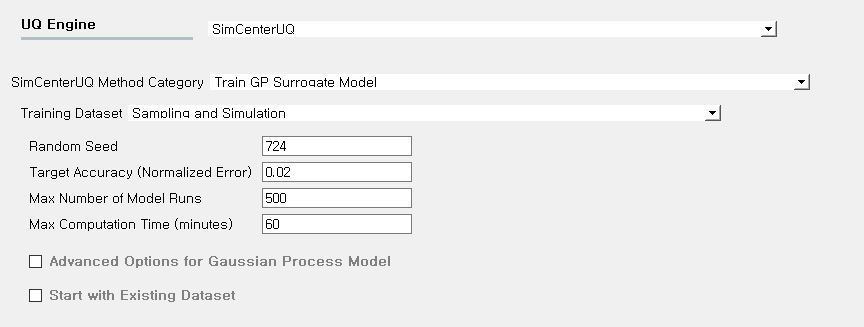
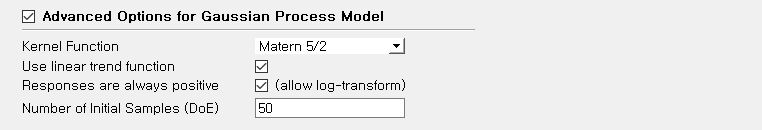
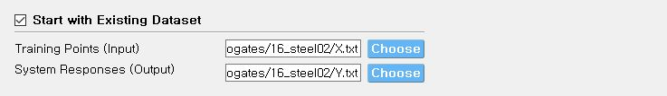
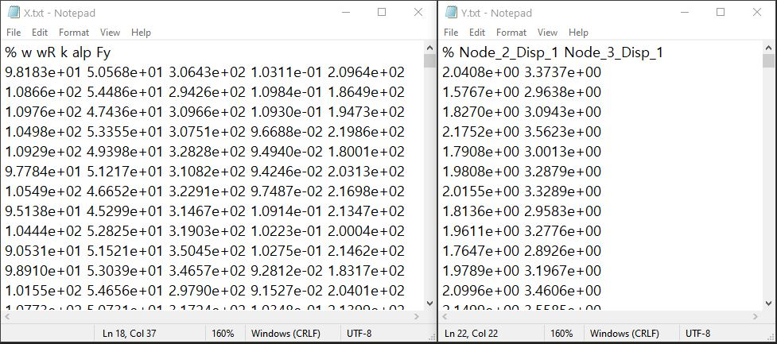
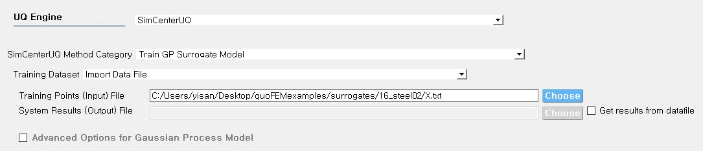
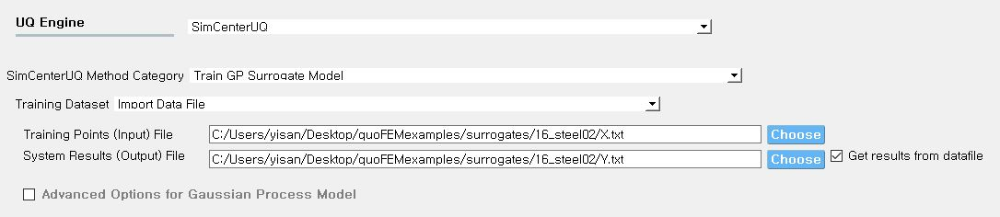
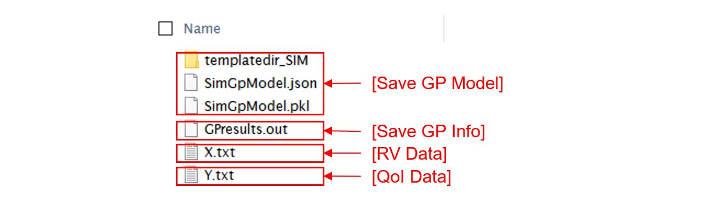

.. _lblSimSurrogate:

Surrogate modeling
*********************

The **Train GP Surrogate Model** is used to construct a Gaussian process (GP) based surrogate model that substitutes expensive computational simulation models or physical experiments. The training datasets can be either provided by user or generated by quoFEM. Consider a model represented as :math:`\boldsymbol{y}=f(\boldsymbol{x})`. Surrogate model can be constructed for different inputs

.. list-table:: User-provided information       
   :widths: 3 10 10
   :header-rows: 1

   * -  
     - RV (model input :math:`\boldsymbol{x}`)
     - QoI (model response :math:`\boldsymbol{y}`)
   * - **Case1**
     - bounds of random variables :math:`\boldsymbol{x}`
     - simulation model: :math:`\boldsymbol{y}=f(\boldsymbol{x})` 
   * - **Case2**  
     - dataset: :math:`\{\boldsymbol{x^{(1)},x^{(2)}, ... ,x^{(N)}}\}`
     - simulation model: :math:`\boldsymbol{y}=f(\boldsymbol{x})` 
   * - **Case3**  
     - dataset: :math:`\{\boldsymbol{x^{(1)},x^{(2)}, ... ,x^{(N)}}\}`
     - dataset: :math:`\{\boldsymbol{y^{(1)},y^{(2)}, ... ,y^{(N)}}\}`

**Case 1 (Sampling and Simulation)**: User provides lower and upper bounds of each random variable and a simulation model. quoFEM will find the best simulation points adaptively using the **design of experiments** strategies and run until the model converges or reaches a user-specified computational tolerance level. 

**Case 2 (Import only design points from a data file)**: User provides sample population of RVs in a text file. quoFEM will simulate the analysis for the given model and build a surrogate model using simulation results.

**Case 3 (Import both design points and responses from data files)**:  User provides sample population of RVs and corresponding responses (QoI) in each text file. quoFEM will not run any simulations and will construct a surrogate model purely based on the provided dataset.

.. list-table:: quoFEM workflow       
   :widths: 2 5 5 5
   :header-rows: 1
   :align: center

   * -  
     - Adaptive DoE 
     - Model simulation   
     - Surrogate Construction   
   * - **Case1**
     - O
     - O
     - O
   * - **Case2**  
     - X
     - O
     - O
   * - **Case3**  
     - X
     - X
     - O

**Constructed surrogate models can be saved as python pickle (.pkl) and json (.json) file and later imported in quoFEM** in place of the original simulation model for UQ analysis or optimization purpose. See 2.2.4 for how to use the surrogate model in quoFEM.

Input description
^^^^^^^^^^^^^^^^^

Case 1: Sampling and Simulation
--------------------------------
When the Dataset option is set to the **Sampling and Simulation**, a surrogate model is constructed for random variables in the **RV tab** and QoI in the **QoI tab** given model in the **FEM tab**. Simulation points are selected adaptively by the design of experiments (DoE, See technical manual for details).

.. _figSim1:

   Input panel for surrogate modeling

* **Random Seed**: Seed of the random number generator
* **Target Accuracy (Normalized Error)**: Target accuracy is defined in terms of normalized root-mean squared error (NRMSE) estimated by leave-out-one cross-validation (LOOCV).

	.. math::
		:label: NRMSE

		\begin{align*}
			\rm{NRMSE} ~ &= \frac{\sqrt{\frac{1}{N} \sum^{N}_{k=1} (y_k-\hat{y}_k)^2}}{\max_{k=1,...,N}(y_k)-\min_{k=1,...,N}(y_k)}
		\end{align*}	

   |   where 
   |      :math:`y_k` : exact response from the model simulation
   |      :math:`\hat{y}_k`: estimated response by LOOCV surrogate model prediction
   |      :math:`N`: number of samples used to construct the surrogate model

* **Maximum Number of Model Runs**: When the number of simulation runs reaches the limit, the analysis will be terminated.
* **Maximum Computation Time (in minutes)**: When the tolerance limit of the computation time is reached, the analysis will be terminated. (Note: There might be few minutes of error)

Additionally, user can activate the **Advanced Options for Gaussian Process Model**

.. _figSim2:

   Sampling and Simulation - Case 1

* **Kernel function**: Correlation function for Gaussian process regression. Matern5/2 is the default, and Matern3/2, Radial Basis, and Exponential functions are additionally supported.
* **Linear trend function**: When increasing or decreasing trend is expected over variables domain, linear trend function can be introduced. The default is unchecked (no trend function).
* **Responses are always positive**: When user can guarantee that the response quantities are always greater than 0, one may introduce a surrogate model in log-transformed space. The default is unchecked (no log-transform).
* **Number of Initial Samples (Design of Experiments)**: User may set the number of initial DoE, while the default initial DoE number is 4 times the number of random variables.

.. Tip:: 

   If the user wants to inactivate the adaptive DoE function, one can set **Number of Initial Samples (DoE)** equal to the number of simulations (**Maximum Number of Model Runs**). In such a case, all samples will be generated at once by Latin hypercube sampling. The computation may be faster, but the resulting verification measures may overestimate the level of accuracy and underestimate the error size.

Users may provide initial samples directly from data files by activating **Start with Existing Dataset**

.. _figSim3:

   Input panel for surrogate modeling

Following two data files should be provided:

* **Train Points (Input)**
* **System Responses (Output)**

where

* Each text file is a numeric table, columns separated by a tab, space, or comma. Multiple headers can be presented after the symbol %. 
* The number of columns corresponds to the number of training data samples.
* Train Points (Input): The number of rows should match the number of RVs required in the FEM model in **FEM tab** and presented in **RV tab**. The order of column should match those presented in **RV tab** (See :numref:`figSim4` and :numref:`figSim4` for example.)
* System Responses (Output): The number of rows should match the number of QoIs presented in **QoI tab**. The order of columns should match the QoI values presented in **QoI tab**.
* Columns are separated by a tab, space, or comma
* Both files need to be presented, and the number of columns should be the same.
* See :numref:`figSim4` for example input data sheets.

.. _figSim4:

   Example of data input files

.. Note:: 

   * One of the simulations will be a redundant one, meaning it will not be used for the surrogate model training. quoFEM will replicate one of the data samples user provided and compare it with the simulation model the user provided. An error will be thrown when the model and data are not consistent.
   * If the user wants to use the samples from only data files and does not wish to introduce any simulation model, refer to Case 3 below.

Case 2: Import only design points (Input locations) from dataset
------------------------------------------------------------------
Set Training Dataset to **Import Data File** and inactivate **Get results from datafile** check box.
Surrogate models are constructed using the samples evaluated at imported locations.

.. _figSim5:

   Import Data File - Case 2

Following two data files should be provided 

* **Train Points (Input)** 

where

* The text file is a numeric table, columns separated by a tab, space, or comma. Multiple headers can be presented after the symbol %. 
* The number of columns corresponds to the number of training data samples.
* The number of rows should match the number of RVs presented in the FEM model in **FEM tab**. The order of columns should match those presented in **RV tab**.
* Columns are separated by a tab, space, or comma
* See :numref:`figSim4` (left) for example.

Case 3: Import both design points and response from dataset
------------------------------------------------------------------
Set Training Dataset to **Import Data File** and activate **Get results from datafile** check box.
Surrogate model is constructed based on data set.

.. _figSim6:

   Import Data File - Case 3

Following two data files should be provided:

* **Train Points (Input)**
* **System Responses (Output)**

where

* Each text file is a numeric table, columns separated by a tab, space, or comma. Multiple headers can be presented after the symbol %. 
* The number of columns corresponds to the number of training data samples.
* The number of rows of files respectively corresponds to the number of RVs and QoIs.
* Columns are separated by a tab, space, or comma
* Both files need to be presented, and the number of columns should correspond to each other.
* See :numref:`figSim4` for example.

**FEM tab** will be inactivated as the model does not need to be defined.

.. Tips::
	- Different Cases can be combined by importing RV and QoI samples.
	- Surrogate model can be continued after when they are terminated by saving and importing RV and QoI samples.
	- The samples from quoFEM forward UQ analysis can be imported.

Random Variables Tab
---------------------
**Case 1 and 2**: The user needs to define the bounds of RV. The bounds need to cover the domain of interest in future applications, while it should not be unnecessarily stretched. **Input type** and **Distribution** should be set to **Parameters** and **Uniform**. When datasets are proved, make sure to match the order of random variables in the **RV tab** to the order of data columns. Any correlation values will be ignored.

.. _figSim7:

.. figure:: figures/Surrogate7_SimUQ.jpg
   :align: center
   :figclass: align-center

   Example of RV tab

**Case 3**: **RV data tab** will be filled automatically as soon as the dataset is imported.

Output description
^^^^^^^^^^^^^^^^^^^

Goodness-of-Fit
-----------------
Once the parameters of GP are calibrated, three verification measures are presented based on leave-one-out cross-validation (LOOCV) error estimation.

* **LOOCV**
   | a test surrogate model :math:`\hat{y}=f^{sur}_{loo,k}(\boldsymbol{x})` is constructed using the samples :math:`\{x_1,x_2,...,x_{k-1},x_{k+1},...,x_N\}` without recalibration of parameters, and its prediction at point :math:`{x}_k,~\hat{y}_k,` is compared with the exact outcome :math:`y_k=f(\boldsymbol{x}_k)`.

* **R2 error**

  | R2 error is defined in terms of the total sum of squares over the residual sum of squares

	.. math::
		:label: R2

		\begin{align*}
			R^2 &= 1 - \frac{\sum^N_{k=1} (\hat{y}_k-\mu_\hat{y})^2}{\sum^N_{k=1} (\hat{y}_k-y_k)^2}
		\end{align*}	

  | The surrogate model is considered well-constructed when **R2 (<1) approaches 1**
 

* **Normalized root-mean-squared-error (NRMSE)**

	.. math::
		:label: NRMSE

		\begin{align*}
			\rm{NRMSE} ~ &= \frac{\sqrt{\frac{1}{N_t} \sum^{N_t}_{k=1} (y_k-\hat{y}_k)^2}}{\max_{k=1,...,N_t}(y_k)-\min_{k=1,...,N_t}(y_k)}
		\end{align*}	

  | The surrogate model is considered well-constructed when **NRMSE (>0) approaches 0**

* **Correlation coefficient**

  	| Correlation coefficient is a statistic that measures linear correlation between two variables

	.. math::
		:label: corr

			\rho_{y,\hat{y}} = \frac{\sum^N_{k=1}(y_k-\mu_{y})(\hat{y}_k-\mu_{\hat{y}})} {\sigma_y \sigma_\hat{y}}

 	|   where 
	|      :math:`\mu_{y}` : mean of :math:`\{y_k\}`
  	|      :math:`\mu_{\hat{y}}`: mean of :math:`\{\hat{y}_k\}`
  	|      :math:`\sigma_{y}`: standard deviation of :math:`\{y_k\}`
  	|      :math:`\sigma_{\hat{y}}`: standard deviation of :math:`\{\hat{y}_k\}`

  | The surrogate model is considered well-constructed when **Correlation coefficient (* :math:`-1<\rho<1` *) approaches 0**

* Additionally **scatter plot** between Predicted and Exact responses are presented: Well constructed model will form diagonal line while poorly constructed model will not.

.. _figSim8:

.. figure:: figures/Surrogate8_SimUQ.jpg
   :align: center
   :figclass: align-center

   Well constructed surrogate (left) and poorly constructed surrogate model (right)

.. Tip::
   The surrogate model may be poorly constructed for various reasons including
    - lack of training samples
    - highly discrete and irregular (ill-posed) response surface 
    - high nonlinearity (with large spacial correlation) combined with large bound

   User can try increasing the number of samples or do the parametric study to check the smoothness and regularity of response surface

Saving Options
--------------
* **Save GP Model**: Once GP model is saved, it can be used for surrogate simulation in quoFEM. Two files, the surrogate model (.pkl) and the meta information (.json), and one folder (tmplate dir) will be saved at once. All the files are all required in future use. The default names are SimGpModel.json, SimGpModel.pkl, templatedir_SIM, respectively
* **Save GP Info**: This is results file generated for the user reference. It contains Gaussian process model informations including correlation length in each dimensions. The default file name is GPresults.out.
* **RV Data**, **QoI Data**: Data realizations. **IMPORTANT: To continue surrogate modeling with more simulations, save two file and import them as initial points. Refer to the 'Start with Existing Dataset' option in Case 1**. The default file names are X.txt and Y.txt, respectively.

.. _figSim9:

.. figure:: figures/Surrogate9_SimUQ.jpg
   :align: center
   :figclass: align-center

   Saving options

.. _figSim10:

   Example outputs from saving options

.. Note:: 
     Since these validation measures are calculated from the cross-validation predictions, they can be **biased**, particularly when **highly localized nonlinear range exists in actual response surface** and those regions are not covered by the training samples. However, the introduction of adaptive DoE helps the user to suppress the bias significantly by the targeted selection of simulation points around potentially faulty regions alarmed by high variance or high bias of surrounding samples.
