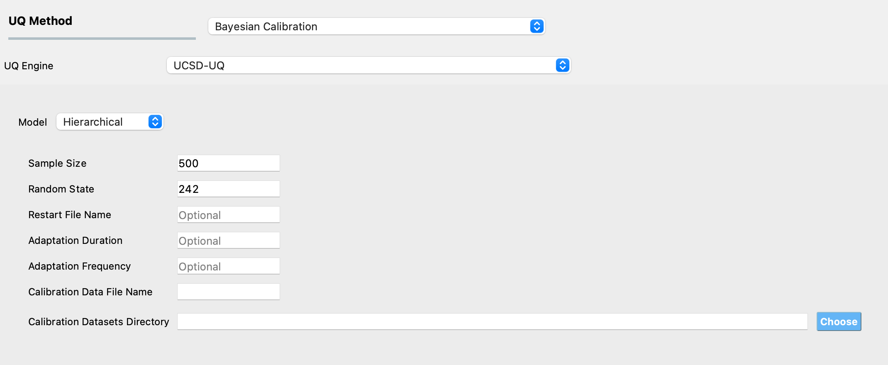

.. _lblUCSDHierarchical:

Calibration of Hierarchical Model
*********************************

Introduction
============
Bayesian calibration of a hierarchical model is performed using the Adaptive Metropolis-within-Gibbs sampling algorithm in quoFEM. Adaptive Metropolis-within-Gibbs is an advanced Markov chain Monte Carlo (MCMC) method that is designed to efficiently sample from complex, high-dimensional distributions, especially when direct sampling of these distributions is impractical. 

The sampler is initialized with a set of reasonable values for the variables (i.e., parameters of the hierarchical model). The hierarchical model that is used in the UCSD_UQ engine (refer the :ref:`Technical Manual <lbluqUCSD_hierarchical>` for more details) results in a structure where the variables can be grouped into blocks. For example, the parameters of the computational model for each dataset have strong interactions/dependencies among themselves, while they are independent of the parameters of the model for other datasets or the hyperparameters or the prediction error variances that are also part of the variables calibrated in the hierarchical model. After the variables have been grouped into blocks, Gibbs sampling involves updating the variables within each block sequentially, conditioned on the current values of variables in other blocks, and generating a sample from the updated distribution. For all the blocks where it is not possible to directly generate a sample from the updated distribution, adaptive Metropolis steps are used. In this step, a new state is proposed for all the variables within the block based on the current values using an adaptive proposal distribution. The acceptance probability for the proposed state is computed using the Metropolis-Hastings criterion and the proposed state is accepted or rejected based on this probability. The proposal distributions are adapted based on the accept/reject decisions made during the previous adaptive Metropolis steps. The adaptation is performed to improve the efficiency of the sampling process by adjusting the proposal distributions to better match the target distribution. This process is repeated for a large number of iterations, after which the sampler generates values from the updated distributions of the parameters of the hierarchical model.

Usage
=====
To use the Adaptive Metropolis-within-Gibbs algorithm, select the **UCSD-UQ** engine in the **UQ** panel and select the **Hierarchical** Model. 

The required inputs to perform Bayesian calibration of a hierarchical model in quoFEM are **Sample Size**, **Random State**, **Calibration Data File Name**, and **Calibration Datasets Directory**. 

The optional inputs are **Restart File Name**, **Adaptation Duration**, and **Adaptation Frequency**. Figure :numref:`figHierarchicalPanel` shows the input panel that is presented when the Hierarchical model is selected. Each of the options on this panel will be explained next.

.. _figHierarchicalPanel:

  	Input panel for Bayesian calibration of a hierarchical model.

1. **Sample Size** defines the number of values to be sampled from the posterior probability distribution of the parameters of the computational model. 
	
2. **Random State** is an integer that is used to specify the seed value of the pseudorandom number generator used in the Bayesian updating algorithm. Setting the same seed as in a previous analysis ensures that the same result is reproduced if the analysis is run again with the same inputs used in the previous analysis. 

3. **Restart File Name** is the name of a JSON file containing the results from a previous Bayesian calibration of the same hierarchical model using quoFEM. The restart option allows users to resume the MCMC sampling from a previously obtained sample value. 

4. **Adaptation Duration** is an integer that specifies the initial number of steps of the sampler during which the characteristics of the proposal distribution are adjusted to increase the efficiency of the sampling. 

5. **Adaptation Frequency** is an integer that defines the number of steps within the adaptation duration after which the proposal distribution is adapted.

6. **Calibration Data File Name** is the name of a text file that contains the data of the measured values of the output quantity of interest. 

7. **Calibration Datasets Directory** is the path to the directory that contains the datasets from multiple measurements. 

