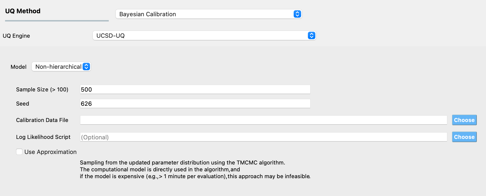
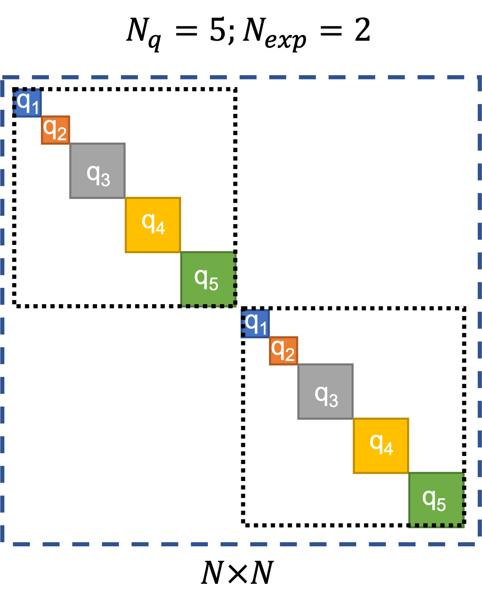
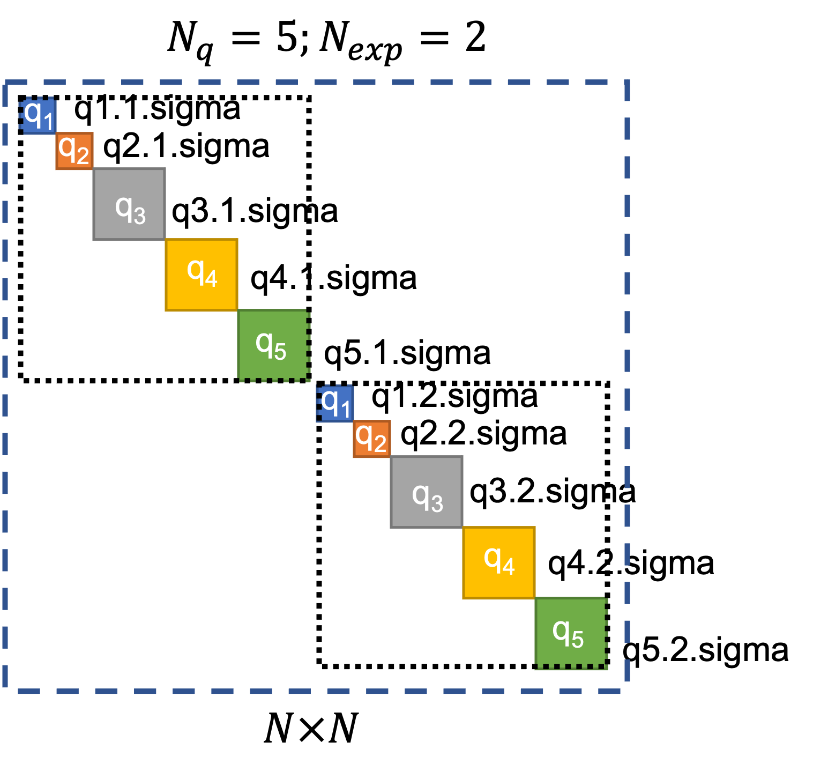

.. _lblUCSDTMCMC:

Calibration of Non-hierarchical Model
*************************************

Introduction
============
Bayesian calibration of a non-hierarchical model is a probabilistic inverse problem where the objective is to estimate the probability distribution of the parameters of a computational model, using all the available data. The data consist of numbers which are typically obtained from measurements of a physical phenomenon being studied. In quoFEM, the data are provided in a text file, whose path is defined in the **UQ** panel. The computational model (defined in the **FEM** panel) is an approximation of the real process that generated the data and the outputs of this model (defined in the **QoI** panel) are the same quantities of interest for which we have measured data. The model has several parameters that influence the output predicted by the model when it is evaluated at a set of inputs. In the inverse problem, the values of these parameters are unknown, and in the Bayesian setting, they are treated as random variables, with specified prior probability distribution functions (defined in the **RV** panel). To complete the definition of the Bayesian inverse problem, the probability model for the data needs to be specified, which is done by the log-likelihood function in the **UQ** panel. 

Usage
=====
Transitional Markov chain Monte Carlo (TMCMC) is an algorithm that is used to draw samples from the posterior probability distribution of the parameters of a computational model when performing Bayesian calibration using a non-hierarchical model. 

To use the TMCMC algorithm, select the **UCSD-UQ** engine in the **UQ** panel. Currently, only the TMCMC method is available with the **UCSD-UQ** engine. 

The required inputs to perform Bayesian calibration in quoFEM using the TMCMC algorithm are **# Samples**, **Seed**, and **Calibration Data File**. Specifying **Log Likelihood Script** is optional. Figure :numref:`figTMCMCPanel` shows the input panel that is presented when the TMCMC method is selected. Each of the options on this panel will be explained next.

.. _figTMCMCPanel:

  	TMCMC algorithm input panel.

1. **# Samples** defines the number of values to be sampled from the posterior probability distribution of the parameters of the computational model. This number is not the same as the number of times the computational model is evaluated. To sample from the posterior probability distribution of the inputs, the TMCMC algorithm relies on gradually changing the target distribution from the prior to the posterior in several stages. The number of stages is not known in advance. In every stage, the Markov chain is propagated for several steps (which vary between 2-5) for each sample, which requires the computational model to be evaluated. So, if **# Samples** is set to a number denoted as :math:`N_{samples}`, the total number of times that the computational model is evaluated is given by :math:`N_{eval} = \sum_{i=1}^{N_{stages}} N_{samples}*N_{steps}^{(i)}`.
	

2. **Seed** is an integer that specifies the seed value of the pseudorandom number generator. If the same Bayesian estimation problem is run multiple times without having the same seed, a different set of samples is produced in each run. Setting the same seed as a previous TMCMC sampling run ensures that the same result is reproduced if the TMCMC sampling is run again. 

3. **Calibration Data File** is the path to a text file that contains the data of the measured values of the quantities of interest. 

.. note::

	The data are provided in the calibration data file, which must fulfill the following requirements:

	1. Each row of the calibration data file contains data from one experiment. The individual entries in every row of this file can be separated by spaces, tabs, or commas.
	2. The number of entries in each row must equal the sum of the length of all outputs defined in the **QoI** panel.
	3. The order of the entries in each row of the calibration data file must match the order in which the outputs are defined in the **QoI** panel and must correspond to the output from the computational model in the ``results.out`` file.

	For example, if there are data from two experiments, and there are 2 response quantities, of length 2 and 1 respectively, then, there must be two rows of values in the calibration data file, the length of each row must be 3, the first two values in each row correspond to the first response quantity and the third value in each row corresponds to the second response quantity. 

4. **Log Likelihood Script**: By default, a Gaussian log-likelihood function is used in the TMCMC algorithm. If desired, a different log-likelihood function defined in a Python script can be provided, and the path to this Python script is provided here. 

Defining the log-likelihood function
====================================

.. warning:: 
	This feature is meant for advanced users, and users must exercise care if defining their log-likelihood function.

In the **Log Likelihood Script** field, users can provide the path to a Python script that contains a function called ``log_likelihood`` that returns the log-likelihood value. 

By allowing users to define a ``log_likelihood`` function in the **Log Likelihood Script**, the workflow provides users full control in defining the log-likelihood model they desire to use. 
The ``log_likelihood`` function is called internally during the execution of the TMCMC algorithm, and this function must compute and return the log-likelihood value at a point in the parameter space. The function must take the arguments as shown below in the signature of the `default log-likelihood script <https://github.com/NHERI-SimCenter/quoFEM/blob/master/backend/modules/performUQ/UCSD_UQ/defaultLogLikeScript.py>`_. Within this function, users can define their log-likelihood function.

.. literalinclude:: defaultLogLikeScript.py
   :linenos: 
   :language: python
   :lines: 15-59

Default error covariance structure
==================================
The likelihood is a function of the difference between the predicted and the measured values of the response quantities of interest. These differences are also called **residuals** or **errors**. The likelihood function assumes a structure of the covariance matrix for these error terms.

By default, quoFEM assumes a block-diagonal error covariance structure. An example of the block-diagonal covariance structure is shown in :numref:`figDefaultCovarianceStructure`. In this figure, the number of experiments is denoted as :math:`N_{exp}`. The number of response quantities of interest is denoted as :math:`N_{q}`, and :math:`q_1, q_2, ..., q5` are the names of the quantities of interest in this example (these will be defined in the **QoI** panel when using quoFEM). Of these, :math:`q_1` and :math:`q_2` are scalar response quantities (i.e., they have a length of 1), while :math:`q_3` ,:math:`q_4`, and :math:`q_5` are response quantities whose length > 1 (referred to as vector/field quantities). The length of each of the :math:`N_q` quantities of interest is denoted by :math:`l_i`. So, :math:`N`, the total number of calibration data terms, which is the same as the total number of terms in the ``results.out`` file output from the model, and is also equal to the total number of error/residual terms, is given by:

.. math::
	N = N_{exp} \times \sum_{i=1}^{N_q} l_i
	:label: eqnCalibrationTerms

Note that quoFEM requires that the calibration data be provided in a text file separate from the script where the model is defined. In this text file, the number of rows corresponds to the number of experiment :math:`N_{exp}`, and the number of terms in each row (i.e., the number of columns) is equal to :math:`\sum_{i=1}^{N_q} l_i`. Hence, the total number of calibration terms :math:`N` is equal to the product of the number of rows and number of columns in the calibration data file. 

The error-covariance matrix is a block-diagonal square matrix of size :math:`N \times N`. There are :math:`N_{exp} \times N_q` blocks on the diagonal. For each of these blocks, if it corresponds to a scalar response quantity, then a scalar variance value is used by default else, a scalar matrix (i.e., an identity matrix of size :math:`l_i \times l_i` multiplied by a scalar value) is used by default. 

.. note::
	For numerical convenience, during execution, a transformation is applied to the calibration data and model prediction corresponding to each response quantity. The calibration data and model prediction for each response quantity are first shifted (a scalar value is added to the data and prediction) and then scaled (the data and prediction are divided by a positive scalar value).
	
	Currently, the shift factors are set to 0.0 for all response quantities by default. The scale factors used are the absolute maximum of the data for each response variable. If the absolute maximum of the data for any response variable is 0.0, then the scale factor is set to 1.0, and the shift factor is set to 1.0.

If there is data from more than one experiment, the default variance value used per response quantity, which is constant across experiments, is computed as the variance of the transformed calibration data. If there is data from only one experiment, then a default variance value is computed by assuming that the standard deviation of the error is 5% of the absolute maximum value of the corresponding transformed calibration data.

.. _figDefaultCovarianceStructure:

  	Default block-diagonal error covariance structure.

In :numref:`figDefaultCovarianceStructure`, the outermost square marked by the blue dashed lines represents the block-diagonal error-covariance matrix for all the :math:`N` error/residual terms. The two squares marked by the black dotted lines along the diagonal of the error covariance matrix indicate the portions of the error covariance matrix corresponding to the two experiments. The solid colored squares indicate the portions of the error covariance matrix that correspond to each quantity of interest. 

The block-diagonal structure implies that there is no correlation among the error/residual terms across experiments, i.e., the portions of the error-covariance matrix outside the two squares marked by black dotted lines are filled with zeros. There is also no correlation among the error/residual terms corresponding to different quantities of interest within each experiment.

User-defined covariance structure
=================================
quoFEM provides users the option to supply error covariance matrices per response quantity per experiment, i.e., users can define each block of the diagonal error-covariance structure which will be utilized in the calculation of the log-likelihood. To do so, users must provide a separate text file for each block containing the values for that block. The names of these text files are expected to follow the convention of "{QoIName}.{ExpNum}.sigma". Examples of the names of the files that contain values that will be used instead of the default values are shown for each block in :numref:`figUserDefinedCovarianceStructure`. 

Within these files, the entries can be separated by either commas, spaces, or tabs. Users can provide a scalar variance value for scalar response quantities, which will be used instead of the default value. For vector/field response quantities, users can supply in the files either 

#. a scalar value, in which case the block corresponding to this response variable and this experiment will be an identity matrix of size :math:`l_i \times l_i` multiplied by this scalar value, or
#. a row/column of :math:`l_i` values, in which case, these will be treated as the elements of the diagonal of the block, or
#. a matrix of values of size :math:`l_i \times l_i`, which implies that the error/residual terms corresponding to this block are correlated. 

.. _figUserDefinedCovarianceStructure:

  	User-defined block-diagonal error covariance structure.

Additional calibration parameters
=================================
In Bayesian calibration problems, the value of the variance/covariances of the error/residual terms is also typically unknown. The residuals include not only measurement errors but also errors caused due to the inability of the model to perfectly represent the behavior being modeled. Hence, by default, quoFEM also calibrates the values of multipliers on the block-diagonal terms in the error covariance matrix. Therefore, the total number of parameters being calibrated is given by the sum of the number of parameters of the computational model and the number of response quantities of interest. 

In quoFEM, the parameters of the model are defined in the **RV** panel, and the response quantities are specified in the **QoI** panel. Hence the total number of parameters being calibrated is equal to the sum of the number of RVs and the number of QoIs. There is one multiplier per response quantity, irrespective of it being either a scalar or a vector/field quantity. Also, the same multiplier per response quantity is used on the blocks of the error covariance matrix across experiments. 

