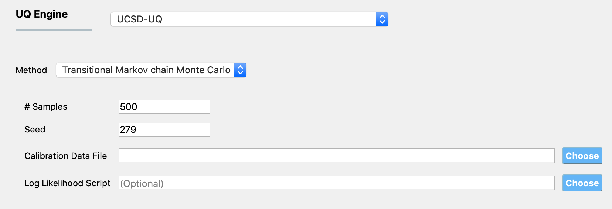

.. _lblUCSDTMCMC:

Transitional Markov chain Monte Carlo (TMCMC) algorithm
*******************************************************

TMCMC is an algorithm which is used to draw samples from the posterior probability distribution of random variables when performing Bayesian estimation. Bayesian estimation is a probabilistic inverse problem where the objective is to estimate the probability distribution of the parameters of a computational model, given data. The data consist of numbers which are typically obtained from measurements of a real process. In quoFEM, the data are provided in a text file, whose path is defined in the **UQ** panel. The computational model (defined in the **FEM** panel) is an approximation of the real process that generated the data and the outputs of this model (defined in the **QoI** panel) are the same quantities of interest for which we have measured data. The model has several parameters that influence the output predicted by the model when it is evaluated at a set of inputs. In the inverse problem, the values of these parameters are unknown, and in the Bayesian setting, they are treated as random variables, with specified prior probability distribution functions (defined in the **RV** panel). To complete the definition of the Bayesian inverse problem, the probability model for the data needs to be specified, which is done by the log-likelihood function in the **UQ** panel. 

To use the TMCMC algorithm, select the **UCSD-UQ** engine in the **UQ** panel. Currently, only the TMCMC method is available with the **UCSD-UQ** engine. 

The required inputs to perform Bayesian calibration in quoFEM using the TMCMC algorithm are **# Samples**, **Seed**, and **Calibration Data File**. Specifying **Log Likelihood Script** is optional. Figure :numref:`figTMCMCPanel` shows the input panel that is presented when the TMCMC method is selected. Each of the options on this panel will be explained next.

.. _figTMCMCPanel:

  	TMCMC algorithm input panel.

1. **# Samples** defines the number of values to be sampled from the posterior probability distribution of the parameters of the computational model. This number is not the same as the number of times the computational model is evaluated. In order to sample from the posterior probability distribution of the inputs, the TMCMC algorithm relies on gradually changing the target distribution from the prior to posterior in a number of stages. The number of stages is not known apriori. In every stage, the Markov chain is propagated for a number of steps (which varies betwen 2-5) for each sample, which requires the computational model to be evaluated. So, if **# Samples** is set to a number denoted as :math:`N_{samples}`, the total number of times that the computational model is evaluated is given by :math:`N_{eval} = \sum_{i=1}^{N_{stages}} N_{samples}*N_{steps}^{(i)}`.
	

2. **Seed** is an integer that specifies the seed value of the psuedo-random number generator. If the same Bayesian estimation problem is run multiple times without having the same seed, a different set of samples produced in each run. Setting the same seed as a previous TMCMC sampling run ensures that the the same result is reproduced if the TMCMC sampling is run again. 

3. **Calibration Data File** is the path to a text file that contains the data of the measured values of the quantities of interest. 

.. note::

	Calibration data file requirements
	==================================
	The data are provided in the calibration data file, which must fulfil the following requirements:

	1. Each row of the calibration data file contains data from one experiment. The individual entries in every row of this file can be separated by spaces, tabs, or commas.
	2. The number of entries in each row must equal the sum of the length of all outputs defined in the **QoI** panel.
	3. The order of the entries in each row of the calibration data file must match the order in which the outputs are defined in the **QoI** panel, and must correspond to the output from the computational model in the ``results.out`` file.

	For example, if there are data from two experiments, and there are 2 response quantities, of length 2 and 1 respectively, then, there must be two rows of values in the calibration data file, the length of each row must be 3, the first two values in each row correspond to the first response quantity and the third value in each row corresponds to the second response quantity. 

4. **Log Likelihood Script**: By default, a Gaussian log-likelihood function is used in the TMCMC algorithm. If desired, a different log-likelihood function defined in a Python script can be provided, and the path to this Python script is provided here. 

Defining the log-likelihood function
====================================

.. warning:: 
	This feature is meant for advanced users, and users must be very careful if defining their own log-likelihood function.

In the **Log Likelihood Script** field, users can provide the path to a Python script which contains a function called ``log_likelihood`` that returns the log-likelihood value. 

By allowing users to define a ``log_likelihood`` function in the **Log Likelihood Script**, the workflow provides users full control in defining the log-likelihood model they desire to use. 
The ``log_likelihood`` function is called internally during the execution of the TMCMC algorithm, and this function must compute and return the log-likelihood value at a point in the parameter space. The function must take the arguments as shown below in signature of the `default log-likelihood script <https://github.com/NHERI-SimCenter/quoFEM/blob/master/backend/modules/performUQ/UCSD_UQ/defaultLogLikeScript.py>`_. Within this function, users can define their own log-likelihood function.

.. literalinclude:: defaultLogLikeScript.py
   :linenos: 
   :language: python
   :lines: 15-59

.. User-defined covariance structure
.. =================================
.. quoFEM allows users to define a block-diagonal covariance structure which will be utilized in the calculation of the log-likelihood. By default, quoFEM assumes a block-diagonal error covariance structure, as shown in :numref:`figDefaultCovarianceStructure`.
..
.. .. _figDefaultCovarianceStructure:
..
.. .. figure:: figures/DefaultBlockDiagonalCovariance.png
.. 	:align: center
.. 	:figclass: align-center
..
..   	Default block-diagonal error covariance structure.

