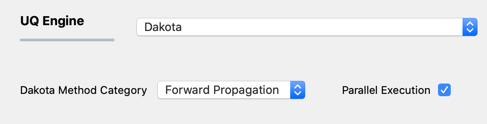

.. _lblUQ:

UQ: Uncertainty Quantification
==============================

The first selection panel the user must select from and enter data into is the **UQ** tab. It is in this panel that the user selects the **UQ Engine** to use for performing the uncertainty quantification calculations. The **UQ Engine** provides algorithms for solving various types of uncertainty analysis and optimization problems. 

.. role:: uqblue

.. only:: quoFEM_app
     
   The **UQ Engine** options currently available are Dakota, SimCenterUQ, and UCSD-UQ. Users can also configure |appName| to use their own UQ methods and algorithms in the |appName| workflow by selecting the CustomUQ option.

   UQ Features At-a-Glance
   -------------------------

   .. panels::
    :container: container-lg pb-3
    :column: col-lg-12 col-md-12 col-sm-12 col-xs-12 p-2

    ---

    .. container:: twocol

       .. container:: leftside

        :uqblue:`Forward propagation` 
            | Forward propagation generates sample realizations of input random variables (RVs) and output quantity of interests (QoIs) to provide statistics such as mean, variance, skewness, and kurtosis. See Dakota user manual for theory details.

             | ▪ :ref:`lblDakotaForward` in Dakota   :link-badge:`../../examples/desktop/qfem-0001/README.html,Example1, cls=badge-primary text-white` :link-badge:`../../examples/desktop/qfem-0002/README.html,Example2, cls=badge-primary text-white`
             | ▪ :ref:`lblSimForward` in SimCenterUQ   :link-badge:`../../examples/desktop/qfem-0015/README.html,Example, cls=badge-success text-white`
             | ▪ :ref:`lblSimForwardMF` in SimCenterUQ  

       .. container:: rightside

         .. thumbnail:: figures/UQtab/method_forward.png
                :width: 25%

    ---

    .. container:: twocol

       .. container:: leftside

        :uqblue:`Global Sensitivity Analysis`            
            | Global sensitivity analysis is used to quantify the contribution of each input RV to the uncertainty in an output QoI. Dakota engine provides classical non-parametric estimation based on a smart sampling approach and the SimCenterUQ engine provides a probabilistic model-based approximation. See Dakota user manual and :ref:`here<lbluqSimTechnical_Sensitivity>` for theory details.

             | ▪ :ref:`lblDakotaSensitivity` in Dakota   :link-badge:`../../examples/desktop/qfem-0001/README.html,Example, cls=badge-primary text-white`
             | ▪ :ref:`lblSimSensitivity` in SimCenterUQ   :link-badge:`../../examples/desktop/qfem-0009/README.html,Example1, cls=badge-success text-white` :link-badge:`../../examples/desktop/qfem-0023/README.html,Example2, cls=badge-success text-white`

       .. container:: rightside

            .. thumbnail:: figures/UQtab/method_sensitivity.png
                :width: 25%

    ---
    .. container:: twocol

       .. container:: leftside

        :uqblue:`Reliability Analysis`
            | Reliability Analysis is performed to estimate the probability of failure, i.e. the probability that a system response (QoI) exceeds a certain threshold level. See Dakota user manual for theory details.

             | ▪ :ref:`lblDakotaReliability` in Dakota   :link-badge:`../../examples/desktop/qfem-0001/README.html,Example, cls=badge-primary text-white`

       .. container:: rightside

         .. thumbnail:: figures/UQtab/method_reliability.png
                :width: 25%

    ---
    .. container:: twocol

       .. container:: leftside

        :uqblue:`Bayesian Calibration`
            | Bayesian Calibration is used to calibrate model parameters probabilistically based on Bayesian inference. The probability distributions of the input parameters (RVs) are updated by experimental data. Theory details can be found in Dakota user manual and :ref:`here<lbluqUCSDSimTechnical>`

             | ▪ :ref:`lblDakotaBayesianCalibration` in Dakota
             | ▪ :ref:`lblUCSDTMCMC` in UCSD-UQ   :link-badge:`../../examples/desktop/qfem-0014/README.html,Example1, cls=badge-danger text-white` :link-badge:`../../examples/desktop/qfem-0019/README.html,Example2, cls=badge-danger text-white`

       .. container:: rightside

          .. thumbnail:: figures/UQtab/method_Bayesian.png
                :width: 25%
    ---
    .. container:: twocol

       .. container:: leftside

        :uqblue:`Deterministic Calibration` 
            | Deterministic Calibration estimates the best parameter values of a simulation model that best fit the experimental data, using deterministic optimization algorithms, e.g. Gauss-Newton least squares, pattern search, etc. See Dakota user manual for theory details.

             | ▪ :ref:`lblDakotaDeterministicCalibration` in Dakota   :link-badge:`../../examples/desktop/qfem-0007/README.html,Example1, cls=badge-primary text-white` :link-badge:`../../examples/desktop/qfem-0019/README.html,Example2, cls=badge-primary text-white`
             | ▪ :ref:`lblDakotaGradientFreeEstimation` in Dakota

       .. container:: rightside
        
          .. thumbnail:: figures/UQtab/method_deterministic.png
                :width: 25%

    ---
    .. container:: twocol

       .. container:: leftside

        :uqblue:`Surrogate Modeling`

            | |app| can be used to train a surrogate model that substitutes expensive computational simulation models or physical experiments. Theory details can be found in :ref:`here<lbluqSimTechnical>`.

             | ▪ :ref:`lblSimSurrogate` in SimCenterUQ   :link-badge:`../../examples/desktop/qfem-0015/README.html,Example1, cls=badge-success text-white` :link-badge:`../../examples/desktop/qfem-0016/README.html,Example2, cls=badge-success text-white`
             | ▪ :ref:`lblSimCenterUQPLoM` in SimCenterUQ

       .. container:: rightside
        
           .. thumbnail:: figures/UQtab/method_surrogate.png
                :width: 25%

    ---
    .. container:: twocol

       .. container:: leftside 

        :uqblue:`Custom UQ`
           | Custom UQ helps the user plug in a user-defined UQ algorithm in SimCenter workflow.

            | ▪ :ref:`lblCustomUQ` in CustomUQ engine   :link-badge:`../../examples/desktop/qfem-0017/README.html,Example, cls=badge-success text-white`

       .. container:: rightside
        
         .. thumbnail:: figures/UQtab/method_custom.png
                :width: 25%

.. only:: notQuoFEM
     
   The **UQ Engine** options currently available are Dakota and SimCenterUQ

Dakota UQ Engine
----------------

This UQ engine utilizes the `Dakota Software <https://dakota.sandia.gov/>`_, a state-of-the-art research application that is robust and provides many methods for optimization and UQ, a selection of which we utilize in this application. **Dakota** provides the user with a large number of methods for different kinds of analyses. For this reason, we have divided the methods into categories through a pull-down menu, as shown below. Once the category has been selected, a number of different methods are made available to the user.

* By checking the ``Parallel Execution``, the UQ analysis will be performed in parallel. It will try to use all the processors available on the machine. 

* By checking the ``Save Working dirs``, individual working directories will be saved in the Local Jobs Directory. Local Jobs Directory is defined at ``File``-``Preference`` in the menubar. Otherwise, individual simulation files will be deleted after each simulation run. Users might uncheck this box when a large number of simulations is requested, to manage driver space.

.. _figDakota:

   Dakota engine and category selection.

The following categories are available:

.. toctree-filt::
   :maxdepth: 1

   DakotaSampling
   :EEUQ:DakotaSensitivity
   :EEUQ:DakotaReliability
   :Hydro:DakotaSensitivity
   :Hydro:DakotaReliability    
   :quoFEM:DakotaSensitivity
   :quoFEM:DakotaReliability
   :quoFEM:DakotaDeterministicCalibration
   :quoFEM:DakotaBayesianCalibration
   :quoFEM:DakotaGradientFreeOptimization

.. only:: quoFEM_app or EEUQ_app

   SimCenter UQ Engine
   -------------------

   The **SimCenterUQ** engine is a UQ engine developed in-house at the SimCenter that accommodates different UQ methods, which are organized into categories that can be accessed through a pull-down menu, as shown below:

   .. _figSimCenterUQ:

   .. figure:: figures/SimCenterUQ.png
      :align: center
      :figclass: align-center
      :width: 1200

      SimCenterUQ engine and category selection.

   The following category options are available:

   .. toctree-filt::
      :maxdepth: 1

      SimCenterUQSampling
      SimCenterUQSensitivity
      SimCenterUQSurrogate
      SimCenterUQPLoM

.. only:: quoFEM_app

   UCSD UQ Engine
   --------------

   The **UCSD-UQ** engine is a module developed at the SimCenter in collaboration with UCSD. It provides algorithms for Bayesian estimation, which can be accessed through a pull-down menu, as shown in :numref:`figUCSDUQ`.

   .. _figUCSDUQ:

   .. figure:: figures/UCSDUQ.png
      :align: center
      :figclass: align-center
      :width: 1200

      UCSD-UQ engine and category selection.

   This module currently offers support for Bayesian estimation using the Transitional Markov chain Monte Carlo (TMCMC) algorithm:

   .. toctree-filt::
     :maxdepth: 1

     UCSD_UQ_TMCMC

   Custom UQ Engine
   ----------------

   The **CustomUQ** option enables users to switch out the UQ engine in the |appName| workflow such that different methods and tools can be applied within the SimCenter framework with minimal effort on the part of the user. The CustomUQ option can be accessed as shown below:
   .. _figCustomUQ:

   .. figure:: figures/customUQ.png
      :align: center
      :figclass: align-center
      :width: 1200

      CustomUQ engine selection.

   In order to use the CustomUQ engine option, two steps are required:

   * Configuring the UQ tab to accept the required inputs
   * Adding UQ engine to customized UQ backend

   These steps are described in more detail here:

   .. toctree-filt::
      :maxdepth: 1

      Configuring_CustomUQ

.. only:: quoFEM_app

   Video Resources
   -------------------

   Recorded in tool training, 2022.

   .. raw:: html

      

         <video controls src="../../../../_static/videos/quoFEM/youtube_UQ_Day1_TestClip.mp4" width="560" height="315"> </video>   
      
