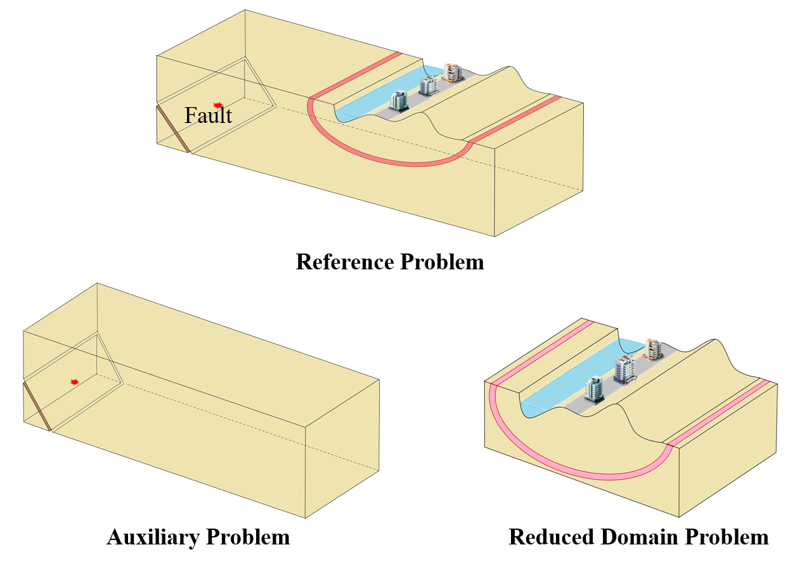
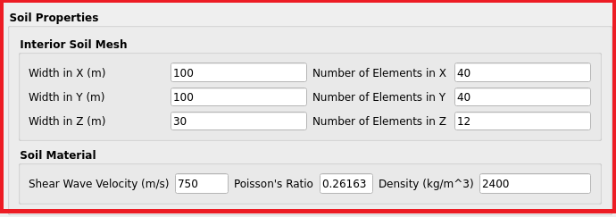
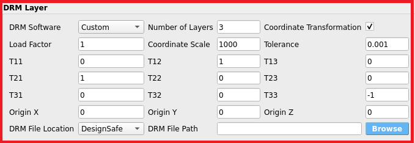
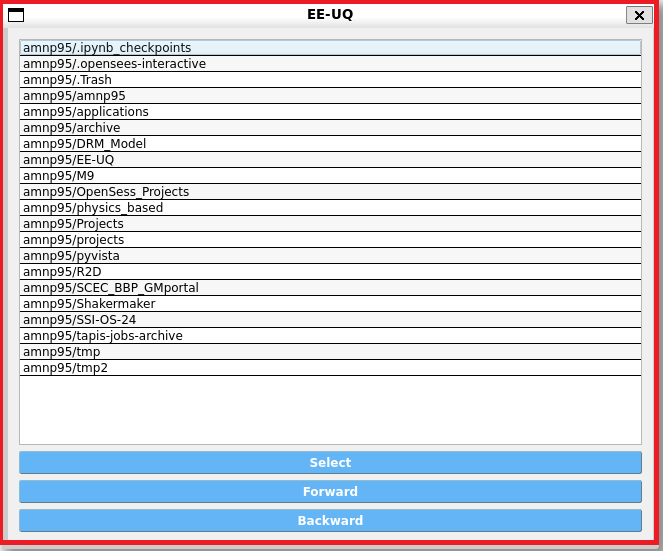
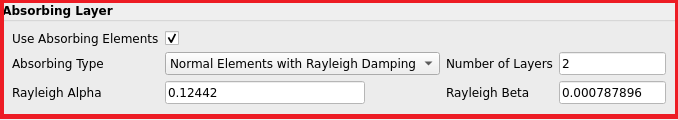
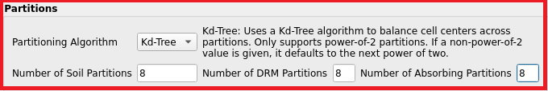
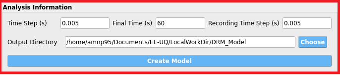
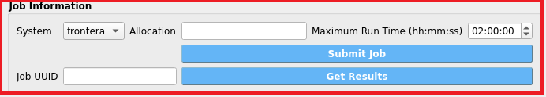

.. _DRM_Modeltools:

Domain Reduction Method Analysis
----------------------------------
Domain Reduction Method analysis tool in EE-UQ is user interface through which users can create a model in OpenSees and use the implemented DRM loading in OpenSees to perform a high fidelity analysis of a structure subjected to earthquake ground motions. The DRM analysis tool is designed to simplify the process of creating a model using parallel processing and doing the analysis using OpenSeesMP through TACC facilities. The tool is designed to be user-friendly and to provide a seamless experience for users to perform a DRM analysis.

Domain Reduction Method
~~~~~~~~~~~~~~~~~~~~~~~~~~~
The **Domain Reduction Method (DRM)** helps to simplify complex earthquake simulations, making it easier and faster to compute how buildings and structures react to earthquakes. Here’s a simple breakdown:

Why is this needed?
^^^^^^^^^^^^^^^^^^^^^^^
In areas near a fault (the break in the Earth's crust where earthquakes happen), the ground moves in a unique way. To study how earthquakes affect large regions, we need to run computer models of these ground motions. However, these models are often very slow and take up a lot of computing power. That's where the DRM comes in—it helps reduce the amount of computing needed while still getting accurate results.

What is DRM?
^^^^^^^^^^^^^^^^^^^^^^^
DRM is a method that divides the problem into two smaller parts, which makes the whole process faster and more manageable. It was first developed by researchers named **Bielak** and **Yoshimura** in 2003.

How does it work?
^^^^^^^^^^^^^^^^^^^^^^^

1. **Step 1: Solve a Big Picture Problem (Background Problem)**  
   First, you solve a "big picture" problem. This means you model a large area that includes both the earthquake waves and the area around the structure (like a building) you are interested in. In this step, you focus on how the earthquake waves move through the ground, not the specific details of what happens to the building.

2. **Step 2: Focus on the Area Near the Structure (Local Problem)**  
   After you have a good idea of how the earthquake waves move, you can zoom in and focus just on the building or structure. The earthquake waves from Step 1 are applied to the building, and you can study how the building reacts to these waves. This step allows you to include detailed effects, like cracks or bending that might happen to the structure.

figure fig-ShakerMaker_DRM shows two stages of the DRM process.

.. _fig-ShakerMaker_DRM:

	Two stages of the DRM.

Why is this method useful?
^^^^^^^^^^^^^^^^^^^^^^^^^^^^^^^^^^^^^^^^^^^^^^
This two-step method saves a lot of time. Instead of having to model both the entire earthquake region and the building in one big, slow calculation, DRM breaks it down. First, you solve the larger, simpler problem (earthquake waves in a big region), and then you use that information to do a more detailed and focused analysis on just the building.

Despite its advantages, the DRM has seen limited use due to challenges in handling large, complex datasets, which require specialized tools for creation. ShakerMaker addresses these issues by offering a straightforward solution for generating DRM-compatible motions and an accessible format for working with extensive datasets, making it easier for researchers and practitioners to leverage this powerful method in their analyses.
There is functionality in OpenSees which accept a DRM load in hdf5 format. The DRM loading should be in a special format which some software like ShakerMaker can generate. The DRM loading is applied to the model in OpenSeesMP and the analysis is performed using TACC facilities. 

Domain Reduction Method Analysis user interface
~~~~~~~~~~~~~~~~~~~~~~~~~~~~~~~~~~~~~~~~~~~~~~~~~~
The DRM analysis tool user interface is consists of the six sections: 

- **Soil Properties**: This section allows the user to define soil geometry and properties. 
- **DRM Layer**: This section allows the user to define the number of DRM layers and the properties input DRM load.
- **Absorbing Layers**: This section allows the user to define the number of absorbing layers and the properties of the absorbing layers.
- **Partitiones**: This section allows the user to define the number of partitions for each of soil, DRM and absorbing layers.
- **Analysis Information**: This section allows the user to define the analysis parameters for the OpenSees model.
- **Job Information**: This section allows the user to submit the job to TACC facilities and get the results back.

Soil Properties
^^^^^^^^^^^^^^^^^^^^^^^
Right now, the DRM analysis tool only supports a single soil layer with cube geometry. The user can define the geometry by inputting the Width in X, Y and Z directions in meters and the number of elements in X, Y and Z directions. 
For the properties of the single layer of soil, the user can input the density, shear wave velocity and Poisson's ratio.

    DRM Analysis Tool Soil Properties Section.

DRM Layer
^^^^^^^^^^^^^^^^^^^^^^^
The DRM layer section allows the user to define the number of DRM layers and the properties of the DRM load. 
The **DRM Software** dropdown allows the user to select the software used to generate the DRM load. The only change that this dropdown does is to change the default values of the properties of the DRM load.
Right now, **ShakerMaker** and **Custom** are the only options in the dropdown.
The Propertises of the DRM Load is aligned with the parameters in **H5DRM pattern**: `H5DRM Documentation <https://opensees.github.io/OpenSeesDocumentation/user/manual/model/H5DRM.html>`_ in OpenSees. The user can input the properties of the DRM load in the textboxes provided. The properties are:

- **Number of Layers**: The number of layers around the Soil layer.
- **Coordinate Transformation check**: The checkbox to enable the coordinate transformation. if checked, the DRM load used the coordinate transformation provided by the user otherwise the default coordinate in the DRM load is used.
- **Load Factor**: The load factor applied to the DRM load.
- **Coordinate Scale**: The scale factor applied to the DRM points coordinates to match the point coordinates in the model.
- **Tolerance**: The tolerance used in the DRM pattern to match the points in the DRM load to the points in the model.
- **T11, T12, T13, T21, T22, T23, T31, T32, T33**: The transformation matrix for coordinate transformation if the coordinate transformation is checked.
- **DRM File Location**: The location of the DRM load file. The user can access the file in their local machine or in the DesignSafe workspace.
- **DRM File Path**: The path to the DRM load file in either the local machine or the DesignSafe workspace.

    DRM Analysis Tool DRM Layer Section.

Notes:
- Right now for submitting job to TACC, the DRM load file should be in the DesignSafe workspace other wise users will need to upload the DRM load file to the DesignSafe workspace and provide the path to the file in the DRM File Path textbox.
- If user want to browse the DRM load file in the DesignSafe workspace, they can click on the **Browse** button and a window will pop up showing the files in the DesignSafe workspace. User may need to login to DesignSafe first by passing username and password in another window that will pop up when the **Browse** button is clicked. Users then can use backward and forward buttons to navigate through the files and folders and select button to select the file. The path to the file will be automatically filled in the DRM File Path textbox.

    Browse DRM Load File in DesignSafe Workspace.

Absorbing Layers
^^^^^^^^^^^^^^^^^^^^^^^
The Absorbing Layers section allows the user to define the type and number of absorbing layers.
The user can select the type of absorbing layers from the dropdown. The options are `PML elements <https://opensees.github.io/OpenSeesDocumentation/user/manual/model/elements/PML.html>`_, `ASDA elements <https://opensees.github.io/OpenSeesDocumentation/user/manual/model/elements/ASDAbsorbingBoundary.html>`_, and **Normal Elements with Rayleigh Damping**.
In the case of **Normal Elements with Rayleigh Damping**, the user can input the damping ratio in the provided text box. However, for **PML elements** and **ASDA elements**, the text box is disabled, as the damping ratio is not required.

    DRM Analysis Tool Absorbing Layers Section.

Partitiones
^^^^^^^^^^^^^^^^^^^^^^^
The Partitiones section allows the user to define the number of partitions for each of soil, DRM and absorbing layers.
The user can select the partitioning method from the dropdown. Right now, the only option in the dropdown is **KD-Tree**. The user can input the number of partitions in the text
For each of the soil, DRM and absorbing layers, at least one partition is required so the minimum cores required for the analysis is 3.

    DRM Analysis Tool Partitiones Section.

Notes:
- KD-Tree needs power of 2 number of partitions. If the user inputs a number that is not a power of 2, the tool will automatically round it up to the next power of 2.

Analysis Information
^^^^^^^^^^^^^^^^^^^^^^^
The Analysis Information section allows the user to define the analysis parameters for the OpenSees model and create the model.
The user can input the analysis parameters in the textboxes provided. The parameters are:

- **Time Step (s)**: The time step for the analysis.
- **Final Time (s)**: The final time for the analysis.
- **Recording Time Step (s)**: The time step for recording the results.
- **Output Directory**: The directory where the output files will be saved. The default directory is the local EE-UQ workspace in the subdirectory DRM_Model.

The user can click on the **Create Model** button to create the model in OpenSees. By clicking on the button, the tool will create Model in the subdirectory of Mesh from the choosen output directory and shows the mesh int Visualization window on the right side of the tool under different tabs. The user can click on the tabs to see the mesh of the soil, DRM and absorbing layers. The user can also click on the **Download Model** button to download the model in the zip format.

    DRM Analysis Tool Analysis Information Section. 

.. list-table::
   :widths: 50 50
   :header-rows: 0

   * - .. figure:: figures/DRM_Model_Mesh_Domain.png
          :width: 100%
          :align: center

          Domain mesh visualization.
     - .. figure:: figures/DRM_Model_Mesh_Partitioned.png
          :width: 100%
          :align: center

          Partitioned mesh visualization.

Job Information
^^^^^^^^^^^^^^^^^^^^^^^
The Job Information section allows the user to submit the job to TACC facilities and get the results back.
The user can input the job parameters in the textboxes provided. The parameters are:

- **System**: The system to run the job on. The options are available systems in TACC.
- **Allocation**: The allocation of the user in TACC.
- **Maximum Run Time**: The maximum run time for the job.
- **Job UUID**: The unique identifier for the job.

By pressing the **Submit Job** button, the tool will create a model first and then submit the job to TACC facilities. The UUID of the job will be shown in the Job UUID textbox. The user can click on the **Get Results** button to get the results of the job. The results will be downloaded in the output directory provided in the Analysis Information section in the subdirectory Results.
The result of these analysis will be the accelration, velocity and displacement time history of the model at center of the soil layer in X, Y and Z directions in a json format. User can use this json files to continue the analysis in the EEUQ by putting the time histories on different structures and running the analysis.

    DRM Analysis Tool Job Information Section.

.. [Bielak 2003] Jacobo Bielak, Kostas Loukakis, Yoshiaki Hisada, Chiaki Yoshimura; Domain Reduction Method for Three-Dimensional Earthquake Modeling in Localized Regions, Part I: Theory. Bulletin of the Seismological Society of America 2003;; 93 (2): 817–824. doi: https://doi.org/10.1785/0120010251

