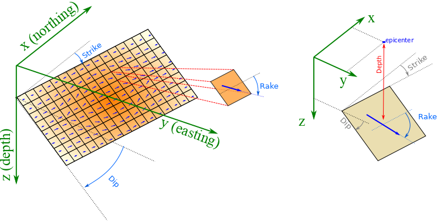
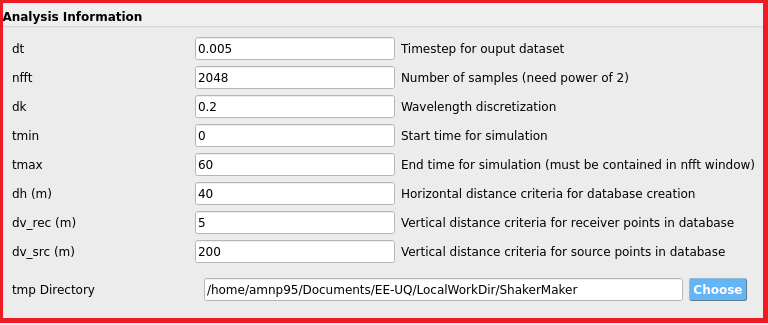
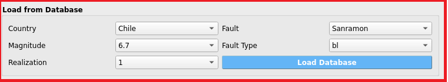
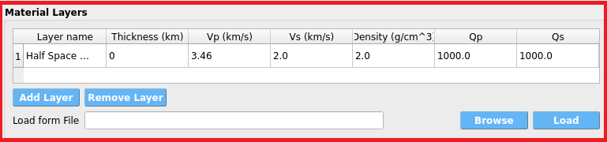
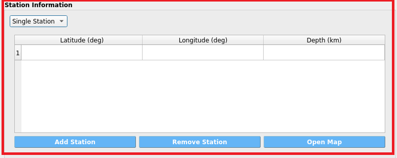
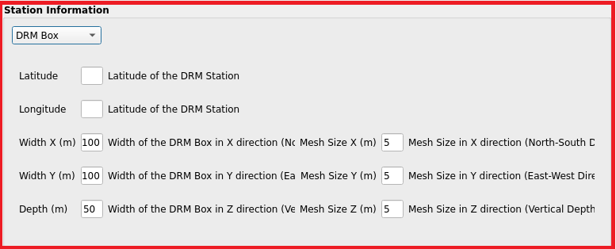
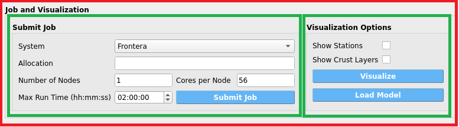

.. _ShakerMakertools:

ShakerMaker Tool
--------------------------
ShakerMaker is a Python library designed for generating and analyzing seismic wave motions. Its core functionality is built upon the FK method, which is implemented in Fortran. This allows ShakerMaker to leverage the high-performance capabilities of Fortran while providing a user-friendly interface through Python. ShakerMaker is designed to assist both earthquake engineers and seismologists by providing an easy-to-use tool for generating and exploring ground motions using the frequency-wavenumber (FK) method on 1-D crustal models. This innovative tool allows users to create realistic, physics-based waveforms for various earthquake scenarios, which can then be analyzed using the Domain Reduction Method (DRM).

The DRM facilitates the simulation of how soil and structures respond to ground motions during earthquakes by connecting large regional earthquake simulations with smaller local soil-structure models without losing critical details. This method significantly improves the accuracy of ground-motion simulations.

**ShakerMaker tool** is a graphical user interface within the EEUQ framework that allows users to create ShakerMaker models easily. This tool simplifies the process of modeling seismic events by providing a visual platform for users to define and manipulate various parameters related to faults, crustal layers and stations. Users can load available fault models and select the type of station they wish to use based on the crustal model. The ShakerMaker tool then generates the necessary input files for the ShakerMaker engine and runs the simulation, providing users with the resulting ground motions for further analysis.

Coordinate system in ShakerMaker
~~~~~~~~~~~~~~~~~~~~~~~~~~~~~~~~~~
ShakerMaker defines it’s coordinate system with x positive towards the north, y positive towards the east and z positive downwards.
Strike is defined clockwise from the north, dip is measured from the horizontal, and rake increases in the down-dip direction.

.. _fig-ShakerMaker_coordinate:

   ShakerMaker coordinate system.

ShakerMaker tool workflow
~~~~~~~~~~~~~~~~~~~~~~~~~~~
The ShakerMaker tool in EEUQ follows a simple workflow to generate ground motions. The interface is divided into five main sections: 

1. **Analysis Information**: This section allows users to define the analysis parameters.
2. **Source Information**: This section provides options to define the fault model.
3. **Material Layers**: This section allows users to define the crustal model.
4. **Station Information**: This section provides options to define the station model.
5. **Job and Visualization**: This section allows users to view the fualt model and submit the job for processing.

Analysis Information
^^^^^^^^^^^^^^^^^^^^^^^
The Analysis Information section allows users to define the analysis parameters. The parammeters which can be defined are:

- **dt**: Time step for the simulation in seconds. 
- **nfft** : Number of points in the frequency domain. It needs to be a power of 2. Not e that the more number of points, the more accurate the simulation will be but it will also take more time.
- **dk**: Wavelength increment in the frequency domain. The default value is 0.2 which is a good value for most simulations but can be changed if needed.
- **tmin**: Minimum time for the simulation in seconds
- **tmax**: Maximum time for the simulation in seconds. The simulation will run from tmin to tmax. Note that the duration of should be greater than nfft*dt.
- **dh**: Horizontal spacing critera for creating green's functions database for DRM load. This parameters is only used when your are creating a DRM load. The default value is 40 meters. 
- **dv_rec**: Vertical spacing critera between station points in a DRM station for creating green's functions database for DRM load. This parameters is only used when your are creating a DRM load. The default value is 200 meters.
- **dv_src**: Vertical spacing critera between source points in a fault for creating green's functions database for DRM load. This parameters is only used when your are creating a DRM load. The default value is 5 meters.
- **tmp Directory**: Temporary directory where the simulation files will be stored. This directory should have enough space to store the simulation files. The default value is the ShakerMaker folder in the EEUQ working directory.

Note: The default values are good for most simulations. Only parameters which are needed to be changed may be tmax based on the durtion and distance of the stations from the fault.

.. _fig-ShakerMaker_Analysis:

   Analysis box interface.

Source Information
^^^^^^^^^^^^^^^^^^^^^^^
The Source Information section provides options to define the fault model. The base idea is that user can just load the fault model from the available fault models in the ShakerMaker tool.

for the fault model user can pick the fault considered fault model from the drop down menu. The drop down menu is in the **Load From Database** section. The laoding section has 5 drop down menus.  the first one is for the country of the fault model, the second one is for the name of the fault model (which shows the region) and the other three are Magnitude, Type and Realization which are specific to a specific fault. By pressing the the **Load Database** button the fault information automatically gets loaded in the **Source Information** and fault files will be downloaded in the **tmp Directory** user defined in the **Analysis Information** under the subfolder of fault. 

.. _fig-ShakerMaker_loadFault:

   Load fault interface.

user can also define their own fault model by providing the fault latitude, longitude and the realted json fault files. The fault files should be in special format which will be explained in the next release of the ShakerMaker tool.

Material Layers
^^^^^^^^^^^^^^^^^^^^^^^
The Material Layers section allows users to define the crustal model. The crustal model is defined by the number of layers and the properties of each layer. for definig the layers a table is provided where user can add rows and define the properties of each layer. properties of each layer are:

- **Layer Name**: Name of the layer. This is just for the user to identify the layer.
- **Thickness**: Thickness of the layer in km.
- **Vp**: P wave velocity in km/s.
- **Vs**: S wave velocity in km/s.
- **Density**: Density of the layer in g/cm^3.
- **Qp**: Q factor for P wave.
- **Qs**: Q factor for S wave.

Each crustal layer at least has one infite layer which is the half space and is shown by the last row with a tickness of 0.

Also there is a **load from File** section which allows user to load the crustal model from a json file. the json file should be array of objects where each object is a layer with the keys (name, thickness, vp, vs, density, qp, qs).

.. _fig-ShakerMaker_Material:

   Material Layers interface.

Station Information
^^^^^^^^^^^^^^^^^^^^^^^
The Station Information section provides options to define the station model. The stations can be single stations or a DRM station. which each one can be choosen from the drop down menu. 

single station
""""""""""""""""""""""""""""""""""""
For the single station user can define the station latitude, longitude and the depth of the station. The depth is the distance from the surface of the earth to the station in km.
Users can add multiple stations by pressing the **Add Station** button. The stations can be removed by pressing the **Remove Station** button.
Also, user can open a map to select the station location by pressing the **Open Map** button and find the station latitude, longitude and using the google map.

.. _fig-ShakerMaker_singleStation:

   Single Station interface.

DRM station
"""""""""""""""""""""""""""
DRM Station is available by choosing the DRM box from the menu. The DRM station is a set of stations around a center on a surface in terms of cube. so the parameters for the DRM station are:

- **Latitude**: Latitude of the center of the cube.
- **Longitude**: Longitude of the center of the cube.
- **Width X**: Width of the cube in the North-South direction in m.
- **Width Y**: Width of the cube in the East-West direction in m.
- **Depth**: Depth of the cube in m.
- **Mesh Size (x)**: Mesh size in the North-South direction in m to discretize the cube.
- **Mesh Size (y)**: Mesh size in the East-West direction in m to discretize the cube.
- **Mesh Size (z)**: Mesh size in the vertical direction in m to discretize the cube.

.. _fig-ShakerMaker_DRMStation:

   DRM Station interface.

Job and Visualization
^^^^^^^^^^^^^^^^^^^^^^^
The Job and Visualization section allows users to sumit a job and run shakermaker model in TACC facilities and visualize the fault. 
This part contains of two serated box. The job box and the visualization box.
.. _fig-ShakerMaker_Job:

   Job interface.

Job
""""""""
The job part get information about the job and submit the job to the TACC facilities. The parameters are:

- **System**: The system which the job will be submitted. The default value is frontera.
- **Allocation**: The allocation which the job will be charged. Users should provide their own allocation.
- **Number of Nodes**: Number of nodes which the job will be run on. The default value is 1.
- **Cores per Node**: Number of cores per node. The default value is 56 for frontera.
- **Maximum run time**: Maximum run time for the job in hours. The default value is 2 hours.

Note : if you are using DRM station it is recommended to use at least 200 cores (Nodes multiply by cores per node) for the job with a mximum run time of at least 10 hours. 

Visualization
""""""""""""""""
The visualization part allows users to visualize the fault model. The visulaization will be shown in the right side of the ShakerMaker panel. 
The visualization consits of two tabs. One that shows the plane of the fault in the plot tab and other one that shows the fault on the map. 
In the visualization box there are two other check boxes, one for showing the stations on the map and the other one for showing the crustal model on the plot tab. 
By pressing the **Visualize** button a python code will be run and the fault will be shown in the plot tab and the map tab after a while. Both plots are interactive and user can zoom in and out and move the plot.

.. list-table::
   :widths: 50 50
   :header-rows: 0

   * - .. figure:: figures/ShakerMaker_Vis_fault.png
          :width: 100%
          :align: center

          Fault visualization.
     - .. figure:: figures/ShakerMaker_Vis_map.png
          :width: 100%
          :align: center

          Fault visualization on the map.

Also in the visulaization box there is a **Load Model** button. By pressing this button a browsing window will be opened and user can load whole model from a json file. 
In the **applications** folder, under the subdirectory `tools/Shakermaker/Examples`, there are two example files:

- **DRM_Sanramon.json**
- **Single_Sanramon.json**

Here is an example of the json file for the loading ShakerMaker parameters with a DRM station:

.. code-block:: json

    {
        "dt": 0.005,
        "nfft": 2048,
        "dk": 0.2,
        "tmin": 0,
        "tmax": 60,
        "dh": 40.0,
        "dv_rec": 5.0,
        "dv_src": 200,
        "layers": [
            {"Layer Name": "Layer1", "Thickness": 0.20, "Vp": 1.32, "Vs": 0.75, "Density": 2.4, "Qp": 1000, "Qs": 1000},
            {"Layer Name": "Layer2", "Thickness": 0.80, "Vp": 2.75, "Vs": 1.57, "Density": 2.5, "Qp": 1000, "Qs": 1000},
            {"Layer Name": "Layer3", "Thickness": 14.5, "Vp": 5.50, "Vs": 3.14, "Density": 2.5, "Qp": 1000, "Qs": 1000},
            {"Layer Name": "Half Space Layer", "Thickness": 0, "Vp": 7.00, "Vs": 4.00, "Density": 2.67, "Qp": 1000, "Qs": 1000}
        ],
        "station_type": "DRM",
        "station_info": {
            "Latitude": -33.40657,
            "Longitude": -70.50653,
            "Width X": 105,
            "Width Y": 105,
            "Depth": 30,
            "Mesh Size X": 2.5,
            "Mesh Size Y": 2.5,
            "Mesh Size Z": 2.5
        },
        "fault_type": "Database",
        "fault_info": {
            "Country": "Chile",
            "Fault": "Sanramon",
            "Magnitude": "6.7",
            "Fault Type": "bl",
            "Realization": "3"
        },
        "System": "Frontera",
        "Queue": "development",
        "Number of Nodes": 40,
        "Cores per Node": 50,
        "Max Run Time": "02:00:00"
    }

    .. [Abell 2022] José A. Abell, Jorge G.F. Crempien, Matías Recabarren, ShakerMaker: A framework that simplifies the simulation of seismic ground-motions, SoftwareX, Volume 17, 2022, 100911, ISSN 2352-7110, https://doi.org/10.1016/j.softx.2021.100911. (https://www.sciencedirect.com/science/article/pii/S235271102100159X)
