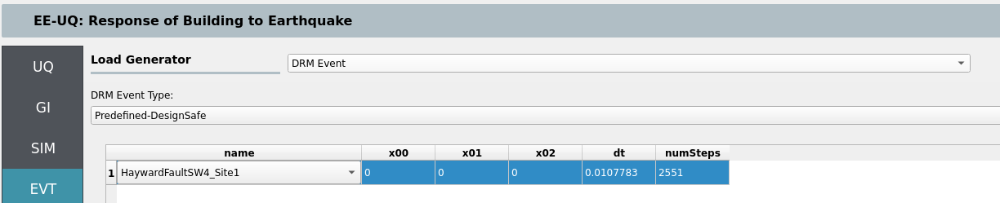
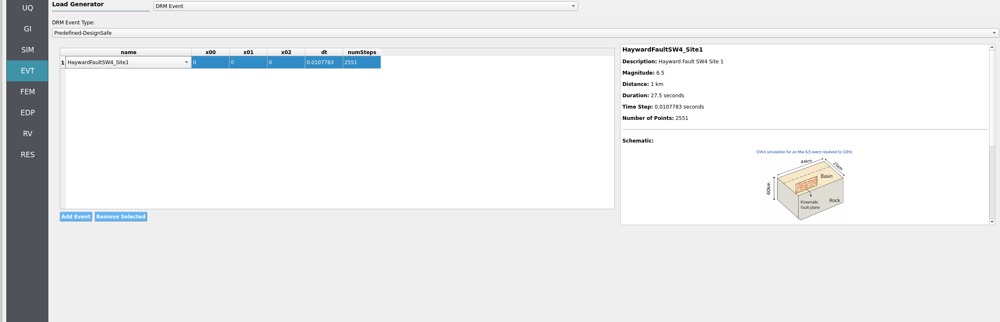
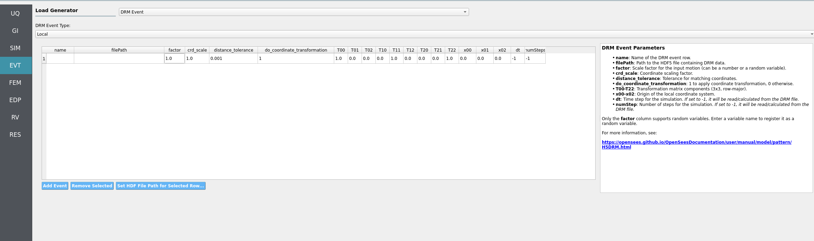

.. only:: EEUQ_app

.. _lblDRMEvent:

Domain Reduction Method (DRM)
=============================

This panel, as shown in :numref:`fig-drm-event`, lets the user apply a precomputed 3D wavefield to the boundaries of a local SSI model. That wavefield can be selected from curated datasets on DesignSafe or read from a local H5DRM file. DRM allows realistic source‑to‑site wave propagation to enter a smaller, high‑resolution domain.

.. _fig-drm-event:

   DRM event selection panel (placeholder – add overview screenshot).

Two DRM modes are available in **EE‑UQ**:

- Predefined (DesignSafe): use a curated dataset hosted on DesignSafe (e.g., Hayward Fault SW4 runs). No local files are required.
- Local: use your own H5DRM file stored locally.

.. note::
   To use DRM with SSI, set ``boundary_conditions = DRM`` in the **SIM → Soil and Foundation** tab (SSI Type 1). See the SSI SIM section for DRM absorbing layer options and resource planning.

Predefined DRM (DesignSafe)
---------------------------

Select from a list of predefined DRM datasets available on DesignSafe (e.g., SW4 Hayward Fault sites near/mid/far). The panel provides:

- Dataset browser / selector: choose a site or scenario from the list. A small viewer displays metadata (e.g., footprint size, mesh spacing).
- Center of your local model: provide the center coordinates for your SSI domain so the imported wavefield aligns with your local box.
- Time step and number of steps: you may set ``dT`` and ``numSteps`` explicitly, or leave them on auto‑detect (when supported by the dataset) to let EE‑UQ configure these from the DRM file.

.. _fig-drm-predefined:

   DRM event panel (Predefined DesignSafe dataset) – add screenshot here.

Tips
"""
- Predefined datasets are large; using them directly avoids uploading huge files.
- Ensure your SSI soil box meets the dataset’s minimum extents (e.g., 128 × 128 × 48 m for 4 m mesh spacing).

Local DRM (H5DRM)
-----------------

Use a local H5DRM file that you prepared or received. The panel exposes the low‑level parameters needed to map the DRM file to your local coordinates (based on the DRM event widgets):

- File: select the local H5DRM file.
- Coordinate transform: toggle whether to apply a coordinate transform and, if enabled, provide the 3×3 matrix entries (``T00..T22``). Use this to rotate/reorient the incoming field relative to your local axes.
- Scale: ``crd_scale`` to reconcile unit systems, if needed.
- Time control: ``dT`` (time step) and ``numSteps`` (number of steps). Set to match your DRM file. Some files can be auto‑inspected; otherwise provide values explicitly.
- DRM box alignment: provide the reference point (e.g., ``x00, x01, x02`` for the model center/origin) to position the local box within the DRM dataset.
- Tolerance: ``distance_tolerance`` for nearest‑neighbor matching within the DRM box.

.. _fig-drm-local:

   DRM event panel (Local H5DRM) – add screenshot here.

.. note::
   - If you run remotely at DesignSafe, EE‑UQ will upload your local H5DRM file. Uploads may take time for very large files.
   - Ensure your local SSI domain size and mesh spacing are compatible with the DRM dataset. The DRM viewer in the event panel can help verify extents.
   - For output extraction under DRM, prefer **User‑Defined EDP** and provide recorders (e.g., a ``recorders.tcl``) for structural and/or soil nodes.

