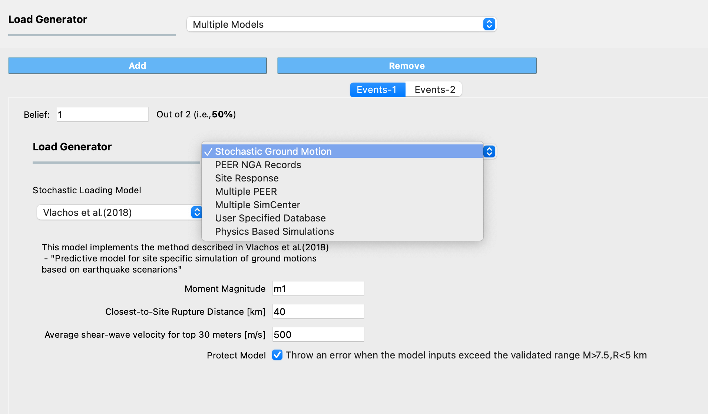

Multiple Models
===============

The **Multiple Models** application allows users to define multiple event models for use in their analysis. The Add and Remove buttons allow users to control the number of models they want to use in the analysis. 

By adding a model, a new tab is created in the EVT panel where users can choose one of the event modeling applications described in the sections above and provide the inputs necessary to create the model. Users also need to specify their belief about the credibility of the model in the tab corresponding to that model. The beliefs are expressed as non-negative numerical values. The belief value for each model is defined relative to the other models, and the beliefs do not need to sum to 1.

   Selecting an event modeling application within a Multiple Models EVT Application

.. Note:: 

   If a Multiple Models application is selected, at least 2 models must be defined.

.. Note:: 

   If the "Multi-fidelity Monte Carlo (MFMC)" option was selected in the UQ tab, the belief values will be ignored. The premise of MFMC is that the high-fidelity model response *always* provides the best response, therefore, the conception of *belief* does not apply.
