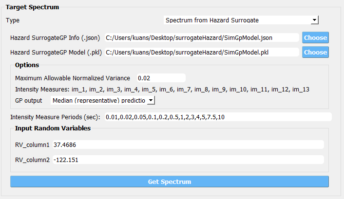
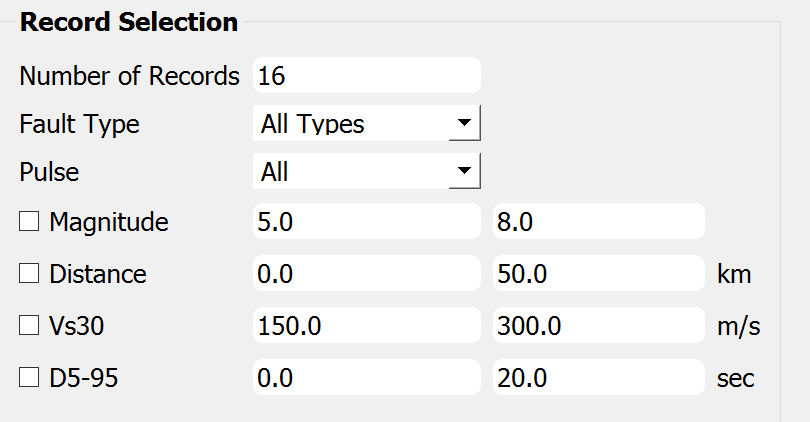
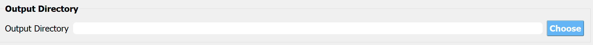
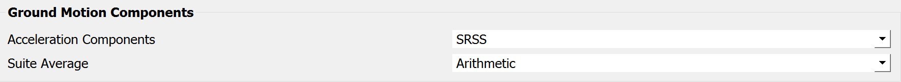
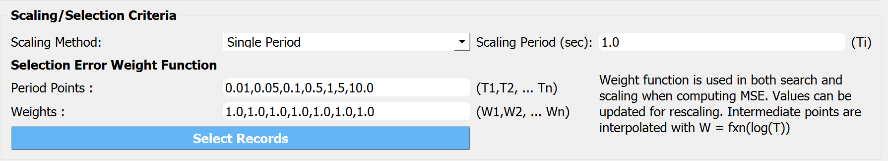

.. lblPEER-NGA:

PEER NGA Records
-----------------

This event allows the user to perform ground motion records selection and scaling using `PEER NGA West 2 ground motions database <https://peer.berkeley.edu/research/nga-west-2>`_. The suite of records can be selected from the database to represent the uncertainty in the ground motion. As shown in :numref:`fig-nga-event` , the user must enter the following information for this event type:

.. _fig-nga-event:

.. figure:: figures/peerNgaRecords.png
	:align: center
	:figclass: align-center

	PEER NGA records event.

#. A target response spectrum must be specified by the user to be used for records selection and scaling.
#. The user specifies a selection criteria, such as the number of records and optional ranges of earthquake magnitude, distance to rupture (:math:`R_{rup}`) and shear wave velocity in the top 30 meter of soil (:math:`V_s 30`).
#. The user specifies via a drop down menu, the number of component directions, one or two horizontal, or two horizontal and one vertical.

Once the selection criteria has been entered, the user selects the  **Select Records** button. The Application at this point will interact with the NGA server to obtain a selection of records. After a suite of records is selected from the database, the list of records is shown in tabular form for the user to inspect their information, as shown in :numref:`fig-nga-event`. Additionally a plot is generated showing the target spectrum, the average and standard deviation of the selected suite of records and the selected scaled ground motions spectra. Users can also highlight particular spectra on the plot by selecting the one or more records in the table provided. This enables the user to inspect the suite of records used to characterize the ground motions before running the building simulation.

.. lblPEER-NGA-TargetPSA

Target Spectrum
^^^^^^^^^^^^^^^^^

1. **Design Spectrum (ASCE 7-10)**: three parameters :math:`S_{DS}`, :math:`S_{D1}`, and :math:`T_L` are used to define a ASCE 7-10 design spectrum.

.. _fig-asce710:

   .. figure:: figures/asce710.png
      :align: center
      :figclass: align-center
      :width: 400

2. **User Specified**: users can define the target response spectrum by (1) directly filling :math:`T` and :math:`Sa` data into the table or (2) 
   uploading a csv file with the first column for :math:`T` and second column for :math:`Sa` (:download:`example <./figures/UserSpecificSpectrum.csv>`).

.. _fig-user-specified:

   .. figure:: figures/user-specified.png
      :align: center
      :figclass: align-center
      :width: 400

3. **Design Spectrum (USGS Web Service)**: users can use the `USGS Web Service <https://earthquake.usgs.gov/ws/designmaps/>`_ to retrieve following target spectra: 
   (1) ASCE 7-05/10/16, (2) ASCE 41-13/17, (3) NEHRP-2009/2015, and (4) IBC-2012/2015. Site location, site class, and risk category are user-specified parameters.

.. _fig-usgs-designspectrum:

   .. figure:: figures/usgs-designspectrum.png
      :align: center
      :figclass: align-center
      :width: 400

4. **Uniform Hazard Spectrum (USGS NSHMP)**: Uniform Hazard Spectrum (UHS) can be retrieved from `USGS NSHMP Service <https://earthquake.usgs.gov/nshmp-haz-ws/apps/services.html>`_ to 
   be used as the target spectrum for ground motion selection. User-specified parameters include return period, site location, site :math:`V_{S30}`, and NSHM edition. Available 
   NSHM editions are (1) Static: Conterminous U.S. 2008 (v3.1.0), (1) Static: Conterminous U.S. 2008 (v3.2.0), (3) Dynamic: Conterminous U.S. 2008 (v3.3.3), 
   (4) Static: Conterminous U.S. 2014 (v4.0.0), (5) Dynamic: Conterminous U.S. 2014 (v4.1.4), and (6) Dynamic: Conterminous U.S. 2014 (update) (v4.2.0).

.. _fig-uhs:

   .. figure:: figures/uhs.png
      :align: center
      :figclass: align-center
      :width: 400

5. **Conditional Mean Spectrum (USGS Disagg.)**: Conditional Mean Spectrum (CMS) is also supported as a target spectrum type. Seismic Disaggregation data (i.e., mean magnitude, distance, and :math:`\epsilon`)
   will be first retrieved from `USGS NSHMP Service <https://earthquake.usgs.gov/nshmp-haz-ws/apps/services.html>`_ given the site location, site :math:`V_{S30}`, disaggregation model edition, 
   return period, and conditional intensity measure (IM). Depending on the NSHM edition, available conditional IM can be different. Users can manually define the conditional period which leads
   to interpolating the results between the two neighboring periods that are supported by USGS NSHMP Service. With the disaggregated hazard, users cane 
   select a ground motion model (GM Model), and a CMS will be computed using the defined GM Model with the NGA-West2 IM correlation model ([BakerBradley2017]_). 

.. _fig-cms-usgs-disagg:

   .. figure:: figures/cms-usgs-disagg.png
      :align: center
      :figclass: align-center
      :width: 400

6. **Spectrum from Hazard Surrogate**: Target spectrum is evaluated via a user-provided Gaussian Process (GP) surrogate model that follows the default format produced by `quoFEM 
   GP surrogate modeling <https://nheri-simcenter.github.io/quoFEM-Documentation/common/user_manual/usage/desktop/SimCenterUQSurrogate.html>`_. Users will provide two input files 
   for the pretrained GP model (the default names are `SimGpModel.json` and `SimGPModel.pkl`, 
   please see more descriptions in `quoFEM documentation <https://nheri-simcenter.github.io/quoFEM-Documentation/common/user_manual/usage/desktop/SimCenterUQSurrogate.html#saving-options>`_).
   Once the model is successfully loaded, the intensity measure names in the trained GP model will be displayed in the `Options` panel.  Users need to provide the periods correspond to the
   spectral accelerations in the GP model.  Along with the `Options` panel, the input random variables in the pretrained model will also be displayed with text edit box(es) for evaluating 
   the GP model. For instance, :numref:`figSurrogateHazard` shows one example that the surrogate GP model is trained for Hayward earthquake scenarios at San Francisco Bay Area in which the 
   Latitude and Longitude (`RV_column1` and `RV_column2`) are input variables to predict response spectral acceleration at various periods from 0.01 to 10 sec.

.. _figSurrogateHazard:

   
   Target spectrum from hazard surrogate 

.. lblPEER-NGA-SelectionCriteria

Configure Selection
^^^^^^^^^^^^^^^^^^^

1. **Number of Records**: number of records to be selected (extensive selections may exceed the limit of PEER NGA-West 2 ground motion database).
2. **Fault Type**: filter - earthquake fault type of the ground event (e.g., strike-slip, normal oblique, reverse oblique);
3. **Pulse**: filter - pulse-like ground motion;
4. **Magnitude**: filter - minimum and maximum magnitudes used in the ground motion selection;
5. **Distance**: filter - minimum and maximum site-rupture distances used in the ground motion selection;
6. **Vs30**: filter - minimum and maximum :math:`V_{S30}` used in the ground motion selection;
7. **Ds5-95**: filter - minimum and maximum 5-95% significant duration :math:`D_{S5-95}` used in the ground motion selection.

.. _fig-selection-criteria

.. lblPEER-NGA-OutputDir

Output Directory
^^^^^^^^^^^^^^^^^^

Users can save the ground motion selection results and downloaded time history traces to local directories by clicking on the **Browse** button.

.. _fig-output-dir:

.. lblPEER-NGA-GMComp

Ground Motion Components
^^^^^^^^^^^^^^^^^^^^^^^^

Ground motion selection is conducted for the selected component(s) to minimize the mean spectrum differences. 
Supported options include SRSS, RotD100, RotD50, GeoMean, H1 (1st horizontal), H2 (2nd horizontal), and V (vertical component).
Supported options for the mean spectrum include Arithmetic and Geometric.

.. _fig-gm-comp:

.. lblPEER-NGA-ScalingSelection

Scaling and Selection
^^^^^^^^^^^^^^^^^^^^^^^^

Three different scaling methods are available: (1) no scaling (No Scaling), (2) scaling factors applied individually to records to minimize differences between mean spectra (Minimize MSE), 
and (3) scaling factors applied individually to pin all spectra at a given period (Single Period).

.. _fig-scaling-selection:

.. note::

   Record selection is always done to minimize the mean square error between the target spectrum and the selected scaled spectrum.

.. note::

   It is important to note that this event requires a PEER NGA West 2 account, users will be asked to provide their credentials (user name and password) to log in to the database. Users who do not have an account will be forwarded to the account sign up web [#]_.

.. note::

   The record-to-record uncertainty in assessing the structural responses under earthquakes are taken into account by running 
   a set of ground motion records. This can be realized by using the **Forward Propagation** method under the **UQ** tab. Once the 
   ground motion records are selected, users have the control of how many records to be run in the time history analyses by seleting 
   the Latin Hypercube Sample (**LHS**) and specifying the number of samples (**# Sample**). Note that with the LHS algorithm, when 
   the number of samples is the total number of selected records, each record will be used once in the time history analyses.  

.. [#] For more help on external services provided by PEER we encourage users to explore their `website <https://peer.berkeley.edu/>`_.

.. [BakerBradley2017] Baker JW, Bradley BA. Intensity Measure Correlations Observed in the NGA-West2 Database, and Dependence of Correlations on Rupture and Site Parameters. Earthquake Spectra. 2017;33(1):145-156. doi:10.1193/060716eqs095m