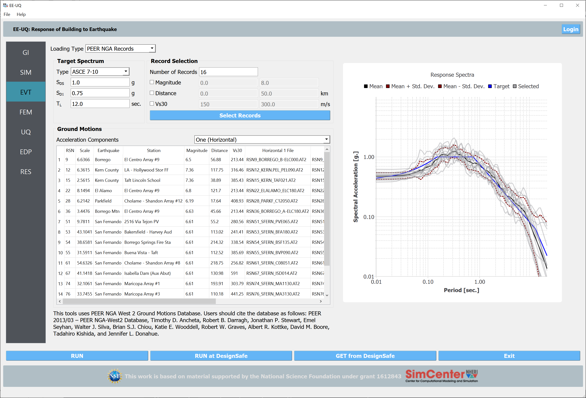

.. lblPEER-NGA:

PEER NGA
--------

This event allows the user to perform ground motion records selection and scaling using `PEER NGA West 2 ground motions database <https://peer.berkeley.edu/research/nga-west-2>`_. The suite of records can be selected from the database to represent the uncertainty in the ground motion. As shown in :numref:`fig-nga-event` , the user must enter the following information for this event type:

.. _fig-nga-event:

	PEER NGA records event.

#. A target response spectrum must be specified by the user to be used for records selection and scaling.
#. The user specifies a selection criteria, such as the number of records and optional ranges of earthquake magnitude, distance to rupture (:math:`R_{rup}`) and shear wave velocity in the top 30 meter of soil (:math:`V_s 30`).
#. The user specifies via a drop down menu, the number of component directions, one or two horizontal, or two horizontal and one vertical.

Once the selection criteria has been entered, the user selects the  **Select Records** button. The Application at this point will interact with the NGA server to obtain a selection of records. After a suite of records is selected from the database, the list of records is shown in tabular form for the user to inspect their information, as shown in :numref:`fig-nga-event`. Additionally a plot is generated showing the target spectrum, the average and standard deviation of the selected suite of records and the selected scaled ground motions spectra. Users can also highlight particular spectra on the plot by selecting the one or more records in the table provided. This enables the user to inspect the suite of records used to characterize the ground motions before running the building simulation.

.. note::

   Record selection is always done to minimize the mean square error between the target spectrum and the selected scaled spectrum. It is also important to note that the current version only allows user to specify the ASCE 7-10 design spectrum as a target. Future versions will allow the users to specify a user-provided target spectrum or a target spectrum obtained from seismic hazard analysis, such as the uniform hazard spectrum (UHS) or the conditional mean spectrum (CMS).

.. note::

   It is important to note that this event requires a PEER NGA West 2 account, users will be asked to provide their credentials (user name and password) to log in to the database. Users who do not have an account will be forwarded to the account sign up web.